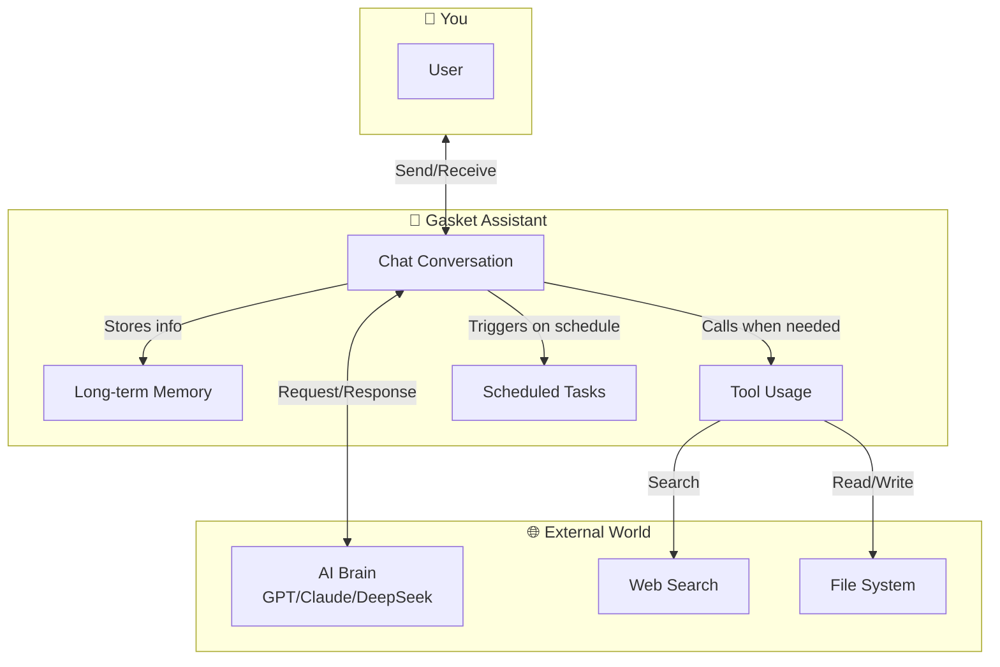
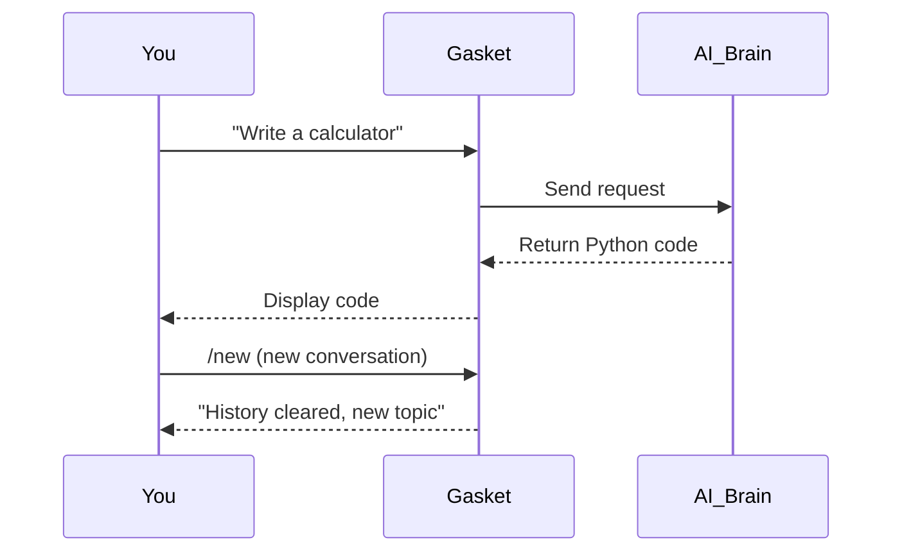
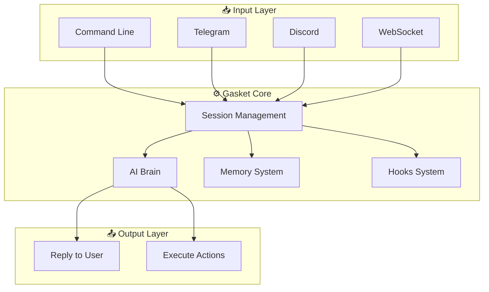
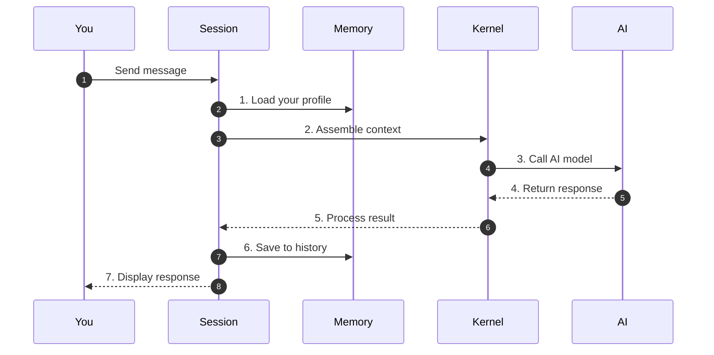
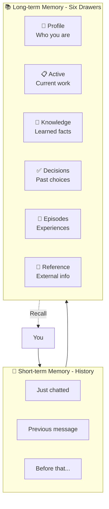
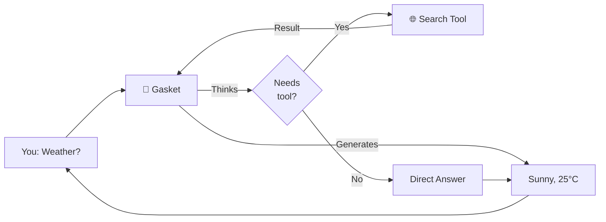
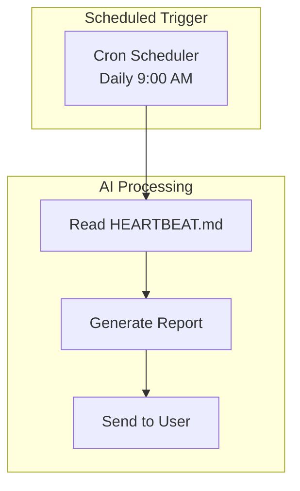

# Gasket - Your AI Personal Assistant

```
    ╭──────────────────────────────────────╮
    │                                      │
    │    🤖 Hello! I'm Gasket              │
    │                                      │
    │    Your personal AI assistant        │
    │                                      │
    ╰──────────────────────────────────────╯
```

> **One-sentence intro**: Gasket is an AI assistant that is **completely yours**. It can chat, write code, research, manage tasks, and most importantly - it **remembers you**.

---

## 🎯 What is Gasket?

Imagine having a personal assistant:

- 📱 Available anytime on Telegram, Discord, or command line
- 💬 Chat with it, ask it to write code, answer questions
- 🧠 It remembers your preferences and conversation history
- ⏰ It can remind you of tasks at scheduled times
- 🔧 It can use tools (web search, execute commands, read/write files)

**Gasket is exactly that assistant, but running as a program on your computer.**



---

## 🚀 5-Minute Quick Start

### Step 1: Install

```bash
# Clone the code
git clone https://github.com/YeHeng/gasket.git
cd gasket-rs

# Build (requires Rust, as simple as installing Node.js)
cargo build --release

# Install to system
cargo install --path cli
```

> 💡 **Don't know Rust?** No problem! Just follow the three commands above. First build takes a few minutes, then you can use the `gasket` command directly.

### Step 2: Initialize

```bash
# Create configuration and workspace (like setting up a desk for your assistant)
gasket onboard
```

This creates:
```
~/.gasket/                    # Your workspace
├── config.yaml              # Configuration file
├── PROFILE.md               # Your profile (tells AI who you are)
├── SOUL.md                  # AI personality settings
├── memory/                  # Long-term memory storage
└── skills/                  # Skills directory
```

### Step 3: Configure API Key

Edit `~/.gasket/config.yaml` and add your AI service key:

```yaml
providers:
  openrouter:
    api_key: sk-or-v1-your-key-here  # Get from openrouter.ai

agents:
  defaults:
    model: openrouter/anthropic/claude-4.5-sonnet
```

> 💡 **What's an API Key?** Like a key to a service. Get one from [OpenRouter](https://openrouter.ai) (recommended, supports multiple models), [DeepSeek](https://deepseek.com), or [Zhipu AI](https://zhipu.ai).

### Step 4: Start Chatting!

```bash
# Launch interactive mode
gasket agent

# You'll see
🤖 Gasket > Hello! How can I help you?

You: Write a simple calculator in Python
🤖 Gasket > (generates code...)

You: /new
🤖 Gasket > (starts new conversation)
```



---

## 📚 Documentation

### 🔰 Getting Started (Recommended First)

These docs use everyday analogies with plenty of diagrams, understandable without technical background:

| Document | One-sentence Summary | Best For |
|----------|---------------------|----------|
| [🚀 Quick Start](docs/quickstart-en.md) | Get Gasket running in 5 minutes | First time users |
| [🧠 AI Brain Core](docs/kernel-en.md) | How AI "thinks" and "acts" | Understanding AI |
| [💬 Session Management](docs/session-en.md) | How AI organizes conversations | Understanding flow |
| [📝 Memory & History](docs/memory-history-en.md) | How AI remembers things | Memory system |
| [🧰 Tool System](docs/tools-en.md) | AI's "hands" and "feet" | What AI can do |
| [🔌 Plugin System](docs/plugin-en.md) | Extend AI with custom scripts | Custom tools |
| [⏰ Scheduled Tasks](docs/cron-en.md) | AI's "alarm clock" | Automation |
| [🪝 Hooks System](docs/hooks-en.md) | Extending AI at key points | Extensions |
| [👥 Subagents](docs/subagents-en.md) | AI creating parallel workers | Complex tasks |

### 🎓 Tutorials

| Document | Content |
|----------|---------|
| [🛠️ Build Your First Skill](docs/tutorial-first-skill-en.md) | Teach AI new abilities |

### ❓ FAQ

| Document | Content |
|----------|---------|
| [📋 FAQ](docs/faq-en.md) | Common questions and solutions |

### 📖 Technical Reference

| Document | Content |
|----------|---------|
| [🏗️ Architecture](docs/architecture-en.md) | System architecture |
| [📊 Data Flow](docs/data-flow-en.md) | CLI/Gateway mode data flow |
| [🗃️ Data Structures](docs/data-structures-en.md) | Message types, SQLite schema |
| [🔧 Module Details](docs/modules-en.md) | Module responsibilities |
| [⚙️ Configuration](docs/config-en.md) | Complete configuration |
| [🚀 Deployment](docs/deployment-en.md) | Production deployment |
| [🔐 Vault Guide](docs/vault-guide-en.md) | Sensitive data management |
| [⏰ Cron Usage](docs/cron-usage-en.md) | Scheduled task details |
| [🤖 Copilot Setup](docs/copilot-setup-en.md) | GitHub Copilot integration |
| [🔄 Model Switching](docs/spawn_with_models-en.md) | Dynamic model selection |

---

## 🎨 Core Concepts Illustrated

### 1. How Gasket Works



### 2. Complete Conversation Flow



### 3. AI Memory System



### 4. Tool Calling: AI's Hands and Feet



---

## 💡 Typical Use Cases

### Case 1: Personal Programming Assistant

```bash
# Ask anything from command line
gasket agent
> Help me write an HTTP server in Rust
> Explain what this code does
> /new  # Start fresh
```

### Case 2: Telegram Personal Assistant

```yaml
# config.yaml
channels:
  telegram:
    token: your-bot-token
```

```bash
gasket gateway  # Start service
```

Chat with AI anytime from your phone, it remembers your conversations.

### Case 3: Automated Tasks

```markdown
<!-- ~/.gasket/HEARTBEAT.md -->
## Daily Report
- cron: 0 9 * * *
- message: Generate yesterday's work summary
```

AI automatically reminds you every morning at 9am.



---

## 🔧 Built-in Tools

Gasket comes with these tools, enabling AI to do more:

| Tool | Function | Example |
|------|----------|---------|
| `read_file` | Read file content | "Read config.yaml" |
| `write_file` | Create new file | "Create hello.py" |
| `exec` | Execute commands | "Run cargo build" |
| `web_search` | Web search | "Search Rust latest version" |
| `web_fetch` | Fetch webpage | "Get this URL's content" |
| `send_message` | Send messages | "Send Telegram message" |
| `memory_search` | Search memory | "What did I learn about DB?" |
| `spawn` | Create subagent | "Analyze multiple files" |
| `cron` | Manage scheduled tasks | "Add daily reminder" |

---

## 🏗️ Project Structure

```
gasket-rs/                     # Project root
├── gasket/
│   ├── engine/                # Core engine
│   │   ├── kernel/            # AI brain (pure function execution)
│   │   ├── session/           # Session management
│   │   ├── tools/             # Tool system
│   │   ├── hooks/             # Hooks system
│   │   ├── subagents/         # Subagents
│   │   └── cron/              # Scheduled tasks
│   ├── cli/                   # CLI executable
│   ├── providers/             # LLM providers
│   ├── storage/               # Data storage
│   └── channels/              # Communication channels
├── docs/                      # Documentation
└── web/                       # Web interface
```

---

## 🛠️ Tech Stack

| Area | Technology | Notes |
|------|------------|-------|
| Language | Rust | High performance, memory-safe |
| Async | Tokio | Rust async runtime |
| HTTP | Axum | Web framework |
| Database | SQLite | Lightweight local database |
| CLI | Clap | Command line parsing |
| LLM | Multi-provider | OpenAI/Claude/DeepSeek/... |

---

## 🤝 Contributing

Issues and PRs welcome!

```bash
# Local development
cd gasket-rs
cargo test          # Run tests
cargo clippy        # Linting
cargo fmt           # Format code
```

---

## 📄 License

MIT License - Free to use, commercial use OK

---

## 💬 Need Help?

- 📖 Check [Getting Started docs](#-documentation)
- 🐛 Submit [Issue](https://github.com/YeHeng/gasket-rs/issues)
- 💡 Check [Configuration Guide](docs/config-en.md)
- 🚀 Check [Deployment Guide](docs/deployment-en.md)

---

**Start using Gasket and make your AI assistant truly yours!** 🤖✨

---

## 🌐 Languages

- [🇺🇸 English](README.md) (This document)
- [🇨🇳 中文](README.zh.md)
