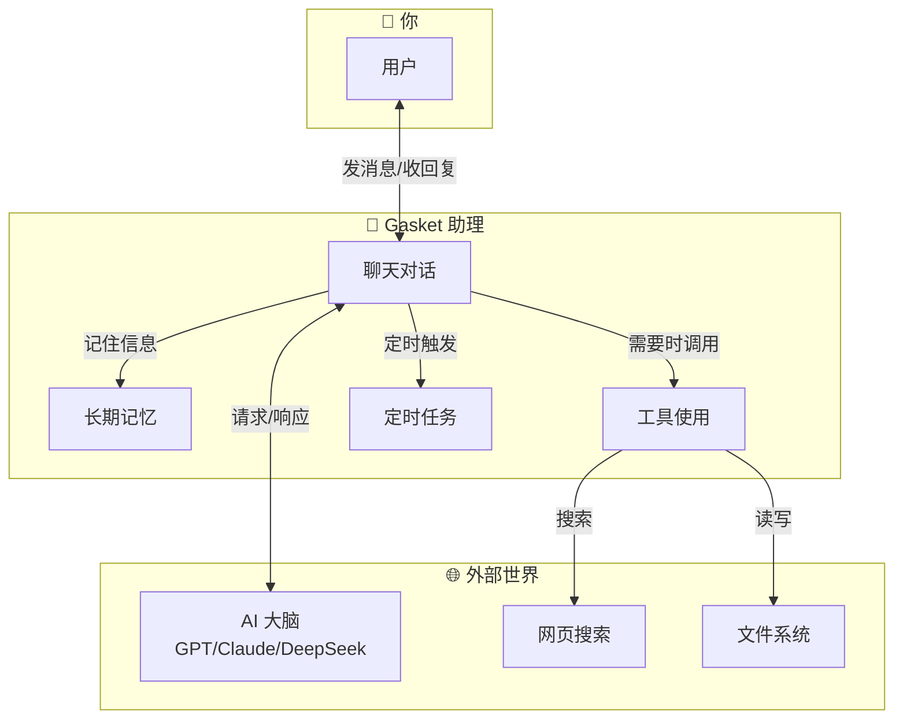
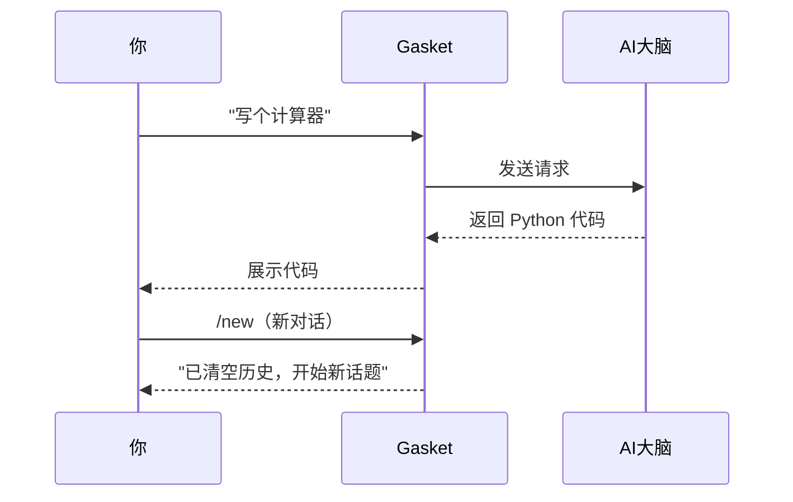
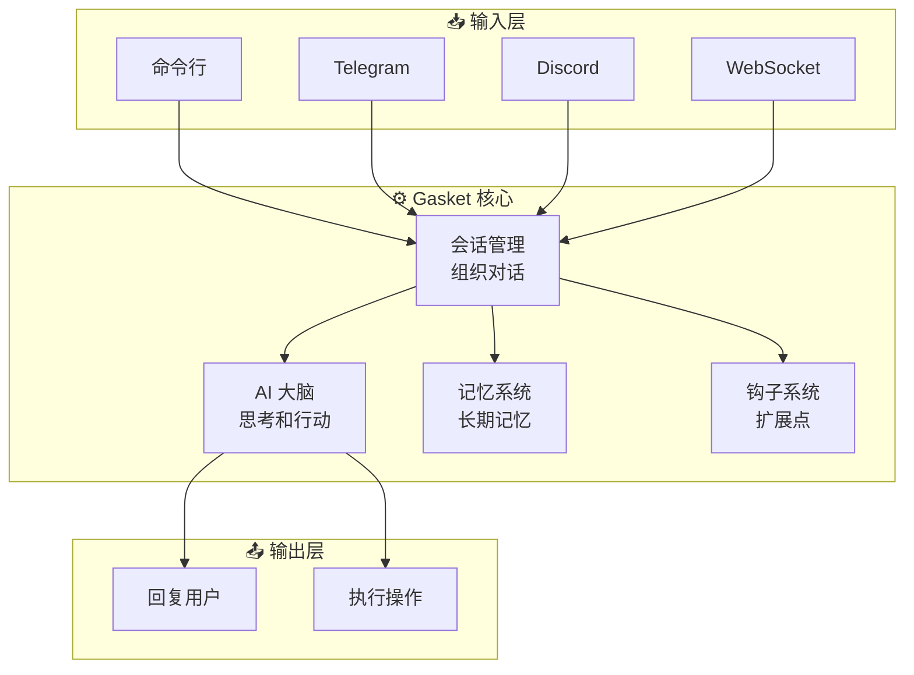
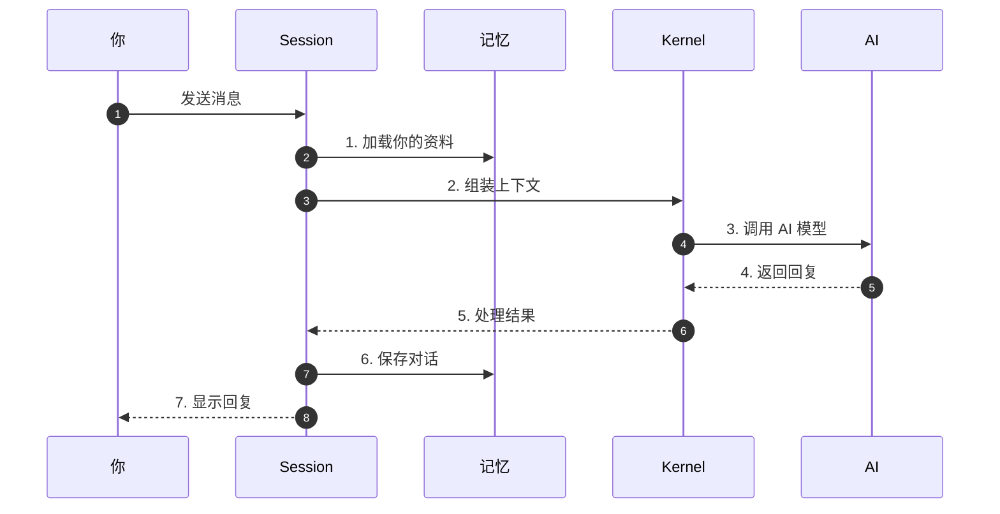
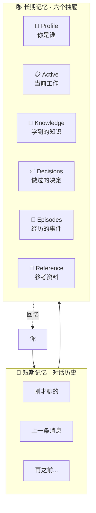
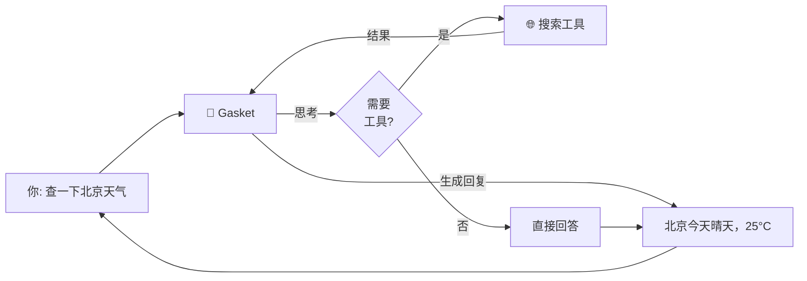
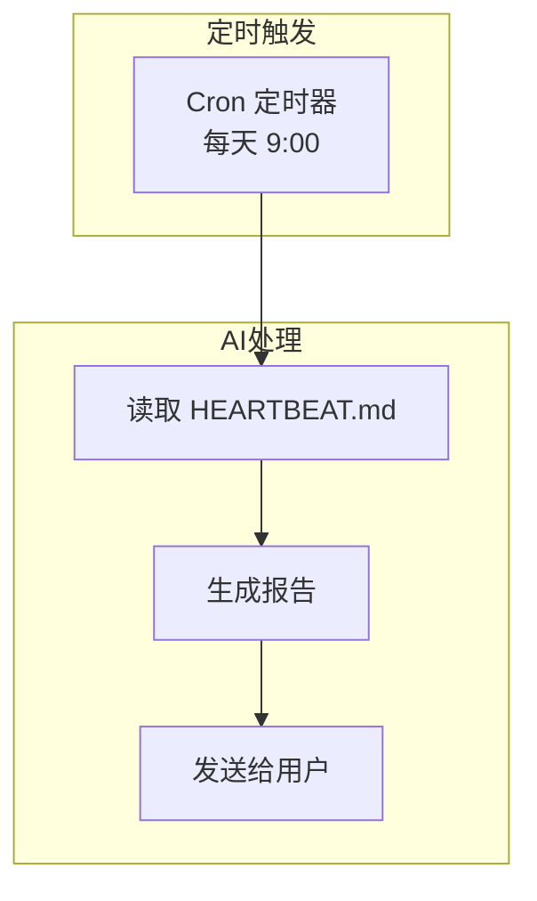

# Gasket - 你的 AI 个人助理

```
    ╭──────────────────────────────────────╮
    │                                      │
    │    🤖 你好！我是 Gasket              │
    │                                      │
    │    一个属于你的 AI 个人助理          │
    │                                      │
    ╰──────────────────────────────────────╯
```

> **一句话介绍**：Gasket 是一个**完全属于你**的 AI 助手，它可以帮你聊天、写代码、查资料、管理任务，最重要的是——它会**记住你**。

---

## 🎯 Gasket 是什么？

想象你有一个私人助理：

- 📱 你随时可以在 Telegram、Discord 或命令行找到它
- 💬 你可以和它聊天，让它帮你写代码、解答问题
- 🧠 它会记住你的喜好、你们聊过的内容
- ⏰ 它可以定时提醒你做事情
- 🔧 它可以调用工具（搜索网页、执行命令、读写文件）

**Gasket 就是这样一个助理，但它是一个运行在电脑上的程序。**



---

## 🚀 5 分钟快速开始

### 第一步：安装

```bash
# 克隆代码
git clone https://github.com/YeHeng/gasket-rs.git
cd gasket-rs

# 编译（需要 Rust，就像安装 Node.js 一样简单）
cargo build --release

# 安装到系统
cargo install --path cli
```

> 💡 **不懂 Rust？** 没关系！只需要按照上面三条命令执行即可。第一次编译需要几分钟，之后就能直接使用 `gasket` 命令了。

### 第二步：初始化

```bash
# 创建配置和工作空间（就像给助理准备一个办公桌）
gasket onboard
```

这会创建：
```
~/.gasket/                    # 你的工作空间
├── config.yaml              # 配置文件
├── PROFILE.md               # 你的个人资料（告诉 AI 你是谁）
├── SOUL.md                  # AI 的人格设定
├── memory/                  # 长期记忆存储
└── skills/                  # 技能目录
```

### 第三步：配置 API Key

编辑 `~/.gasket/config.yaml`，填入你的 AI 服务密钥：

```yaml
providers:
  openrouter:
    api_key: sk-or-v1-your-key-here  # 从 openrouter.ai 获取

agents:
  defaults:
    model: openrouter/anthropic/claude-4.5-sonnet
```

> 💡 **什么是 API Key？** 就像打开服务的钥匙。你可以从 [OpenRouter](https://openrouter.ai)（推荐，支持多种模型）、[DeepSeek](https://deepseek.com) 或 [智谱 AI](https://zhipu.ai) 获取。

### 第四步：开始聊天！

```bash
# 启动交互模式
gasket agent

# 你会看到
🤖 Gasket > 你好！有什么可以帮你的吗？

You: 用 Python 写一个简单的计算器
🤖 Gasket > （生成代码...）

You: /new
🤖 Gasket > （开启新对话）
```



---

## 📚 文档导航

### 🔰 零基础入门（推荐先看）

这些文档用生活化的比喻，配合大量图表，让没有技术背景的人也能看懂：

| 文档 | 一句话说明 | 适合场景 |
|------|-----------|---------|
| [🚀 快速开始](docs/quickstart.md) | 5 分钟让 Gasket 跑起来 | 第一次使用 |
| [🧠 AI 大脑核心](docs/kernel.md) | AI 是如何"思考"和"行动"的 | 想了解 AI 工作原理 |
| [💬 会话管理](docs/session.md) | AI 如何组织一次完整的对话 | 想了解对话流程 |
| [📝 记忆与历史](docs/memory-history.md) | AI 如何记住事情 | 想了解 AI 的记忆系统 |
| [🧰 工具系统](docs/tools.md) | AI 的"手"和"脚" | 想知道 AI 能做什么 |
| [⏰ 定时任务](docs/cron.md) | AI 的"闹钟" | 需要自动化任务 |
| [🪝 钩子系统](docs/hooks.md) | 在关键时刻"插一脚" | 想扩展 AI 功能 |
| [👥 子代理](docs/subagents.md) | AI 创建"分身"并行工作 | 复杂任务处理 |

### 🎓 教程

手把手教你完成具体任务：

| 文档 | 内容 |
|------|------|
| [🛠️ 构建你的第一个技能](docs/tutorial-first-skill.md) | 教 AI 新能力 |

### ❓ 常见问题

| 文档 | 内容 |
|------|------|
| [📋 FAQ](docs/faq.md) | 常见问题和解决方案 |

### 📖 技术参考

深入的技术实现，适合开发者查阅：

| 文档 | 内容 |
|------|------|
| [🏗️ 架构设计](docs/architecture.md) | 系统整体架构、模块关系 |
| [📊 数据流](docs/data-flow.md) | CLI/Gateway 模式数据流转 |
| [🗃️ 数据结构](docs/data-structures.md) | 消息类型、SQLite 表结构 |
| [🔧 模块详解](docs/modules.md) | 各模块职责与接口 |
| [⚙️ 配置指南](docs/config.md) | 完整配置说明 |
| [🚀 部署指南](docs/deployment.md) | 生产环境部署 |
| [🔐 Vault 指南](docs/vault-guide.md) | 敏感数据管理 |
| [⏰ Cron 使用](docs/cron-usage.md) | 定时任务详细用法 |
| [🤖 Copilot 配置](docs/copilot-setup.md) | GitHub Copilot 集成 |
| [🔄 模型切换](docs/spawn_with_models.md) | 动态模型选择 |

---

## 🎨 核心概念图解

### 1. Gasket 的工作方式



### 2. 一次对话的完整流程



### 3. AI 的记忆系统



### 4. 工具调用：AI 的手脚



---

## 💡 典型使用场景

### 场景 1：个人编程助手

```bash
# 在命令行随时提问
gasket agent
> 帮我用 Rust 写一个 HTTP 服务器
> 解释一下这段代码的意思
> /new  # 开启新对话
```

### 场景 2：Telegram 个人助手

```yaml
# config.yaml
channels:
  telegram:
    token: your-bot-token
```

```bash
gasket gateway  # 启动服务
```

然后随时随地用手机和 AI 聊天，它会记住你们的对话。

### 场景 3：自动化任务

```markdown
<!-- ~/.gasket/HEARTBEAT.md -->
## 每日报告
- cron: 0 9 * * *
- message: 生成昨日工作总结
```

AI 每天早上 9 点自动提醒你。



---

## 🔧 内置工具

Gasket 自带这些工具，让 AI 能做更多事情：

| 工具 | 功能 | 示例 |
|------|------|------|
| `read_file` | 读取文件 | "帮我看看 main.rs 的内容" |
| `write_file` | 写入文件 | "创建一个 config.yaml" |
| `exec` | 执行命令 | "运行 cargo build" |
| `web_search` | 网页搜索 | "搜索 Rust 最新版本" |
| `web_fetch` | 抓取网页 | "抓取这个 URL 的内容" |
| `send_message` | 发送消息 | "给 Telegram 发消息" |
| `memory_search` | 搜索记忆 | "我之前学过什么关于数据库的？" |
| `spawn` | 创建子代理 | "同时分析多个文件" |
| `cron` | 管理定时任务 | "添加一个每日提醒" |

---

## 🏗️ 项目结构

```
gasket-rs/                     # 项目根目录
├── gasket/
│   ├── engine/                # 核心引擎
│   │   ├── kernel/            # AI 大脑（纯函数执行）
│   │   ├── session/           # 会话管理
│   │   ├── tools/             # 工具系统
│   │   ├── hooks/             # 钩子系统
│   │   ├── subagents/         # 子代理
│   │   └── cron/              # 定时任务
│   ├── cli/                   # 命令行程序
│   ├── providers/             # LLM 提供商
│   ├── storage/               # 数据存储
│   └── channels/              # 通信渠道
├── docs/                      # 文档
└── web/                       # Web 界面
```

---

## 🛠️ 技术栈

| 用途 | 技术 | 说明 |
|------|------|------|
| 语言 | Rust | 高性能、内存安全 |
| 异步 | Tokio | Rust 异步运行时 |
| HTTP | Axum | Web 框架 |
| 数据库 | SQLite | 轻量级本地数据库 |
| CLI | Clap | 命令行解析 |
| LLM | 多提供商 | OpenAI/Claude/DeepSeek/... |

---

## 🤝 参与贡献

欢迎提交 Issue 和 PR！

```bash
# 本地开发
cd gasket-rs
cargo test          # 运行测试
cargo clippy        # 代码检查
cargo fmt           # 格式化代码
```

---

## 📄 许可证

MIT License - 自由使用， commercial use OK

---

## 💬 需要帮助？

- 📖 查看 [入门文档](#-文档导航)
- 🐛 提交 [Issue](https://github.com/YeHeng/gasket-rs/issues)
- 💡 查看 [配置指南](docs/config.md)
- 🚀 查看 [部署指南](docs/deployment.md)

---

**开始使用 Gasket，让你的 AI 助理真正属于你！** 🤖✨

---

## 🌐 Languages

- [🇺🇸 English](README.md)
- [🇨🇳 中文](README.zh.md) (本文档)
