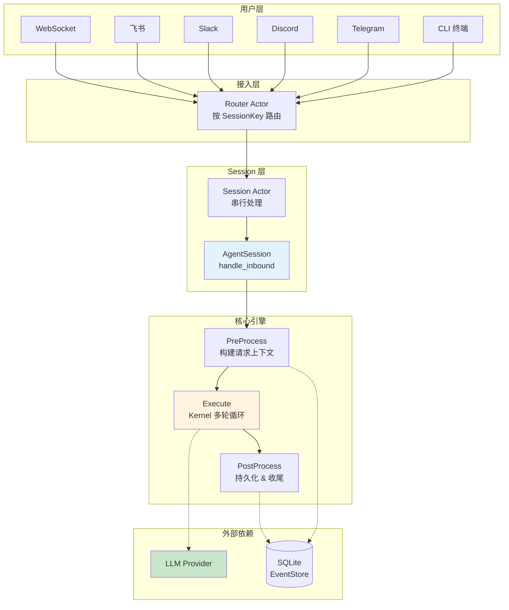
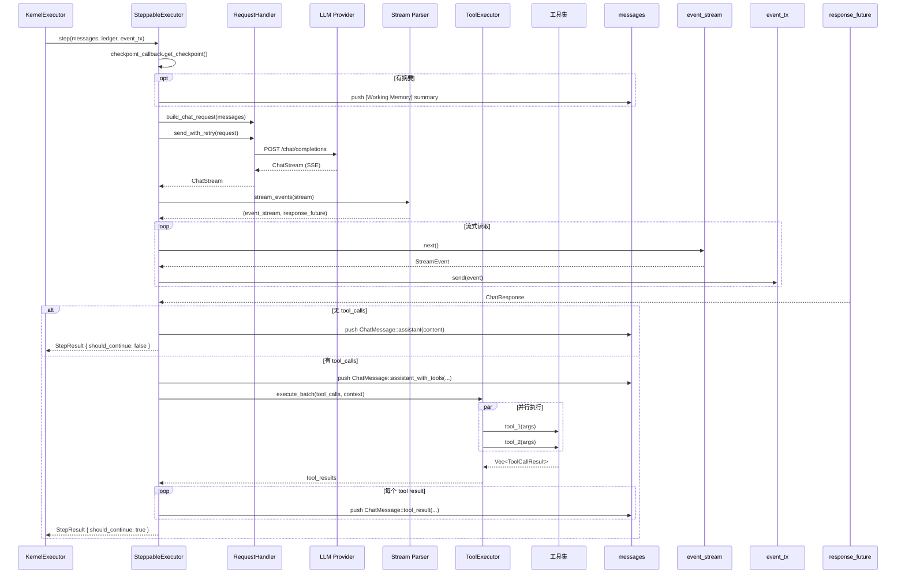
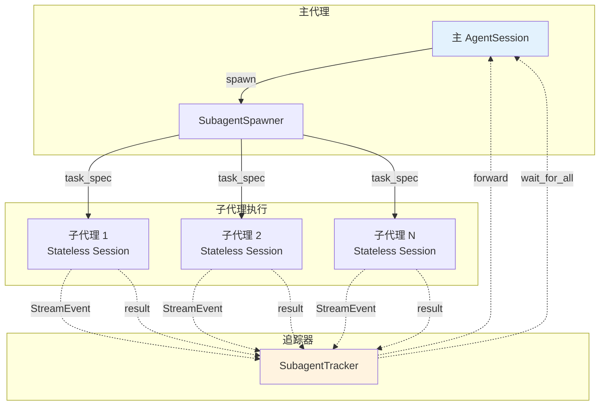
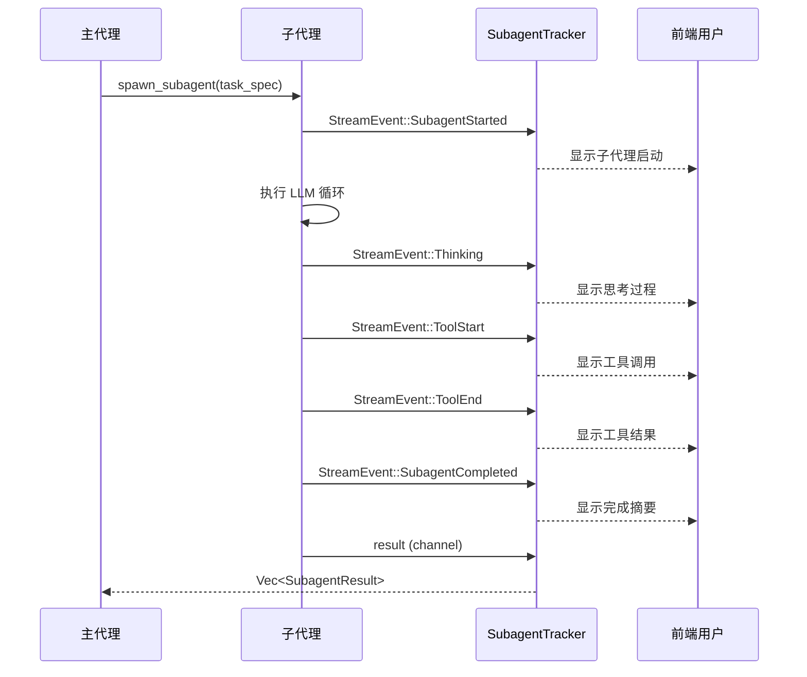
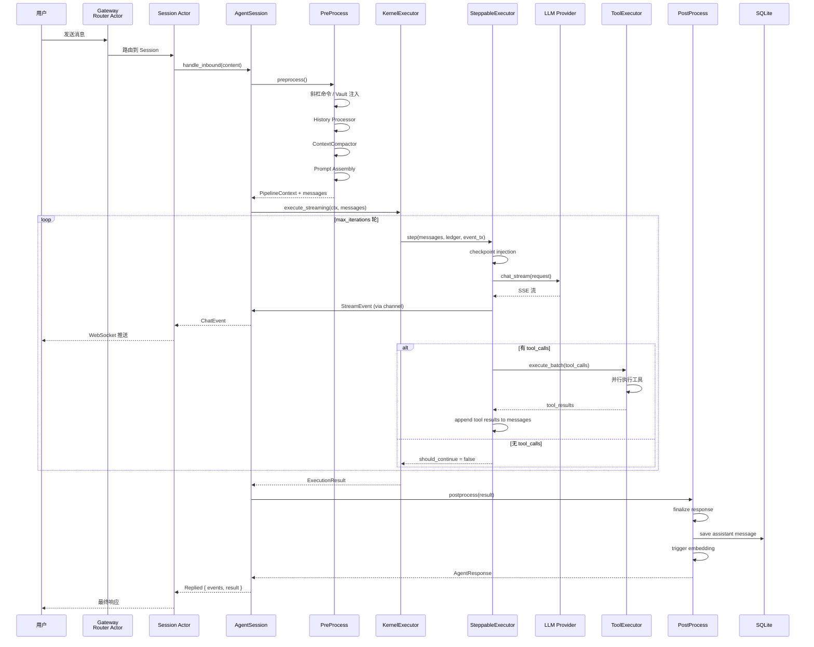

# Agent 执行流程图

> 完整描述 Gasket 中一个用户请求从入口到响应的完整生命周期

---

## 一、全景总览



---

## 二、AgentSession 三阶段流水线

```mermaid
flowchart LR
    subgraph 阶段1：PreProcess
        P1[构建 Prompt<br/>PROFILE + SOUL +<br/>AGENTS + MEMORY +<br/>BOOTSTRAP + skills]
        P2[History Processor<br/>token 感知截断]
        P3[ContextCompactor<br/>摘要压缩]
        P4[Vault 注入<br/>替换占位符]
    end

    subgraph 阶段2：Execute
        E1[Kernel::execute_streaming]
        E2[多轮 LLM 循环]
        E3[Tool 并行执行]
    end

    subgraph 阶段3：PostProcess
        O1[ResponseFinalizer<br/>计算 cost]
        O2[保存 assistant<br/>message 到 EventStore]
        O3[触发 embedding<br/>索引]
    end

    P1 --> P2 --> P3 --> P4 --> E1 --> E2 --> E3 --> O1 --> O2 --> O3

    style P4 fill:#E3F2FD
    style E2 fill:#FFF3E0
    style O1 fill:#F3E5F5
```

---

## 三、PreProcess 详细流程

```mermaid
flowchart TB
    START([开始]) --> PR[AgentSession<br/>handle_inbound]

    PR --> PA{pending_ask<br/>等待中?}
    PA -->|YES| CON[Consumed<br/>直接交付]
    PA -->|NO| PP[prepare_pipeline]

    PP --> BR[BeforeRequest Hook<br/>可修改 / 中止]
    BR --> SL[处理斜杠命令<br/>/new /help /model]
    SL --> SM{斜杠命令?}
    SM -->|YES| EXC[执行内置命令]
    SM -->|NO| SAVE

    SAVE[1. 保存 user message<br/>到 EventStore]

    subgraph 历史处理
        HH[History Processor]
        HH --> HP[算法：<br/>1. 取最近 max_messages 条<br/>2. 始终保留最后 recent_keep 条<br/>3. 较早消息按 token 预算纳入/驱逐<br/>→ ProcessedHistory]
    end

    SAVE --> HH

    subgraph 上下文压缩
        CC[ContextCompactor<br/>compact]
        CC --> EV{evicted<br/>不为空?}
        EV -->|YES| SUM[同步 LLM 生成摘要]
        EV -->|NO| LS[加载已有摘要]
        SUM --> SS[summary: Option<String>]
        LS --> SS
    end

    HP --> CC

    subgraph Prompt 组装
        PA2[Prompt Assembly]
        PA2 --> SYS1["[system] PROFILE.md + SOUL.md +<br/>AGENTS.md + MEMORY.md +<br/>BOOTSTRAP.md + skills_context"]
        PA2 --> SYS2["[system] 摘要 (如有)"]
        PA2 --> USR1["[user] 历史消息 × N"]
        PA2 --> USR2["[user] 长期记忆 (动态加载)"]
        PA2 --> USR3["[user] 当前输入内容"]
    end

    SS --> PA2

    PA2 --> VAULT[VaultInjector<br/>替换 {{vault:*}}]
    VAULT --> END_PP([返回 PipelineContext<br/>+ messages])

    style HH fill:#E3F2FD
    style CC fill:#FFF3E0
    style PA2 fill:#F3E5F5
```

---

## 四、Kernel 执行循环（核心）

```mermaid
flowchart TB
    START([开始]) --> I[iteration = 0]

    I --> LP{iteration &lt;<br/>max_iterations<br/>(默认20)?}

    LP -->|YES| INC[iteration++]
    INC --> CK[Proactive Checkpoint<br/>注入工作记忆摘要]
    CK --> CR[构建 ChatRequest<br/>model + messages + tools +<br/>temperature + max_tokens +<br/>thinking]

    CR --> LLM[LLM Provider<br/>chat_stream]

    LLM --> LR{失败?}
    LR -->|YES| RET[指数退避重试 ×3]
    RET --> LLM

    LR -->|NO| STREAM[流式解析<br/>accumulate_stream]

    STREAM --> DELTA{delta类型}
    DELTA -->|content| EC[StreamEvent::Content]
    DELTA -->|reasoning| ER[StreamEvent::Reasoning]
    DELTA -->|tool_calls| ET[累积 tool_calls<br/>直到流结束]

    EC --> CB[callback<br/>实时推送前端]
    ER --> CB

    STREAM --> RESP[ChatResponse<br/>content + reasoning + tool_calls]

    RESP --> TC{has_tool_calls?}

    TC -->|YES| TE[ToolExecutor<br/>execute_batch<br/>并行执行]
    TE --> TR[Tool Result<br/>追加到 messages]
    TR --> I

    TC -->|NO| DONE[StreamEvent::Done]
    DONE --> OUT[返回 ExecutionResult<br/>content + reasoning +<br/>tools_used + token_usage]

    LP -->|NO| MAX["返回 MaxIterations<br/>( gracefully )"]

    style LLM fill:#FFF3E0
    style TE fill:#F3E5F5
    style STREAM fill:#E3F2FD
```

---

## 五、单次 Step 详细流程



---

## 六、流式事件转换

```mermaid
flowchart TB
    subgraph Kernel 层事件
        K1[StreamEvent::Thinking]
        K2[StreamEvent::Content]
        K3[StreamEvent::ToolStart]
        K4[StreamEvent::ToolEnd]
        K5[StreamEvent::TokenStats]
        K6[StreamEvent::Done]
        K7[StreamEvent::SubagentStarted]
        K8[StreamEvent::SubagentCompleted]
        K9[StreamEvent::SubagentError]
    end

    subgraph 转换层
        T1[to_chat_event()<br/>filter_map]
    end

    subgraph 用户层事件 ChatEvent
        C1[WebSocketMessage::Thinking]
        C2[WebSocketMessage::Text]
        C3[WebSocketMessage::ToolStart]
        C4[WebSocketMessage::ToolEnd]
        C5[内部消费<br/>不转发]
        C6[WebSocketMessage::Done]
        C7[WebSocketMessage::SubagentStarted]
        C8[WebSocketMessage::SubagentCompleted]
        C9[WebSocketMessage::SubagentError]
    end

    K1 --> T1 --> C1
    K2 --> T1 --> C2
    K3 --> T1 --> C3
    K4 --> T1 --> C4
    K5 --> T1 --> C5
    K6 --> T1 --> C6
    K7 --> T1 --> C7
    K8 --> T1 --> C8
    K9 --> T1 --> C9

    style T1 fill:#E3F2FD
```

---

## 七、子代理（Subagent）执行流程



### 子代理事件流



---

## 八、完整时序图



---

## 九、关键数据结构流转

```mermaid
flowchart LR
    subgraph 输入
        I1[用户输入 String]
        I2[SessionKey]
    end

    subgraph 中间态
        M1[BuildOutcome<br/>Aborted | Ready]
        M2[ChatRequest<br/>messages + model + tools]
        M3[PipelineContext<br/>runtime_ctx + messages + fctx]
        M4[ChatResponse<br/>content + reasoning + tool_calls]
        M5[ExecutionResult<br/>content + reasoning + tools_used + token_usage]
    end

    subgraph 输出
        O1[AgentResponse<br/>content + reasoning + tools_used + model + cost]
        O2[ChatEvent Stream<br/>Text | Thinking | ToolStart | ToolEnd | Done]
    end

    I1 --> M1
    I2 --> M1
    M1 --> M2
    M2 --> M3
    M3 --> M4
    M4 --> M5
    M5 --> O1
    M4 -.-> O2

    style M3 fill:#E3F2FD
    style M5 fill:#FFF3E0
```

---

## 十、文件位置索引

| 模块 | 文件路径 | 职责 |
|------|---------|------|
| **入口** | `engine/src/session/mod.rs` | `AgentSession::handle_inbound` |
| **预处理** | `engine/src/session/mod.rs` | `preprocess()`, `prepare_pipeline()` |
| **Prompt 构建** | `engine/src/session/history/builder.rs` | `ContextBuilder::build()` |
| **历史处理** | `engine/src/session/history/processor.rs` | `HistoryProcessor` |
| **上下文压缩** | `engine/src/session/compactor/mod.rs` | `ContextCompactor::compact()` |
| **Kernel 入口** | `engine/src/kernel/mod.rs` | `execute_streaming()` |
| **执行循环** | `engine/src/kernel/kernel_executor.rs` | `KernelExecutor::execute()`, `run_loop()` |
| **单步执行** | `engine/src/kernel/steppable_executor.rs` | `SteppableExecutor::step()` |
| **流式解析** | `engine/src/kernel/stream.rs` | `stream_events()` |
| **工具执行** | `engine/src/kernel/tool_executor.rs` | `ToolExecutor::execute_batch()` |
| **请求构建** | `engine/src/kernel/request_handler.rs` | `RequestHandler::build_chat_request()` |
| **后处理** | `engine/src/session/finalizer.rs` | `ResponseFinalizer::finalize()` |
| **子代理** | `engine/src/plugin/dispatcher/subagent.rs` | `spawn_subagent()` |
| **事件转换** | `gasket-types/src/events.rs` | `StreamEvent::to_chat_event()` |
