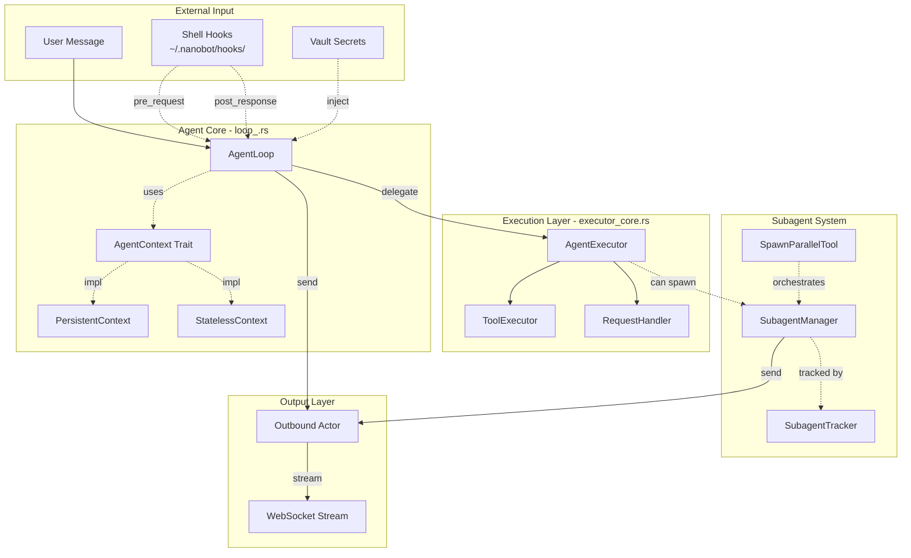
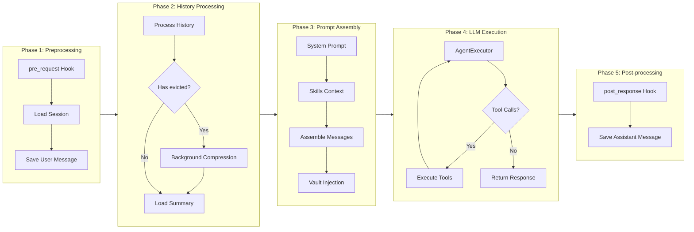
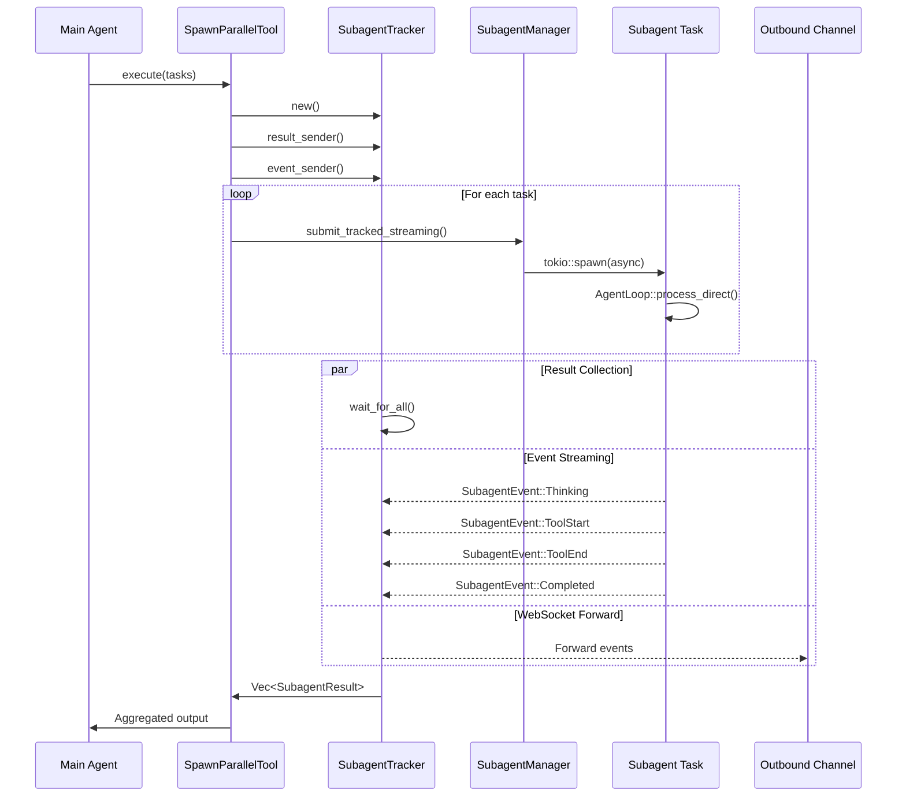
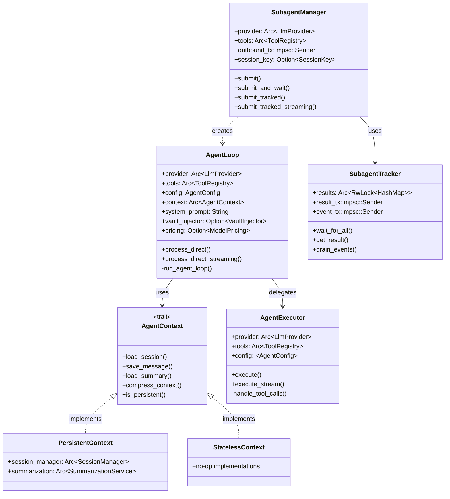

# Agent Module Architecture

> **Linus-style Architecture Review**: Good code should be self-explanatory, but complex systems need blueprints. This document is the "source code map" for the agent module.

---

## 1. High-Level Data Flow Overview



---

## 2. AgentLoop Execution Flow Details



---

## 3. Subagent Concurrency Model



---

## 4. Key Data Structure Relationships



---

## 5. Execution Mode Comparison

| Mode | Context Type | Persistence | Typical Use | Entry Point |
|------|-----------|--------|---------|--------|
| **Main Agent** | PersistentContext | Yes | User conversation | `AgentLoop::new()` |
| **Background Subagent** | StatelessContext | No | Background tasks | `SubagentManager::submit()` |
| **Sync Subagent** | StatelessContext | No | Governance agent | `SubagentManager::submit_and_wait()` |
| **Parallel Subagent** | StatelessContext | No | Parallel computation | `SpawnParallelTool::execute()` |
| **Model Switch** | StatelessContext | No | Switch model | `SubagentManager::submit_and_wait_with_model()` |

---

## 6. Key Execution Path Code Mapping

### 6.1 Main Agent Execution Path

```
User Input
    ↓
AgentLoop::process_direct() [loop_.rs:440]
    ↓
AgentLoop::run_agent_loop() [loop_.rs:735]
    ↓
AgentExecutor::execute_with_options() [executor_core.rs:152]
    ↓
RequestHandler::send_with_retry() [request.rs]
    ↓
LlmProvider::chat_stream()
```

### 6.2 Subagent Execution Path

```
Tool Call (spawn_parallel)
    ↓
SpawnParallelTool::execute() [spawn_parallel.rs:132]
    ↓
SubagentManager::submit_tracked_streaming() [subagent.rs:384]
    ↓
tokio::spawn(async { ... })
    ↓
AgentLoop::builder() → StatelessContext [loop_.rs:385]
    ↓
AgentLoop::process_direct_streaming() [loop_.rs:591]
    ↓
Result → mpsc::channel → SubagentTracker
```

---

## 7. Design Review: Potential Issues and Risks

### 7.1 🔴 High Risk: Subagent Result Loss

**Issue**: `SubagentTracker::wait_for_all()` uses `tokio::time::timeout`, but results from partially completed tasks may be lost after timeout.

**Code Location**: `subagent_tracker.rs:124-186`

```rust
// Issue: After timeout, still-running subagents continue sending to closed channel
pub async fn wait_for_all_timeout(&self, count: usize, timeout: Duration) -> Vec<SubagentResult> {
    // ... Returns collected results if timeout occurs
    // But background tasks still running, may panic or lose results
}
```

**Recommendations**:
1. Use `tokio_util::sync::CancellationToken` to actively cancel timed-out tasks
2. Or use `JoinHandle` to wait for all tasks to truly complete

### 7.2 🟡 Medium Risk: Channel Backpressure

**Issue**: Event forwarding task in `spawn_parallel.rs:292-360` uses infinite loop; if WebSocket consumer is slower than producer, may cause memory growth.

**Code Location**: `spawn_parallel.rs:354`

```rust
// Uses try_send to avoid blocking, but only warns on failure
if let Err(e) = outbound_tx.try_send(outbound) {
    warn!("Failed to send subagent event to outbound channel: {}", e);
}
```

**Recommendation**: Consider using bounded channel + backpressure strategy, or rate-limited sending.

### 7.3 🟡 Medium Risk: Task-Local Storage Abuse Risk

**Issue**: `CURRENT_SESSION_KEY` is global task-local variable; while currently controlled, adds implicit dependencies.

**Code Location**: `loop_.rs:81-83`

```rust
task_local! {
    pub static CURRENT_SESSION_KEY: Option<SessionKey>;
}
```

**Current Mitigation**:
- Detailed comments explaining usage restrictions
- Only used in Tool::execute() to get session context
- Prohibited for storing mutable state

### 7.4 🟢 Low Risk: Code Duplication

**Issue**: `SubagentManager` has multiple similar submit methods with code duplication.

**Code Location**: `subagent.rs:90-331`

- `submit()` - fire-and-forget
- `submit_and_wait()` - sync wait
- `submit_and_wait_with_model()` - with model switch
- `submit_and_wait_with_model_streaming()` - with streaming

**Recommendation**: Consider using builder pattern or unified parameter struct to reduce duplication.

---

## 8. Taste Score

```
┌─────────────────────────────────────────────────────────┐
│  【Taste Score】 Good Taste ✓                            │
├─────────────────────────────────────────────────────────┤
│  【Highlights】                                          │
│  • AgentContext trait eliminates Option<T> runtime checks│
│  • Clear separation between execution and state layers   │
│  • Vault values at request-level scope, prevents leaks   │
│  • Background compression doesn't block user response    │
├─────────────────────────────────────────────────────────┤
│  【Improvements】                                        │
│  • Subagent timeout handling could be simpler/clearer    │
│  • Multiple submit_* methods could merge into unified API│
│  • spawn_parallel mpsc clone logic could extract helper  │
└─────────────────────────────────────────────────────────┘
```

---

## 9. File Index

| File | Responsibility | Key Structures |
|------|------|---------|
| `loop_.rs` | Main Agent loop | `AgentLoop`, `AgentConfig` |
| `executor_core.rs` | Core execution engine | `AgentExecutor`, `ExecutionResult` |
| `context.rs` | State management trait | `AgentContext`, `PersistentContext`, `StatelessContext` |
| `subagent.rs` | Subagent management | `SubagentManager` |
| `subagent_tracker.rs` | Parallel tracking | `SubagentTracker`, `SubagentEvent` |
| `spawn_parallel.rs` | Parallel tool | `SpawnParallelTool` |
| `pipeline.rs` | Simplified pipeline | `process_message()` |
| `stream.rs` | Stream events | `StreamEvent` |
| `request.rs` | Request building | `RequestHandler` |
| `history_processor.rs` | History processing | `process_history()` |
