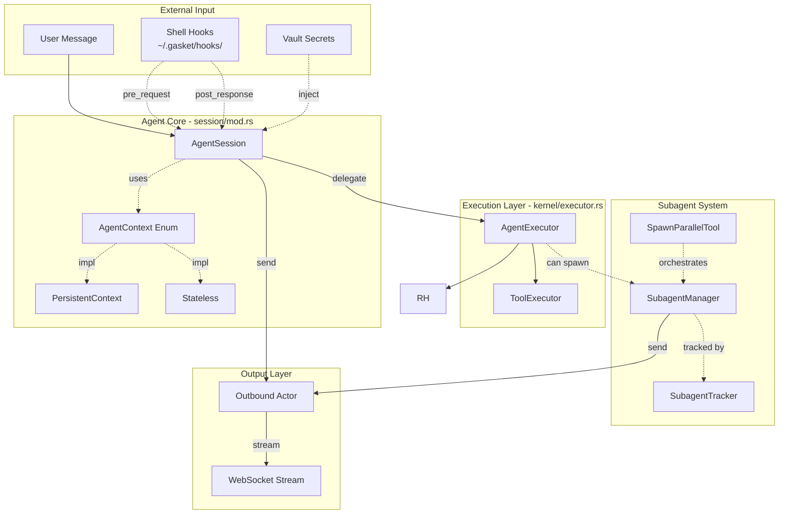
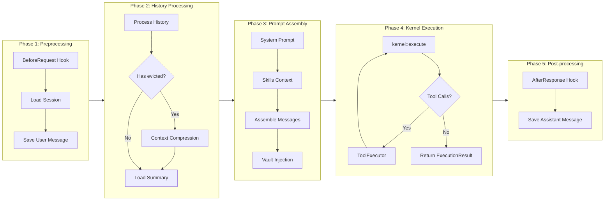
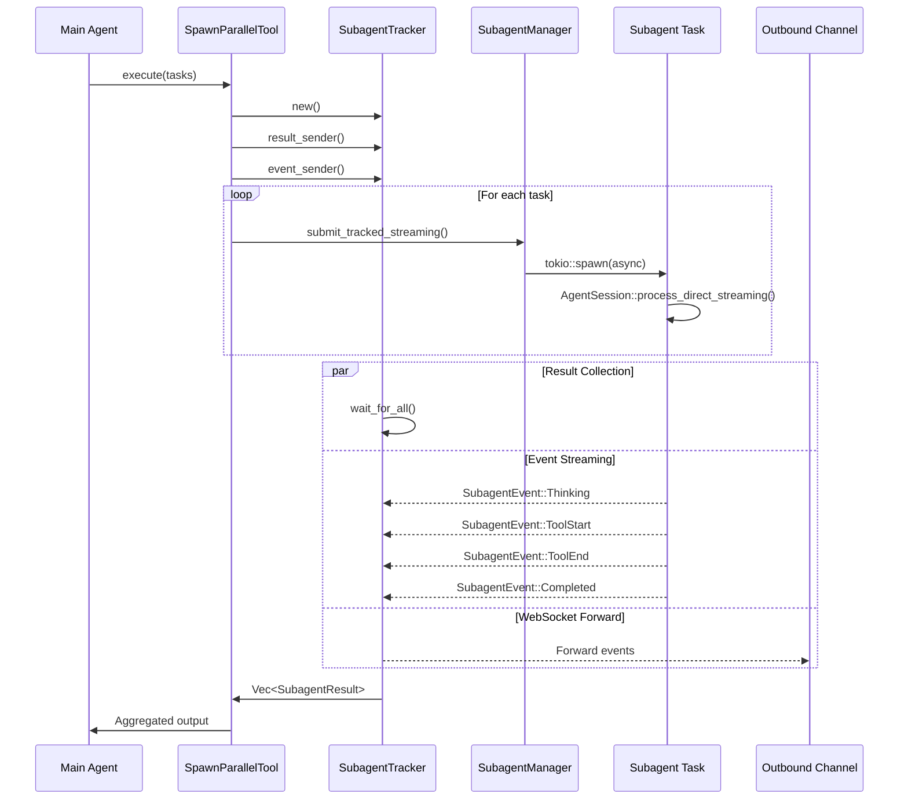
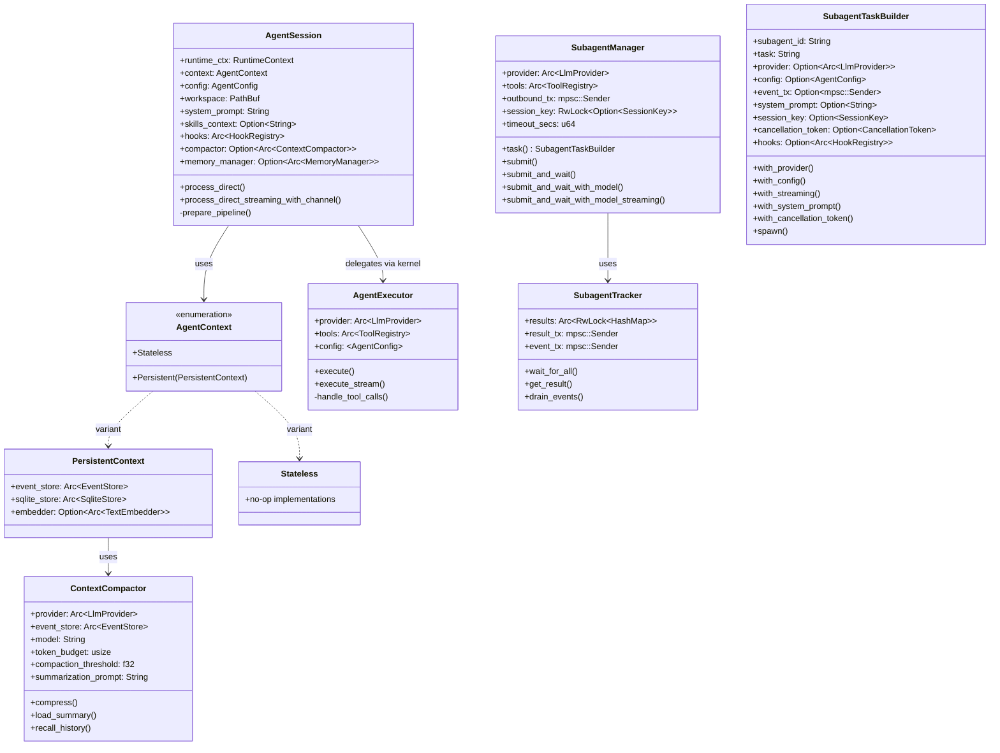

# Agent Module Architecture

> **Linus-style Architecture Review**: Good code should be self-explanatory, but complex systems need blueprints. This document is the "source code map" for the agent module.

---

## 1. High-Level Data Flow Overview



---

## 2. AgentSession Execution Flow Details



---

## 3. Subagent Concurrency Model



---

## 4. Key Data Structure Relationships



---

## 5. Execution Mode Comparison

| Mode | Context Type | Persistence | Typical Use | Entry Point |
|------|-----------|--------|---------|--------|
| **Main Agent** | AgentContext::Persistent | Yes | User conversation | `AgentSession::new()` |
| **Background Subagent** | AgentContext::Stateless | No | Background tasks | `SubagentManager::submit()` |
| **Sync Subagent** | AgentContext::Stateless | No | Governance agent | `SubagentManager::submit_and_wait()` |
| **Parallel Subagent** | AgentContext::Stateless | No | Parallel computation | `SpawnParallelTool::execute()` |
| **Model Switch** | AgentContext::Stateless | No | Switch model | `SubagentManager::submit_and_wait_with_model()` |

---

## 6. Key Execution Path Code Mapping

### 6.1 Main Agent Execution Path

```
User Input
    ↓
AgentSession::process_direct() [session/mod.rs]
    ↓
prepare_pipeline() → BuildOutcome::Ready
    ↓
kernel::execute() [kernel/mod.rs]
    ↓
AgentExecutor::execute_with_options() [kernel/executor.rs]
    ↓
LlmProvider::chat_stream()
    ↓
finalize_response() → AgentResponse
```

### 6.2 Subagent Execution Path

```
Tool Call (spawn_parallel)
    ↓
SpawnParallelTool::execute() [tools/spawn_parallel.rs]
    ↓
SubagentTracker::new() + event_sender()
    ↓
SubagentManager::task(id, prompt) → SubagentTaskBuilder [subagents/manager.rs]
    ↓
SubagentTaskBuilder::with_streaming().spawn()
    ↓
tokio::spawn(async { ... })
    ↓
AgentSession::with_pricing() → AgentContext::Stateless
    ↓
process_direct_streaming()
    ↓
Result → mpsc::channel → SubagentTracker
```

---

## 7. Design Review: Potential Issues and Risks

### 7.1 🟢 Low Risk: Subagent Result Loss (Mitigated)

**Previous Issue**: `SubagentTracker::wait_for_all()` uses `tokio::time::timeout`, but results from partially completed tasks may be lost after timeout.

**Mitigation**: `CancellationToken` is now used for graceful cancellation of timed-out tasks.

**Code Location**: `subagent_tracker.rs`

```rust
// Now uses CancellationToken for graceful cancellation
pub async fn wait_for_all_timeout(&self, count: usize, timeout: Duration) -> Vec<SubagentResult> {
    // SubagentTaskBuilder::with_cancellation_token() ensures clean shutdown
}
```

**Status**: ✅ Mitigated with CancellationToken pattern

### 7.2 🟡 Medium Risk: Channel Backpressure

**Issue**: Event forwarding task in `spawn_parallel.rs:292-360` uses infinite loop; if WebSocket consumer is slower than producer, may cause memory growth.

**Code Location**: `spawn_parallel.rs:354`

```rust
// Uses try_send to avoid blocking, but only warns on failure
if let Err(e) = outbound_tx.try_send(outbound) {
    warn!("Failed to send subagent event to outbound channel: {}", e);
}
```

**Recommendation**: Consider using bounded channel + backpressure strategy, or rate-limited sending.

### 7.3 🟡 Medium Risk: Task-Local Storage Abuse Risk

**Issue**: `CURRENT_SESSION_KEY` is global task-local variable; while currently controlled, adds implicit dependencies.

**Code Location**: `loop_.rs:81-83`

```rust
task_local! {
    pub static CURRENT_SESSION_KEY: Option<SessionKey>;
}
```

**Current Mitigation**:
- Detailed comments explaining usage restrictions
- Only used in Tool::execute() to get session context
- Prohibited for storing mutable state

### 7.4 🟢 Low Risk: Code Duplication

**Issue**: `SubagentManager` has multiple similar submit methods with code duplication.

**Code Location**: `subagent.rs:90-331`

- `submit()` - fire-and-forget
- `submit_and_wait()` - sync wait
- `submit_and_wait_with_model()` - with model switch
- `submit_and_wait_with_model_streaming()` - with streaming

**Recommendation**: Consider using builder pattern or unified parameter struct to reduce duplication.

---

## 8. Taste Score

```
┌─────────────────────────────────────────────────────────┐
│  【Taste Score】 Good Taste ✓                            │
├─────────────────────────────────────────────────────────┤
│  【Highlights】                                          │
│  • AgentContext enum eliminates trait object overhead   │
│  • Clear separation between execution and state layers   │
│  • Vault values at request-level scope, prevents leaks   │
│  • ContextCompactor for synchronous context compression  │
│  • Builder pattern for subagent task configuration       │
├─────────────────────────────────────────────────────────┤
│  【Improvements】                                        │
│  • Subagent timeout handling now uses CancellationToken  │
│  • Builder pattern unifies subagent API                  │
│  • ContextCompactor for sync compression (was async bg task) │
└─────────────────────────────────────────────────────────┘
```

---

## 9. File Index

| File | Responsibility | Key Structures |
|------|------|---------|
| `session/mod.rs` | Session management core | `AgentSession`, `AgentResponse`, `FinalizeContext` |
| `session/config.rs` | Agent configuration | `AgentConfig`, `AgentConfigExt` |
| `session/context.rs` | Context management | `AgentContext` enum, `PersistentContext` |
| `session/compactor.rs` | Context compression | `ContextCompactor` |
| `session/memory.rs` | Memory management | `MemoryManager`, `MemoryContext`, `MemoryProvider` |
| `session/prompt.rs` | Prompt loading | `load_system_prompt()`, `load_skills_context()` |
| `kernel/mod.rs` | Pure function entry | `execute()`, `execute_streaming()` |
| `kernel/executor.rs` | Core execution engine | `AgentExecutor`, `ToolExecutor`, `ExecutionResult` |
| `kernel/context.rs` | Runtime context | `RuntimeContext`, `KernelConfig` |
| `kernel/stream.rs` | Stream events | `StreamEvent`, `BufferedEvents` |
| `subagents/manager.rs` | Subagent management | `SubagentManager`, `SubagentTaskBuilder` |
| `subagents/tracker.rs` | Parallel tracking | `SubagentTracker`, `SubagentEvent`, `SubagentResult` |
| `subagents/runner.rs` | Subagent execution | `run_subagent()`, `ModelResolver` |
| `tools/spawn_parallel.rs` | Parallel tool | `SpawnParallelTool` |
| `processor.rs` | History processing | `process_history()`, `HistoryConfig`, `ProcessedHistory` |
| `compactor.rs` | Context compression | `ContextCompactor`, `CompactionConfig` |
| `prompt.rs` | Prompt loading | `load_prompt()`, `load_skills_context()` |
