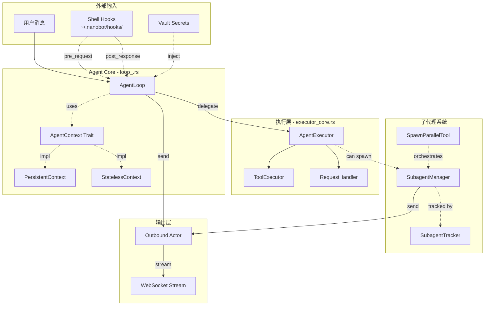
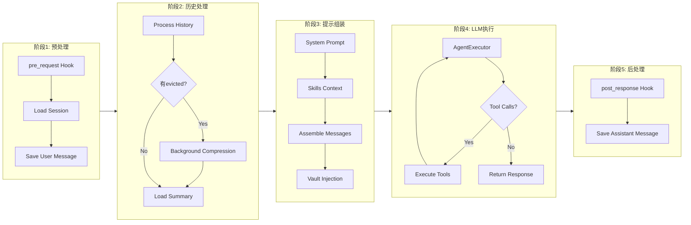
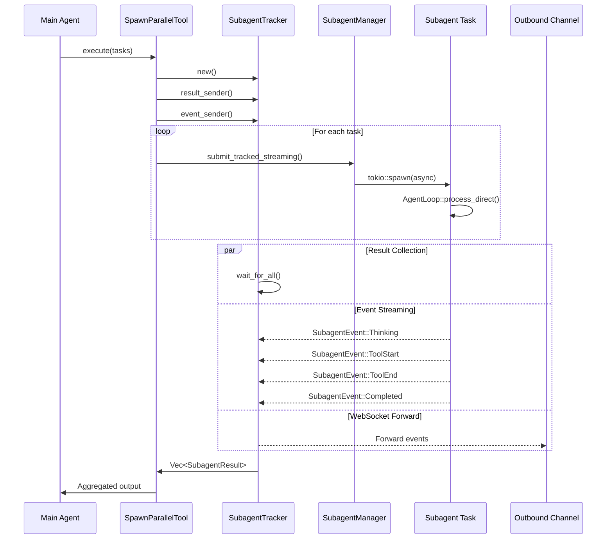
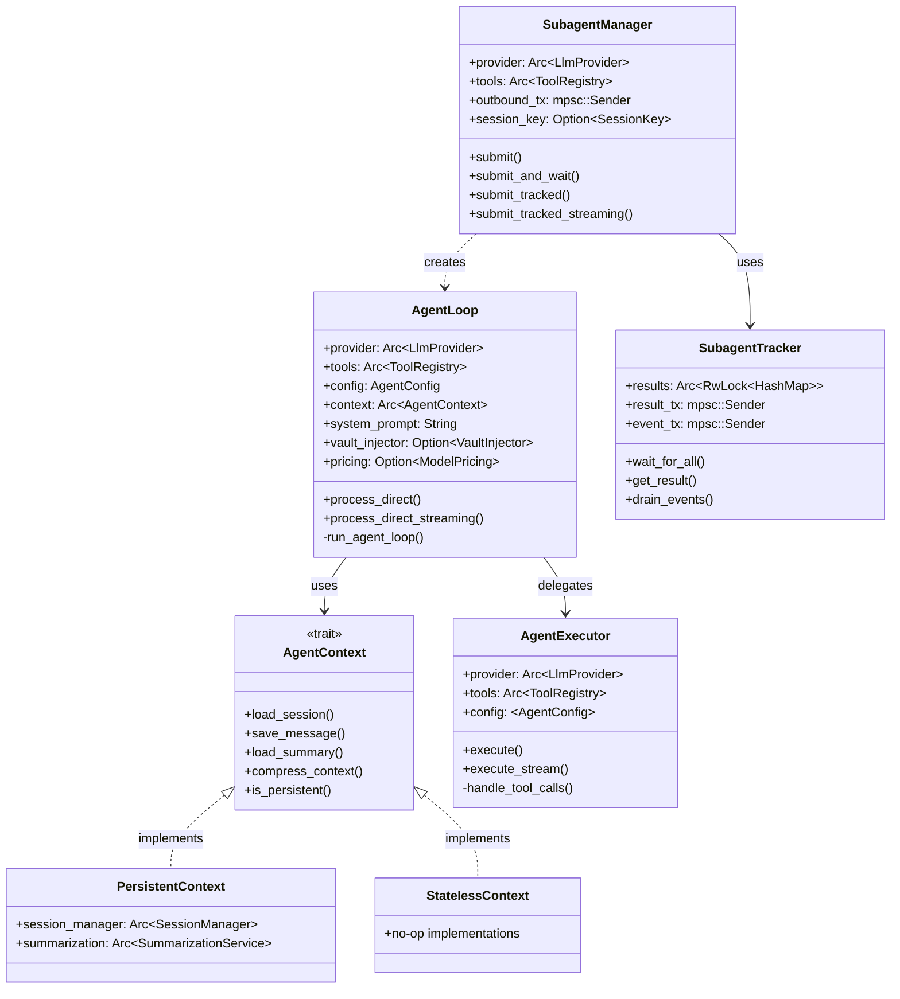

# Agent Module Architecture

> **Linus式架构审查**: 好代码应该自我解释，但复杂系统需要蓝图。本文档是agent模块的"源代码地图"。

## 1. 高层数据流概览



## 2. AgentLoop 执行流程详解



## 3. Subagent 并发模型



## 4. 关键数据结构关系



## 5. 执行模式对比

| 模式 | 上下文类型 | 持久化 | 典型用途 | 入口点 |
|------|-----------|--------|---------|--------|
| **Main Agent** | PersistentContext | 是 | 用户对话 | `AgentLoop::new()` |
| **Background Subagent** | StatelessContext | 否 | 后台任务 | `SubagentManager::submit()` |
| **Sync Subagent** | StatelessContext | 否 | 治理代理 | `SubagentManager::submit_and_wait()` |
| **Parallel Subagent** | StatelessContext | 否 | 并行计算 | `SpawnParallelTool::execute()` |
| **Model Switch** | StatelessContext | 否 | 切换模型 | `SubagentManager::submit_and_wait_with_model()` |

## 6. 关键执行路径代码映射

### 6.1 主Agent执行路径
```
User Input
    ↓
AgentLoop::process_direct() [loop_.rs:440]
    ↓
AgentLoop::run_agent_loop() [loop_.rs:735]
    ↓
AgentExecutor::execute_with_options() [executor_core.rs:152]
    ↓
RequestHandler::send_with_retry() [request.rs]
    ↓
LlmProvider::chat_stream()
```

### 6.2 Subagent执行路径
```
Tool Call (spawn_parallel)
    ↓
SpawnParallelTool::execute() [spawn_parallel.rs:132]
    ↓
SubagentManager::submit_tracked_streaming() [subagent.rs:384]
    ↓
tokio::spawn(async { ... })
    ↓
AgentLoop::builder() → StatelessContext [loop_.rs:385]
    ↓
AgentLoop::process_direct_streaming() [loop_.rs:591]
    ↓
Result → mpsc::channel → SubagentTracker
```

## 7. 设计审查: 潜在问题与风险

### 7.1 🔴 高风险: Subagent结果丢失

**问题**: `SubagentTracker::wait_for_all()` 使用 `tokio::time::timeout`，但timeout后部分完成的任务结果会丢失。

**代码位置**: `subagent_tracker.rs:124-186`

```rust
// 问题: timeout后，仍在运行的subagent会继续发送结果到closed channel
pub async fn wait_for_all_timeout(&self, count: usize, timeout: Duration) -> Vec<SubagentResult> {
    // ... 如果timeout发生，返回已收集的结果
    // 但后台任务仍在运行，可能panic或丢失结果
}
```

**建议**:
1. 使用 `tokio_util::sync::CancellationToken` 主动取消超时任务
2. 或者使用 `JoinHandle` 等待所有任务真正完成

### 7.2 🟡 中风险: Channel背压

**问题**: `spawn_parallel.rs:292-360` 的事件转发任务使用无限循环，如果WebSocket消费者慢于生产者，可能导致内存增长。

**代码位置**: `spawn_parallel.rs:354`

```rust
// 使用try_send避免阻塞，但失败时只是warn
if let Err(e) = outbound_tx.try_send(outbound) {
    warn!("Failed to send subagent event to outbound channel: {}", e);
}
```

**建议**: 考虑使用有界channel + 背压策略，或限流发送。

### 7.3 🟡 中风险: Task-Local Storage滥用风险

**问题**: `CURRENT_SESSION_KEY` 是全局task-local变量，虽然当前使用受控，但增加了隐式依赖。

**代码位置**: `loop_.rs:81-83`

```rust
task_local! {
    pub static CURRENT_SESSION_KEY: Option<SessionKey>;
}
```

**当前缓解措施**:
- 详细注释说明使用限制
- 仅用于Tool::execute()获取session上下文
- 禁止用于存储可变状态

### 7.4 🟢 低风险: 重复代码

**问题**: `SubagentManager` 有多个类似的submit方法，存在代码重复。

**代码位置**: `subagent.rs:90-331`

- `submit()` - fire-and-forget
- `submit_and_wait()` - sync wait
- `submit_and_wait_with_model()` - with model switch
- `submit_and_wait_with_model_streaming()` - with streaming

**建议**: 考虑使用builder模式或统一参数结构体来减少重复。

## 8. 品味评分

```
┌─────────────────────────────────────────────────────────┐
│  【品味评分】 好品味 ✓                                   │
├─────────────────────────────────────────────────────────┤
│  【亮点】                                                │
│  • AgentContext trait消除Option<T>运行时检查             │
│  • 执行层与状态管理层清晰分离                              │
│  • Vault值请求级作用域，防止内存泄漏                       │
│  • 背景压缩不阻塞用户响应                                  │
├─────────────────────────────────────────────────────────┤
│  【可改进】                                              │
│  • Subagent超时处理可以更简单明确                          │
│  • 多个submit_*方法可以合并为统一API                       │
│  • spawn_parallel的mpsc克隆逻辑可以提取辅助函数             │
└─────────────────────────────────────────────────────────┘
```

## 9. 文件索引

| 文件 | 职责 | 关键结构 |
|------|------|---------|
| `loop_.rs` | 主Agent循环 | `AgentLoop`, `AgentConfig` |
| `executor_core.rs` | 核心执行引擎 | `AgentExecutor`, `ExecutionResult` |
| `context.rs` | 状态管理trait | `AgentContext`, `PersistentContext`, `StatelessContext` |
| `subagent.rs` | 子代理管理 | `SubagentManager` |
| `subagent_tracker.rs` | 并行追踪 | `SubagentTracker`, `SubagentEvent` |
| `spawn_parallel.rs` | 并行工具 | `SpawnParallelTool` |
| `pipeline.rs` | 简化流水线 | `process_message()` |
| `stream.rs` | 流事件 | `StreamEvent` |
| `request.rs` | 请求构建 | `RequestHandler` |
| `history_processor.rs` | 历史处理 | `process_history()` |
