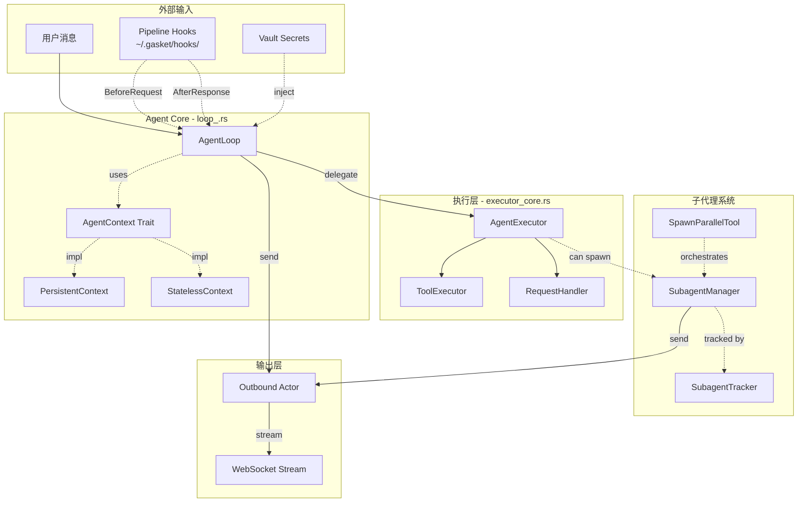
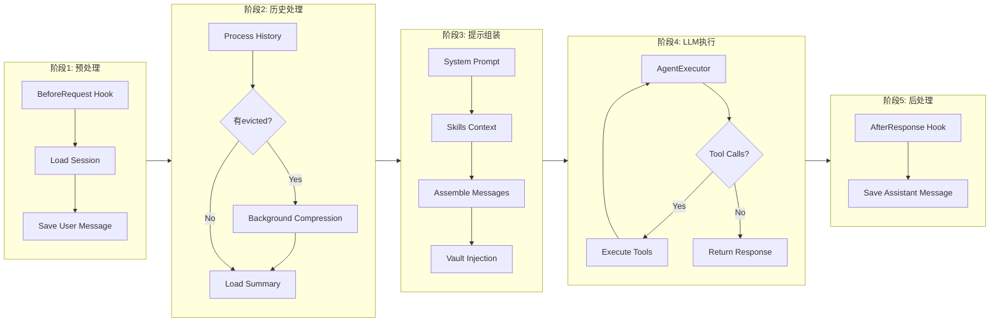
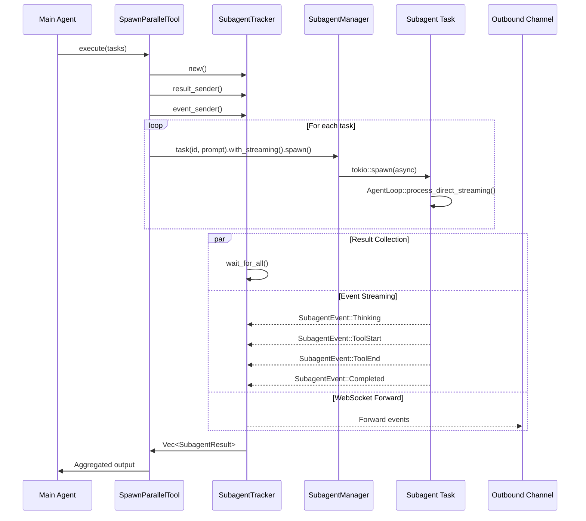
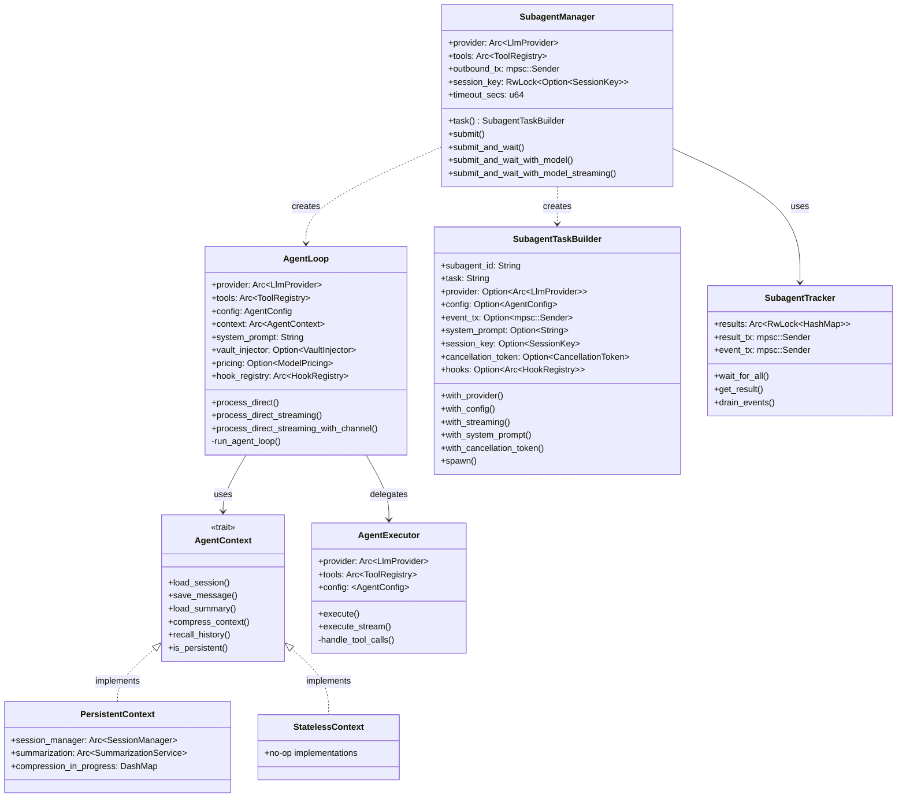

# Agent Module Architecture

> Agent 模块技术架构文档

---

## 1. 高层数据流概览



---

## 2. AgentLoop 执行流程详解



---

## 3. Subagent 并发模型



---

## 4. 关键数据结构关系



---

## 5. 执行模式对比

| 模式 | 上下文类型 | 持久化 | 典型用途 | 入口点 |
|------|-----------|--------|---------|--------|
| **Main Agent** | PersistentContext | 是 | 用户对话 | `AgentLoop::new()` |
| **Background Subagent** | StatelessContext | 否 | 后台任务 | `SubagentManager::submit()` |
| **Sync Subagent** | StatelessContext | 否 | 治理代理 | `SubagentManager::submit_and_wait()` |
| **Parallel Subagent** | StatelessContext | 否 | 并行计算 | `SpawnParallelTool::execute()` |
| **Model Switch** | StatelessContext | 否 | 切换模型 | `SubagentManager::submit_and_wait_with_model()` |

---

## 6. 关键执行路径代码映射

### 6.1 主Agent执行路径
```
User Input
    ↓
AgentLoop::process_direct() [loop_.rs:465]
    ↓
AgentLoop::run_agent_loop() [loop_.rs:862]
    ↓
AgentExecutor::execute_with_options() [executor_core.rs]
    ↓
RequestHandler::send_with_retry() [request.rs]
    ↓
LlmProvider::chat_stream()
```

### 6.2 流式执行路径
```
User Input
    ↓
AgentLoop::process_direct_streaming_with_channel() [loop_.rs:660]
    ↓
AgentExecutor::execute_stream() [executor_core.rs]
    ↓
StreamEvent::Content/Reasoning/ToolStart/ToolEnd → mpsc::channel
    ↓
WebSocket Forward [actors.rs:200]
```

### 6.3 Subagent执行路径（Builder模式）
```
Tool Call (spawn_parallel)
    ↓
SpawnParallelTool::execute() [spawn_parallel.rs]
    ↓
SubagentManager::task(id, prompt) → SubagentTaskBuilder [subagent.rs:681]
    ↓
SubagentTaskBuilder::with_streaming().with_system_prompt()...
    ↓
SubagentTaskBuilder::spawn() [subagent.rs:220]
    ↓
tokio::spawn(async { ... })
    ↓
AgentLoop::builder() → StatelessContext [loop_.rs:393]
    ↓
AgentLoop::process_direct_streaming() [loop_.rs:625]
    ↓
Result → mpsc::channel → SubagentTracker
```

---

## 7. AgentContext Trait 详解

`AgentContext` trait 抽象了状态管理，消除了核心循环中的 `Option<T>` 检查。

```rust
#[async_trait]
pub trait AgentContext: Send + Sync {
    /// 加载或创建会话
    async fn load_session(&self, key: &SessionKey) -> Session;

    /// 保存消息到会话
    async fn save_message(
        &self,
        key: &SessionKey,
        role: &str,
        content: &str,
        tools: Option<Vec<String>>,
    ) -> Result<(), AgentError>;

    /// 加载会话摘要
    async fn load_summary(&self, key: &str) -> Option<String>;

    /// 压缩上下文（后台非阻塞）
    fn compress_context(&self, key: &str, evicted: &[SessionMessage]);

    /// 语义历史召回
    async fn recall_history(
        &self,
        key: &str,
        query_embedding: &[f32],
        top_k: usize,
    ) -> Result<Vec<String>>;

    /// 是否启用持久化
    fn is_persistent(&self) -> bool;
}
```

### 实现对比

| 方法 | PersistentContext | StatelessContext |
|------|------------------|------------------|
| `load_session` | 从 SQLite 加载 | 内存创建 |
| `save_message` | 持久化到 SQLite | No-op |
| `load_summary` | 从 SQLite 加载 | 返回 None |
| `compress_context` | 后台 LLM 摘要 | No-op |
| `recall_history` | 语义搜索 | 返回空 Vec |
| `is_persistent` | true | false |

---

## 8. Hook 系统架构

Pipeline Hook 系统提供五个执行点的扩展机制：

```rust
pub enum HookPoint {
    BeforeRequest,    // 顺序执行，可修改/中止
    AfterHistory,     // 顺序执行，可修改
    BeforeLLM,        // 顺序执行，最后修改机会
    AfterToolCall,    // 并行执行，只读
    AfterResponse,    // 并行执行，只读
}
```

### 内置 Hooks

| Hook | 类型 | 职责 |
|------|------|------|
| `ExternalShellHook` | BeforeRequest/AfterResponse | 外部 Shell 脚本扩展 |
| `HistoryRecallHook` | AfterHistory | 语义历史召回 |
| `VaultHook` | BeforeLLM | Vault 占位符注入 |

---

## 9. 上下文压缩机制

`SummarizationService` 提供非阻塞的上下文压缩：

```rust
pub struct SummarizationService {
    provider: Arc<dyn LlmProvider>,
    store: SqliteStore,
    config: SummarizationConfig,
}

impl SummarizationService {
    /// 后台压缩（非阻塞）
    pub async fn compress(&self, session_key: &str, messages: &[SessionMessage]) -> Result<()>;

    /// 加载已有摘要
    pub async fn load_summary(&self, session_key: &str) -> Option<String>;

    /// 语义历史召回
    pub async fn recall_history(&self, session_key: &str, embedding: &[f32], top_k: usize)
        -> Vec<(String, f32)>;
}
```

压缩流程：
1. `process_history()` 识别被驱逐的消息
2. `AgentContext::compress_context()` 触发后台任务
3. `DashMap` 确保每会话只有一个压缩任务运行
4. 摘要存储到 `session_summaries` 表

---

## 10. SubagentManager API

SubagentManager 提供 Builder 模式的任务创建 API：

```rust
// Builder 模式（推荐）
let task_id = manager
    .task("sub-1", "执行任务")
    .with_system_prompt("自定义提示词".to_string())
    .with_streaming(event_tx)
    .with_cancellation_token(token)
    .spawn(result_tx)
    .await?;

// 传统 API 仍可用
manager.submit(prompt, channel, chat_id)?;
manager.submit_and_wait(prompt, system_prompt, channel, chat_id).await?;
```

---

## 11. 文件索引

| 文件 | 职责 | 关键结构 |
|------|------|---------|
| `loop_.rs` | 主Agent循环 | `AgentLoop`, `AgentConfig`, `AgentResponse` |
| `executor_core.rs` | 核心执行引擎 | `AgentExecutor`, `ExecutionResult` |
| `context.rs` | 状态管理trait | `AgentContext`, `PersistentContext`, `StatelessContext` |
| `subagent.rs` | 子代理管理 | `SubagentManager`, `SubagentTaskBuilder`, `SessionKeyGuard` |
| `subagent_tracker.rs` | 并行追踪 | `SubagentTracker`, `SubagentEvent`, `SubagentResult` |
| `spawn_parallel.rs` | 并行工具 | `SpawnParallelTool` |
| `pipeline.rs` | 简化流水线 | `process_message()` |
| `stream.rs` | 流事件 | `StreamEvent` |
| `request.rs` | 请求构建 | `RequestHandler` |
| `history_processor.rs` | 历史处理 | `process_history()`, `HistoryConfig`, `ProcessedHistory` |
| `summarization.rs` | 摘要服务 | `SummarizationService`, `SummarizationConfig` |
| `prompt.rs` | 提示加载 | `load_prompt()`, `load_skills_context()` |
