# System Architecture

> Gasket overall architecture design — how the components work together

---

## One-Sentence Summary

Gasket is like an **operating system for an AI assistant**, connecting user input, AI brain, memory, and tools together.

---

## Overall Architecture Diagram

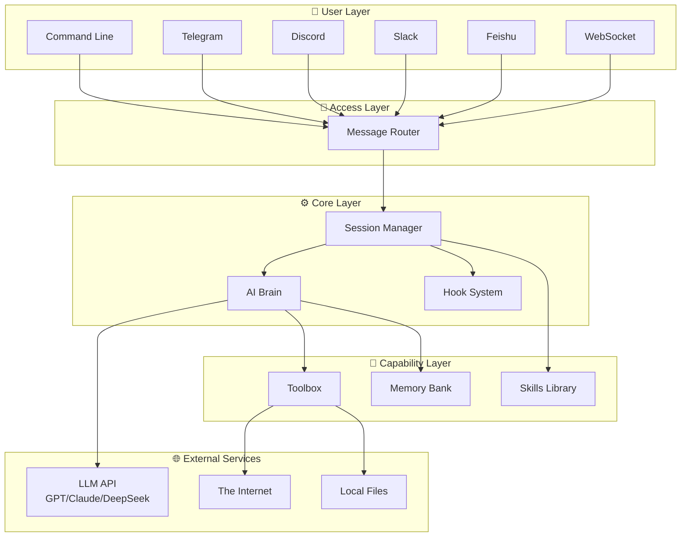

---

## Layer Responsibilities

### 1. User Layer: Multiple Entry Points

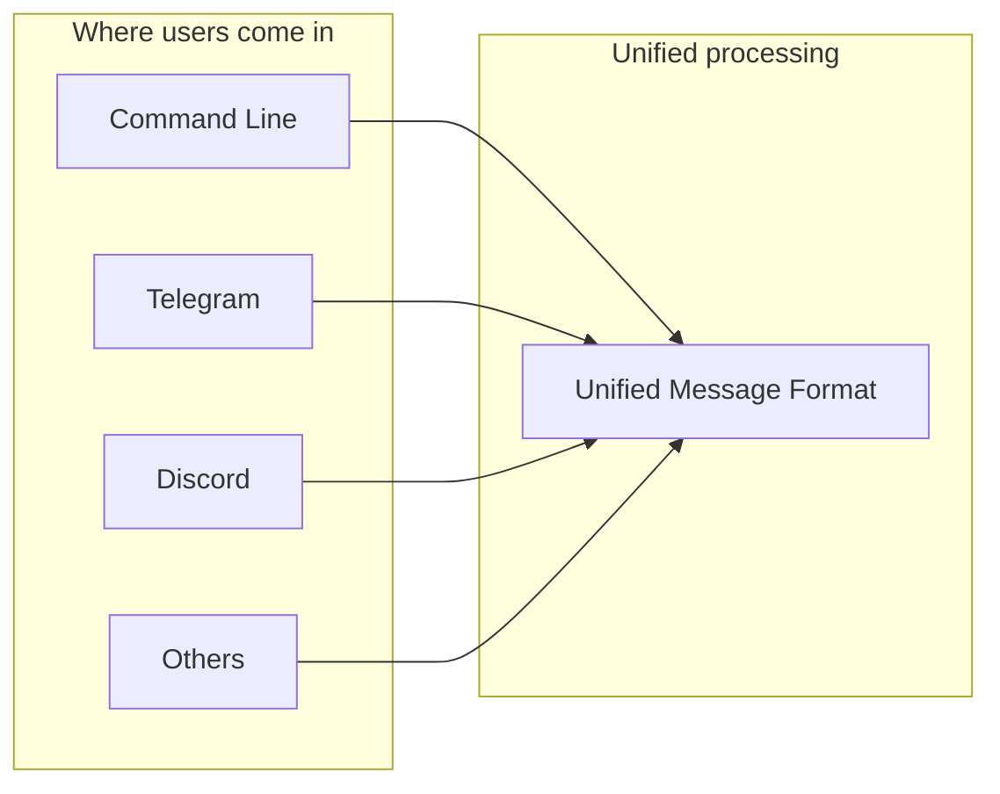

No matter which channel the user comes from, messages are converted into a unified format:
- User ID
- Message content
- Channel type
- Timestamp

### 2. Access Layer: Message Routing

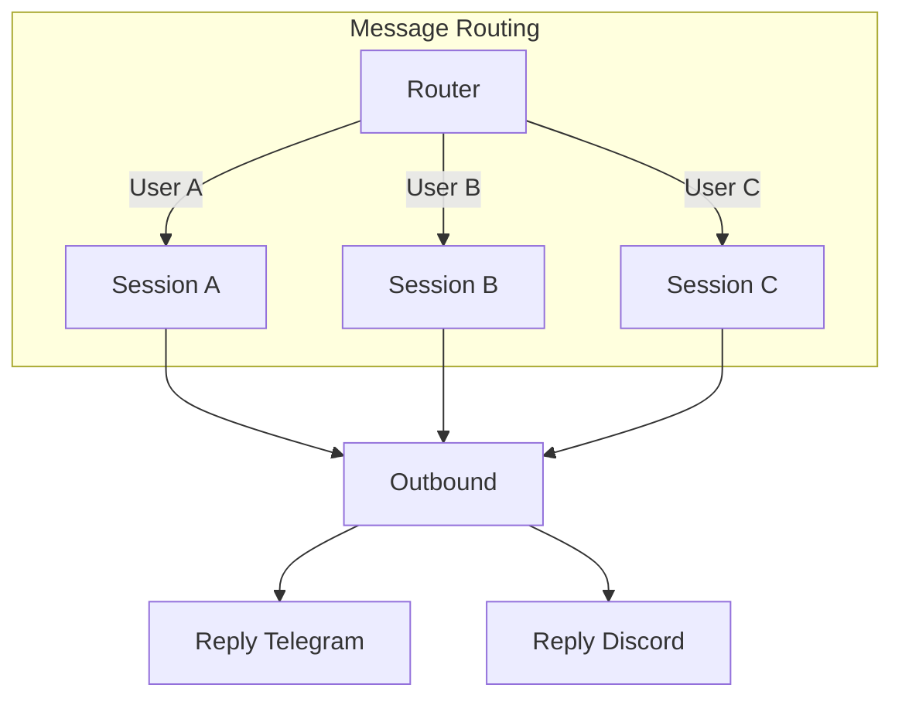

**Key Design**:
- Each user has an independent Session
- Sessions do not interfere with each other
- Sessions are automatically created and cleaned up

### 3. Core Layer: The Three Musketeers

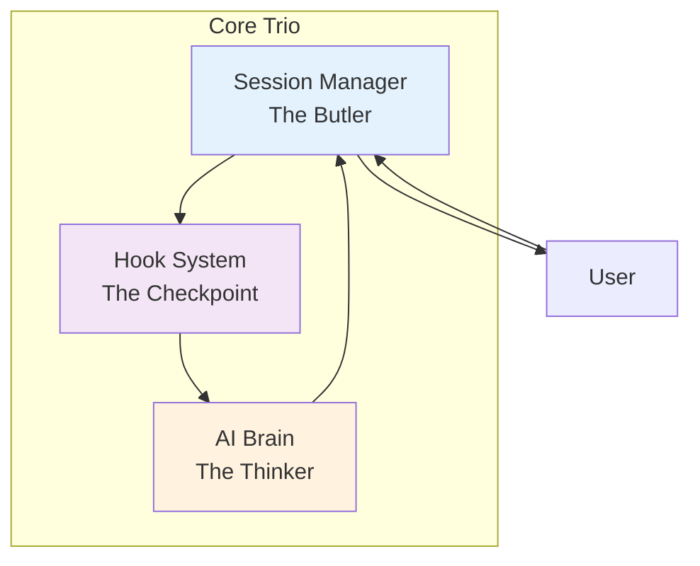

| Component | Analogy | Responsibility |
|-----------|---------|----------------|
| Session | Butler | Receives guests, prepares materials, takes notes |
| Kernel | Brain | Thinks, decides, generates replies |
| Hook | Checkpoint | Security checks, data injection, logging |

### 4. Capability Layer: Toolbox

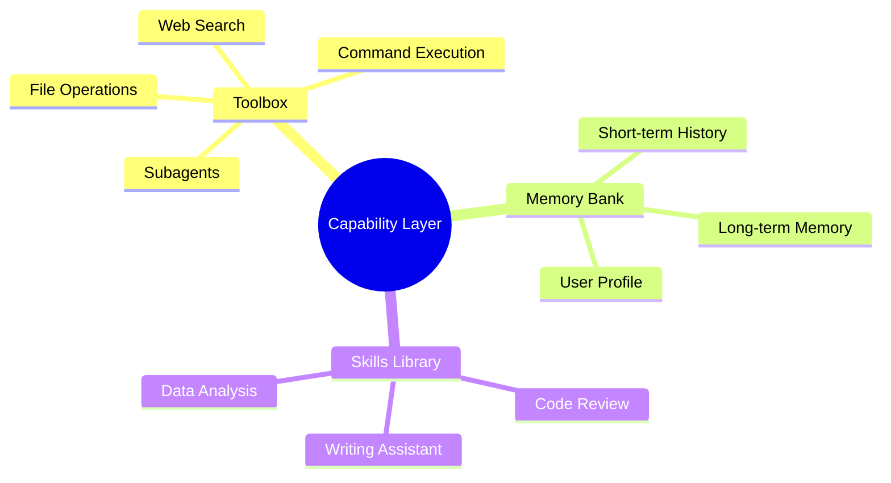

---

## Data Flow

### Complete Request Processing Flow

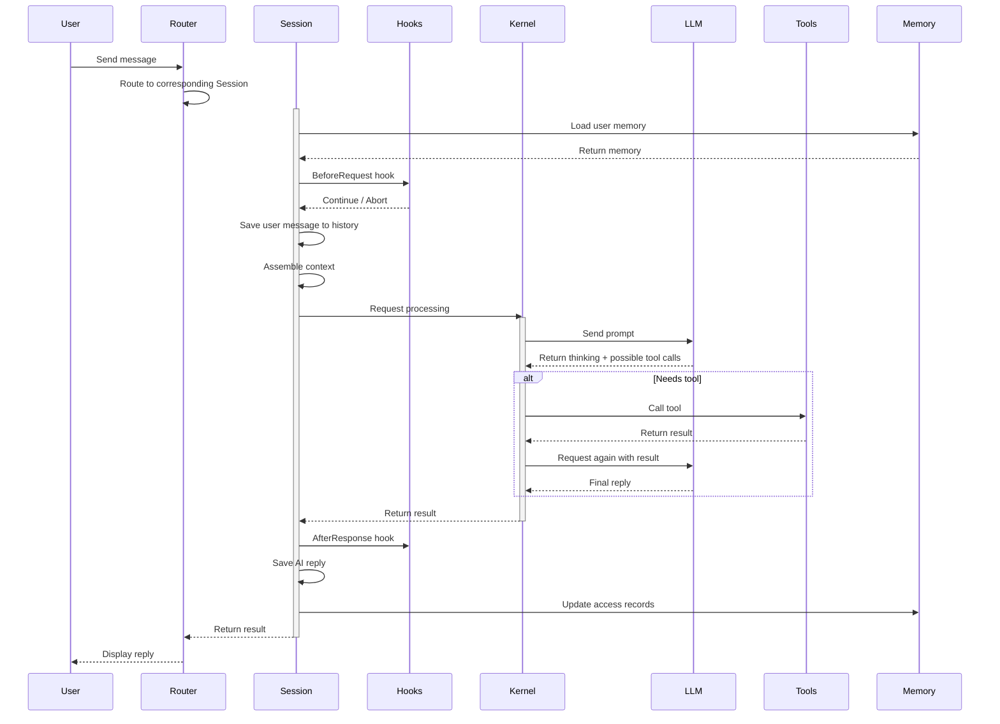

---

## Module Deep Dive

### Session: Session Management

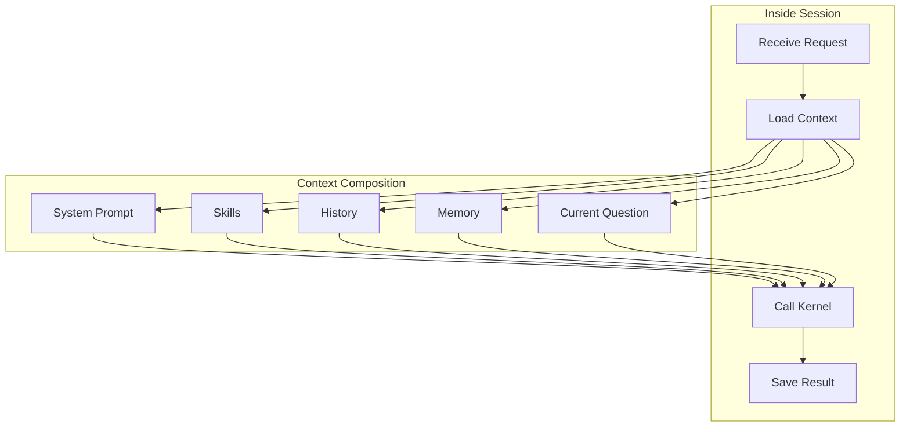

### Kernel: AI Brain

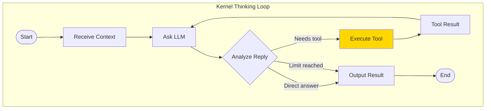

### Memory: Memory System

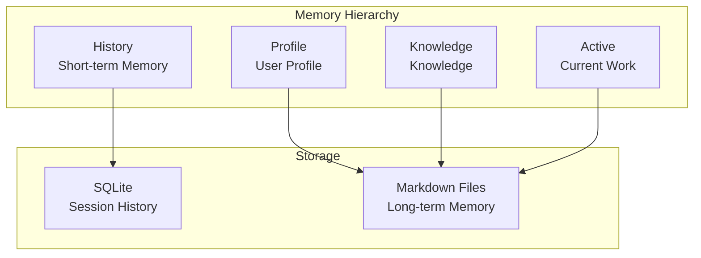

### Tools: Tool System

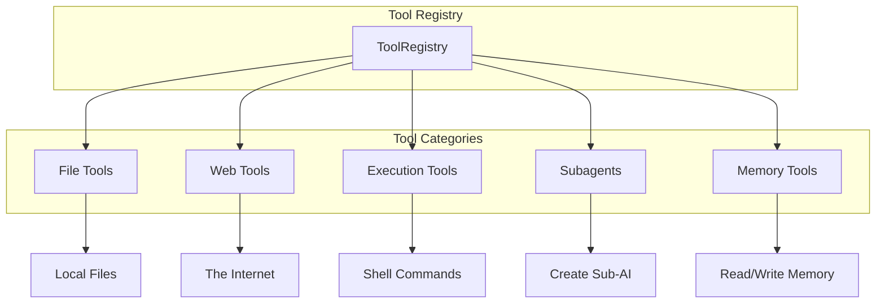

---

## Key Design Decisions

### 1. Pure Function Kernel

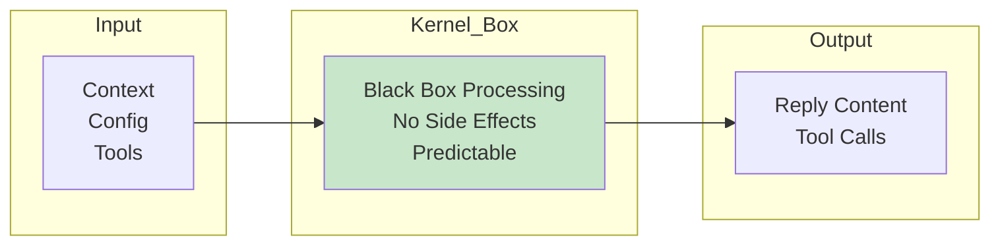

**Benefits**:
- Same input, same output
- Easy to test
- Convenient for retry and caching

### 2. Enum Instead of Option

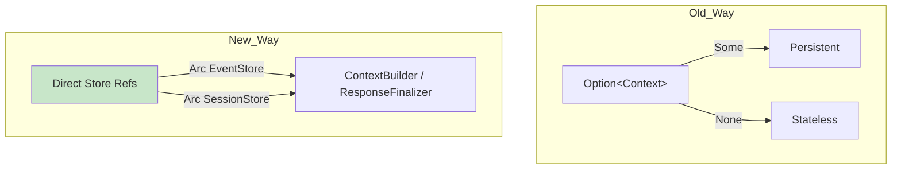

**Benefits**:
- Type known at compile time
- Zero runtime overhead
- Cleaner code

### 3. File + Database Hybrid Storage

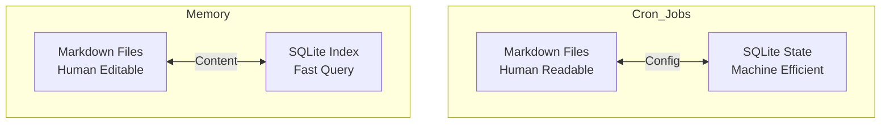

**Benefits**:
- Human editable (Markdown)
- Machine high performance (SQLite)
- Version control friendly

---

## Extension Points

### 1. Hooks: Custom Behavior

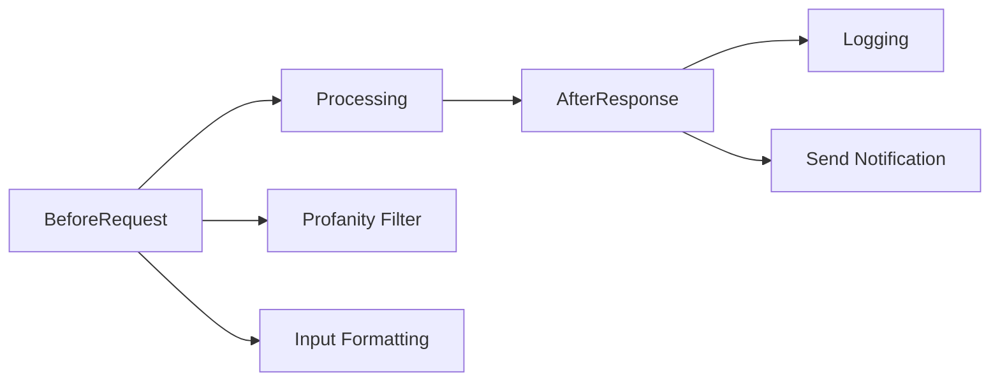

### 2. Skills: Custom Capabilities

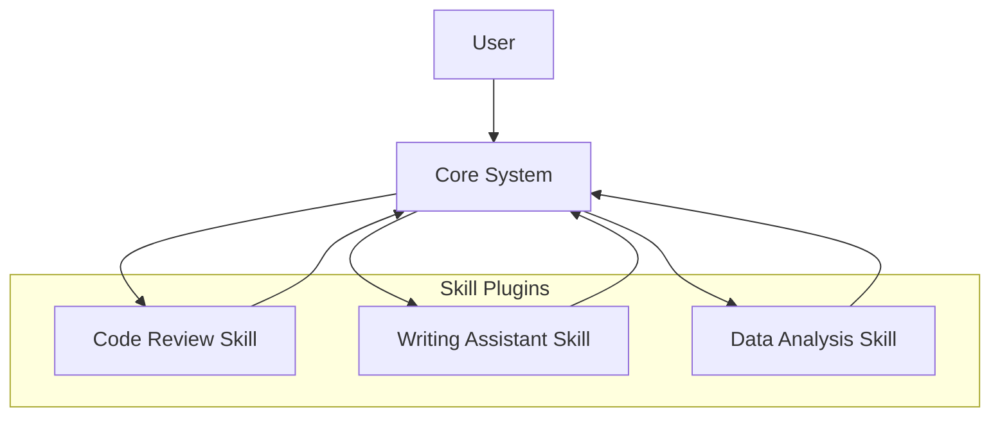

### 3. MCP: External Tool Services

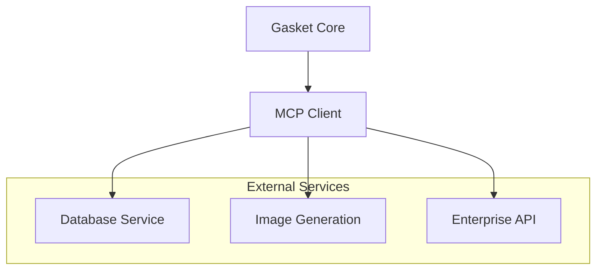

---

## Deployment Modes

### Mode 1: CLI Interactive Mode

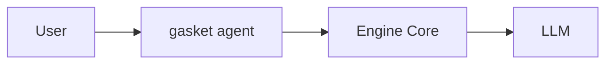

### Mode 2: Gateway Service Mode

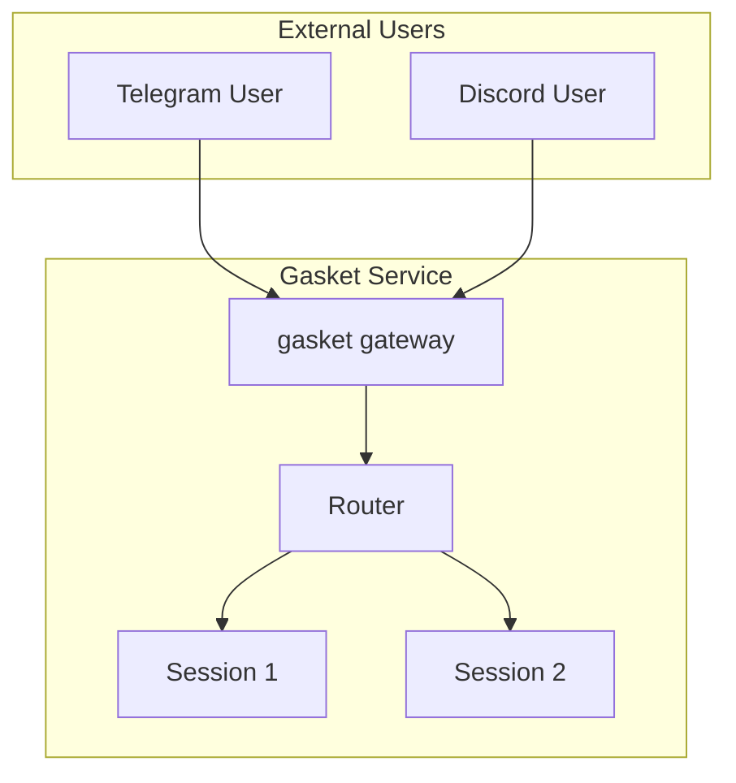

### Mode 3: Hybrid Mode

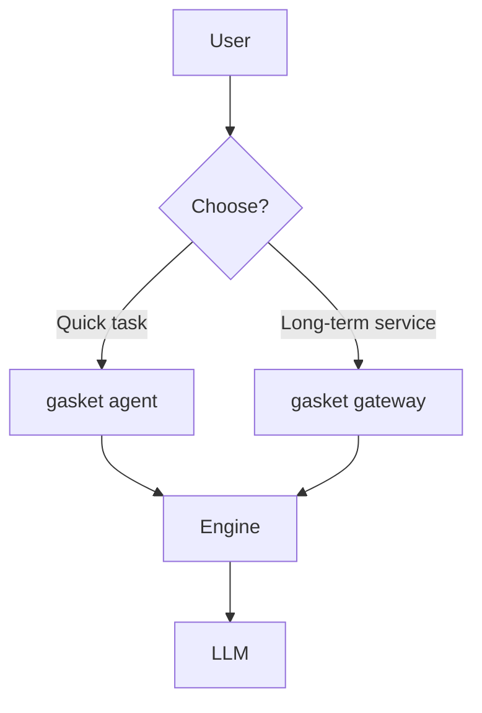

---

## Summary

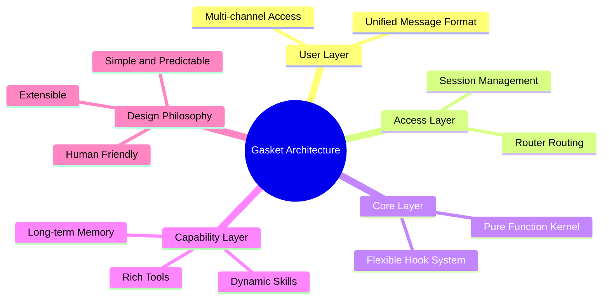
