# 系统架构

> Gasket 整体架构设计——各部件如何协同工作

---

## 一句话理解

Gasket 就像一个**AI 助手的操作系统**，把用户输入、AI 大脑、记忆、工具连接在一起。

---

## 整体架构图

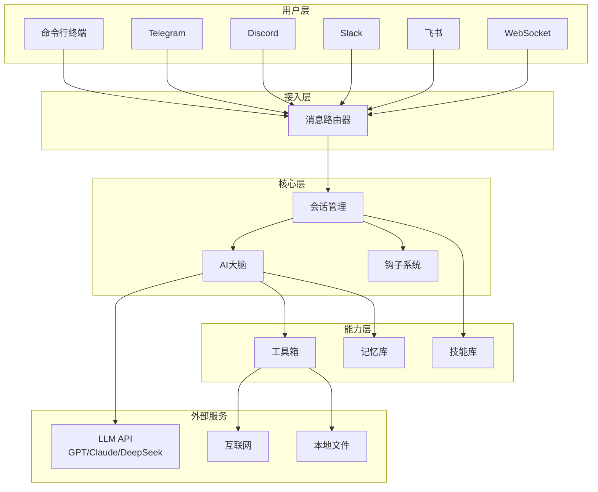

---

## 各层职责

### 1. 用户层：多种入口

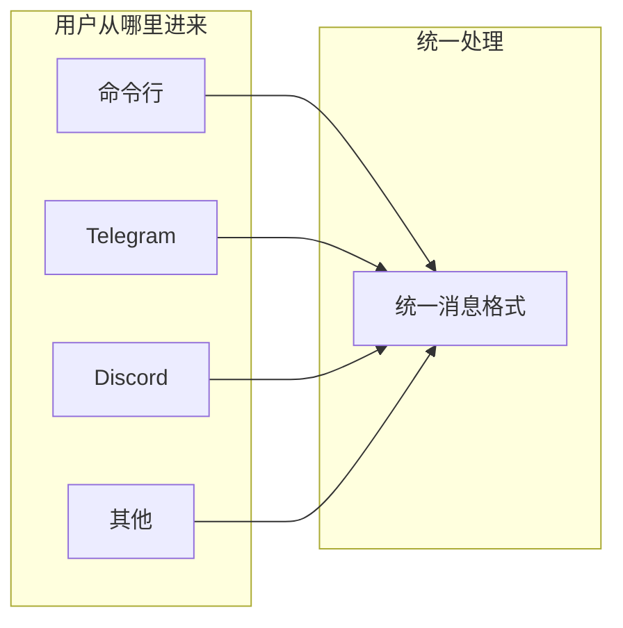

无论用户从哪个渠道进来，都会被转换成统一的消息格式：
- 用户ID
- 消息内容
- 渠道类型
- 时间戳

### 2. 接入层：消息路由

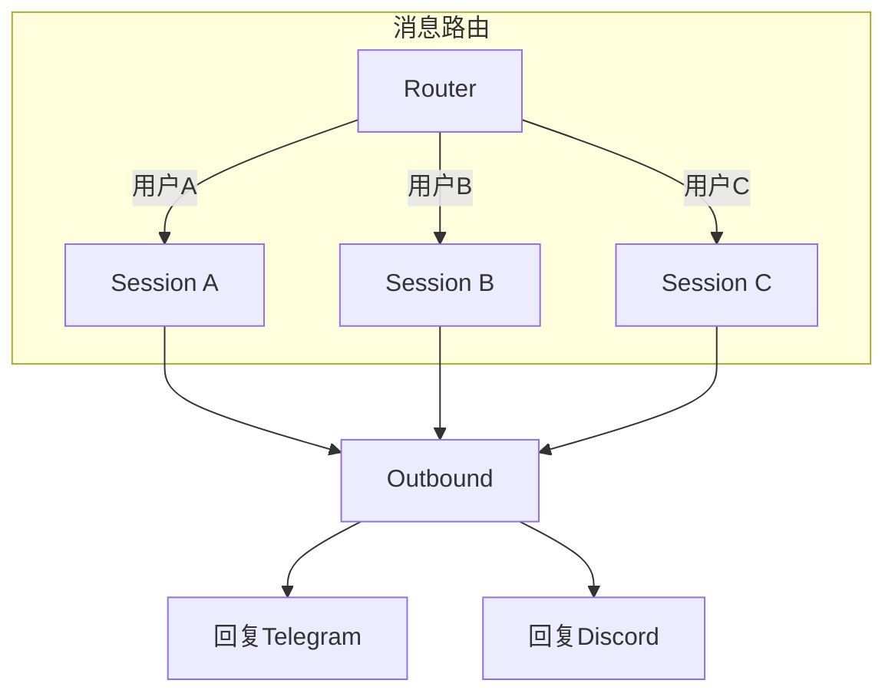

**关键设计**：
- 每个用户有独立的 Session
- Session 之间互不干扰
- 自动创建和清理 Session

### 3. 核心层：三剑客

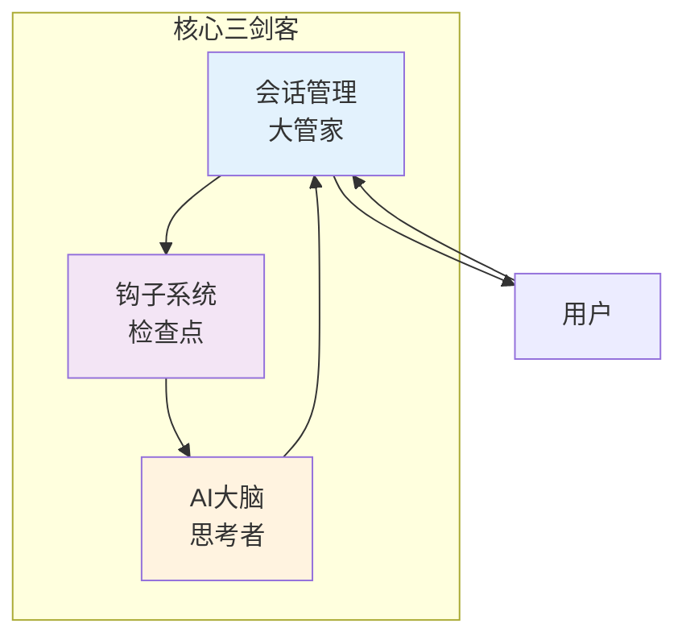

| 组件 | 比喻 | 职责 |
|------|------|------|
| Session | 管家 | 接待、准备资料、记录 |
| Kernel | 大脑 | 思考、决策、生成回复 |
| Hook | 检查点 | 安全检查、数据注入、日志 |

### 4. 能力层：工具箱

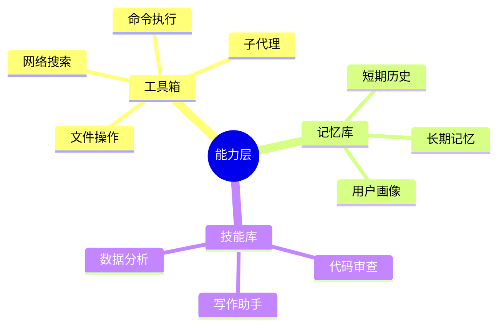

---

## 数据流动

### 完整请求处理流程

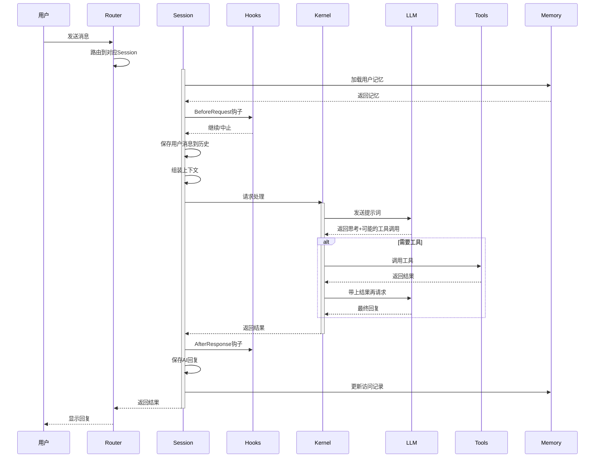

---

## 模块详解

### Session：会话管理

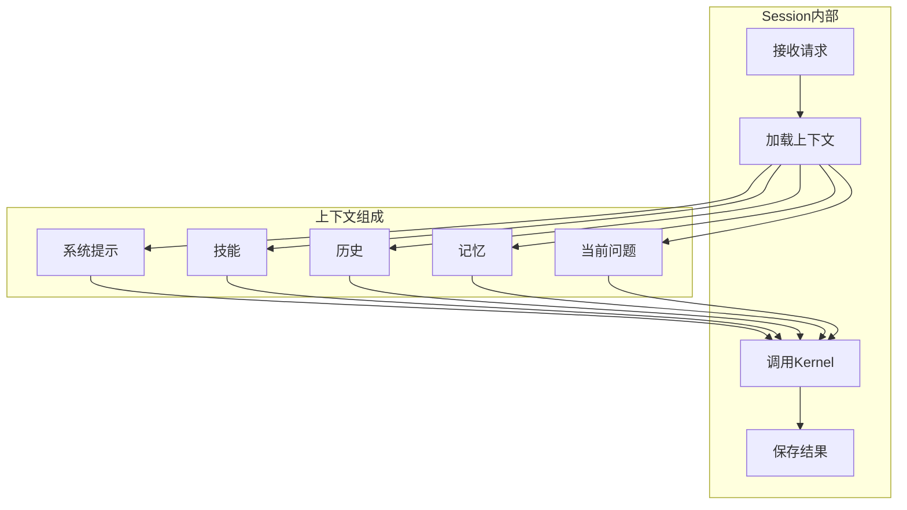

### Kernel：AI 大脑

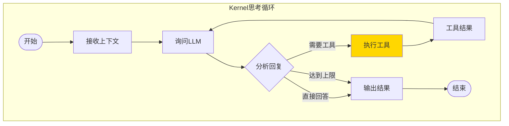

### Memory：记忆系统

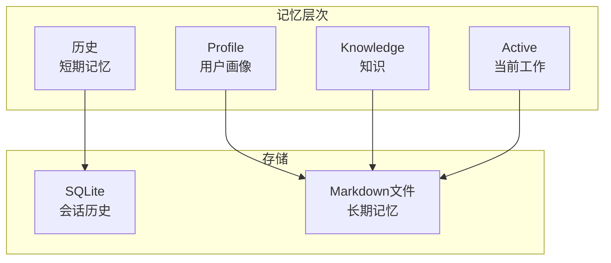

### Tools：工具系统

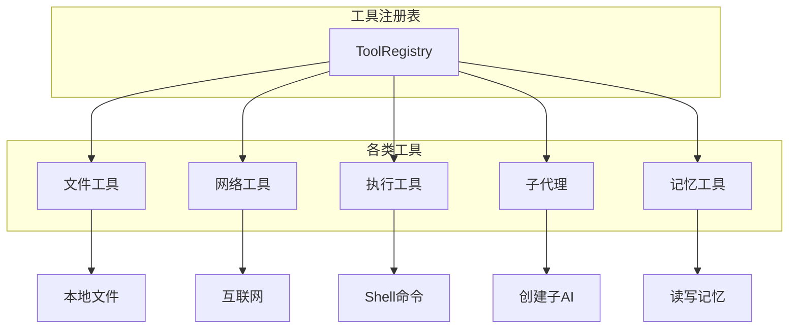

---

## 关键设计决策

### 1. 纯函数 Kernel

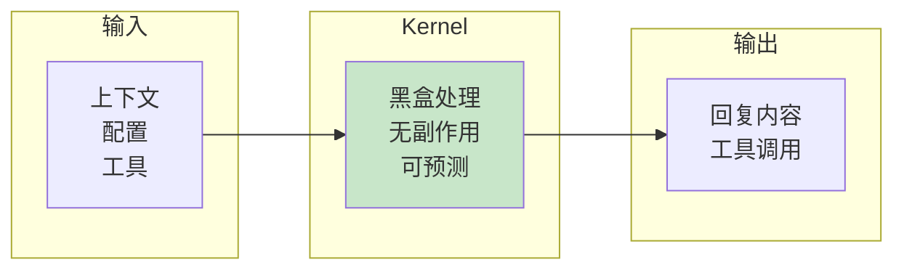

**好处**：
- 相同输入，相同输出
- 容易测试
- 方便重试和缓存

### 2. 枚举替代 Option

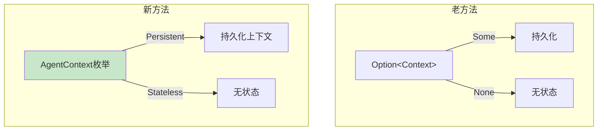

**好处**：
- 编译期就知道类型
- 零运行时开销
- 代码更清晰

### 3. 文件 + 数据库混合存储

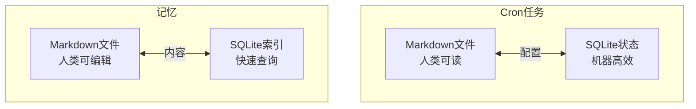

**好处**：
- 人类可编辑（Markdown）
- 机器高性能（SQLite）
- 版本控制友好

---

## 扩展点

### 1. Hooks：自定义行为

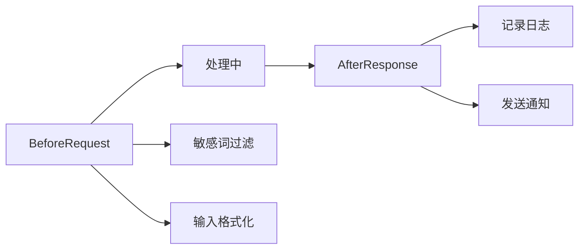

### 2. Skills：自定义能力

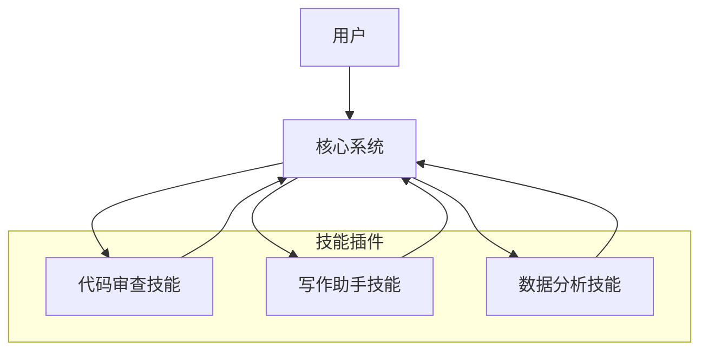

### 3. MCP：外部工具服务

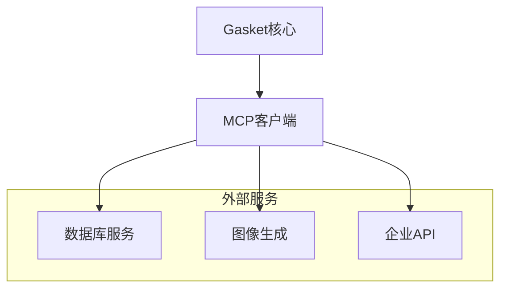

---

## 部署模式

### 模式1：CLI 交互模式

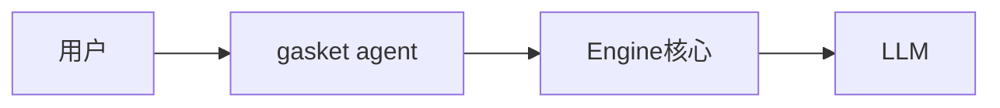

### 模式2：Gateway 服务模式

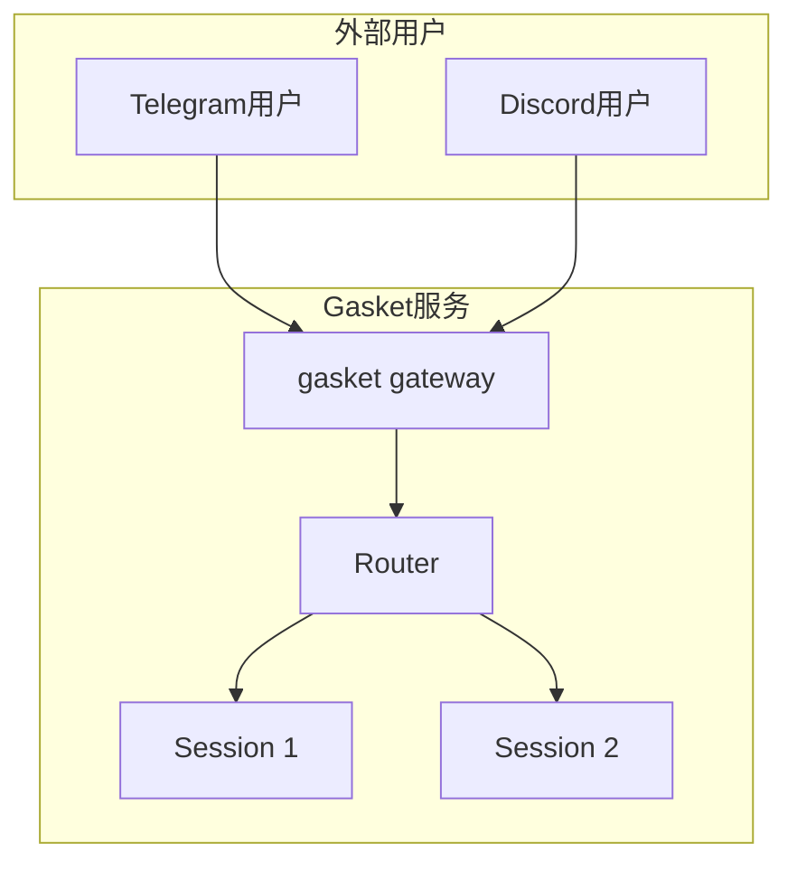

### 模式3：混合模式

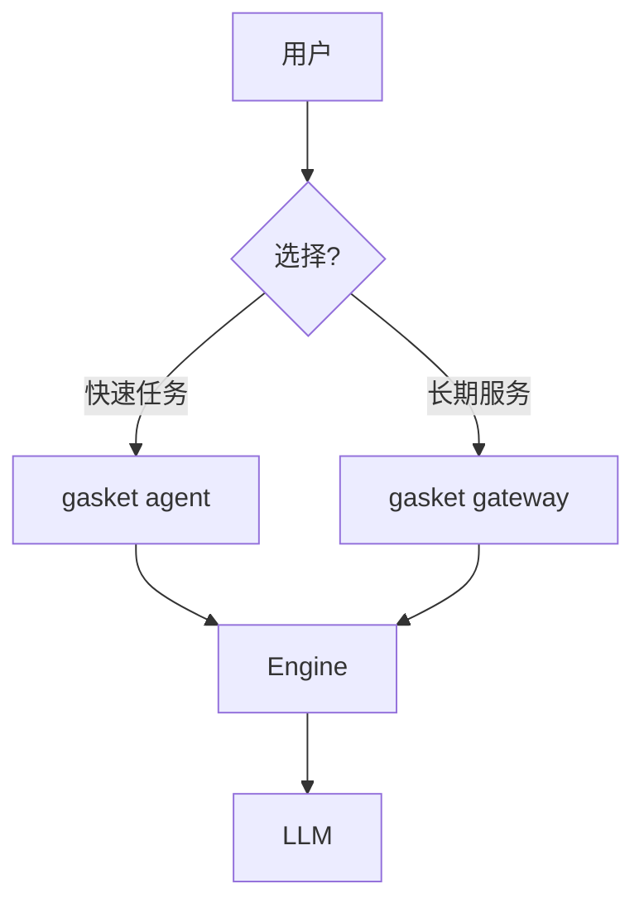

---

## 总结

```mermaid
mindmap
  root((Gasket架构))
    用户层
      多渠道接入
      统一消息格式
    接入层
      Router路由
      Session管理
    核心层
      纯函数Kernel
      灵活Hook系统
    能力层
      丰富工具
      长期记忆
      动态技能
    设计哲学
      简洁可预测
      人类友好
      可扩展
