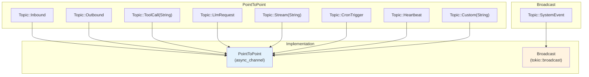
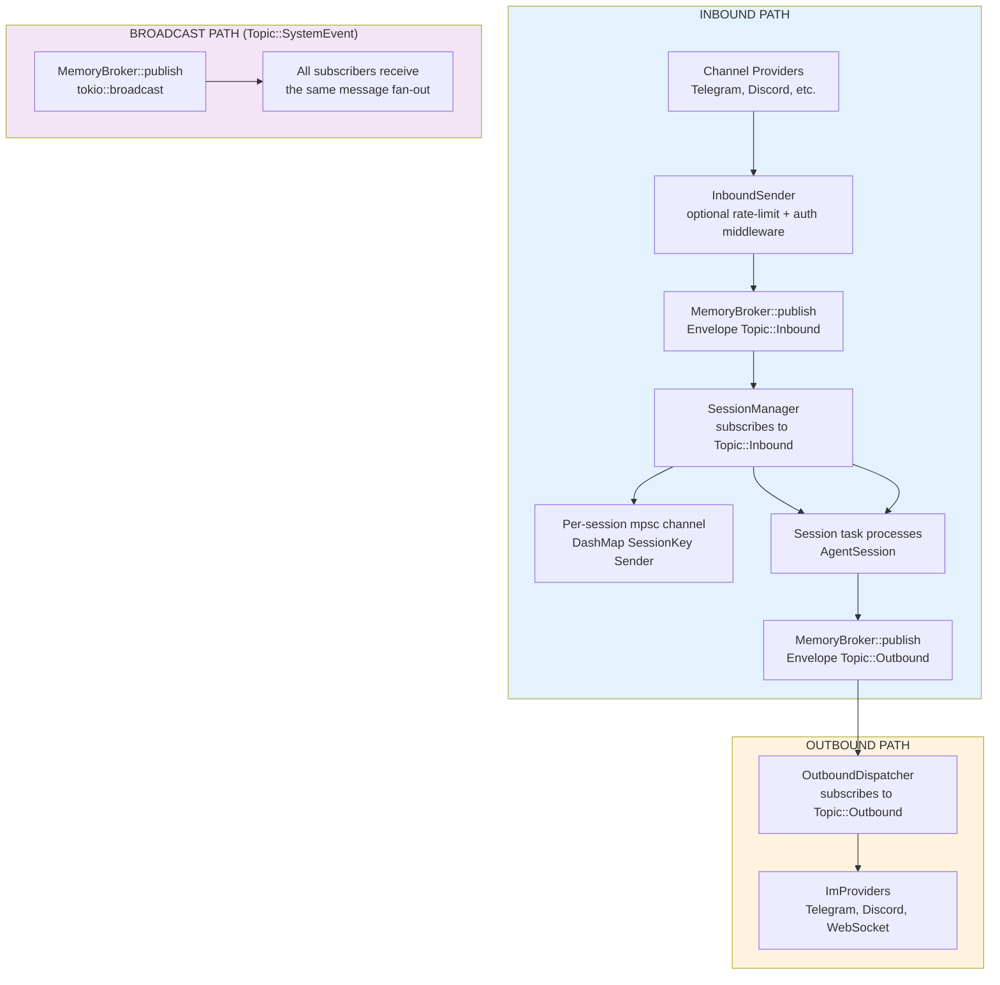

# Broker Module Design Document

## 1. Overview

The Broker is the core message broker component in the Gasket workspace, responsible for all inter-component asynchronous message passing.

**Core Responsibilities:**
- Topic-based message routing
- Two delivery modes: PointToPoint and Broadcast
- Message backpressure control
- Per-session message isolation

---

## 2. Directory Structure

```
gasket/broker/
├── src/
│   ├── lib.rs              # Public exports
│   ├── broker.rs           # Broker trait, Subscriber enum, QueueMetrics
│   ├── types.rs            # Topic, Envelope, BrokerPayload, DeliveryMode
│   ├── memory.rs           # MemoryBroker implementation (DashMap + channels)
│   ├── session.rs           # SessionManager (per-session message routing)
│   └── error.rs            # BrokerError enum
└── tests/
    └── integration_test.rs
```

---

## 3. Core Data Types

### 3.1 Type System (types.rs)

| Type | Responsibility |
|------|----------------|
| `Topic` | Strongly-typed topic enum (Inbound, Outbound, SystemEvent, ToolCall, LlmRequest, Stream, CronTrigger, Heartbeat, Custom). Avoids stringly-typed routing. |
| `DeliveryMode` | Compile-time decision: `PointToPoint` (work-stealing, one consumer) or `Broadcast` (fan-out to all subscribers) |
| `BrokerPayload` | Zero-cost in-process payload enum: `Inbound(InboundMessage)` or `Outbound(OutboundMessage)` |
| `Envelope` | Pure data wrapper: `id: Uuid`, `timestamp: u64`, `topic: Topic`, `payload: Arc<BrokerPayload>`. Fully clone-safe. |

### 3.2 Broker Abstraction (broker.rs)

| Type | Responsibility |
|------|----------------|
| `BrokerError` | Error enum: `QueueFull`, `ChannelClosed`, `Lagged(u64)`, `TopicNotFound`, `InvalidTopic`, `AckAlreadyConsumed`, `Internal` |
| `QueueMetrics` | Queue state snapshot: `depth`, `total_published`, `total_consumed` |
| `Subscriber` | Unified receiver enum: `PointToPoint(async_channel::Receiver)` or `Broadcast(tokio::broadcast::Receiver)` |

### 3.3 MemoryBroker (memory.rs)

In-memory broker implementation using:
- **DashMap** for thread-safe topic storage
- **async-channel** (bounded) for PointToPoint queues
- **tokio::broadcast** for Broadcast queues

| Method | Behavior |
|--------|----------|
| `publish(envelope)` | Blocking await — backpressures when queue is full |
| `try_publish(envelope)` | Non-blocking — returns `QueueFull` immediately |
| `subscribe(topic)` | Creates queue if needed, returns `Subscriber` |
| `close_topic(topic)` | Graceful shutdown |
| `metrics(topic)` | Returns `QueueMetrics` snapshot |

### 3.4 SessionManager (session.rs)

Replaces the old Router Actor + Session Actor pattern. Manages per-session processing tasks.

| Component | Responsibility |
|-----------|----------------|
| `MessageHandler` trait | Async trait for handling messages and streaming: `handle_message`, `handle_streaming_message`, `handle_command` |
| `SessionManager<H>` | Subscribes to `Topic::Inbound`, dispatches to per-session tasks, performs idle-timeout GC every 300s |

---

## 4. Topic Hierarchy & Delivery Semantics



**Delivery Semantics:**
- **PointToPoint**: Work-stealing — first subscriber to call `recv()` claims the message
- **Broadcast**: All subscribers receive every message (fan-out)

---

## 5. Data Flow Diagram

### 5.1 Overall Message Flow



---

## 6. Integration with Other Crates

### 6.1 Integration with engine

**Bus Adapter** (`engine/src/bus_adapter.rs`):
- Implements `MessageHandler` trait for `EngineHandler`
- Bridges broker messages to `AgentSession::process_direct` and `process_direct_streaming_with_channel`

**Broker Outbound** (`engine/src/broker_outbound.rs`):
- `OutboundDispatcher` subscribes to `Topic::Outbound`
- Routes messages to `ImProviders`
- WebSocket messages sent inline (preserving FIFO); others fire-and-forget

### 6.2 Integration with channels

**Middleware** (`channels/src/middleware.rs`):
- `InboundSender` wraps direct mpsc or broker-based publishing
- `new_with_broker(broker)` constructor for broker mode
- Applies auth checking and rate-limiting before publishing

---

## 7. Key Design Decisions

| Decision | Description |
|----------|-------------|
| Topic replaces Actor routing | Old bus used Router Actor + Session Actor + Outbound Actor; broker uses Topic + subscribers |
| Zero-copy payloads | `BrokerPayload` uses `Arc<BrokerPayload>` in Envelope for sharing without cloning |
| Compile-time delivery mode | `Topic::delivery_mode()` is a method, not runtime lookup |
| Bounded channel backpressure | `async_channel::bounded` in P2P mode provides natural backpressure |
| Broadcast lag detection | Slow subscribers receive `BrokerError::Lagged(n)` when exceeding buffer |
| Session isolation | Each session gets its own mpsc channel and task, no shared mutable state |
| No serde_json on hot path | `BrokerPayload` is a typed struct enum, avoiding JSON serialization |

---

## 8. File Index

| Feature | File Path |
|---------|----------|
| Topic/Envelope definition | `broker/src/types.rs` |
| Broker/Session abstraction | `broker/src/broker.rs` |
| MemoryBroker implementation | `broker/src/memory.rs` |
| SessionManager | `broker/src/session.rs` |
| Error types | `broker/src/error.rs` |
| Engine bus adapter | `engine/src/bus_adapter.rs` |
| Engine outbound dispatcher | `engine/src/broker_outbound.rs` |
