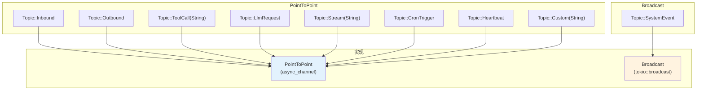
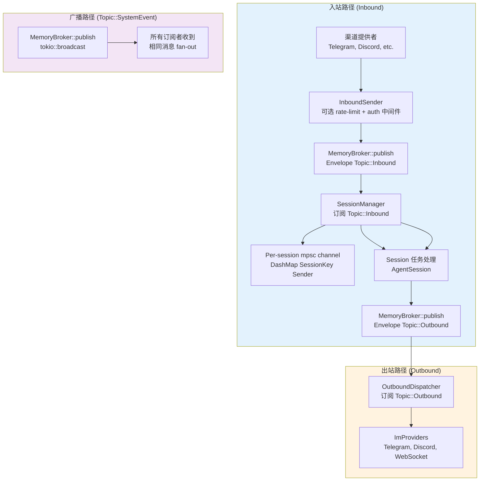

# Broker 模块设计文档

## 1. 概述

Broker 是 Gasket 工作区中的核心消息代理组件，负责所有组件间的异步消息传递。

**核心职责：**
- 基于 Topic 的消息路由
- 点对点 (PointToPoint) 和广播 (Broadcast) 两种投递模式
- 消息背压 (backpressure) 控制
- Session 级别的消息隔离

---

## 2. 目录结构

```
gasket/broker/
├── src/
│   ├── lib.rs              # 公共导出
│   ├── broker.rs           # Broker trait, Subscriber enum, QueueMetrics
│   ├── types.rs            # Topic, Envelope, BrokerPayload, DeliveryMode
│   ├── memory.rs           # MemoryBroker 实现 (DashMap + channels)
│   ├── session.rs          # SessionManager (per-session 消息路由)
│   └── error.rs            # BrokerError 枚举
└── tests/
    └── integration_test.rs
```

---

## 3. 核心数据类型

### 3.1 类型系统 (types.rs)

| 类型 | 职责 |
|------|------|
| `Topic` | 强类型 Topic 枚举 (Inbound, Outbound, SystemEvent, ToolCall, LlmRequest, Stream, CronTrigger, Heartbeat, Custom)。避免字符串类型路由。 |
| `DeliveryMode` | 编译时决策：`PointToPoint` (工作窃取，一个消费者) 或 `Broadcast` (广播给所有订阅者) |
| `BrokerPayload` | 零拷贝进程内负载枚举：`Inbound(InboundMessage)` 或 `Outbound(OutboundMessage)` |
| `Envelope` | 纯数据包装器：`id: Uuid`, `timestamp: u64`, `topic: Topic`, `payload: Arc<BrokerPayload>`。完全克隆安全。 |

### 3.2 Broker 抽象 (broker.rs)

| 类型 | 职责 |
|------|------|
| `BrokerError` | 错误枚举：`QueueFull`, `ChannelClosed`, `Lagged(u64)`, `TopicNotFound`, `InvalidTopic`, `AckAlreadyConsumed`, `Internal` |
| `QueueMetrics` | 队列状态快照：`depth`, `total_published`, `total_consumed` |
| `Subscriber` | 统一接收器枚举：`PointToPoint(async_channel::Receiver)` 或 `Broadcast(tokio::broadcast::Receiver)` |

### 3.3 MemoryBroker (memory.rs)

内存 broker 实现，使用：
- **DashMap** 线程安全 Topic 存储
- **async-channel** (有界) 实现 PointToPoint 队列
- **tokio::broadcast** 实现 Broadcast 队列

| 方法 | 行为 |
|------|------|
| `publish(envelope)` | 阻塞等待 — 队列满时背压 |
| `try_publish(envelope)` | 非阻塞 — 立即返回 `QueueFull` |
| `subscribe(topic)` | 按需创建队列，返回 `Subscriber` |
| `close_topic(topic)` | 优雅关闭 |
| `metrics(topic)` | 返回 `QueueMetrics` 快照 |

### 3.4 SessionManager (session.rs)

替代旧的 Router Actor + Session Actor 模式，管理 per-session 处理任务。

| 组件 | 职责 |
|------|------|
| `MessageHandler` trait | 处理消息和流的异步 trait：`handle_message`, `handle_streaming_message`, `handle_command` |
| `SessionManager<H>` | 订阅 `Topic::Inbound`，分发到 per-session 任务，每 300 秒执行空闲超时 GC |

---

## 4. Topic 层级与投递语义



**投递语义：**
- **PointToPoint**: 工作窃取 — 第一个调用 `recv()` 的订阅者获取消息
- **Broadcast**: 所有订阅者收到每条消息 (fan-out)

---

## 5. 数据流图

### 5.1 整体消息流



---

## 6. 与其他 Crate 的集成

### 6.1 与 engine 的集成

**Bus Adapter** (`engine/src/bus_adapter.rs`):
- 为 `EngineHandler` 实现 `MessageHandler` trait
- 桥接 broker 消息到 `AgentSession::process_direct` 和 `process_direct_streaming_with_channel`

**Broker Outbound** (`engine/src/broker_outbound.rs`):
- `OutboundDispatcher` 订阅 `Topic::Outbound`
- 路由消息到 `ImProviders`
- WebSocket 消息内联发送保持 FIFO；其他 fire-and-forget

### 6.2 与 channels 的集成

**中间件** (`channels/src/middleware.rs`):
- `InboundSender` 包装直接 mpsc 或基于 broker 的发布
- `new_with_broker(broker)` 构造函数
- 发布前执行认证检查和限流

---

## 7. 关键设计决策

| 决策 | 说明 |
|------|------|
| Topic 替代 Actor 路由 | 旧的 bus 使用 Router Actor + Session Actor + Outbound Actor；broker 使用 Topic + subscribers |
| 零拷贝负载 | `BrokerPayload` 使用 `Arc<BrokerPayload>` 在 Envelope 中共享，避免克隆 |
| 编译时投递模式 | `Topic::delivery_mode()` 是方法而非运行时查找 |
| 有界通道背压 | `async_channel::bounded` 在 P2P 模式提供自然背压 |
| 广播滞后检测 | 慢订阅者超过缓冲区大小时收到 `BrokerError::Lagged(n)` |
| Session 隔离 | 每个 session 独立 mpsc 通道和任务，无共享可变状态 |
| 热路径无 JSON | `BrokerPayload` 是强类型结构体枚举，避免消息传递路径中的 JSON 序列化 |

---

## 8. 文件索引

| 功能 | 文件路径 |
|------|----------|
| Topic/Envelope 定义 | `broker/src/types.rs` |
| Broker/Session 抽象 | `broker/src/broker.rs` |
| MemoryBroker 实现 | `broker/src/memory.rs` |
| SessionManager | `broker/src/session.rs` |
| 错误类型 | `broker/src/error.rs` |
| Engine 总线适配器 | `engine/src/bus_adapter.rs` |
| Engine 出站调度器 | `engine/src/broker_outbound.rs` |
