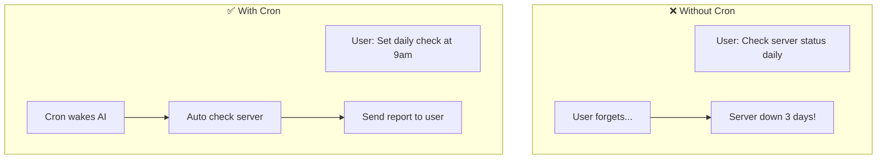
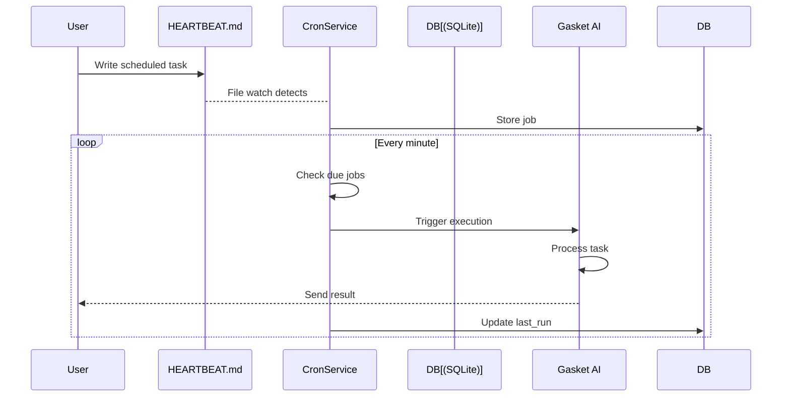
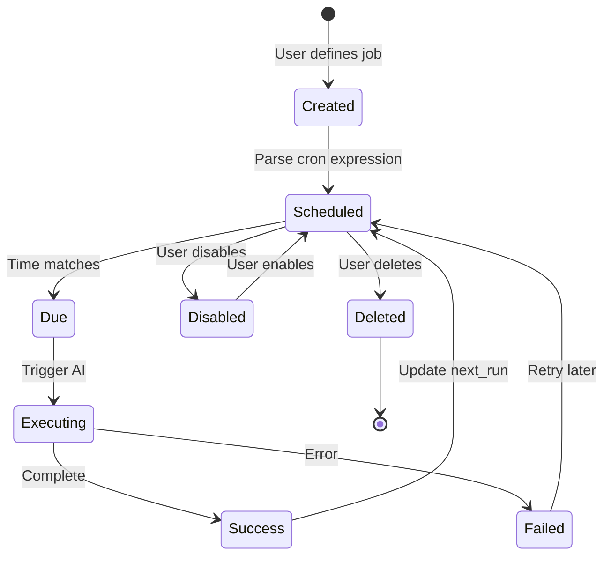
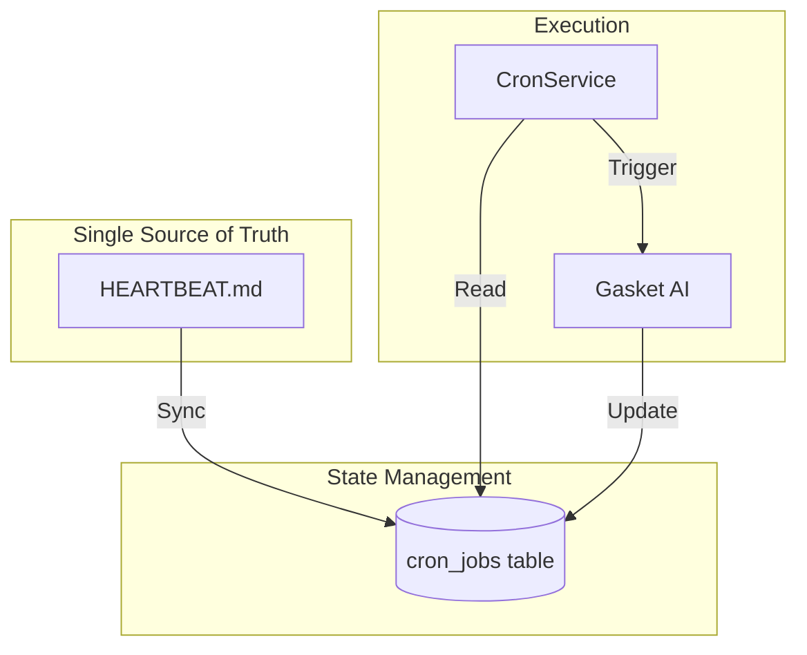
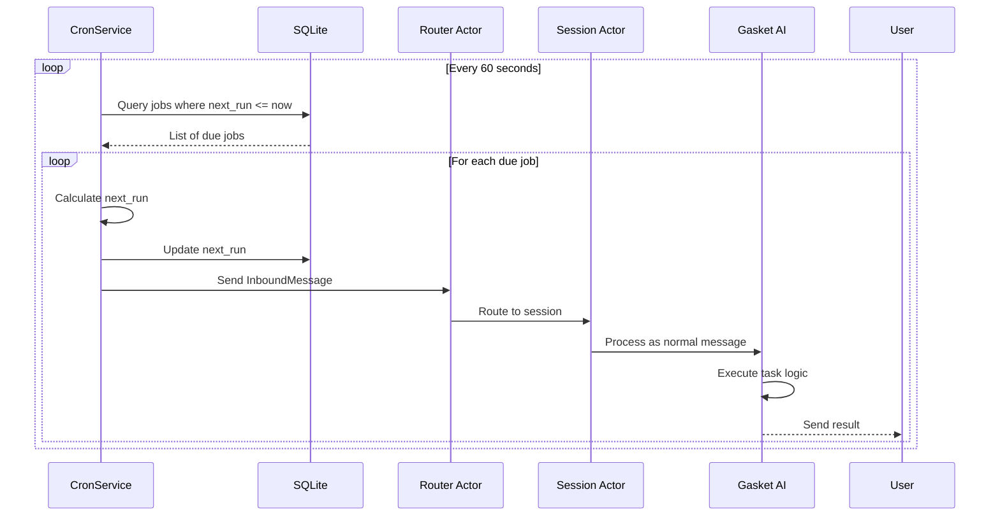
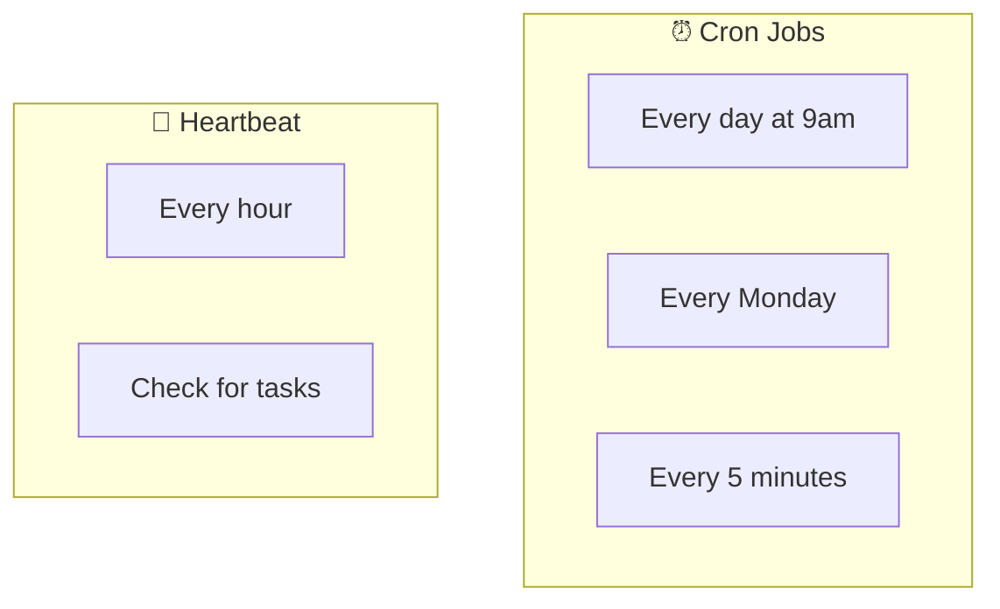

# Cron Module

> AI's Alarm Clock

---

## One-Sentence Understanding

**Cron is AI's alarm clock** - it wakes up the AI at scheduled times to perform tasks automatically.

> Analogy: Like setting an alarm to wake you up, or a reminder to take medicine at specific times.

---

## Why Do We Need Cron?



Without Cron: You must remember to do things.
With Cron: AI automatically does things at scheduled times.

---

## How It Works



---

## Cron Expression Format

Cron uses a time expression to specify when to run:

```
┌───────────── minute (0 - 59)
│ ┌───────────── hour (0 - 23)
│ │ ┌───────────── day of month (1 - 31)
│ │ │ ┌───────────── month (1 - 12)
│ │ │ │ ┌───────────── day of week (0 - 6, Sunday = 0)
│ │ │ │ │
│ │ │ │ │
* * * * *
```

### Common Patterns

| Expression | Meaning | When It Runs |
|------------|---------|--------------|
| `0 9 * * *` | Every day at 9:00 AM | Daily morning |
| `0 */6 * * *` | Every 6 hours | 00:00, 06:00, 12:00, 18:00 |
| `0 9 * * 1` | Every Monday at 9:00 AM | Weekly |
| `0 9 1 * *` | 1st of every month at 9:00 AM | Monthly |
| `*/5 * * * *` | Every 5 minutes | Frequent checks |

```mermaid
timeline
    title Daily Schedule Example (0 9 * * *)
    section Morning
        09:00 : Task runs
    section Afternoon
        12:00 : (No run)
    section Evening
        18:00 : (No run)
    section Night
        00:00 : (No run)
```

---

## Defining Cron Jobs

### Method 1: HEARTBEAT.md File

Create `~/.gasket/HEARTBEAT.md`:

```markdown
## Daily Report
- cron: 0 9 * * *
- message: Generate daily summary report

## Weekly Review
- cron: 0 10 * * 1
- message: Review weekly progress and plan next week

## Health Check
- cron: */30 * * * *
- message: Check server health status
```

### Method 2: Via Tool Call

```
User: Set a reminder every morning at 8am

🤖 Gasket uses cron tool:
```json
{
  "action": "create",
  "name": "morning-reminder",
  "cron": "0 8 * * *",
  "message": "Good morning! Start your day with planning."
}
```
```

---

## Job Lifecycle



---

## Architecture

### Hybrid Design



| Component | Purpose | Why |
|-----------|---------|-----|
| HEARTBEAT.md | Human-readable definition | Easy to edit, version control |
| SQLite | Runtime state | Fast queries, persistence |
| CronService | Scheduling engine | Accurate timing |

### Database Schema

```sql
CREATE TABLE cron_jobs (
    id TEXT PRIMARY KEY,
    name TEXT UNIQUE NOT NULL,
    cron TEXT NOT NULL,           -- Cron expression
    message TEXT NOT NULL,        -- Message to send
    channel TEXT,                 -- Target channel
    chat_id TEXT,                 -- Target chat
    last_run TEXT,                -- Last execution time
    next_run TEXT NOT NULL,       -- Next scheduled time
    enabled INTEGER DEFAULT 1,    -- Is active?
    created_at TEXT
);
```

---

## Execution Flow



Key points:
1. Cron jobs are treated as **inbound messages**
2. They go through the same **Router → Session** pipeline
3. AI processes them **like normal user messages**

---

## Use Cases

### Daily Standup Reminder

```markdown
## Daily Standup
- cron: 0 9 * * 1-5
- message: Generate daily standup summary from yesterday's commits
```

### Weekly Report

```markdown
## Weekly Report
- cron: 0 17 * * 5
- message: Generate weekly work summary and send to manager
```

### Health Monitoring

```markdown
## Health Check
- cron: */5 * * * *
- message: Check all service health endpoints and alert if issues found
```

### Data Backup

```markdown
## Backup Reminder
- cron: 0 2 * * *
- message: Remind to backup important data
```

---

## Cron vs Heartbeat

| Feature | Cron | Heartbeat |
|---------|------|-----------|
| **Schedule** | Flexible (any cron expression) | Simple interval |
| **Source** | HEARTBEAT.md or tool calls | HEARTBEAT.md only |
| **Precision** | Minute-level | Hour-level |
| **Use case** | Scheduled tasks | Regular check-ins |



---

## Management Commands

```bash
# List all cron jobs
gasket cron list

# Create a new job
gasket cron create --name daily-report --cron "0 9 * * *" \
  --message "Generate daily report"

# Enable/disable a job
gasket cron disable daily-report
gasket cron enable daily-report

# Delete a job
gasket cron delete daily-report
```

---

## Best Practices

1. **Idempotent Jobs**: Design jobs to be safe if run multiple times
2. **Error Handling**: Jobs should handle failures gracefully
3. **Time Zones**: Be aware of server time zone vs user time zone
4. **Resource Limits**: Don't schedule too many jobs at the same exact time

---

## Related Modules

- **Heartbeat**: Simpler interval-based triggering
- **Tools**: Cron tool for programmatic job management
- **Session**: Processes triggered jobs
