# Cron Module

> AI's Alarm Clock + To-Do List

---

## One-Sentence Understanding

**Cron is AI's alarm clock + to-do list.** When the time comes, AI automatically executes preset tasks.

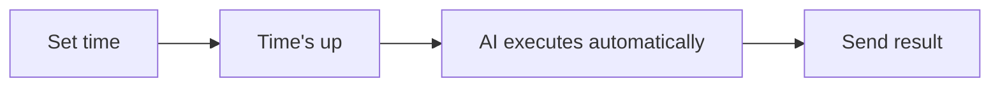

---

## Real-Life Examples

| Scenario | Similar to Cron... |
|----------|--------------------|
| Phone alarm rings at 7am daily | Send good morning message daily at 7am |
| Calendar reminder for Monday meeting | Send weekly report reminder every Monday |
| Timer to turn off stove in 30 min | Remind to check tasks after 30 minutes |
| Birthday reminder sends wishes yearly | Send wishes automatically every year |

---

## What Cron Can Do

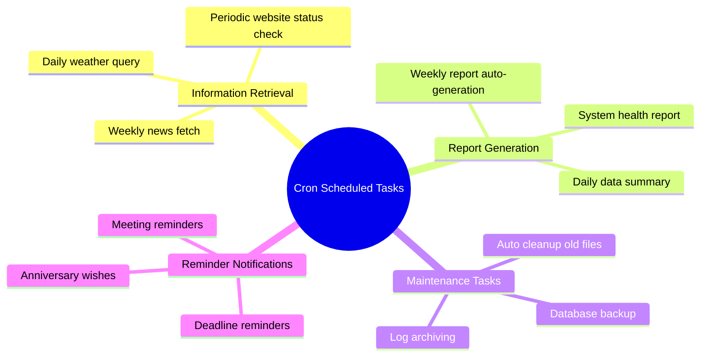

---

## Composition of Scheduled Tasks

Each scheduled task contains:

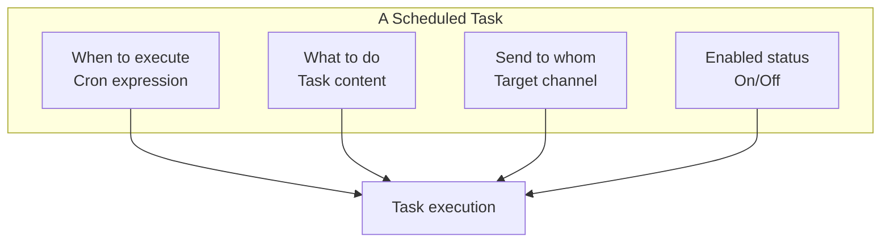

### 1. When to Execute? (Cron Expression)

The Cron expression is a time format that tells the system **when** to execute the task:

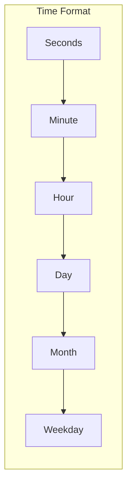

The implementation supports **6-field** (`sec min hour day month weekday`) or **7-field** (with year) Cron expressions. 5-field input is auto-normalized by prepending `0` for seconds. The `cron` tool explicitly documents the 7-field format.

| Expression | Meaning | Example |
|------------|---------|---------|
| `0 0 9 * * *` | Every day at 9:00 | Daily morning report at 9am |
| `0 0 */6 * * *` | Every 6 hours | Check email every 6 hours |
| `0 0 9 * * 1` | Every Monday at 9:00 | Weekly report reminder every Monday |
| `0 0 0 1 * *` | 1st of every month | Monthly report on the 1st |
| `0 */5 * * * *` | Every 5 minutes | Check system status every 5 minutes |

### 2. What to Do? (Task Content)

Task content tells AI what operation to perform:

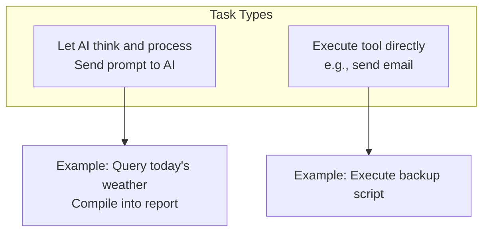

### 3. Send to Whom? (Target Channel)

Task execution results can be sent to:

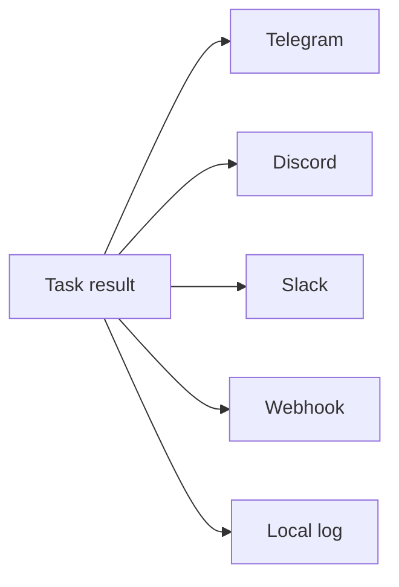

---

## System Architecture

### File Storage Design

Cron jobs are defined as Markdown files with YAML frontmatter in `~/.gasket/cron/*.md`:

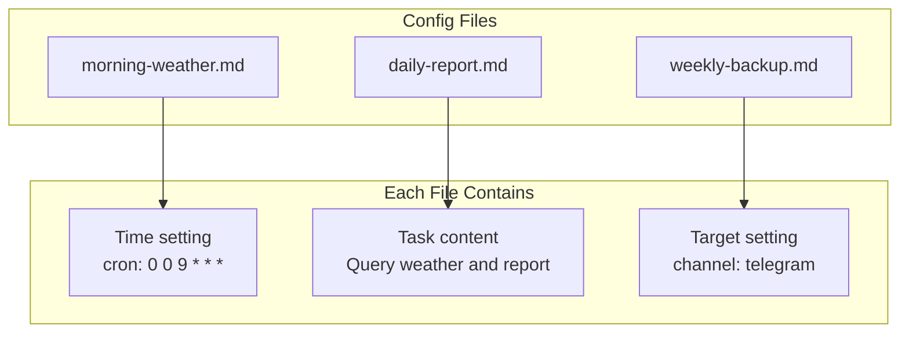

### Execution Flow

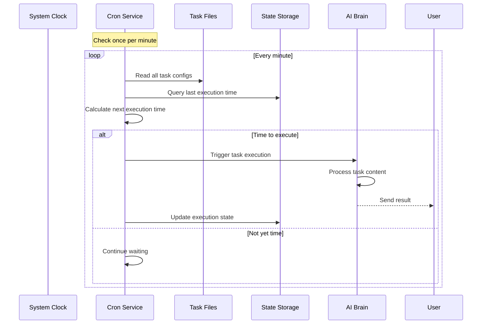

---

## Hybrid Architecture Design

Cron uses a **file + database** hybrid design:

```mermaid
flowchart TB
    subgraph Config Layer (Files)
        F[Task definition files<br/>.md format]
        F1[Human-editable]
        F2[Version control friendly]
        F3[Hot reload support]
    end

    subgraph State Layer (Database)
        D[SQLite database]
        D1[Last execution time]
        D2[Next execution time]
        D3[Execution count stats]
    end

    subgraph Memory Layer (Runtime)
        M[Task scheduler]
        M1[Cache task list]
        M2[Calculate execution time]
        M3[Trigger execution]
    end

    F --> M
    D --> M
    M --> D
```

**Why this design?**
- **Files store config**: You can edit files directly, manage with Git, clear at a glance
- **Database stores state**: Records last execution time, won't lose on restart, can detect missed tasks

### Database Schema

```sql
CREATE TABLE cron_state (
    job_id TEXT PRIMARY KEY,
    last_run TIMESTAMP,
    next_run TIMESTAMP
);
```

---

## Actual Usage Scenarios

### Scenario 1: Daily Weather Report

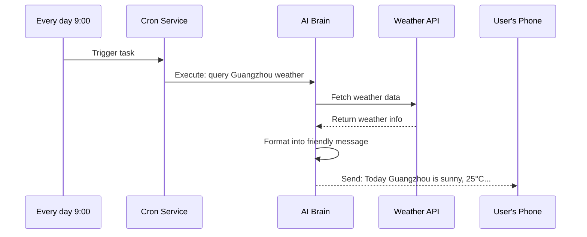

**Task file example:**
```markdown
---
name: Daily Weather
cron: "0 0 9 * * *"
channel: telegram
to: "User ID"
---

Query Guangzhou today and next three days' weather,
send to user in a friendly tone.
```

### Scenario 2: System Auto-Maintenance

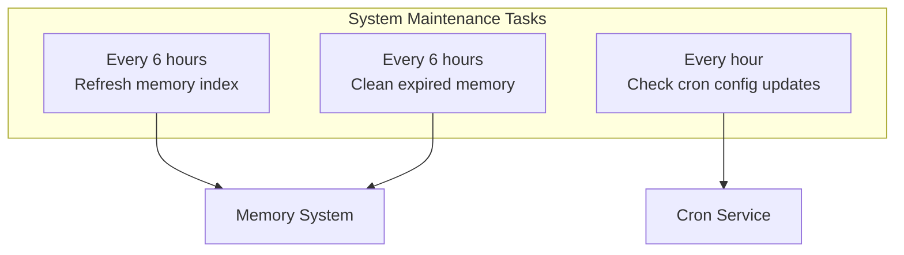

These tasks **execute tools directly**, bypassing AI, zero cost:
- `system-memory-decay`: Clean expired memory
- `system-memory-refresh`: Refresh memory index
- `system-cron-refresh`: Reload task configuration

### Scenario 3: Missed Task Catch-up

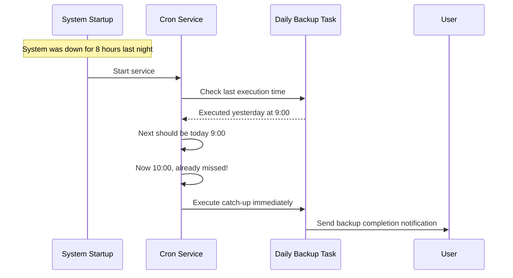

---

## Task Lifecycle

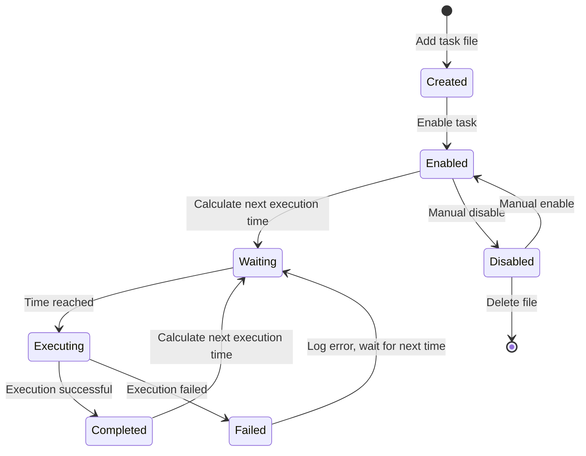

---

## How to Use

### 1. View All Tasks

```bash
gasket cron list
```

Example output:
```
Daily Weather
  Time: Every day 9:00
  Status: Enabled ✓
  Next: Tomorrow 9:00

Weekly Report
  Time: Every Monday 9:00
  Status: Enabled ✓
  Next: Next Monday 9:00
```

### 2. Add New Task

```bash
# CLI method
gasket cron add "Daily Weather" "0 0 9 * * *" "Query Guangzhou weather and send"

# Or create file ~/.gasket/cron/daily-weather.md
```

### 3. Enable/Disable Task

```bash
gasket cron enable daily-weather   # Enable
gasket cron disable daily-weather  # Disable
```

### 4. Show Task Details

```bash
gasket cron show daily-weather
```

### 5. Remove Task

```bash
gasket cron remove daily-weather
```

### 6. Refresh Tasks from Disk

```bash
gasket cron refresh
```

### 7. Manually Edit Task File

Edit files directly, the system auto-detects changes:

```bash
vim ~/.gasket/cron/daily-weather.md
# Save after editing, takes effect immediately, no restart needed
```

---

## FAQ

**Q: What if the computer was shut down, what about missed tasks?**
A: The system remembers the next execution time. After booting, it checks for missed tasks and executes them immediately.

**Q: Do I need to restart after modifying task files?**
A: No! The system monitors file changes, changes take effect immediately after saving.

**Q: How many tasks can I set?**
A: No limit, but plan reasonably to avoid too many tasks executing at the same time.

**Q: Will failed tasks retry?**
A: Each task executes independently. On failure, it logs and waits for the next execution time to retry.
