# 定时任务模块 (Cron)

> 让 AI 自动按时工作的闹钟系统

---

## 一句话理解

Cron 就是 AI 的**闹钟 + 待办事项清单**。到时间了，AI 会自动执行预设的任务。

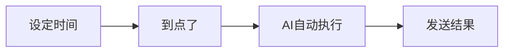

---

## 生活中的例子

| 场景 | 类似 Cron 的...
|------|---------------|
| 手机闹钟每天 7 点响 | 每天 7 点发送早安消息 |
| 日历提醒每周一开例会 | 每周一发送周报提醒 |
| 定时器 30 分钟后关火 | 30 分钟后提醒检查任务 |
| 生日提醒每年自动发送祝福 | 每年自动发送祝福消息 |

---

## Cron 能做什么

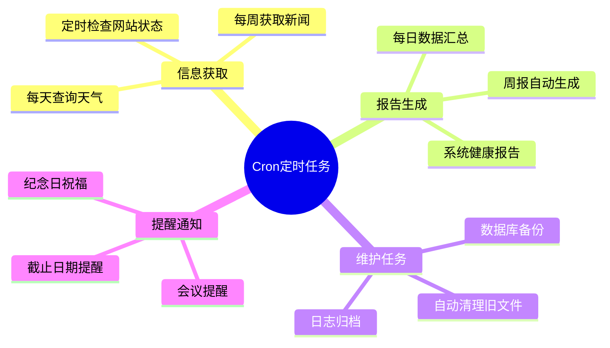

---

## 定时任务的组成

每个定时任务包含：

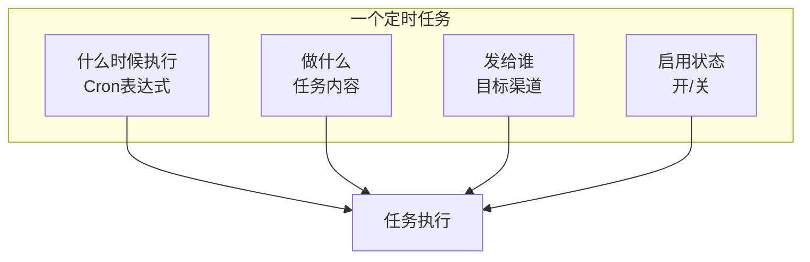

### 1. 什么时候执行？（Cron 表达式）

Cron 表达式是一种时间格式，告诉系统**何时**执行任务：

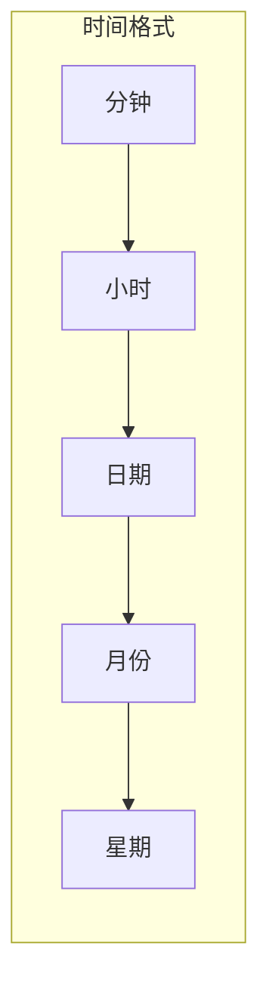

| 表达式 | 含义 | 举例 |
|--------|------|------|
| `0 9 * * *` | 每天 9:00 | 每天上午9点发送早报 |
| `0 */6 * * *` | 每 6 小时 | 每6小时检查一次邮件 |
| `0 9 * * 1` | 每周一 9:00 | 每周一发送周报提醒 |
| `0 0 1 * *` | 每月 1 号 | 每月1号生成月报 |
| `*/5 * * * *` | 每 5 分钟 | 每5分钟检查系统状态 |

### 2. 做什么？（任务内容）

任务内容就是告诉 AI 要执行什么操作：

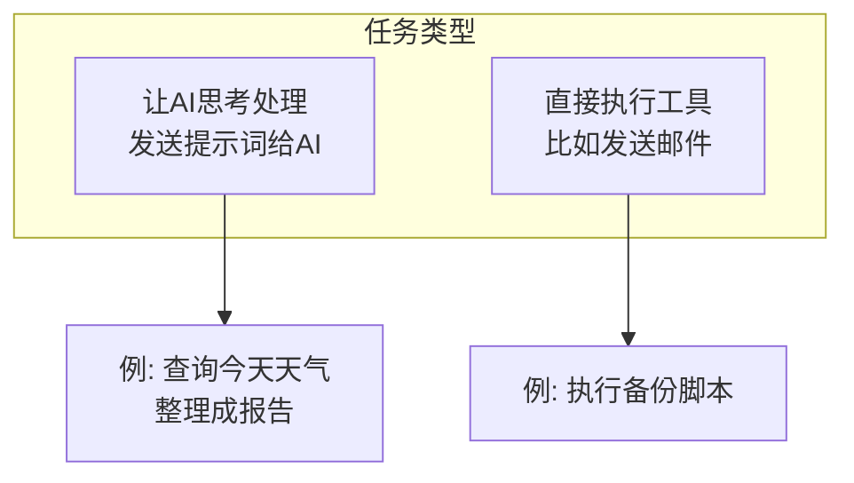

### 3. 发给谁？（目标渠道）

任务执行结果可以发送到：

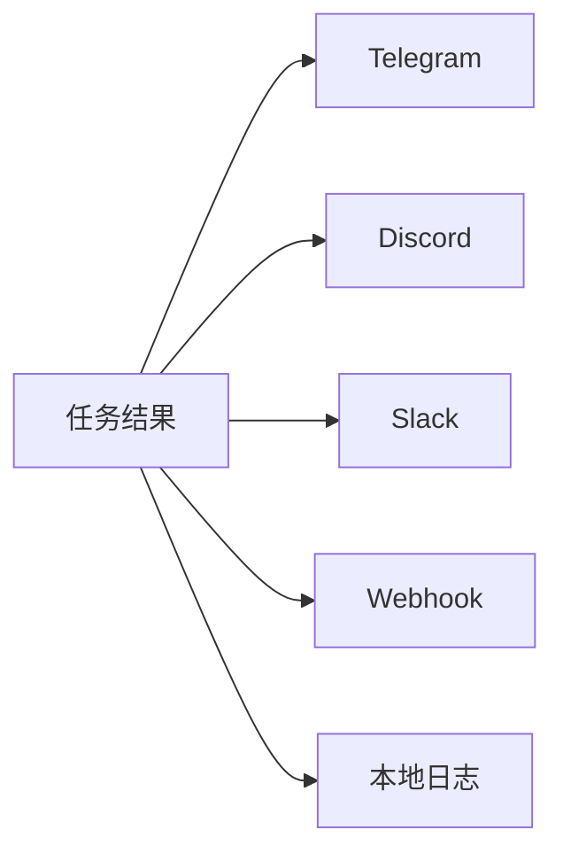

---

## 系统架构

### 文件存储设计

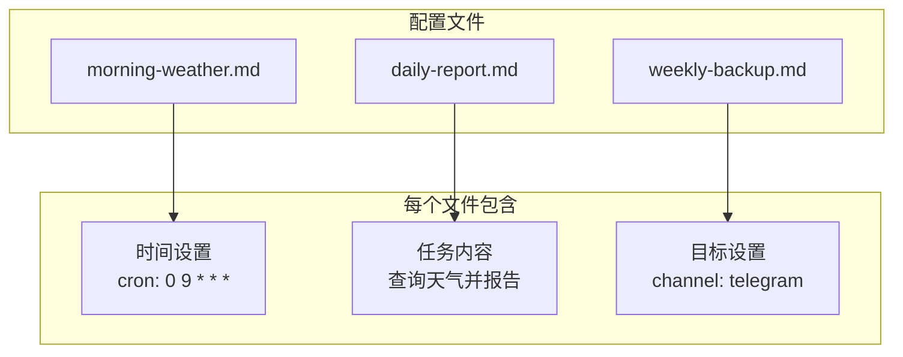

### 执行流程

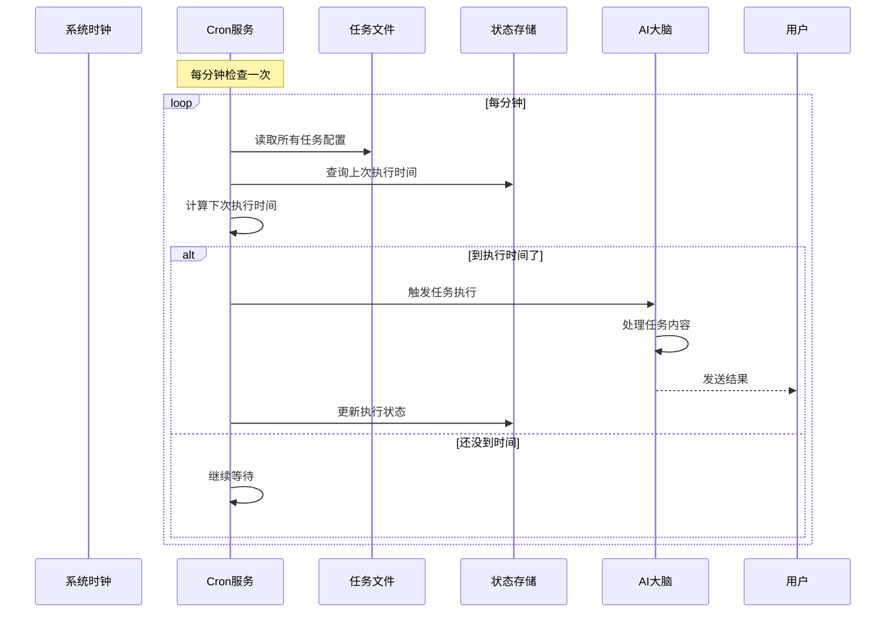

---

## 混合架构设计

Cron 使用**文件 + 数据库**的混合设计：

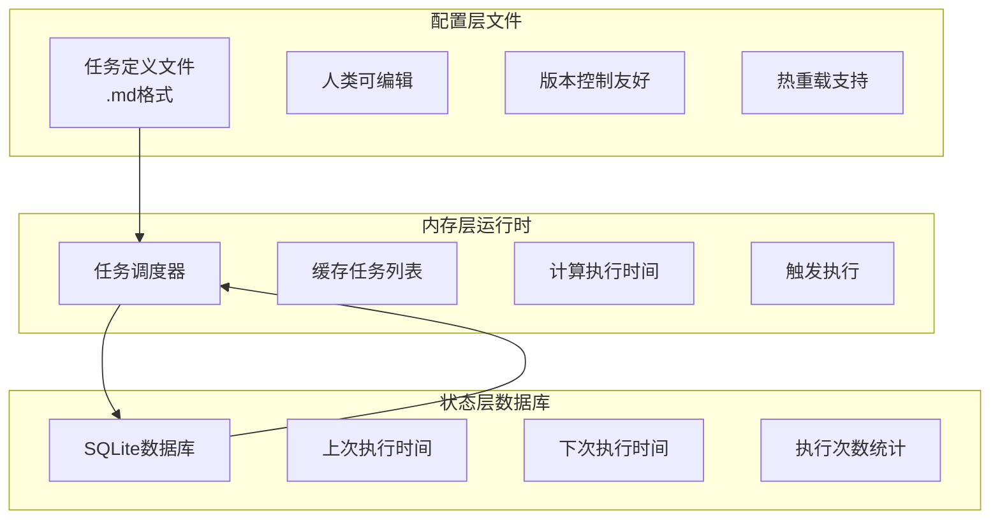

**为什么这样设计？**
- **文件存配置**：你可以直接编辑文件，用 Git 管理，一目了然
- **数据库存状态**：记录上次执行时间，重启后不会丢失，能检测错过的任务

---

## 实际使用场景

### 场景1：每日天气早报

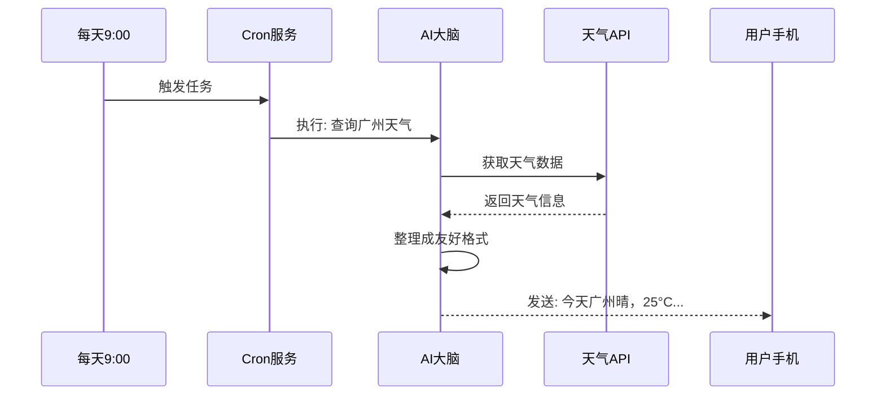

**任务文件示例：**
```markdown
---
name: 每日天气
cron: "0 9 * * *"
channel: telegram
to: "用户ID"
---

查询广州今天和未来三天的天气情况，
用亲切的语气发送给用户。
```

### 场景2：系统自动维护

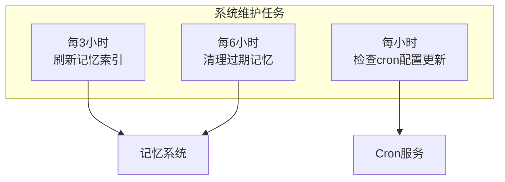

这些任务**直接执行工具**，不经过 AI，零成本：
- `memory_refresh`：刷新记忆索引
- `memory_decay`：清理过期记忆
- `cron refresh`：重新加载任务配置

### 场景3：错过的任务补执行

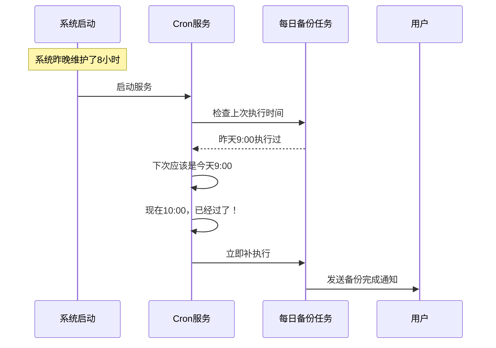

---

## 任务的生命周期

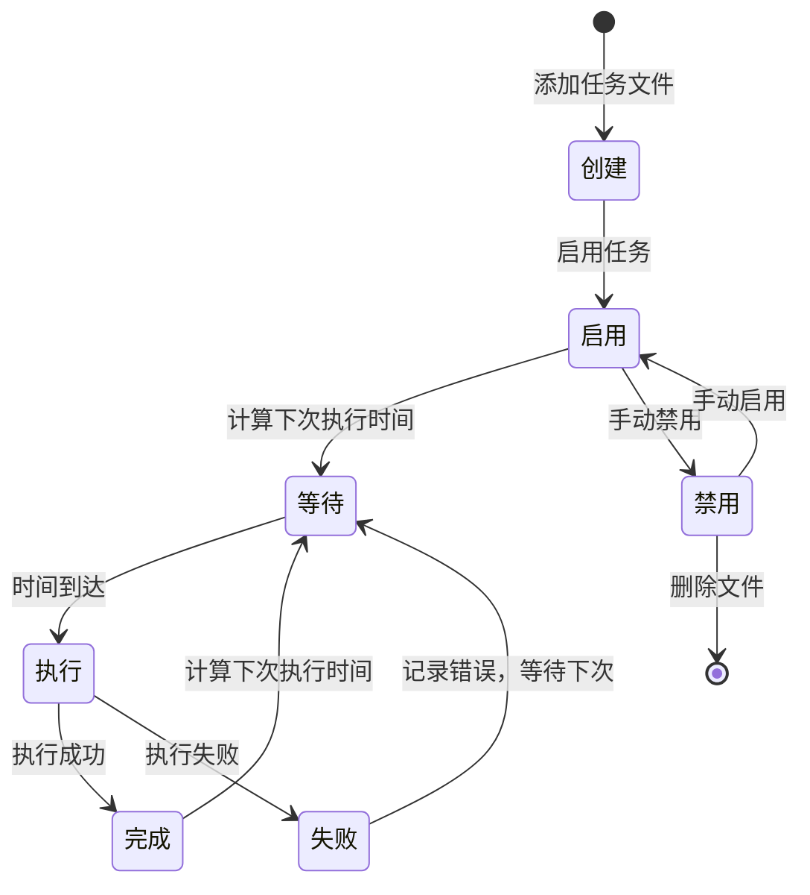

---

## 如何使用

### 1. 查看所有任务

```bash
gasket cron list
```

输出示例：
```
每日天气
  时间: 每天 9:00
  状态: 启用 ✓
  下次: 明天 9:00

周报提醒
  时间: 每周一 9:00
  状态: 启用 ✓
  下次: 下周一 9:00
```

### 2. 添加新任务

```bash
# 命令行方式
gasket cron add "每日天气" "0 9 * * *" "查询广州天气并发送"

# 或者创建文件 ~/.gasket/cron/daily-weather.md
```

### 3. 启用/禁用任务

```bash
gasket cron enable daily-weather   # 启用
gasket cron disable daily-weather  # 禁用
```

### 4. 手动编辑任务文件

直接编辑文件，系统会自动检测变化：

```bash
vim ~/.gasket/cron/daily-weather.md
# 修改后保存，立即生效，无需重启
```

---

## 常见问题

**Q: 如果电脑关机了，错过的任务怎么办？**
A: 系统会记住下次执行时间，开机后会检查是否有错过的任务，并立即补执行。

**Q: 任务文件修改后要重启吗？**
A: 不需要！系统会监控文件变化，保存后立即生效。

**Q: 可以设置多少任务？**
A: 没有限制，但建议合理规划，避免同时执行太多任务。

**Q: 任务执行失败会重试吗？**
A: 每次任务独立执行，失败后记录日志，等待下次执行时间再试。
