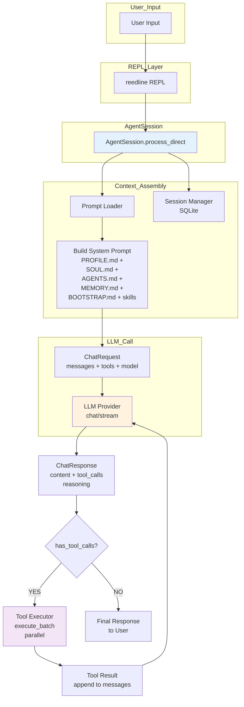
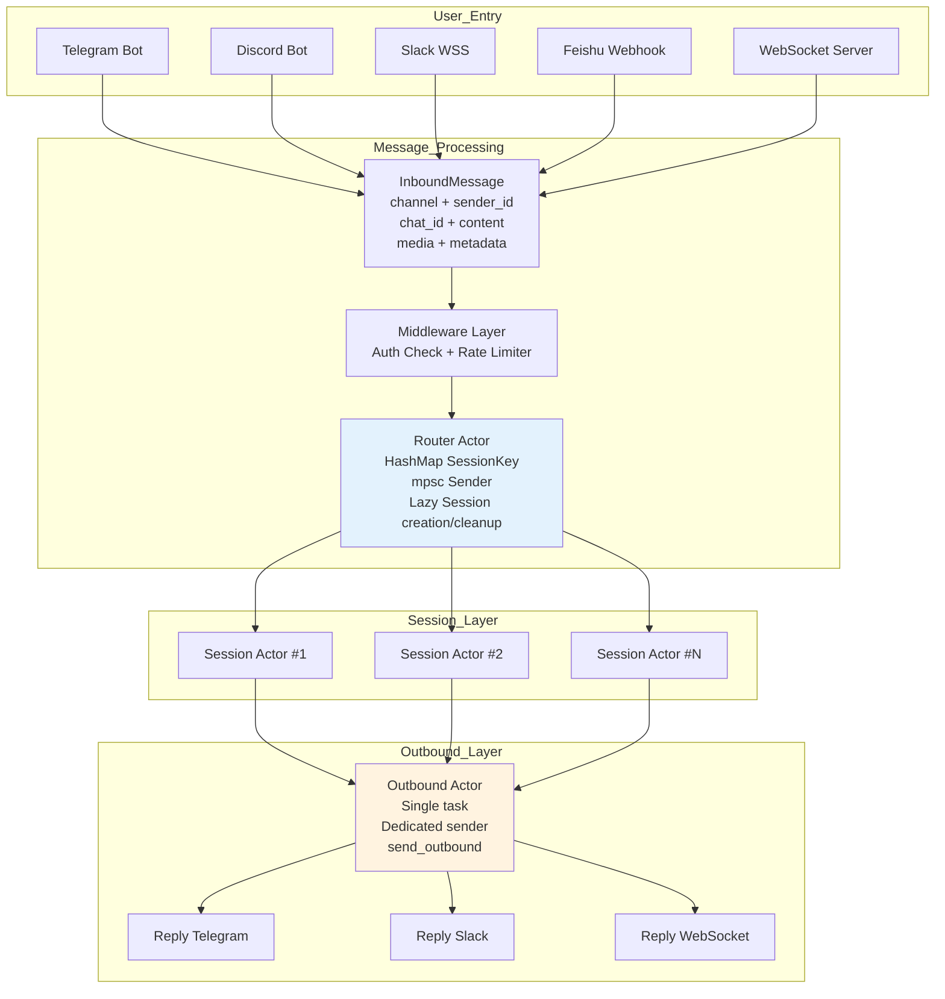
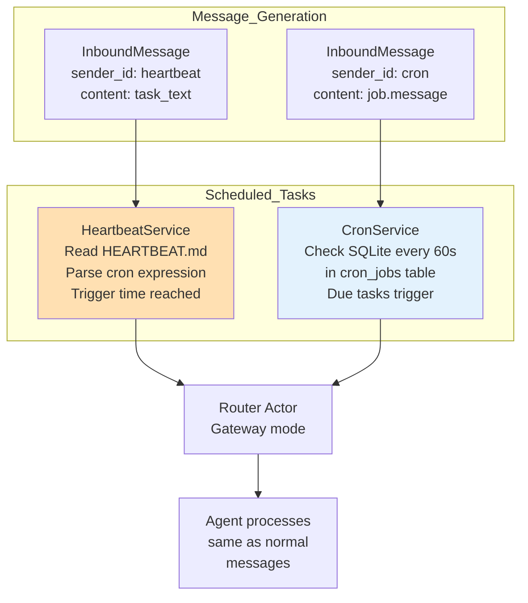
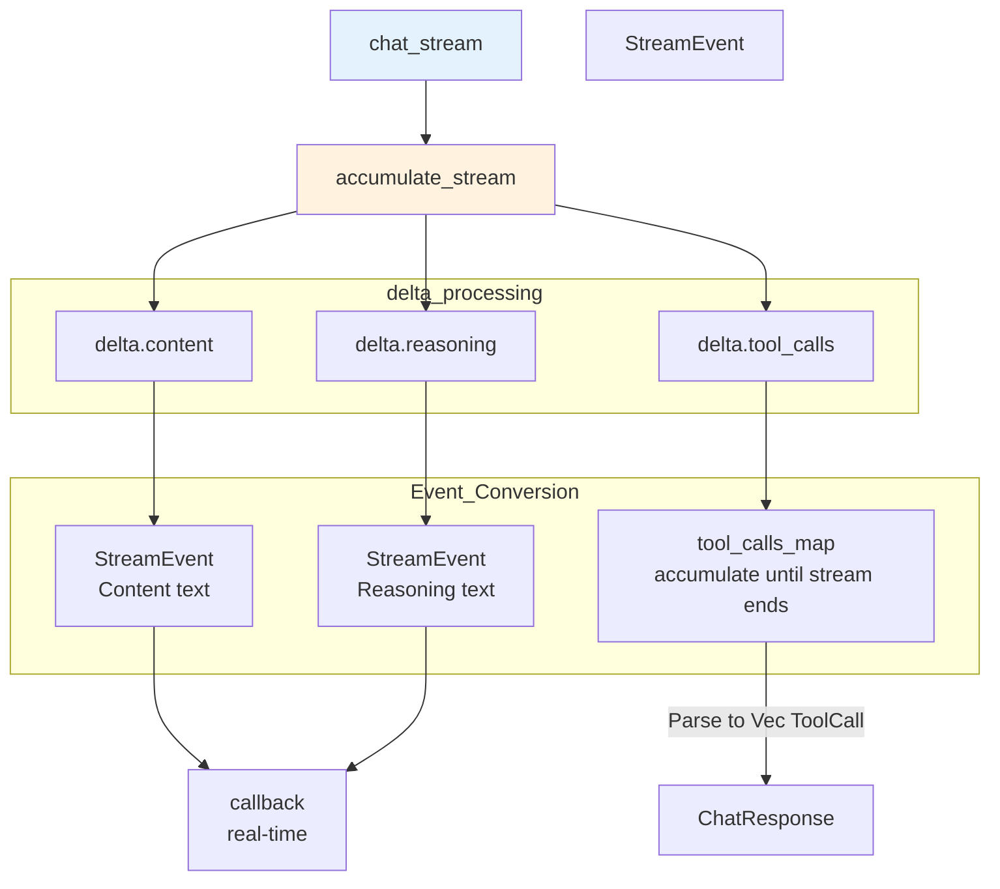
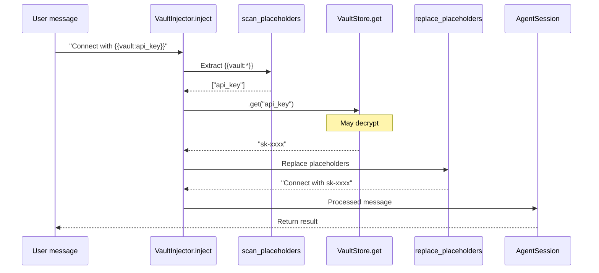
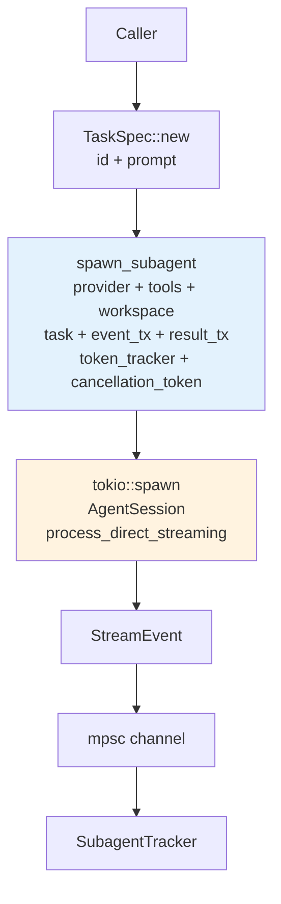
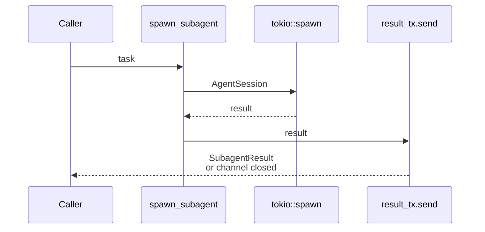
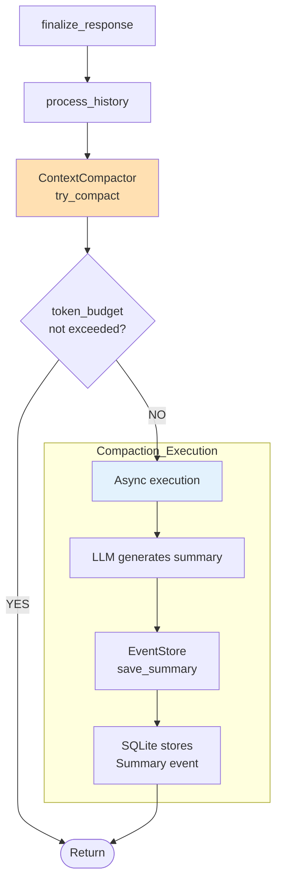
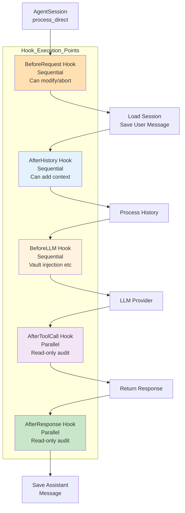

# Data Flow Design

> Data flow paths in Gasket-RS under different modes

---

## 1. CLI Mode Data Flow



---

## 2. Gateway Mode Data Flow (Actor Model)



### Actor Model Design Points

| Actor | Responsibility | Concurrency Model |
|-------|----------------|-------------------|
| **Router Actor** | Distributes messages to Session Actors by SessionKey, lazy creation/cleanup | Single task, owns routing table HashMap, zero locks |
| **Session Actor** | Processes all messages for a single session serially, calls AgentSession | Independent tokio::spawn per session, shares `Arc<AgentSession>` |
| **Outbound Actor** | Cross-network HTTP/WebSocket sending, doesn't block upstream | Single task, external API blocking doesn't affect Agent |

---

## 3. Heartbeat & Cron Data Flow



---

## 4. Agent Execution Flowchart

```mermaid
flowchart TB
    START([Start]) --> PR[process_direct]

    PR --> BR[pre_request Hook<br/>Optional<br/>Can modify/abort]

    BR --> SL[Process slash commands<br/>/new → clear<br/>/help → help]

    SL --> SM{slash cmd?}

    SM -->|YES| EX[Execute command]
    SM -->|NO| SH

    subgraph Save_Message
        SH[1. Save user message<br/>to SessionEvent]
    end

    SH --> HH[History Processor<br/>token-aware]

    subgraph History_Processing
        HH --> HP[Algorithm:<br/>1. Take last max_messages<br/>2. Always keep last recent_keep<br/>3. Earlier messages by token budget<br/>→ ProcessedHistory<br/>messages + evicted]
    end

    HP --> CC[ContextCompactor<br/>compact]

    CC --> EV{evicted<br/>not empty?}

    EV -->|YES| SUM[LLM summary]
    EV -->|NO| LS[Load existing summary]
    SUM --> SS[summary: Option String]
    LS --> SS

    SS --> PA[Prompt Assembly]

    subgraph Prompt_Assembly
        PA --> SYS1["[system] PROFILE.md + SOUL.md +<br/>AGENTS.md + BOOTSTRAP.md +<br/>skills_context"]
        PA --> USR1["[user] [SYSTEM: dynamic memory]<br/>Relevant memories +<br/>summary (if any)"]
        PA --> USR2["[assistant/user] History<br/>messages (processed)"]
        PA --> USR3["[user] Current input"]
    end

    PA --> I[iteration = 0]

    I --> LP{iteration &lt;<br/>max_iterations<br/>(default 20)?}

    LP -->|YES| INC[iteration++]
    INC --> CR[Build ChatRequest<br/>model + messages + tools +<br/>temperature + max_tokens +<br/>thinking]

    CR --> LLM[LLM Provider<br/>chat / chat_stream]

    LLM --> LR{Fail?}

    LR -->|YES| RET[Exponential backoff<br/>retry ×3]
    RET --> LLM

    LR -->|NO| CR2[ChatResponse]

    CR2 --> TC{has_tool<br/>_calls?}

    TC -->|YES| TE[ToolExecutor<br/>execute_batch<br/>parallel]

    TE --> TR[Append tool<br/>results to messages]

    TR --> I

    TC -->|NO| OUT[Return final<br/>response<br/>AgentResponse<br/>content + reasoning<br/>+ tools_used]

    LP -->|NO| OUT

    OUT --> AR[post_response Hook<br/>Optional<br/>Audit/Alert]

    AR --> SA[Save assistant<br/>message to<br/>Session]

    SA --> END([Done])

    style PR fill:#E3F2FD
    style LLM fill:#FFF3E0
    style TE fill:#F3E5F5
```

---

## 5. Streaming Output Flow



---

## 6. Vault Injection Flow



### InjectionReport

```rust
InjectionReport {
    total_placeholders: 1,
    replaced: 1,
    missing_keys: [],      // Keys not found are recorded here
}
```

---

## 7. Subagent Spawning Patterns

### Pure Function Creation (Recommended)



### Fire-and-Forget Mode

```mermaid
flowchart TB
    C[Caller]
    SA[spawn_subagent<br/>task + result_tx<br/>+ cancellation_token]
    JH[Returns JoinHandle]
    TS[tokio::spawn<br/>AgentSession<br/>process_direct]
    OM[OutboundMessage]

    C --> SA
    SA --> JH
    SA --> TS
    TS --> OM

    Note over TS: 10-minute timeout

    OM -->|via outbound_tx<br/>sent to channel| OUT[Result routed to chat]

    style SA fill:#FFE0B2
```

### Sync Wait Mode



---

## 8. Context Compaction Flow



### Compaction Execution Strategy

- Non-blocking compaction triggered in `finalize_response`
- Compaction runs in background, does not block response
- Checked after every response (if needed)

---

## 9. Hook System Data Flow



### Hook Execution Strategy

| Hook Point | Strategy | Can Modify? | Can Abort? |
|------------|----------|-------------|------------|
| BeforeRequest | Sequential | ✓ | ✓ |
| AfterHistory | Sequential | ✓ | ✗ |
| BeforeLLM | Sequential | ✓ | ✗ |
| AfterToolCall | Parallel | ✗ | ✗ |
| AfterResponse | Parallel | ✗ | ✗ |
