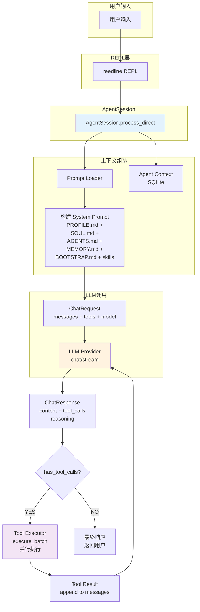
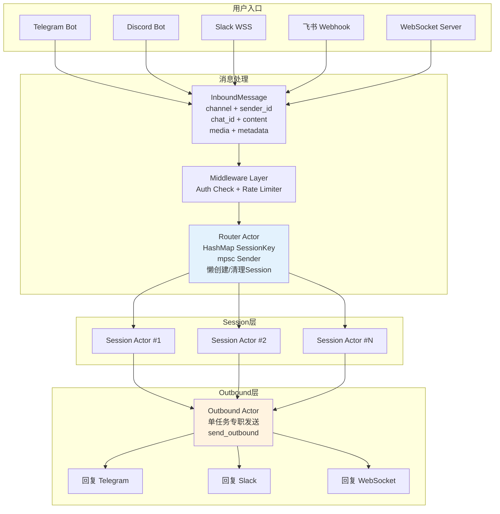
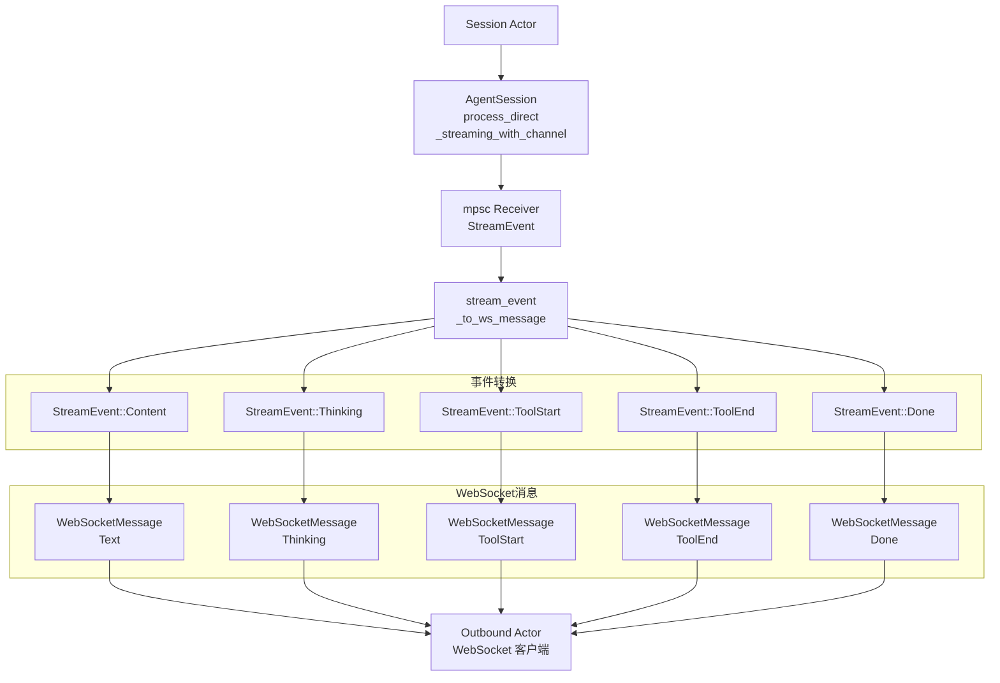
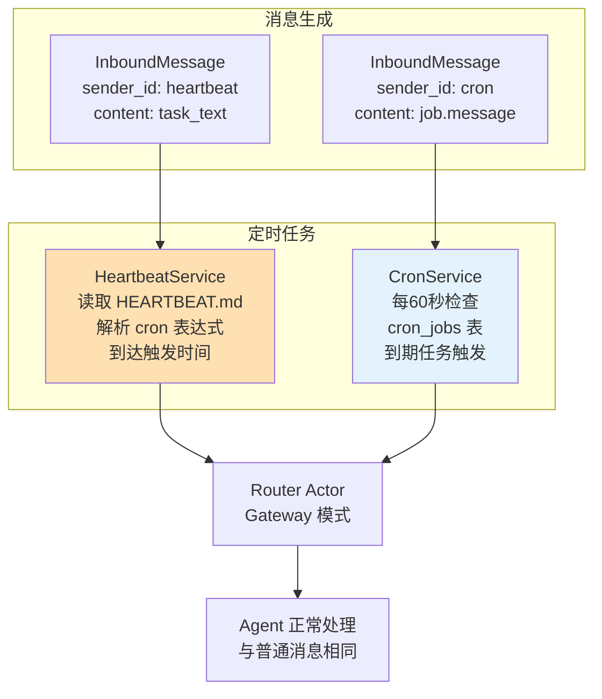
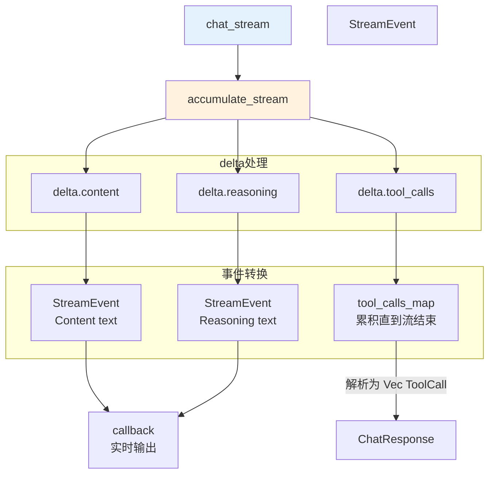
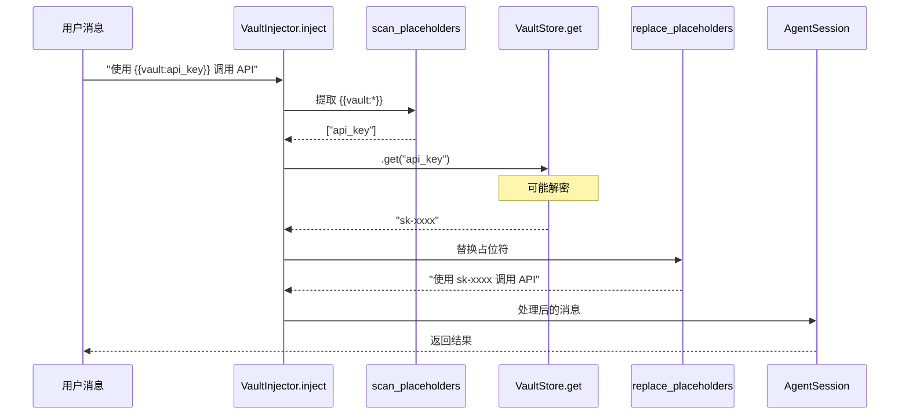
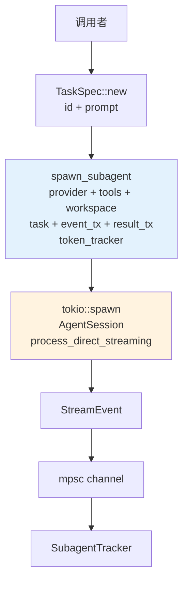
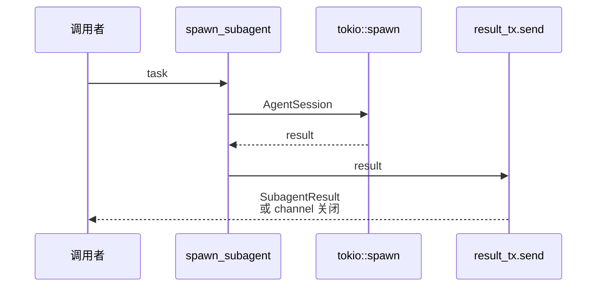
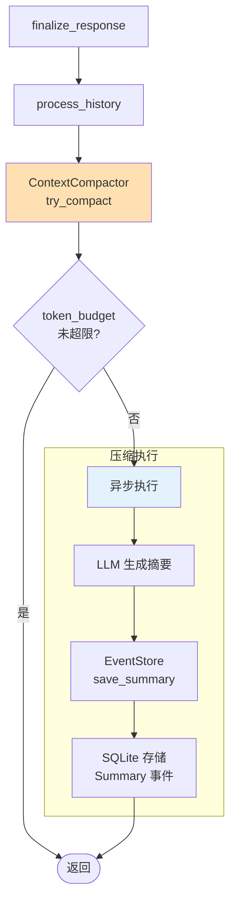
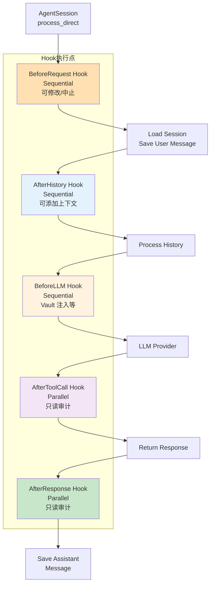

# 数据流设计

> Gasket-RS 各模式下的数据流转路径

---

## 1. CLI 模式数据流



---

## 2. Gateway 模式数据流 (Actor 模型)



### Actor 模型设计要点

| Actor | 职责 | 并发模型 |
|-------|------|----------|
| **Router Actor** | 按 SessionKey 分发消息到 Session Actor，懒创建/清理 | 单任务，拥有路由表 HashMap，零锁 |
| **Session Actor** | 串行处理单个 session 的所有消息，调用 AgentSession | 每 session 独立 tokio::spawn，共享 `Arc<AgentSession>` |
| **Outbound Actor** | 跨网络 HTTP/WebSocket 发送，不阻塞上游 | 单任务，即使外部 API 阻塞也不影响 Agent |

### WebSocket 流式处理



---

## 3. Heartbeat & Cron 数据流



---

## 4. Agent 执行流程图

```mermaid
flowchart TB
    START([开始]) --> PR[开始处理<br/>AgentSession<br/>process_direct]

    PR --> BR[BeforeRequest Hook<br/>可选<br/>可修改/中止]

    BR --> SL[处理斜杠命令<br/>/new → 清空<br/>/help → 帮助]

    SL --> SM{斜杠命令?}

    SM -->|YES| EX[执行命令]
    SM -->|NO| SH

    subgraph 保存消息
        SH[1. 保存 user message<br/>到 SessionEvent]
    end

    SH --> HH[History Processor<br/>token 感知]

    subgraph 历史处理
        HH --> HP[算法：<br/>1. 取最近 max_messages 条<br/>2. 始终保留最后 recent_keep 条<br/>3. 较早消息按 token 预算纳入/驱逐<br/>→ ProcessedHistory<br/>messages + evicted]
    end

    HP --> CC[ContextCompactor<br/>compact]

    CC --> EV{evicted<br/>不为空?}

    EV -->|YES| SUM[同步 LLM 摘要]
    EV -->|NO| LS[加载已有摘要]
    SUM --> SS[summary: Option String]
    LS --> SS

    SS --> PA[Prompt Assembly]

    subgraph Prompt组装
        PA --> SYS1["[system] PROFILE.md + SOUL.md +<br/>AGENTS.md + MEMORY.md +<br/>BOOTSTRAP.md + skills_context"]
        PA --> SYS2["[system] 摘要 (如有)"]
        PA --> USR1["[user] 历史消息 × N (已处理)"]
        PA --> USR2["[user] 长期记忆 (动态加载)<br/>Relevant memories..."]
        PA --> USR3["[user] 当前输入内容"]
    end

    PA --> I[iteration = 0]

    I --> LP{iteration &lt;<br/>max_iterations<br/>(默认20)?}

    LP -->|YES| INC[iteration++]
    INC --> CR[构建 ChatRequest<br/>model + messages + tools +<br/>temperature + max_tokens +<br/>thinking]

    CR --> LLM[LLM Provider<br/>chat / chat_stream]

    LLM --> LR{失败?}

    LR -->|YES| RET[指数退避重试 ×3]
    RET --> LLM

    LR -->|NO| CR2[ChatResponse]

    CR2 --> TC{has_tool<br/>_calls?}

    TC -->|YES| TE[ToolExecutor<br/>execute_batch<br/>并行执行]

    TE --> TR[Tool Result<br/>追加到 messages]

    TR --> I

    TC -->|NO| OUT[返回最终响应<br/>AgentResponse<br/>content + reasoning<br/>+ tools_used]

    LP -->|NO| OUT

    OUT --> AR[AfterResponse Hook<br/>可选<br/>审计/告警]

    AR --> SA[保存 assistant<br/>message 到<br/>Session]

    SA --> END([完成])

    style PR fill:#E3F2FD
    style LLM fill:#FFF3E0
    style TE fill:#F3E5F5
```

---

## 5. 流式输出流程



### 流式事件类型

```rust
pub enum StreamEvent {
    Thinking { agent_id: Option<Arc<str>>, content: Arc<str> },
    ToolStart { agent_id: Option<Arc<str>>, name: Arc<str>, arguments: Option<Arc<str>> },
    ToolEnd { agent_id: Option<Arc<str>>, name: Arc<str>, output: Option<Arc<str>> },
    Content { agent_id: Option<Arc<str>>, content: Arc<str> },
    Done { agent_id: Option<Arc<str>> },
    TokenStats { agent_id: Option<Arc<str>>, input_tokens: usize, output_tokens: usize, total_tokens: usize, cost: f64, currency: Arc<str> },
    SubagentStarted { agent_id: Arc<str>, task: Arc<str>, index: u32 },
    SubagentCompleted { agent_id: Arc<str>, index: u32, summary: Arc<str>, tool_count: u32 },
    SubagentError { agent_id: Arc<str>, index: u32, error: Arc<str> },
    Text { agent_id: Option<Arc<str>>, content: Arc<str> },
}
```

---

## 6. Vault 注入流程



### InjectionReport

```rust
InjectionReport {
    total_placeholders: 1,
    replaced: 1,
    missing_keys: [],      // 未找到的密钥会记录在此
}
```

---

## 7. 子代理调度模式

### 7.1 纯函数创建（推荐）



### 7.2 Fire-and-Forget 模式

```mermaid
flowchart TB
    C[调用者]
    SA[spawn_subagent<br/>task + result_tx]
    JH[返回 JoinHandle]
    TS[tokio::spawn<br/>AgentSession<br/>process_direct]
    OM[OutboundMessage]

    C --> SA
    SA --> JH
    SA --> TS
    TS --> OM

    Note over TS: 10分钟超时

    OM -->|通过 outbound_tx<br/>发送到渠道| OUT[结果路由到 chat]

    style SA fill:#FFE0B2
```

### 7.3 同步等待模式



---

## 8. 上下文压缩数据流



### 压缩执行策略

- 非阻塞压缩在 `finalize_response` 中触发
- 压缩在后台执行，不阻塞响应
- 每次响应都会检查并执行压缩（如需要）

---

## 9. Hook 系统数据流



### Hook 执行策略

| Hook Point | 策略 | 可修改 | 可中止 |
|------------|------|--------|--------|
| BeforeRequest | Sequential | ✓ | ✓ |
| AfterHistory | Sequential | ✓ | ✗ |
| BeforeLLM | Sequential | ✓ | ✗ |
| AfterToolCall | Parallel | ✗ | ✗ |
| AfterResponse | Parallel | ✗ | ✗ |
