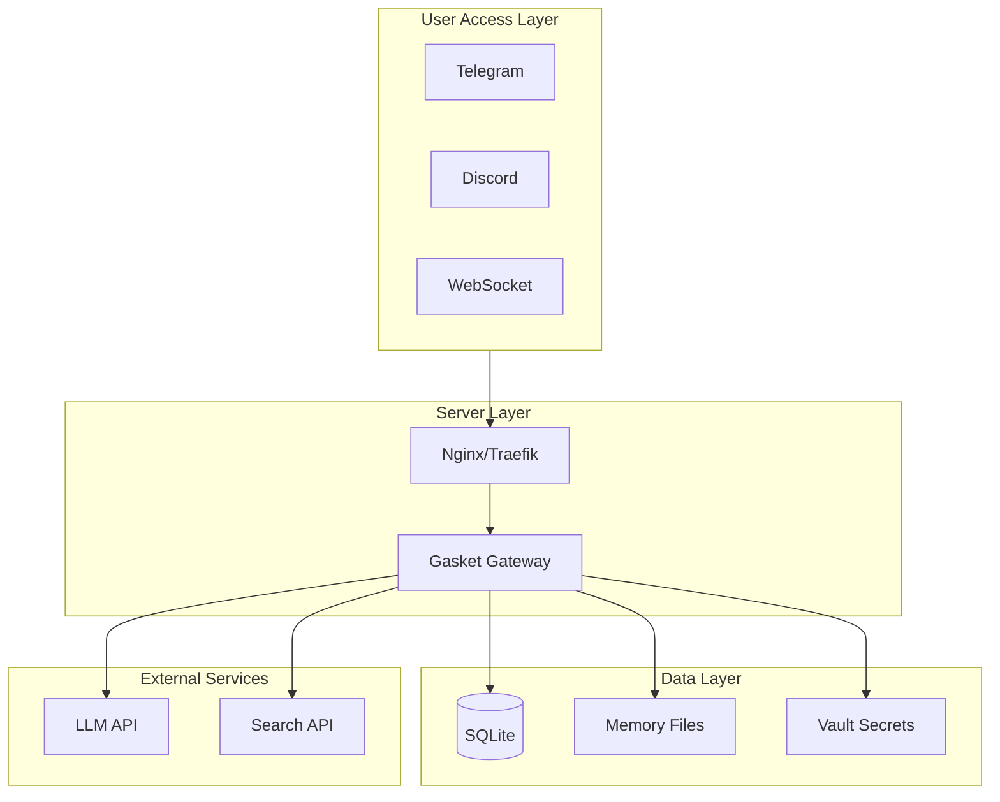

# Deployment Guide

> Production Deployment Instructions for Gasket-RS

---

## Deployment Architecture



---

## 1. Binary Deployment

### 1.1 Build Release Version

```bash
# Clone repository
git clone https://github.com/YeHeng/gasket-rs.git
cd gasket-rs

# Build (enable all channels)
cargo build --release

# Or enable specific channels only
cargo build --release --no-default-features \
    --features "telegram,discord,websocket"

# Binary location
./target/release/gasket
```

### 1.2 Systemd Service Deployment

Create service file `/etc/systemd/system/gasket.service`:

```ini
[Unit]
Description=Gasket AI Agent Gateway
After=network.target

[Service]
Type=simple
User=gasket
Group=gasket
WorkingDirectory=/opt/gasket
Environment="RUST_LOG=info"
Environment="GASKET_CONFIG=/opt/gasket/config.yaml"
ExecStart=/opt/gasket/gasket gateway
Restart=always
RestartSec=10

# Security restrictions
NoNewPrivileges=true
ProtectSystem=strict
ProtectHome=true
ReadWritePaths=/opt/gasket/data
ProtectKernelTunables=true
ProtectKernelModules=true
ProtectControlGroups=true

[Install]
WantedBy=multi-user.target
```

Deployment script:

```bash
# Create user
sudo useradd -r -s /bin/false gasket

# Deploy files
sudo mkdir -p /opt/gasket
cp target/release/gasket /opt/gasket/
cp config.yaml /opt/gasket/
sudo chown -R gasket:gasket /opt/gasket

# Start service
sudo systemctl daemon-reload
sudo systemctl enable gasket
sudo systemctl start gasket

# View logs
sudo journalctl -u gasket -f
```

---

## 2. Docker Deployment

### 2.1 Dockerfile

```dockerfile
# Build stage
FROM rust:1.75-bookworm as builder

WORKDIR /app
COPY . .

RUN cargo build --release --features "telegram,discord,websocket"

# Runtime stage
FROM debian:bookworm-slim

RUN apt-get update && apt-get install -y \
    ca-certificates \
    sqlite3 \
    && rm -rf /var/lib/apt/lists/*

# Create non-root user
RUN useradd -m -u 1000 gasket

WORKDIR /app

# Copy binary
COPY --from=builder /app/target/release/gasket /usr/local/bin/

# Create working directory
RUN mkdir -p /data && chown gasket:gasket /data

USER gasket

# Data volume
VOLUME ["/data"]

EXPOSE 18790

ENTRYPOINT ["gasket"]
CMD ["status"]
```

### 2.2 docker-compose.yml

```yaml
version: '3.8'

services:
  gasket:
    build: .
    container_name: gasket
    restart: unless-stopped
    
    environment:
      - RUST_LOG=info
      - GASKET_CONFIG=/data/config.yaml
    
    volumes:
      - ./data:/data
      - ./config.yaml:/data/config.yaml:ro
    
    ports:
      - "18790:18790"
    
    # Resource limits
    deploy:
      resources:
        limits:
          cpus: '2'
          memory: 2G
        reservations:
          cpus: '0.5'
          memory: 512M
```

Deploy:

```bash
docker-compose up -d
docker-compose logs -f
```

---

## 3. Kubernetes Deployment

### 3.1 ConfigMap

```yaml
apiVersion: v1
kind: ConfigMap
metadata:
  name: gasket-config
data:
  config.yaml: |
    providers:
      openrouter:
        api_key: ${OPENROUTER_API_KEY}
    
    agents:
      defaults:
        model: openrouter/anthropic/claude-4.5-sonnet
    
    gateway:
      session_timeout: 3600
```

### 3.2 Secret

```yaml
apiVersion: v1
kind: Secret
metadata:
  name: gasket-secrets
type: Opaque
stringData:
  OPENROUTER_API_KEY: "sk-or-v1-xxx"
  TELEGRAM_TOKEN: "xxx"
  VAULT_PASSWORD: "your-vault-password"
```

### 3.3 Deployment

```yaml
apiVersion: apps/v1
kind: Deployment
metadata:
  name: gasket
spec:
  replicas: 2
  selector:
    matchLabels:
      app: gasket
  template:
    metadata:
      labels:
        app: gasket
    spec:
      containers:
      - name: gasket
        image: your-registry/gasket:latest
        ports:
        - containerPort: 18790
        env:
        - name: RUST_LOG
          value: "info"
        - name: GASKET_CONFIG
          value: "/config/config.yaml"
        - name: OPENROUTER_API_KEY
          valueFrom:
            secretKeyRef:
              name: gasket-secrets
              key: OPENROUTER_API_KEY
        volumeMounts:
        - name: config
          mountPath: /config
          readOnly: true
        - name: data
          mountPath: /data
        resources:
          requests:
            memory: "512Mi"
            cpu: "500m"
          limits:
            memory: "2Gi"
            cpu: "2000m"
        livenessProbe:
          httpGet:
            path: /health
            port: 18790
          initialDelaySeconds: 30
          periodSeconds: 10
        readinessProbe:
          httpGet:
            path: /ready
            port: 18790
          initialDelaySeconds: 5
          periodSeconds: 5
      volumes:
      - name: config
        configMap:
          name: gasket-config
      - name: data
        persistentVolumeClaim:
          claimName: gasket-data
```

Deploy:

```bash
kubectl apply -f k8s/
kubectl get pods -l app=gasket
kubectl logs -f deployment/gasket
```

---

## 4. Reverse Proxy Configuration

### 4.1 Nginx

```nginx
upstream gasket {
    server 127.0.0.1:8080;
    keepalive 32;
}

server {
    listen 80;
    server_name your-domain.com;
    
    # WebSocket support
    location /ws {
        proxy_pass http://gasket;
        proxy_http_version 1.1;
        proxy_set_header Upgrade $http_upgrade;
        proxy_set_header Connection "upgrade";
        proxy_set_header Host $host;
        proxy_set_header X-Real-IP $remote_addr;
        proxy_read_timeout 86400;
    }
    
    # API proxy
    location / {
        proxy_pass http://gasket;
        proxy_http_version 1.1;
        proxy_set_header Host $host;
        proxy_set_header X-Real-IP $remote_addr;
        proxy_set_header X-Forwarded-For $proxy_add_x_forwarded_for;
        proxy_set_header X-Forwarded-Proto $scheme;
    }
}
```

---

## 5. Backup and Recovery

### 5.1 Backup Strategy

```bash
#!/bin/bash
# backup.sh - Daily backup

BACKUP_DIR="/backup/gasket/$(date +%Y%m%d)"
mkdir -p "$BACKUP_DIR"

# Backup SQLite database
sqlite3 ~/.gasket/gasket.db ".backup '$BACKUP_DIR/gasket.db'"

# Backup memory files
tar czf "$BACKUP_DIR/memory.tar.gz" -C ~/.gasket memory/

# Backup vault
tar czf "$BACKUP_DIR/vault.tar.gz" -C ~/.gasket vault/

# Backup config
cp ~/.gasket/config.yaml "$BACKUP_DIR/"

# Keep last 7 days
find /backup/gasket -type d -mtime +7 -exec rm -rf {} +
```

### 5.2 Recovery

```bash
# Stop service
sudo systemctl stop gasket

# Restore data
cp /backup/gasket/20240101/gasket.db ~/.gasket/
tar xzf /backup/gasket/20240101/memory.tar.gz -C ~/.gasket
tar xzf /backup/gasket/20240101/vault.tar.gz -C ~/.gasket

# Start service
sudo systemctl start gasket
```

---

## 6. Security Configuration

### 6.1 File Permissions

```bash
# Configuration directory permissions
chmod 700 ~/.gasket
chmod 600 ~/.gasket/config.yaml
chmod 600 ~/.gasket/gasket.db
chmod 700 ~/.gasket/vault
```

### 6.2 Vault Encryption

Production environments should enable Vault encryption:

```bash
# Set environment variable
export GASKET_MASTER_PASSWORD="your-strong-password"

# Or use systemd LoadCredential
# /etc/systemd/system/gasket.service.d/override.conf
[Service]
LoadCredential=vault_password:/etc/gasket/vault_password
```

---

## 7. Performance Tuning

### 7.1 SQLite Optimization

```sql
-- Execute on connection
PRAGMA journal_mode = WAL;
PRAGMA synchronous = NORMAL;
PRAGMA cache_size = 10000;
PRAGMA temp_store = memory;
```

### 7.2 System Limits

```ini
# /etc/systemd/system/gasket.service.d/limits.conf
[Service]
LimitNOFILE=65536
LimitNPROC=4096
```
