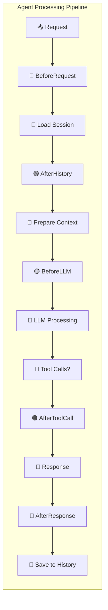
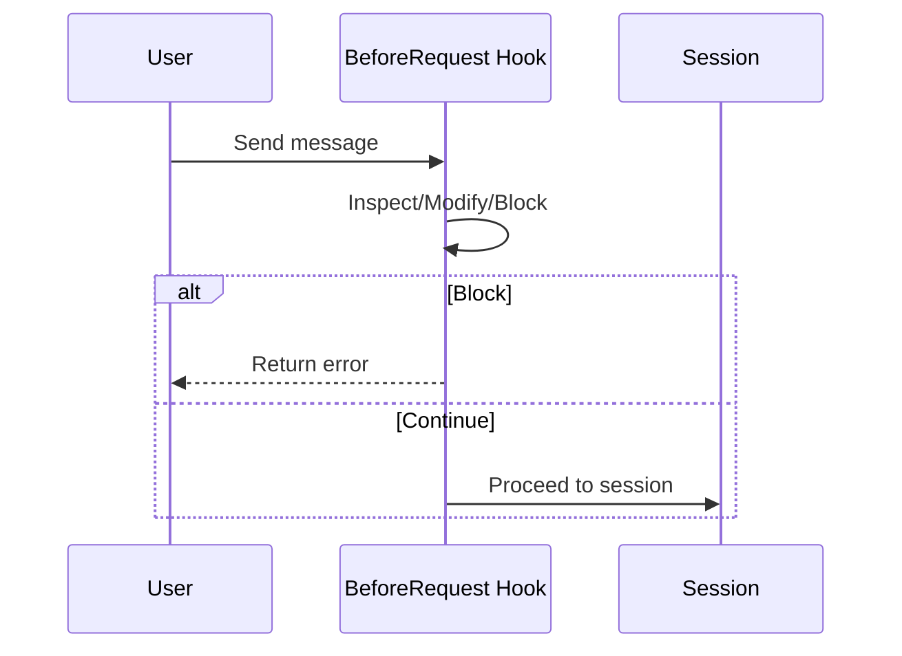
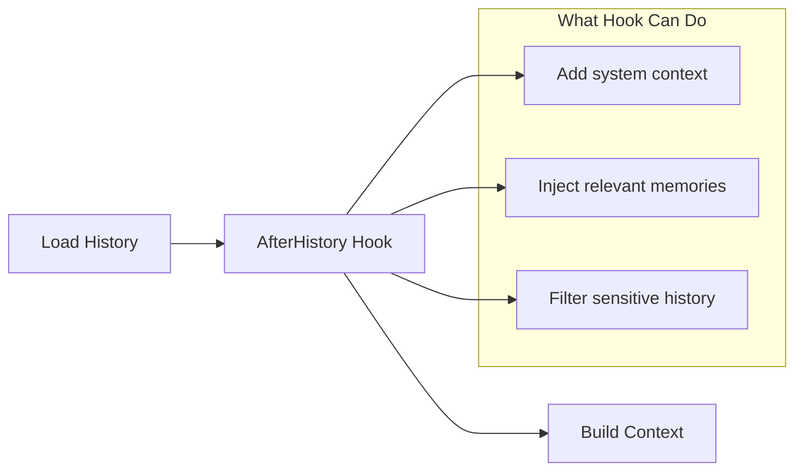
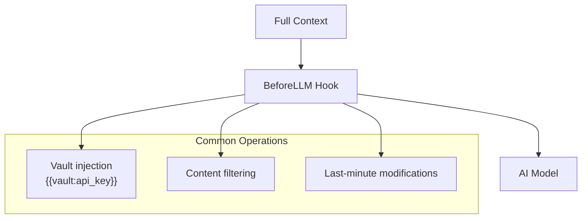
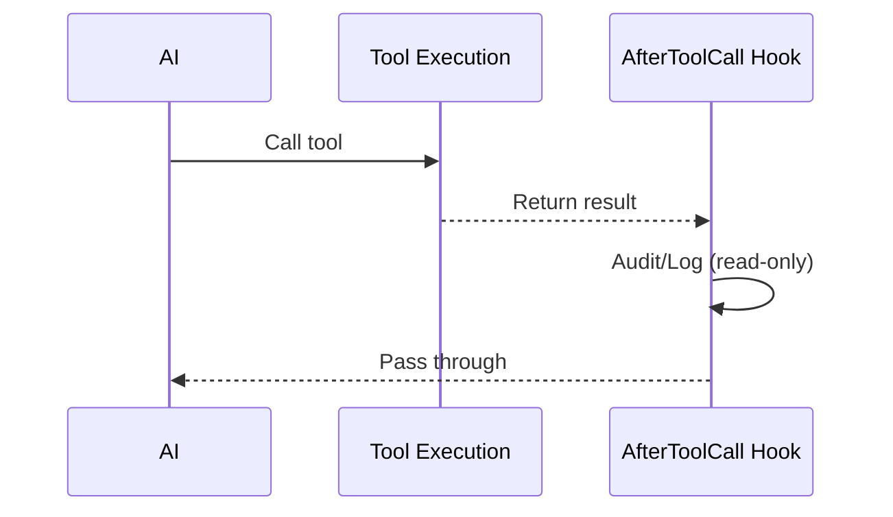
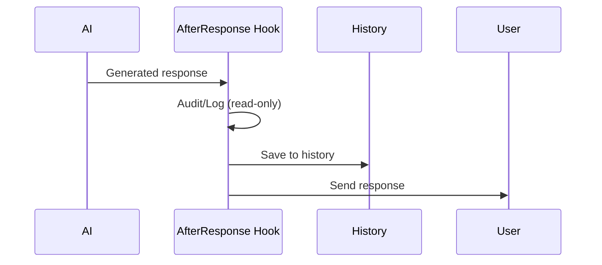
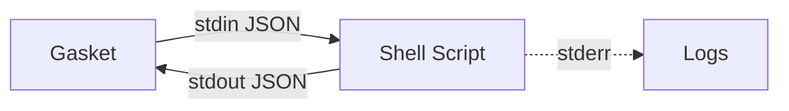
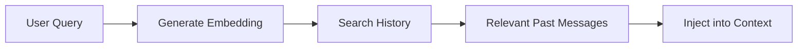
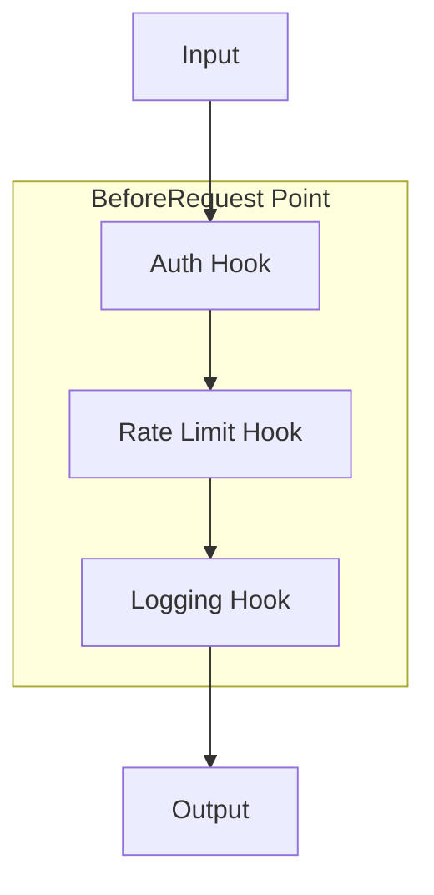

# Hooks System

> Checkpoints in the Factory

---

## One-Sentence Understanding

**Hooks are checkpoints in a factory assembly line** - they let you inspect or modify the work at specific stages.

> Analogy: Like quality control checkpoints in a factory where you can inspect, fix, or even stop the product if something is wrong.

---

## Why Do We Need Hooks?

```mermaid
flowchart TB
    subgraph Without["❌ Without Hooks"]
        In["Input"] --> Process["Processing"] --> Out["Output"]
        note right of Process "Black box - can't modify"
    end
    
    subgraph With["✅ With Hooks"]
        In2["Input"] --> H1["Hook 1"] --> H2["Hook 2"] --> Process2["Processing"] --> H3["Hook 3"] --> Out2["Output"]
        note right of H1 "Can modify/stop"
        note right of H2 "Can add context"
        note right of H3 "Can audit"
    end
```

Without hooks: Pipeline is a black box.
With hooks: You can extend behavior at key points.

---

## Five Hook Points



| Hook Point | When It Runs | Can Modify? | Can Stop? | Notes |
|------------|--------------|-------------|-----------|-------|
| **BeforeRequest** | First thing when request arrives | ✅ Yes | ✅ Yes | |
| **AfterHistory** | After loading conversation history | ✅ Yes | ❌ No | |
| **BeforeLLM** | Before sending to AI | ✅ Yes | ❌ No | |
| **AfterToolCall** | After tool execution | ❌ No (read-only) | ❌ No | Defined but not yet triggered in codebase |
| **AfterResponse** | After getting response | ❌ No (read-only) | ❌ No | |

---

## Hook Execution Strategies

```mermaid
flowchart TB
    subgraph Sequential["Sequential Strategy"]
        direction TB
        H1["Hook 1"] --> H2["Hook 2"] --> H3["Hook 3"]
        note right of H1 "Each waits for previous<br/>Can modify context"
    end
    
    subgraph Parallel["Parallel Strategy"]
        direction LR
        Input --> H1["Hook 1"]
        Input --> H2["Hook 2"]
        Input --> H3["Hook 3"]
        H1 --> Collect["Collect Results"]
        H2 --> Collect
        H3 --> Collect
        note right of Input "All run simultaneously<br/>Read-only access"
    end
```

| Strategy | Execution | Use Case |
|----------|-----------|----------|
| **Sequential** | One by one, ordered | Modifying context |
| **Parallel** | All at once | Auditing, logging |

---

## Hook Point Details

### 1. BeforeRequest

**When**: First checkpoint after receiving user input



**Use cases**:
- Authentication check
- Rate limiting
- Input validation
- Message modification

**Example**: Block messages from blocked users

---

### 2. AfterHistory

**When**: After loading conversation history from database



**Use cases**:
- Semantic memory recall
- Add relevant context from external sources
- Filter sensitive information

**Example**: Search knowledge base for relevant info

---

### 3. BeforeLLM

**When**: Final checkpoint before sending to AI



**Use cases**:
- Vault placeholder replacement
- Content safety check
- Prompt injection detection
- Final context adjustments

**Example**: Replace `{{vault:api_key}}` with actual API key

---

### 4. AfterToolCall

**When**: After tools execute, before AI sees results



**Characteristics**:
- 🔒 Read-only (can't modify)
- ⚡ Parallel execution
- 📝 For audit/logging

**Use cases**:
- Tool usage logging
- Security audit
- Cost tracking

---

### 5. AfterResponse

**When**: After AI generates response, before saving



**Characteristics**:
- 🔒 Read-only (can't modify response)
- ⚡ Parallel execution
- 📝 Final checkpoint

**Use cases**:
- Response logging
- Compliance checking
- Alert on sensitive content
- Usage analytics

---

## Built-in Hooks

### ExternalShellHook

Execute external shell scripts:



```bash
# ~/.gasket/hooks/pre_request.sh
#!/bin/bash

# Read input from stdin
read input

# Process (example: add timestamp)
echo "$input" | jq '.metadata.timestamp = now'
```

| Script | Runs At | Purpose |
|--------|---------|---------|
| `pre_request.sh` | BeforeRequest | Modify input, authentication |
| `post_response.sh` | AfterResponse | Logging, notifications |

**Limits**:
- 2 second timeout
- 1MB stdout limit
- Non-blocking execution

### VaultHook

Replaces placeholders with secrets:

```
Input:  "Use {{vault:api_key}} to call API"
        ↓
VaultHook injects
        ↓
Output: "Use sk-xxxxxx to call API"
```

Runs at **BeforeLLM** hook point.

### HistoryRecallHook

Semantic search for relevant past conversations:



Runs at **AfterHistory** hook point.

---

## Creating Custom Hooks

### Rust Hook Example

```rust
#[async_trait]
impl PipelineHook for MyHook {
    fn name(&self) -> &str {
        "my_custom_hook"
    }
    
    fn point(&self) -> HookPoint {
        HookPoint::BeforeRequest
    }
    
    async fn run(&self, ctx: &mut HookContext) -> HookResult {
        // Modify context
        ctx.metadata.insert("key".to_string(), "value".to_string());
        
        // Or abort
        if should_block(&ctx) {
            return HookResult::Abort("Blocked".to_string());
        }
        
        HookResult::Continue
    }
}
```

### Shell Hook Example

```bash
#!/bin/bash
# ~/.gasket/hooks/pre_request.sh

# Read JSON from stdin
read -r input

# Parse and modify
modified=$(echo "$input" | jq '.messages[0].content |= "[Processed] " + .')

# Output modified JSON
echo "$modified"
```

---

## Hook Registry

Multiple hooks can be registered at the same point:



Execution order:
1. Registration order for sequential hooks
2. All parallel hooks run simultaneously

---

## Hook Context

Data passed to hooks:

```rust
struct HookContext {
    session_key: SessionKey,      // Who is chatting
    messages: Vec<ChatMessage>,   // Conversation
    user_input: Option<String>,   // Raw input
    response: Option<String>,     // AI response (if available)
    tool_calls: Option<Vec<ToolCallInfo>>, // Tool calls made
    token_usage: Option<TokenUsage>,       // Token usage stats
    vault_values: Vec<String>,    // Secrets collected for redaction
}
```

---

## Best Practices

1. **Keep hooks fast**: Slow hooks block the pipeline
2. **Fail gracefully**: Hooks shouldn't crash the system
3. **Log actions**: For debugging and audit
4. **Test thoroughly**: Hooks can break the pipeline

---

## Related Modules

- **Session**: Integrates hooks into the pipeline
- **Vault**: Secret management often used in hooks
- **Tools**: Can be triggered by hooks
