# 钩子系统 (Hooks)

> 在关键时刻插一脚——扩展 AI 行为的插件系统

---

## 一句话理解

Hooks 是 AI 对话流程中的**检查站**，可以在关键时刻插入自定义逻辑：修改输入、拦截请求、记录日志、发送通知...

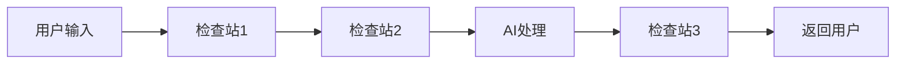

---

## 生活中的类比

想象一个工厂的生产线：

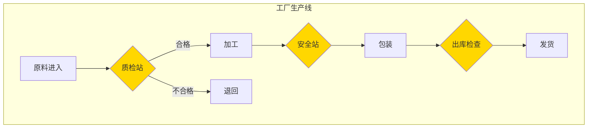

| 工厂检查站 | Hooks 对应 |
|-----------|-----------|
| 原料质检 | 检查用户输入是否合法 |
| 安全监控 | 敏感信息处理 |
| 出库检查 | 记录日志、发送通知 |

---

## 五个关键时刻（Hook 点）

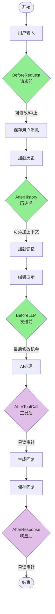

### Hook 点详解

| Hook 点 | 时机 | 能做什么 | 执行方式 |
|---------|------|---------|---------|
| **BeforeRequest** | 收到请求后 | 修改输入、拦截请求 | 顺序执行 |
| **AfterHistory** | 加载历史后 | 添加上下文 | 顺序执行 |
| **BeforeLLM** | 发送给AI前 | 最后修改（如密钥注入） | 顺序执行 |
| **AfterToolCall** | 工具调用后 | 审计、记录 | 并行执行 |
| **AfterResponse** | 生成回复后 | 日志、通知 | 并行执行 |

```mermaid
graph TB
    subgraph 顺序执行<br/>可修改上下文
        S1[BeforeRequest]
        S2[AfterHistory]
        S3[BeforeLLM]
    end
    
    subgraph 并行执行<br/>只读审计
        P1[AfterToolCall]
        P2[AfterResponse]
    end
    
    S1 -->|可修改/中止| Next1[下一步]
    S2 -->|可修改| Next2[下一步]
    S3 -->|可修改| Next3[下一步]
    
    P1 -.->|并行触发| Audit1[审计日志]
    P1 -.->|并行触发| Notify1[发送通知]
    
    P2 -.->|并行触发| Audit2[审计日志]
    P2 -.->|并行触发| Notify2[发送消息]
    
    style S1 fill:#C8E6C9
    style S2 fill:#C8E6C9
    style S3 fill:#C8E6C9
    style P1 fill:#E1BEE7
    style P2 fill:#E1BEE7
```

---

## 钩子能做什么

### 1. 修改输入（BeforeRequest）

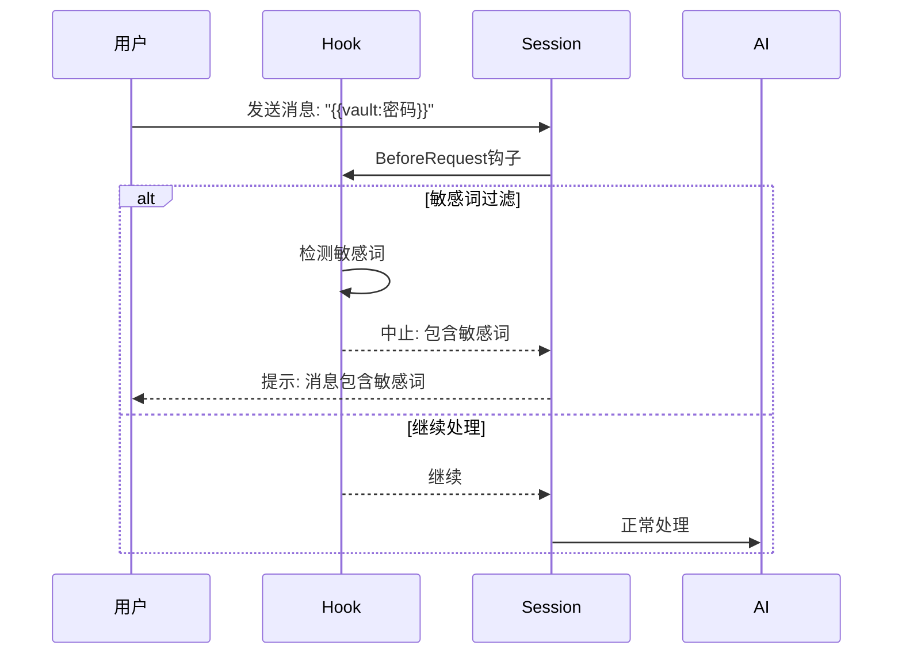

**应用场景：**
- 敏感词过滤
- 输入格式化
- 权限检查

### 2. 密钥注入（BeforeLLM）

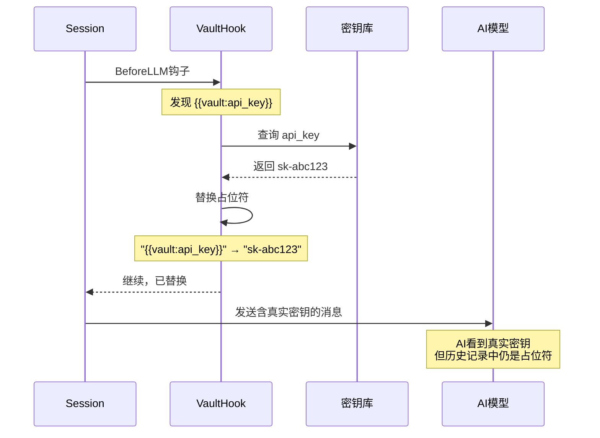

**应用场景：**
- API 密钥注入
- 数据库密码注入
- 任何敏感数据替换

### 3. 审计日志（AfterResponse）

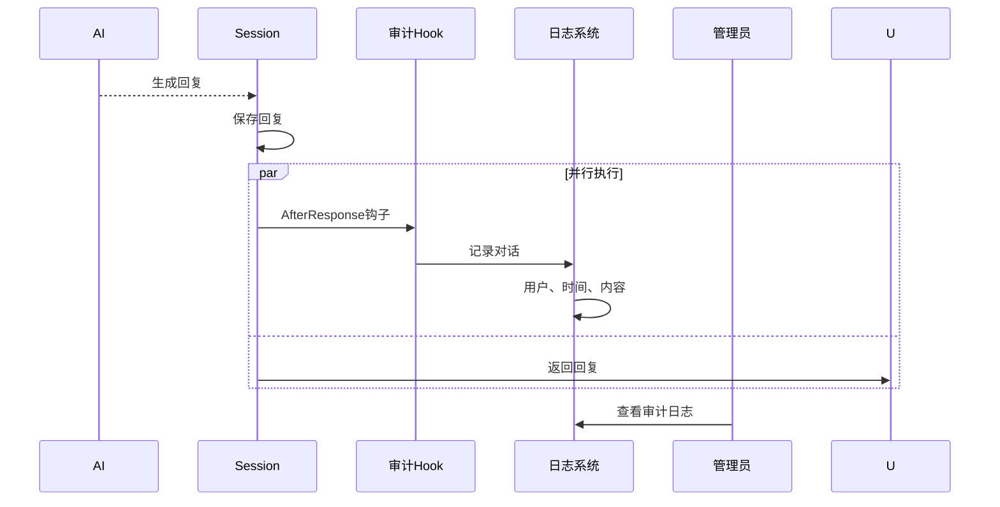

**应用场景：**
- 记录所有对话
- 合规审计
- 安全监控

### 4. 发送通知（AfterResponse）

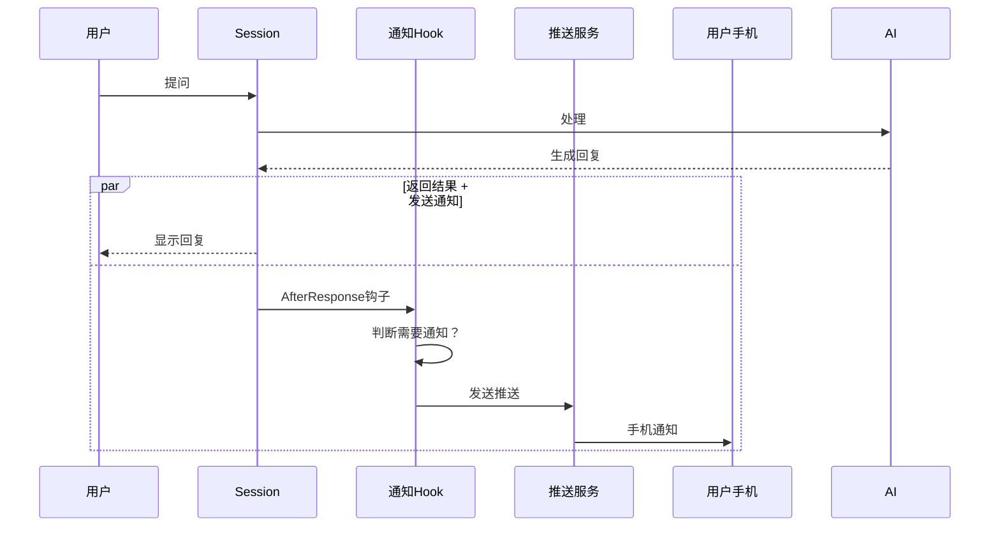

**应用场景：**
- 长任务完成通知
- 重要消息提醒
- 多渠道同步

---

## 钩子的执行策略

### 顺序执行（可修改）

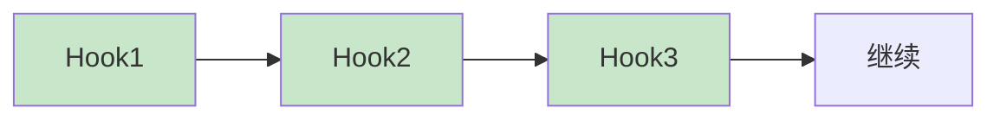

- 一个接着一个执行
- 可以修改上下文
- 可以中止流程
- 用于：BeforeRequest、AfterHistory、BeforeLLM

### 并行执行（只读）

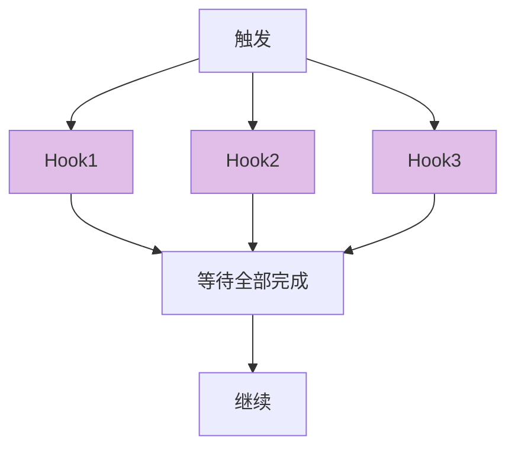

- 同时执行多个钩子
- 只能读取，不能修改
- 不阻塞主流程
- 用于：AfterToolCall、AfterResponse

---

## 钩子的动作

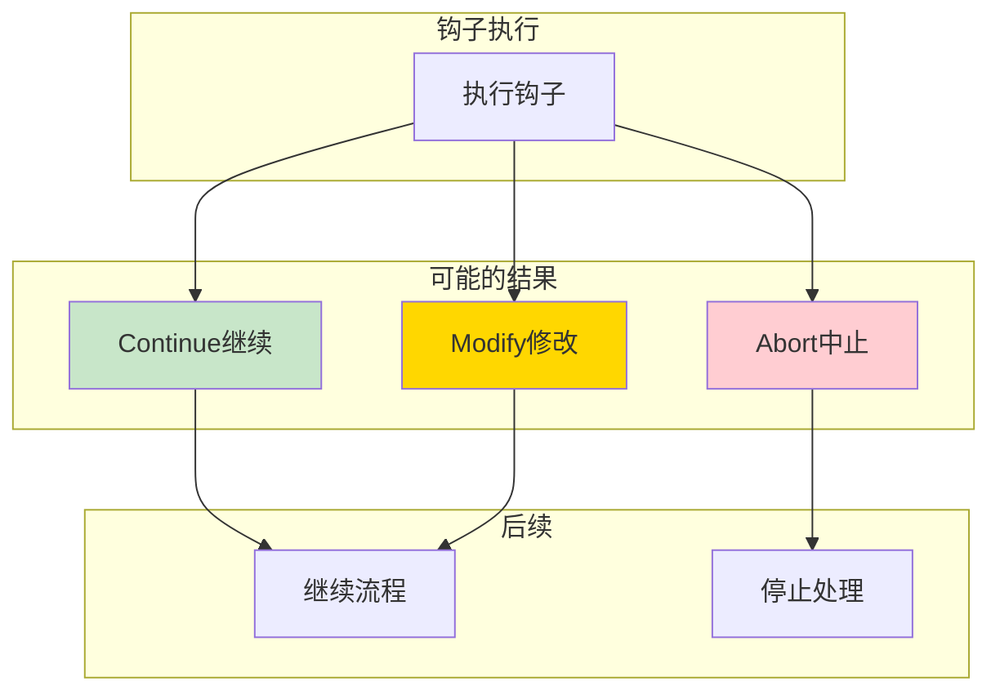

| 动作 | 说明 | 使用场景 |
|------|------|---------|
| **Continue** | 继续执行 | 一切正常 |
| **Modify** | 修改后继续 | 格式化输入、注入数据 |
| **Abort** | 中止流程 | 非法输入、权限不足 |

---

## 内置钩子实现

### VaultHook - 密钥注入

```mermaid
flowchart TB
    Input[用户消息含<br/>{{vault:api_key}}]
    
    subgraph VaultHook
        Scan[扫描占位符]
        Query[查询密钥库]
        Replace[替换为真实值]
        Record[记录使用的值]
    end
    
    Output[发送给AI<br/>含真实密钥]
    History[保存到历史<br/>仍是占位符]
    
    Input --> Scan
    Scan --> Query
    Query --> Replace
    Replace --> Record
    Record --> Output
    Record --> History
    
    style Output fill:#C8E6C9
    style History fill:#E3F2FD
```

**作用**：在最后一刻把 `{{vault:api_key}}` 替换成真实的密钥，AI 能正常使用，但历史记录里保存的还是占位符，保护敏感信息。

### ExternalShellHook - 外部脚本

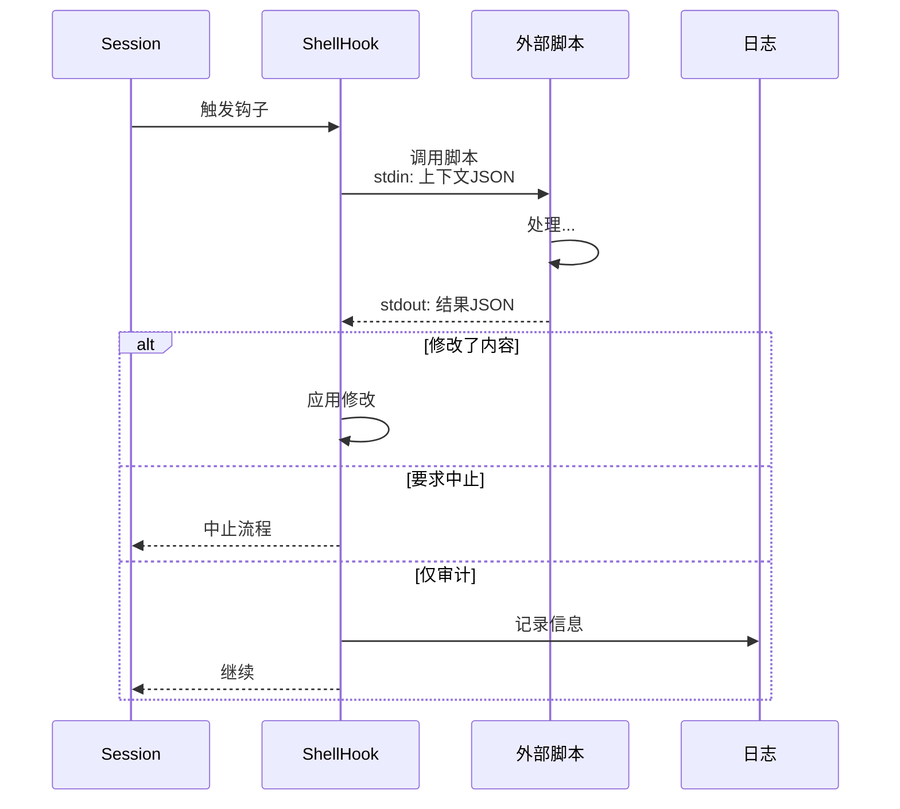

**作用**：调用外部脚本（Shell/Python 等），让开发者能用任何语言扩展功能。

### HistoryRecallHook - 历史召回

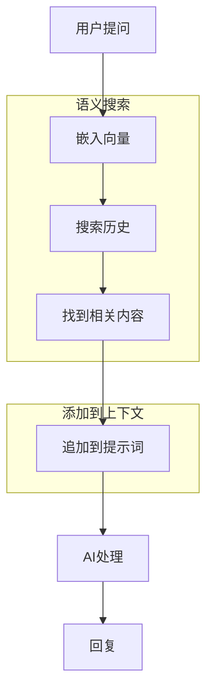

**作用**：根据用户问题，自动从历史中找到相关对话，追加到当前上下文，让 AI "想起"之前聊过的相关内容。

---

## 钩子注册表

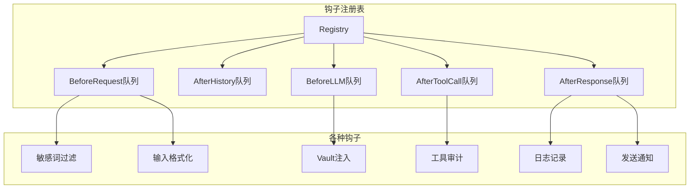

---

## 完整流程示例

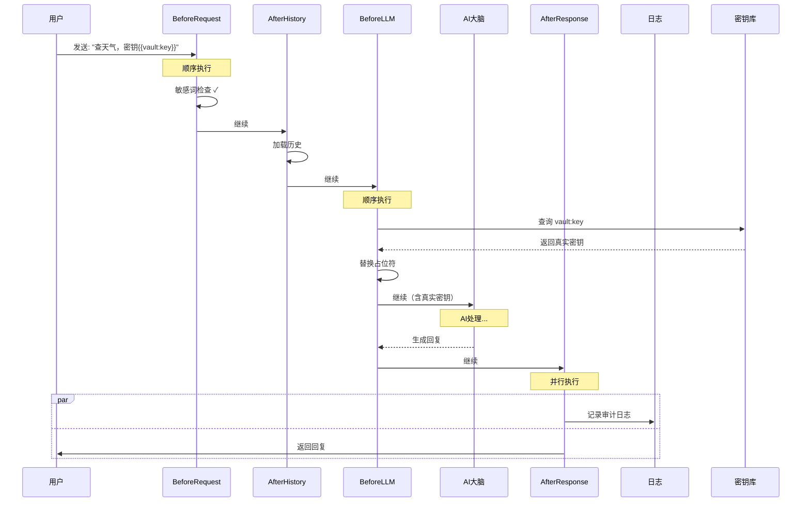

---

## 如何使用钩子

### 1. 配置 Vault 注入

创建 `~/.gasket/vault/secrets.json`：
```json
{
  "api_key": "sk-abc123",
  "db_password": "secret456"
}
```

使用时在消息中写：
```
请用 {{vault:api_key}} 调用 API
```

### 2. 添加外部脚本钩子

创建 `~/.gasket/hooks/pre_request.sh`：
```bash
#!/bin/bash
# 读取输入JSON
read -r input

# 检查敏感词
if echo "$input" | grep -q "敏感词"; then
    echo '{"abort": true, "message": "包含敏感词"}'
else
    echo '{"abort": false}'
fi
```

### 3. 编程方式注册钩子

```rust
// 创建钩子注册表
let registry = HookBuilder::new()
    .with_hook(Arc::new(VaultHook::new(vault)))
    .with_hook(Arc::new(LoggingHook::new()))
    .build_shared();

// 在 Session 中使用
let session = AgentSession::new(...)
    .with_hooks(registry);
```

---

## 常见问题

**Q: 钩子和工具有什么区别？**
A: 钩子是在特定时机自动触发的，用户无感知；工具是 AI 主动调用的，需要 AI 决定使用哪个工具。

**Q: 钩子执行失败会怎样？**
A: 顺序执行的钩子失败会中断流程；并行执行的钩子失败会被忽略，不影响主流程。

**Q: 可以有多少个钩子？**
A: 没有限制，每个 Hook 点可以有多个钩子，按注册顺序执行。

**Q: 钩子能访问哪些数据？**
A: 可以访问当前会话的所有上下文：用户输入、历史消息、工具调用、Token 使用等。

**Q: VaultHook 安全吗？**
A: 密钥只在发送给 AI 前一刻注入，历史记录中保存的是占位符，不会泄露真实密钥。
