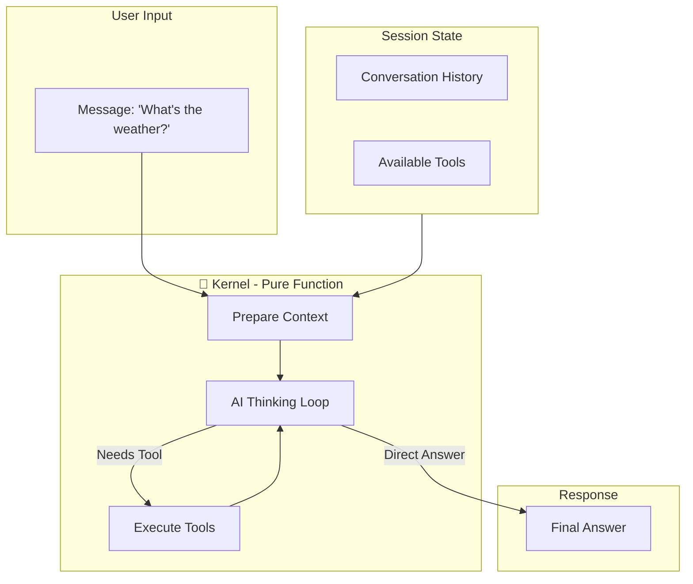
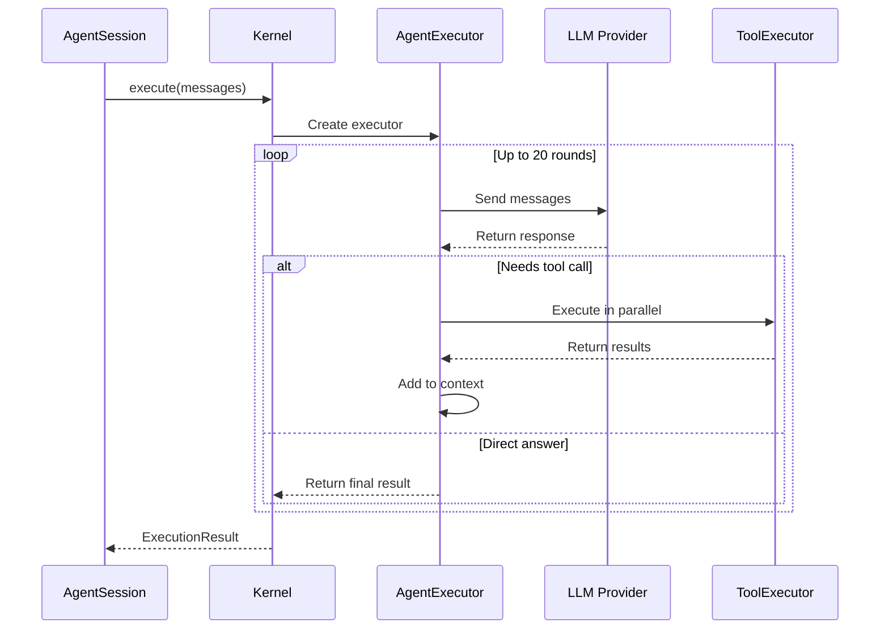
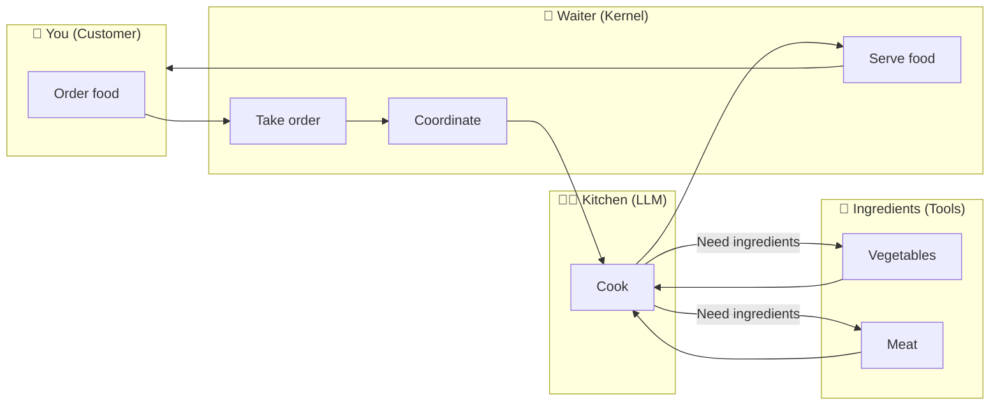
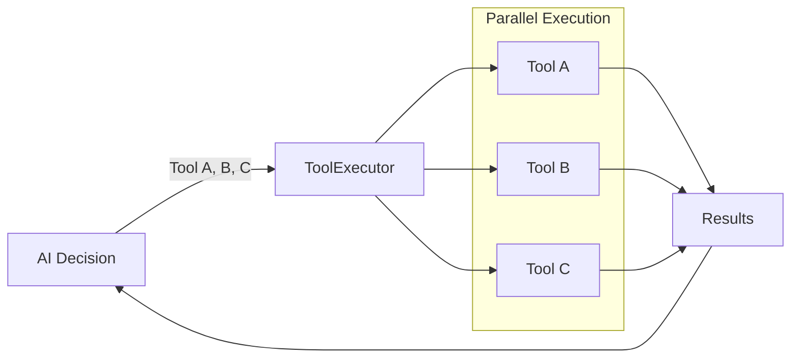
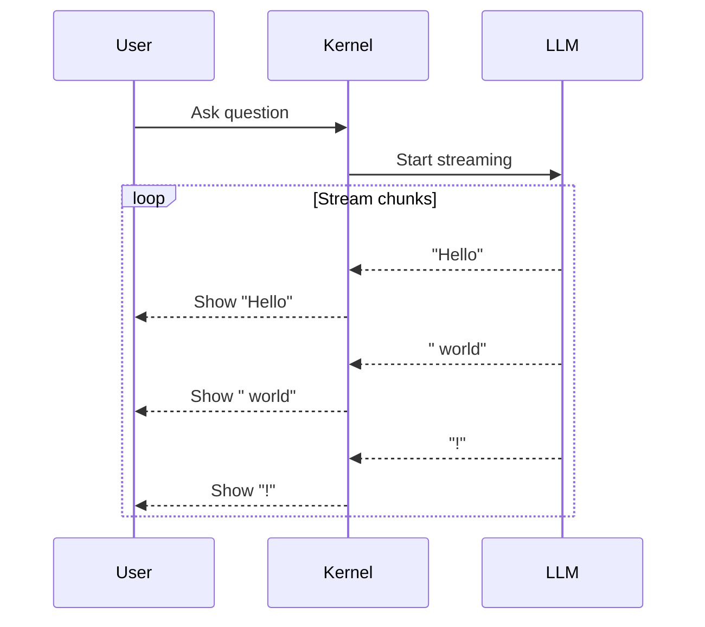

# Kernel Module

> The "Brain" of AI - Pure Function Execution Core

---

## One-Sentence Understanding

**Kernel is the AI's brain** - it only handles "thinking" and "acting", not "remembering".

> Analogy: Like a restaurant waiter who takes your order, brings it to the kitchen (AI model), and serves the food. The waiter doesn't cook, but coordinates everything.

---

## Core Concepts



---

## What Does "Pure Function" Mean?

In programming, a **pure function** means:

| Pure Function | Impure Function |
|---------------|-----------------|
| Same input → Same output | May produce different results |
| No side effects | Changes external state |
| Doesn't remember anything | Has memory/state |

**Kernel is pure** - it doesn't:
- ❌ Read/write database
- ❌ Access files
- ❌ Remember previous calls

**Kernel receives everything through parameters**:
- ✅ Messages (conversation history)
- ✅ Tools (what it can use)
- ✅ Configuration (how to behave)

> 💡 Why pure? Easier to test, debug, and scale!

---

## Core Execution Flow



### Execution Steps

1. **Receive Input**: Conversation history + available tools
2. **AI Thinking**: Send to LLM for reasoning
3. **Decision Point**:
   - If AI wants to use tools → Execute tools → Back to step 2
   - If AI gives direct answer → Return result
4. **Loop Control**: Maximum 20 rounds (prevents infinite loops)

---

## Restaurant Waiter Analogy



| Component | Restaurant | Gasket |
|-----------|-----------|--------|
| Customer | You | User |
| Waiter | Takes orders, coordinates | Kernel |
| Kitchen | Does the actual cooking | LLM (GPT/Claude/DeepSeek) |
| Ingredients | Raw materials | Tools (search, files, commands) |

---

## Key Components

### AgentExecutor

The "coordinator" that manages the AI thinking loop:

```rust
// Pseudo-code showing the logic
while iterations < max_iterations {
    // Ask AI what to do
    response = llm.chat(messages);
    
    if response.has_tool_calls() {
        // Execute tools in parallel
        results = execute_tools_parallel(response.tool_calls);
        messages.extend(results);
    } else {
        // Got final answer
        return response.content;
    }
}
```

### ToolExecutor

Executes tools in parallel for efficiency:



### RuntimeContext

Dependency injection container - all external dependencies go here:

| Dependency | Purpose |
|------------|---------|
| `llm_provider` | Which AI model to use |
| `tool_registry` | What tools are available |
| `config` | Temperature, max_tokens, etc. |

---

## Streaming Output

When AI is "thinking", you can see it in real-time:



This is like watching someone type live instead of waiting for the entire message.

---

## Error Handling

```mermaid
flowchart TB
    Start["Start Execution"] --> Try{"Try"}
    
    Try -->|Success| Normal["Normal Flow"]
    Try -->|LLM Error| Retry{"Retry?"}
    Try -->|Tool Error| ToolErr["Tool Returns Error"]
    
    Retry -->|Yes (< 3 times)| Backoff["Exponential Backoff"]
    Backoff --> Try
    Retry -->|No| Fail["Return Error"]
    
    ToolErr --> AI["AI Sees Error"]
    AI -->|May retry or explain| Normal
    
    Normal --> Success["Success"]
```

---

## Pure Function Benefits

1. **Testability**: Same input always produces same output
2. **Debuggability**: No hidden state to worry about
3. **Concurrency**: Multiple kernels can run in parallel safely
4. **Reliability**: Stateless means no memory leaks or corruption

---

## Related Modules

- **Session**: Manages state (history, memory) - the "butler"
- **Tools**: What Kernel can use - the "hands and feet"
- **Providers**: Different AI models - different "kitchens"
