# AI 大脑核心 (Kernel)

> AI 是如何思考和回复的？—— 决策中枢详解

---

## 一句话理解

Kernel 是 AI 的**大脑**，负责接收信息、思考问题、调用工具、给出回答。

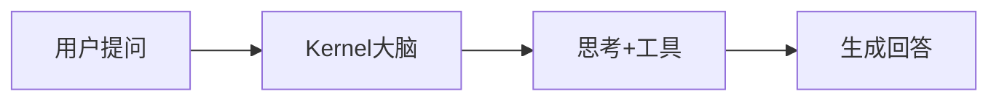

---

## 用餐厅服务员类比

想象 Kernel 是一个超级服务员：

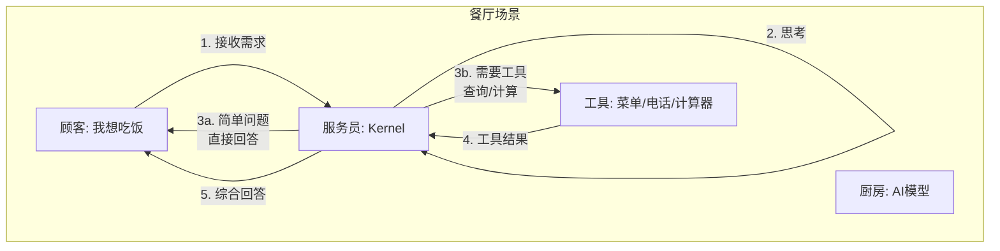

| 餐厅 | AI系统 |
|------|--------|
| 顾客 | 用户 |
| 服务员 (接收需求、协调) | **Kernel** |
| 厨房 (真正做饭) | AI模型 (GPT/Claude等) |
| 菜单/电话/计算器 | 工具 (搜索/文件/执行命令) |

---

## Kernel 的核心工作流

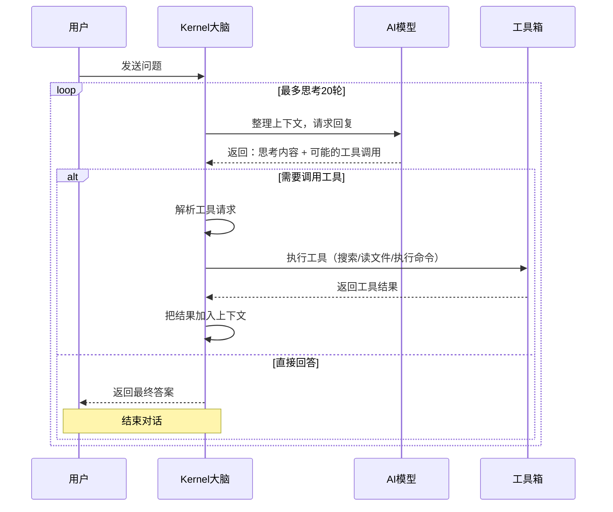

---

## 思考循环详解

Kernel 使用**迭代思考**的方式工作，就像一个侦探不断收集线索：

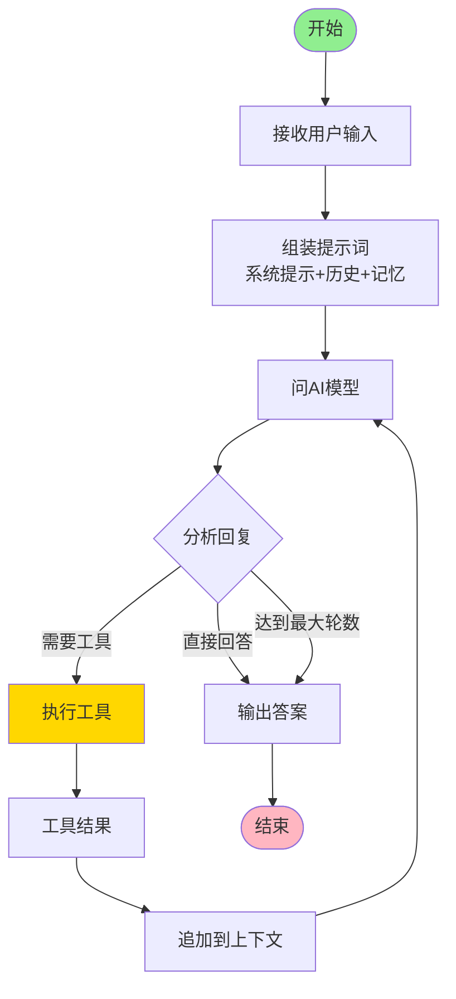

### 举例说明

**用户问："今天北京的天气怎么样？"**

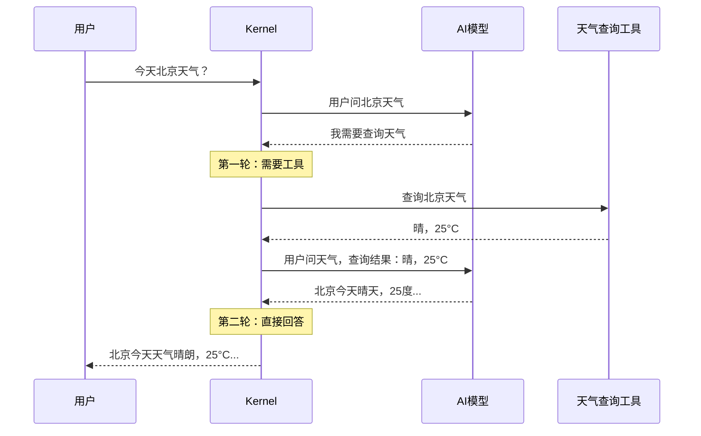

---

## 核心组件

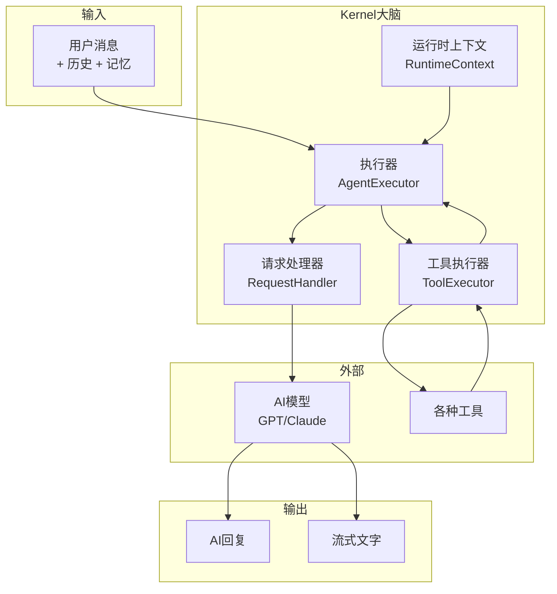

### 1. 执行器 (AgentExecutor)

**职责**：协调整个思考过程

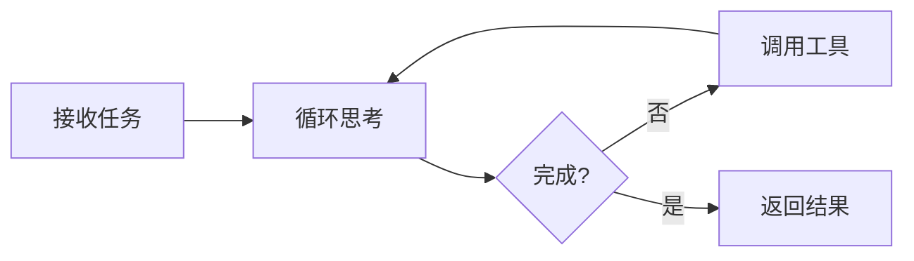

### 2. 工具执行器 (ToolExecutor)

**职责**：并行执行多个工具

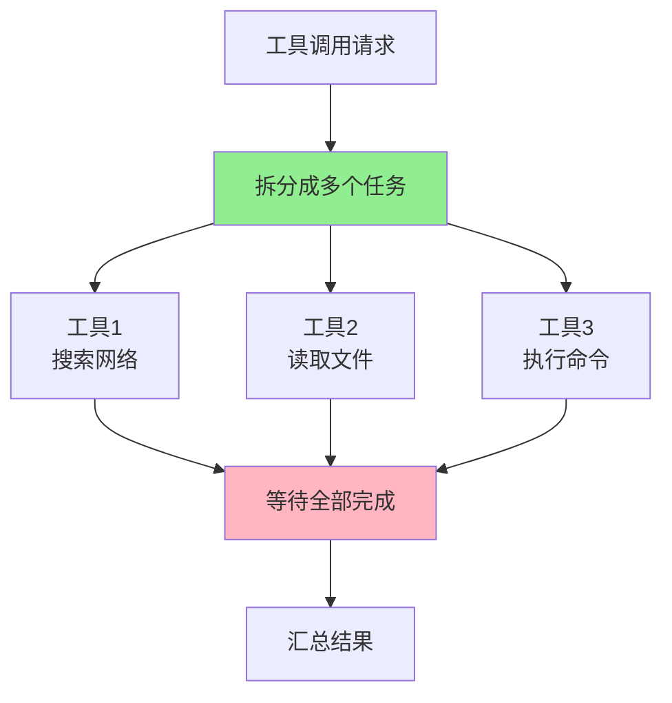

### 3. 运行时上下文 (RuntimeContext)

**职责**：依赖注入容器，承载所有外部依赖

| 依赖 | 用途 |
|------|------|
| `llm_provider` | 使用哪个 AI 模型 |
| `tool_registry` | 有哪些可用工具 |
| `config` | 温度、max_tokens 等参数 |

---

## 数据流动全景图

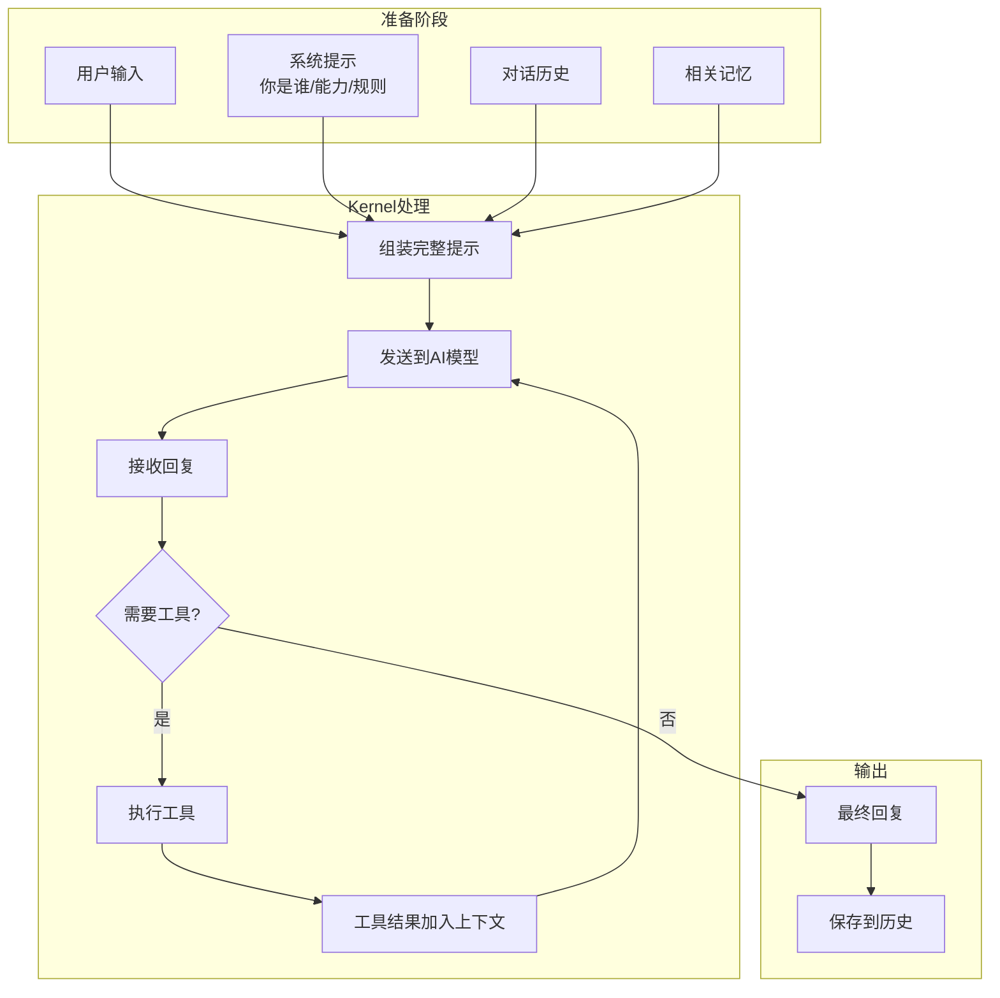

---

## 关键特性

### 1. 纯函数设计

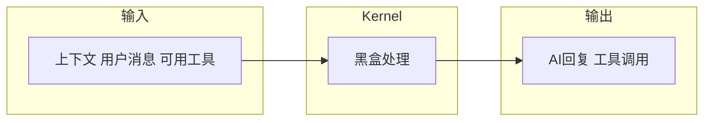

**好处**：
- 容易测试
- 可预测
- 方便重试

**自动重退避策略**：`backoff = (1 << retries).min(15)` 秒
- 第1次重试：2秒
- 第2次重试：4秒
- 第3次重试：8秒
- 上限：15秒
- 最大重试次数：3次（`DEFAULT_MAX_RETRIES = 3`）

### 2. 自动重试

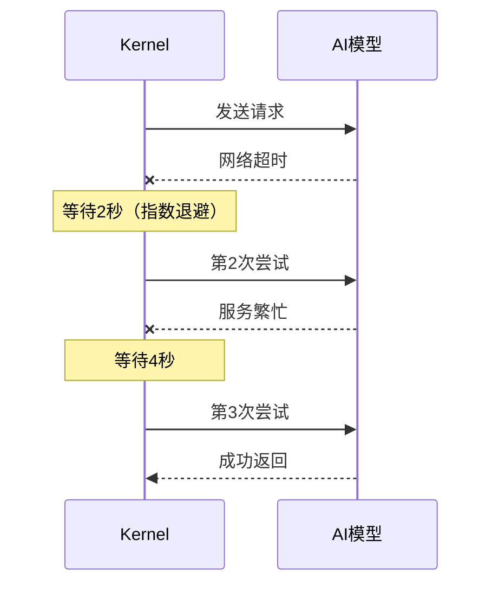

### 3. 最大轮数保护

防止 AI "陷入沉思" 无限循环：

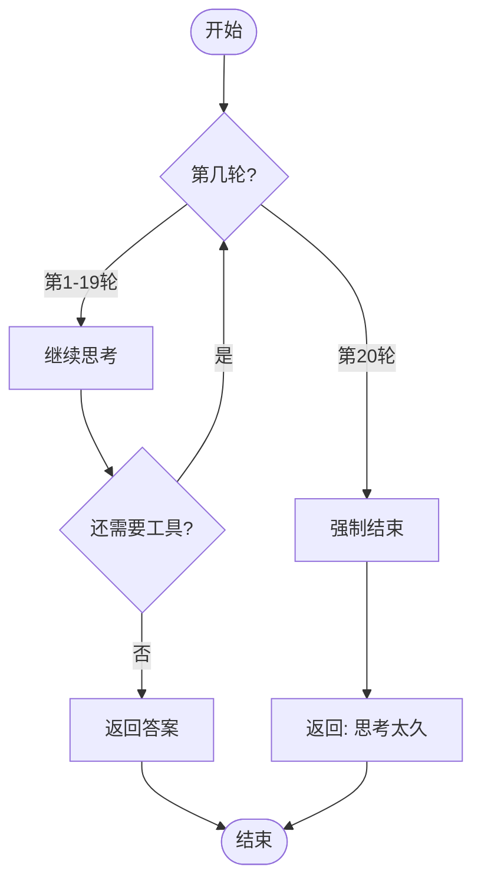

---

## 实际使用场景

### 场景1：简单问答

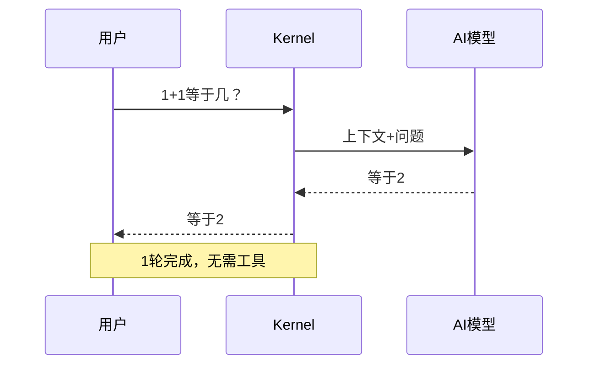

### 场景2：需要查资料

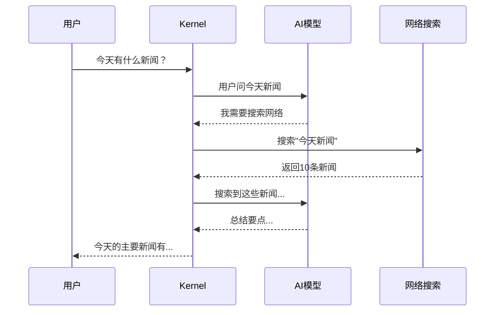

### 场景3：多工具协作

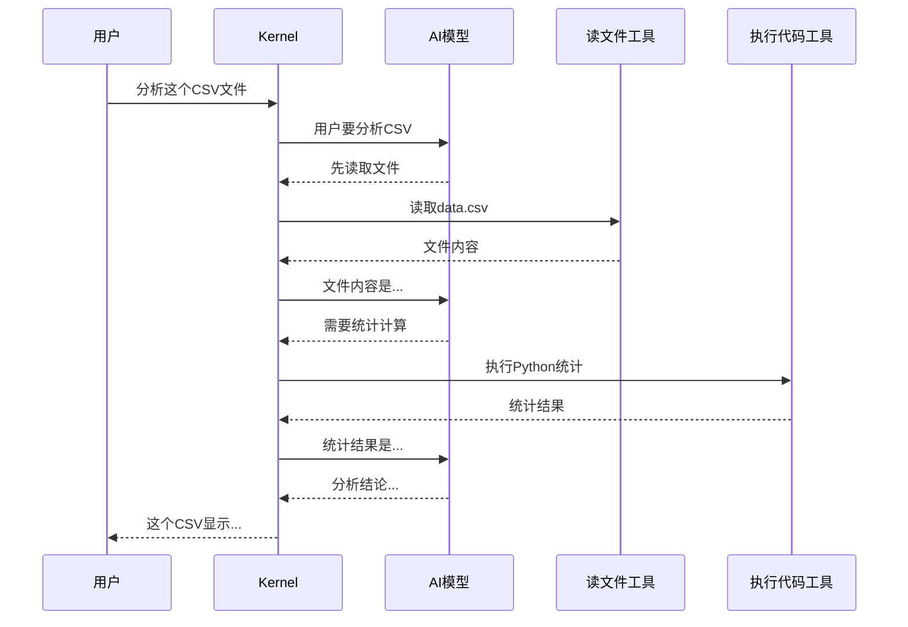

---

## Kernel vs Session 的关系

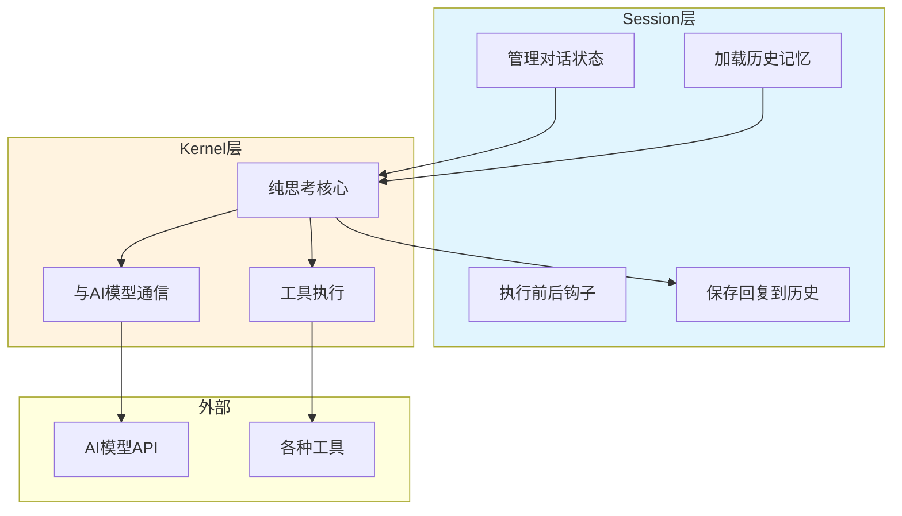

**比喻**：
- **Session** = 餐厅经理（接待客人、安排座位、记录订单、处理投诉）
- **Kernel** = 厨师（专心做菜，不管其他杂事）

---

## 常见问题

**Q: Kernel 和 AI 模型是什么关系？**
A: Kernel 是"大脑指挥官"，AI 模型是"思考引擎"。Kernel 负责组织信息、决定什么时候用工具、什么时候给用户回复，AI 模型负责真正的语言理解和生成。

**Q: 为什么需要多轮思考？**
A: 就像人思考问题一样，有时候需要查资料、计算、对比，AI 也需要多步推理才能给出完整答案。

**Q: 流式输出是什么意思？**
A: 就像看人打字一样，AI 生成一个字就显示一个字，不用等整段话都生成完。这样用户体验更好。

**Q: 工具执行失败怎么办？**
A: Kernel 会捕获错误信息，告诉 AI 模型工具失败了，AI 会根据情况重试或换一种方式回答。
