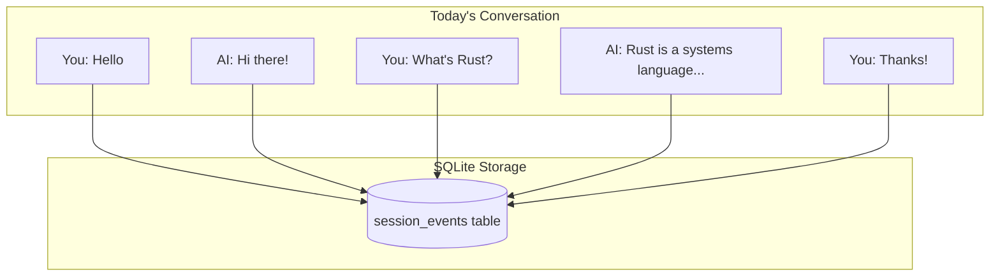
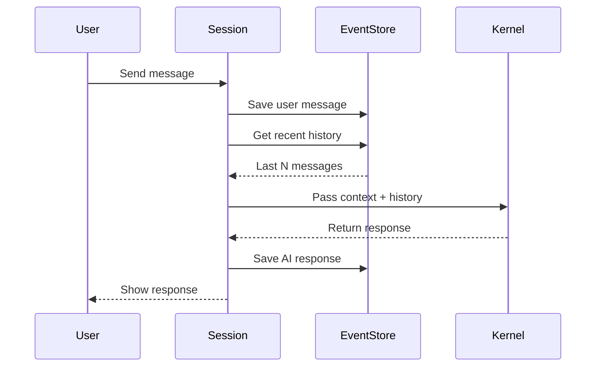
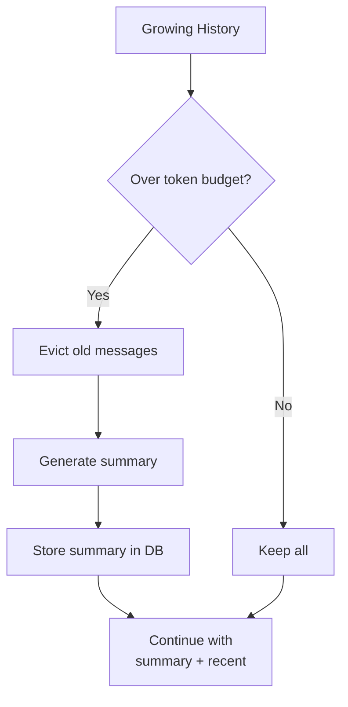
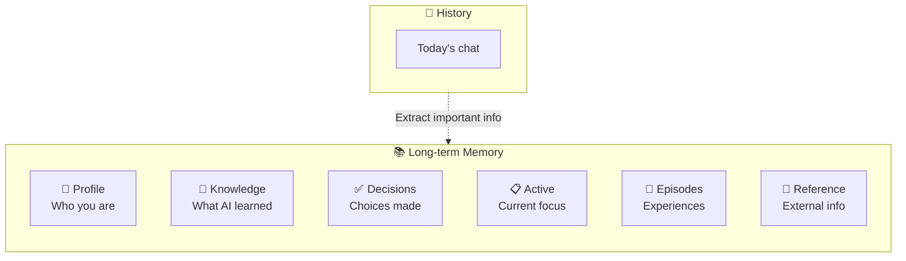
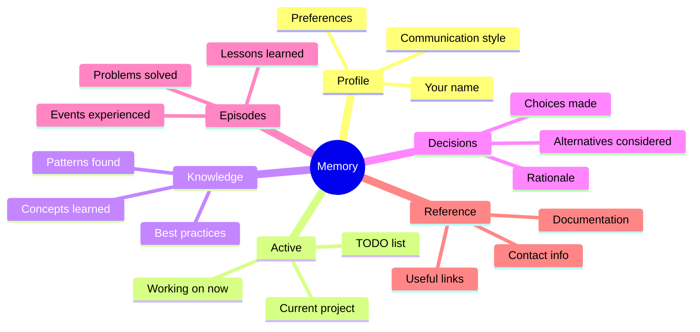
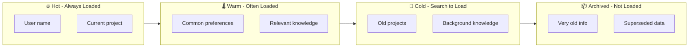
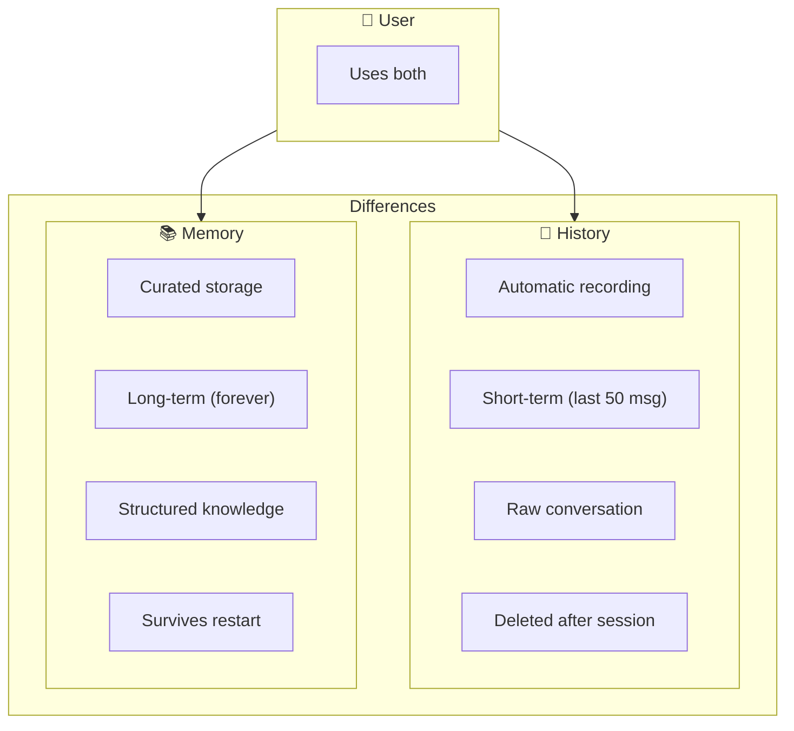
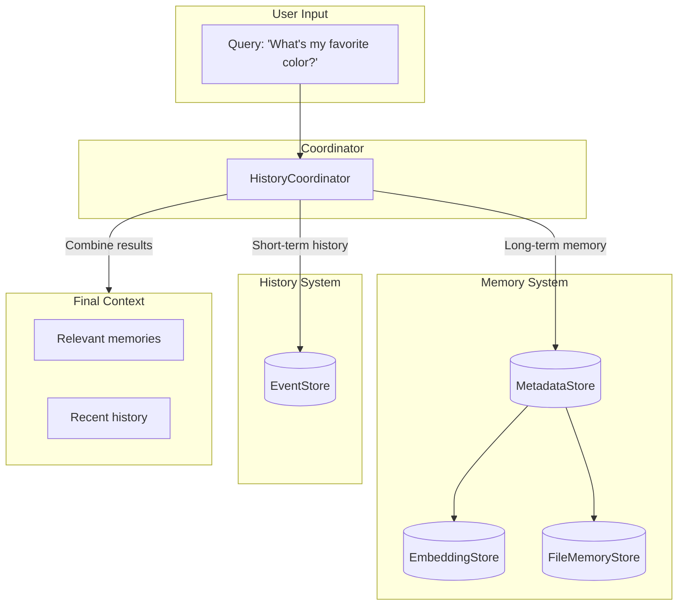

# Memory & History System

> AI's Brain Memory vs Conversation Notebook

---

## One-Sentence Understanding

- **Memory** = Long-term knowledge base (user preferences, learned notes)
- **History** = Short-term conversation log (chat records)

> Analogy: Memory is like a filing cabinet with organized folders. History is like a notebook you carry around for today's meetings.

---

## History System (Short-term Memory)

### What is History?



**History is the conversation transcript** - every message sent back and forth.

### Why Do We Need History?

| Without History | With History |
|-----------------|--------------|
| "What's my name?" → "I don't know" | "What's my name?" → "You're Alice!" |
| Each message is isolated | Context flows naturally |
| Can't reference earlier | "As you mentioned earlier..." |

### History Data Flow



### What If History Gets Too Long?



Like a notebook getting full - tear out old pages, keep a summary, continue writing.

---

## Memory System (Long-term Memory)

### What is Memory?

Unlike history (automatic recording), **memory is curated knowledge**:



### Six Drawers of Memory



| Drawer | Purpose | Example |
|--------|---------|---------|
| Profile | Who you are | "User is a Rust developer, prefers concise answers" |
| Active | Current work | "Working on Project X, deadline next Friday" |
| Knowledge | Learned facts | "Rust uses ownership instead of GC" |
| Decisions | Past choices | "Chose SQLite over PostgreSQL for simplicity" |
| Episodes | Experiences | "Debugged a tricky async bug on 2024-01-15" |
| Reference | External info | "API docs: https://..." |

### Memory Temperature



| Temperature | Load Strategy | Access Frequency |
|-------------|---------------|------------------|
| Hot | Always in context | Every conversation |
| Warm | If topic matches | Often |
| Cold | Search to find | Rarely |
| Archived | Not loaded unless asked | Almost never |

### Three-Phase Memory Loading

```mermaid
flowchart TB
    subgraph Phase1["Phase 1: Bootstrap (~700 tokens)"]
        P1[Load all Profile]
        P2[Load Active (hot only)]
    end
    
    subgraph Phase2["Phase 2: Scenario-aware (~1500 tokens)"]
        S1[Query hot items]
        S2[Query warm items<br/>with tag matching]
    end
    
    subgraph Phase3["Phase 3: On-demand (~1000 tokens)"]
        O1[Semantic search]
        O2[Load top results]
    end
    
    Phase1 --> Phase2 --> Phase3
    
    style Phase1 fill:#90EE90
    style Phase2 fill:#FFD700
    style Phase3 fill:#FFB6C1
```

1. **Bootstrap** (must have): Profile + current focus
2. **Scenario-aware** (likely relevant): Topic-matched memories
3. **On-demand** (search for): Specific query matching

**Hard limit**: 3200 tokens total

---

## Memory vs History: Complete Comparison



| Aspect | History | Memory |
|--------|---------|--------|
| **What** | Conversation log | Curated knowledge |
| **When** | Automatic | Extracted/created manually |
| **How long** | Recent only | Forever |
| **Format** | Raw messages | Structured files |
| **Storage** | SQLite | Markdown files |
| **Persistence** | Session only | Permanent |
| **Growth** | Linear (every message) | Curated (important only) |

---

## Data Flow Panorama



---

## Practical Scenarios

### Scenario 1: Remember User's Name

```
User: I'm Alice

[Session saves to History]
[AI extracts to Memory - Profile]

--- Next conversation ---

User: What's my name?
Session: [Loads Profile from Memory]
AI: You're Alice!
```

### Scenario 2: Continue Cross-Session Project

```
Session 1:
User: Working on Project X using Rust
[Saved to Active memory]

Session 2 (next day):
User: Any progress?
Session: [Loads Active memory]
AI: Last time we were working on Project X in Rust...
```

### Scenario 3: Smart Knowledge Recall

```
User: How do I handle errors in Rust?

Session: 
  1. [Semantic search Memory - Knowledge]
  2. [Found: "Rust error handling patterns"]
  3. [Load into context]

AI: Based on what we discussed before about Rust...
```

---

## FAQ

**Q: Will AI remember everything I say?**
A: No. History remembers recent conversations. Only important information is extracted to long-term Memory.

**Q: How do I make AI remember something?**
A: Explicitly ask: "Remember that I prefer dark mode" or edit `~/.gasket/memory/profile/preferences.md` directly.

**Q: Can I delete memories?**
A: Yes. Delete the corresponding `.md` file in `~/.gasket/memory/`.

**Q: Where is data stored?**
A: History in `~/.gasket/gasket.db` (SQLite), Memory in `~/.gasket/memory/` (Markdown files).
