# 记忆与历史模块

> AI 是如何记住事情的？—— 记忆与历史系统详解

---

## 一句话理解

把 Gasket 想象成一个人：
- **历史** = 短期记忆（刚才说了什么）
- **记忆** = 长期记忆（你的名字、喜好、过去的约定）

---

## 历史系统（短期记忆）

### 是什么？

历史系统记录的是**当前这次对话**的内容。就像你和朋友聊天时，你会记得刚才说了什么，基于上文继续对话。

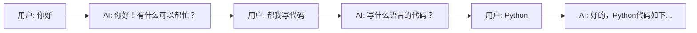

### 为什么需要历史？

没有历史，AI 每次回复都是独立的，无法连贯对话：

| 有历史 | 无历史 |
|--------|--------|
| 用户: 帮我写代码 | 用户: 帮我写代码 |
| AI: 写什么语言？ | AI: 好的，写什么代码？ |
| 用户: Python | 用户: Python |
| AI: 好的，Python代码... | AI: （不知道用户要什么代码）|

### 历史数据流

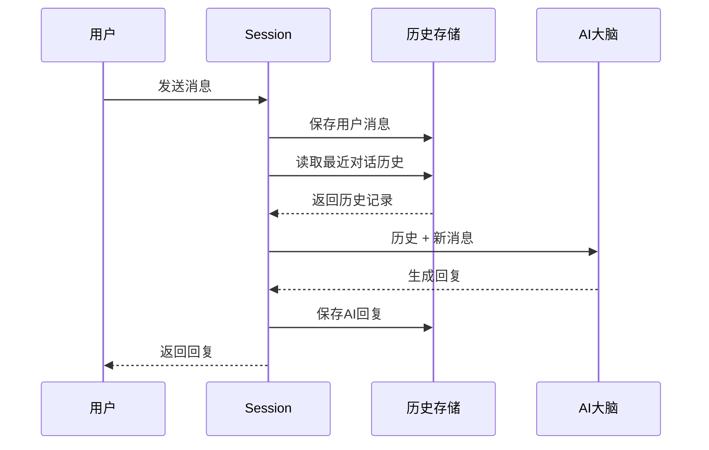

### 历史太多怎么办？

对话太长时，历史会占用大量空间。这时候需要**摘要压缩**：

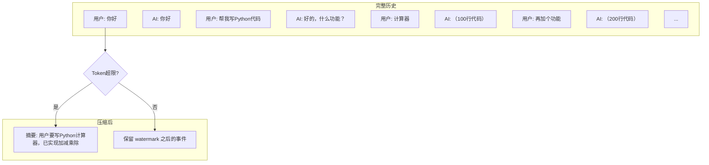

---

## 记忆系统（长期记忆）

### 是什么？

记忆系统存储的是**跨会话的知识**。比如：
- 用户的名字、职业
- 用户的代码风格偏好
- 之前项目的技术选型
- 用户喜欢的沟通方式

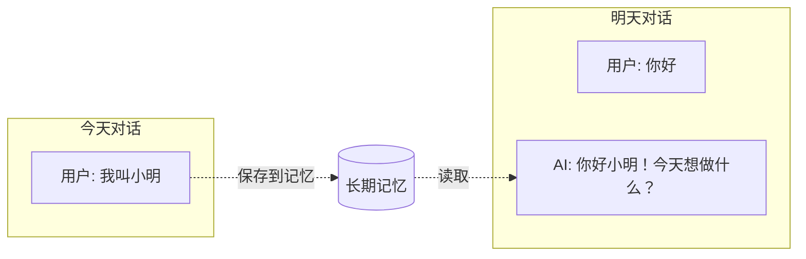

### 记忆的六个抽屉

记忆按用途分为六个场景（像六个抽屉）：

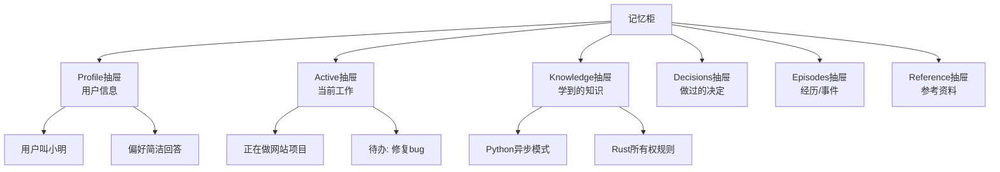

### 记忆的冷热分层

不是所有记忆都同等重要，系统会自动管理：

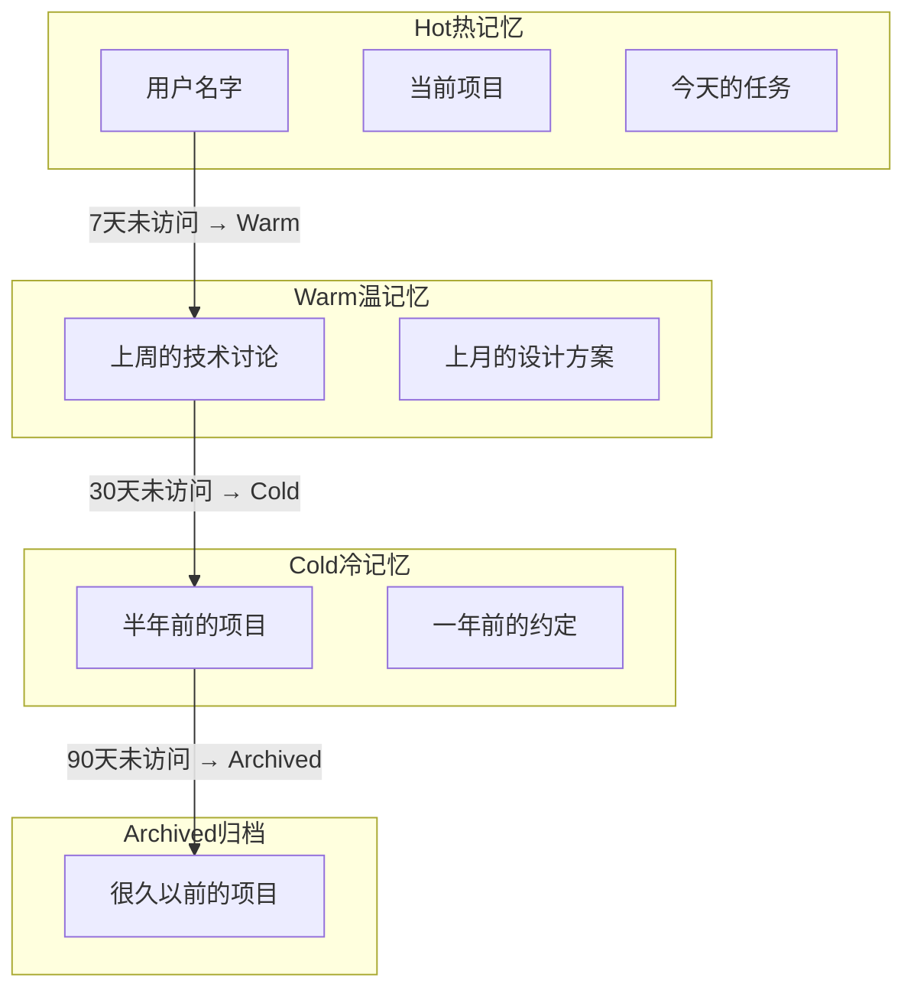

### 三阶段记忆加载

当用户提问时，系统分三个阶段查找记忆（总预算约 4000 tokens）：

| 阶段 | 预算 | 内容 | 加载策略 |
|------|------|------|---------|
| **Bootstrap** | ~1500 tokens | Profile + Active (Hot/Warm) | 必加载 |
| **Scenario** | ~1500 tokens | 当前场景 Hot + tag 匹配 | 条件加载 |
| **On-demand** | ~1000 tokens | 语义搜索补充 | 按需加载 |

排序优先级：**豁免场景优先** → **skill 类型优先** → **高频优先** → **相似度优先**

**加载结果以 User Message 注入**（而非追加到 System Prompt），这是为了保护 Anthropic 等平台的 Prompt Cache：System Prompt 在整个对话中保持不变，只有动态的 memory 内容作为 User Message 每轮变化。长会话可节省 90%+ 的 API 成本。

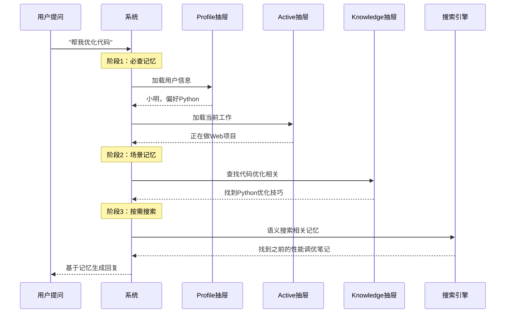

---

## 记忆的类型：Note vs Skill

记忆不仅按**场景**分类，还按**类型**区分用途：

| 类型 | 用途 | 示例 | 加载优先级 |
|------|------|------|-----------|
| **note** (默认) | 事实性知识 | 用户偏好、代码片段、项目信息 | 正常 |
| **skill** | 程序性知识 | 部署流程、调试步骤、SOP | **优先** |

**何时使用 skill 类型？**
- 内容包含明确的步骤（1. 2. 3.）
- 有陷阱提示和验证方法
- 是跨会话可复用的操作流程

调用 `memorize` 时，通过 `memory_type: "skill"` 标记。skill 类型的记忆在三阶段加载中会被优先排序。

---

## 记忆 vs 历史：完整对比

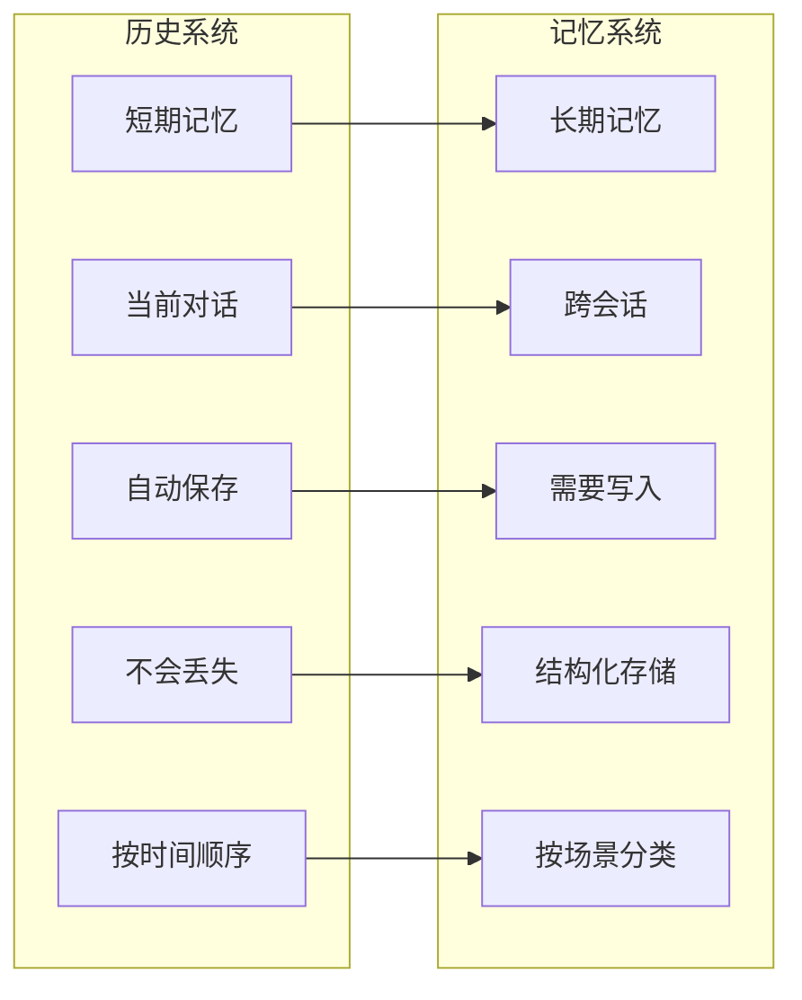

| 特性 | 历史 | 记忆 |
|------|------|------|
| **保存什么** | 对话内容 | 关键信息、知识、约定 |
| **保存多久** | 当前会话 | 永久 |
| **谁决定存** | 自动 | AI或用户决定 |
| **怎么存** | 按时间线 | 按场景分类 |
| **怎么用** | 直接拼接 | 智能匹配查询 |

---

## 数据流动全景图

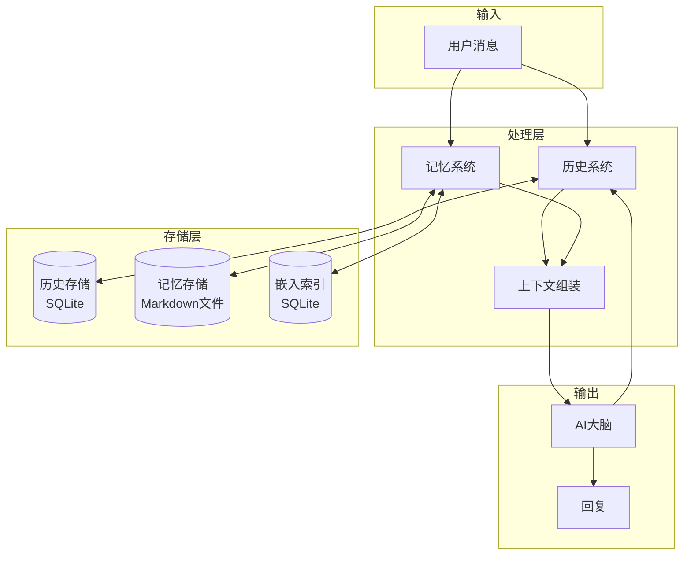

---

## 实际使用场景

### 场景1：记住用户名字

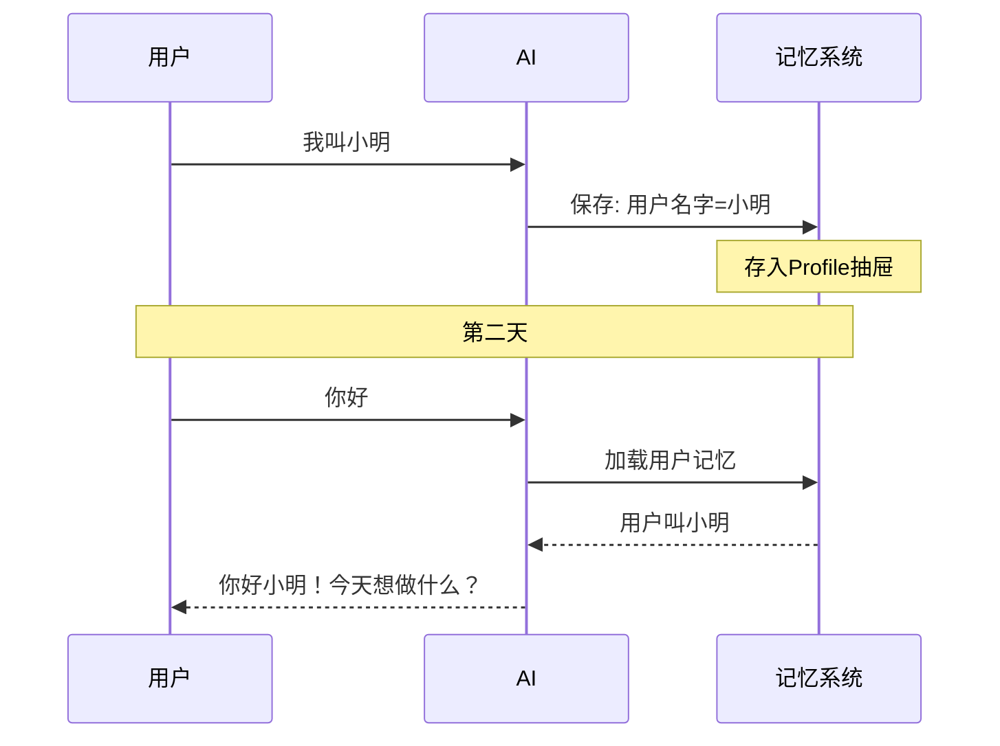

### 场景2：跨会话继续项目

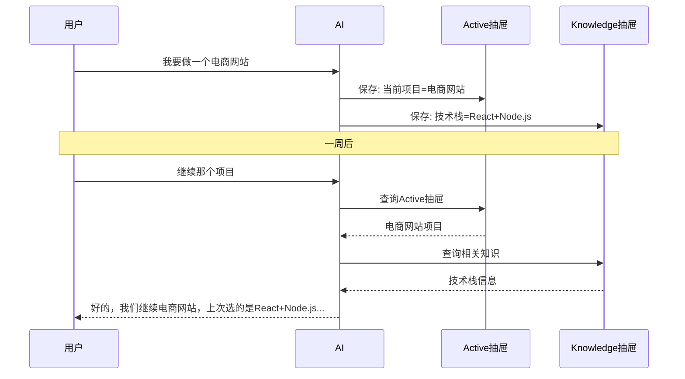

### 场景3：智能召回相关知识

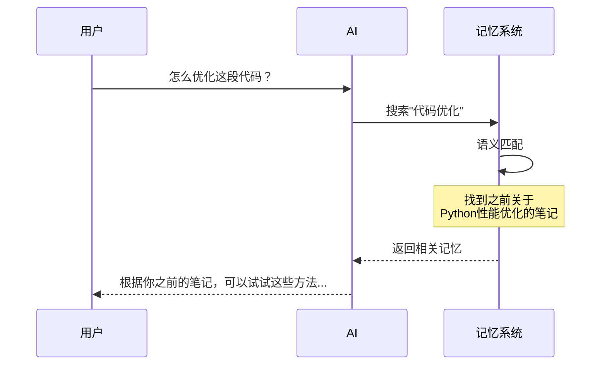

---

## 常见问题

**Q: 历史会保存多久？**
A: 历史是永久保存的，但旧的对话会被压缩成摘要，只保留关键信息。

**Q: 记忆会自己学习吗？**
A: AI 会根据对话自动判断哪些信息值得记住，也可以通过 `memorize` 工具主动保存。

**Q: 记忆会不会太多？**
A: 系统会自动管理：不常用的记忆会逐渐"降温"，很久不用的会归档，不会无限增长。

**Q: 隐私安全吗？**
A: 所有数据都存在你自己的电脑上，不会上传到云端。
