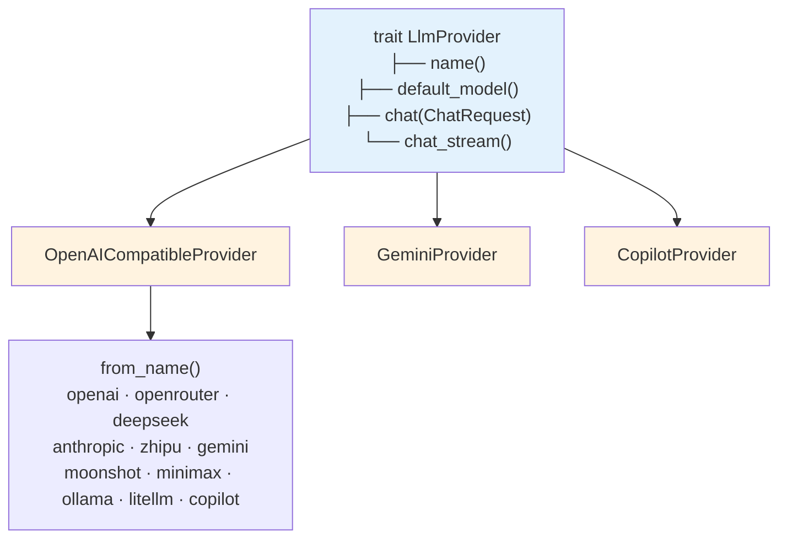
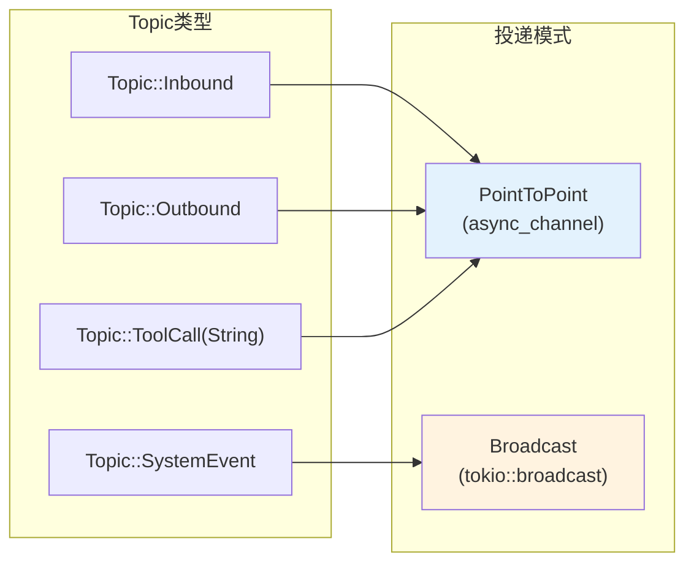
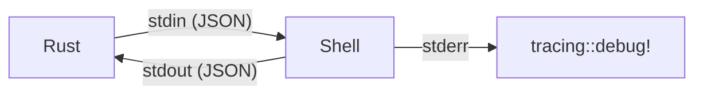
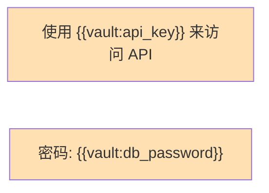

# 模块设计

> Gasket-RS 各模块职责与接口设计

---

## 1. providers/ — LLM 提供商抽象层

> **注意**: 核心类型从 `providers` crate re-export，保持向后兼容。

### 核心 Trait

```rust
#[async_trait]
trait LlmProvider: Send + Sync {
    fn name(&self) -> &str;
    fn default_model(&self) -> &str;
    async fn chat(&self, request: ChatRequest) -> Result<ChatResponse>;
    async fn chat_stream(&self, request: ChatRequest) -> Result<ChatStream>;
}
```

### 提供商实现



- **OpenAICompatibleProvider**: 通过 `PROVIDER_DEFAULTS` 数据表配置，新增提供商只需加一行数据，不需要写代码
- **GeminiProvider**: Google Gemini API（非 OpenAI 兼容格式）
- **CopilotProvider**: GitHub Copilot API（带 OAuth 认证流程）

**ModelSpec 解析格式**: `provider_id/model_id` 或 `model_id`

| 输入 | provider | model |
|------|----------|-------|
| `deepseek/deepseek-chat` | `deepseek` | `deepseek-chat` |
| `anthropic/claude-4.5-sonnet` | `anthropic` | `claude-4.5-sonnet` |
| `gpt-4o` | `None` (使用默认) | `gpt-4o` |

---

## 2. tools/ — 工具系统

> **注意**: `Tool` trait 和基础类型从 `types` re-export，沙箱类型从 `sandbox` re-export。

### 核心 Trait

```rust
#[async_trait]
trait Tool: Send + Sync {
    fn name(&self) -> &str;
    fn description(&self) -> &str;
    fn parameters(&self) -> serde_json::Value;  // JSON Schema
    async fn execute(&self, args: Value, ctx: &ToolContext) -> ToolResult;
}
```

### 内置工具清单

| 工具 | 类别 | 需要审批 | 说明 |
|------|------|---------|------|
| `read_file` | filesystem | 否 | 读取文件内容 |
| `write_file` | filesystem | 是 | 写入文件 |
| `edit_file` | filesystem | 是 | 编辑文件 (search/replace) |
| `list_dir` | filesystem | 否 | 列出目录内容 |
| `exec` | system | 是 | 执行 Shell 命令 (带超时 + policy: allowlist/denylist) |
| `spawn` | system | 否 | 创建子代理执行任务（仅 Orchestrator 角色） |
| `spawn_parallel` | system | 否 | 并行创建多个子代理（仅 Orchestrator 角色） |
| `web_fetch` | web | 否 | HTTP GET 请求 |
| `web_search` | web | 否 | Web 搜索 (Brave/Tavily/Exa/Firecrawl) |
| `ask_user` | interaction | 否 | 向用户提问并等待回复 |
| `message` | communication | 否 | 通过 Broker 发消息到渠道 |
| `cron` | system | 否 | 管理定时任务 (CRUD) |
| `history_query` | wiki | 否 | 按关键词查询对话历史（SQLite 本地搜索） |
| `history_search` | wiki | 否 | 语义搜索历史对话（需要 `embedding` 特性） |
| `wiki_search` | wiki | 否 | Tantivy BM25 搜索 Wiki 页面 |
| `wiki_read` | wiki | 否 | 按路径读取 Wiki 页面 |
| `wiki_write` | wiki | 否 | 写入/更新 Wiki 页面 |
| `wiki_decay` | wiki | 否 | 运行 Wiki 频率衰减 |
| `wiki_refresh` | wiki | 否 | 刷新 Wiki 索引 |
| `wiki_delete` | wiki | 是 | 删除 Wiki 页面 |
| `search_sops` | wiki | 否 | 搜索 SOP（标准操作流程）页面 |
| `create_plan` | system | 否 | 创建执行计划（需要 LLM provider） |
| `evolution` | system | 否 | 从对话中提取记忆（需要 LLM provider） |
| `new_session` | system | 是 | 开启新会话并清空历史 |
| `clear_session` | system | 是 | 清空当前会话历史 |
| 插件工具 | plugin | 否 | 从 `~/.gasket/plugins/` 加载的外部脚本工具 |

### 辅助模块

| 模块 | 说明 |
|------|------|
| `registry.rs` | `ToolRegistry` — 工具注册表，管理所有可用工具 |
| `base.rs` | 工具基础类型和辅助函数 |
| `wiki_decay.rs` | `WikiDecayTool` — Wiki 页面衰减工具（原 memory_decay） |
| `wiki_refresh.rs` | `WikiRefreshTool` — Wiki 索引刷新工具（原 memory_refresh） |
| `wiki_tools.rs` | `WikiReadTool`, `WikiSearchTool`, `WikiWriteTool` — Wiki 读写搜索工具 |

> **注意**: 沙箱相关类型（`ProcessManager`, `SandboxConfig`）从 `sandbox` crate re-export。

---

## 2.5. plugin/ — 外部插件系统

> 位于 `engine/src/plugin/`

插件系统通过 YAML 清单加载外部脚本，并将其暴露为原生工具。

### 模块结构

| 文件 | 职责 |
|------|------|
| `mod.rs` | `PluginTool` — 外部脚本的 Tool trait 实现 |
| `manifest.rs` | `PluginManifest`, `PluginProtocol`, `RuntimeConfig`, `Permission` |
| `rpc.rs` | JSON-RPC 2.0 消息类型和行编解码器 |
| `runner/simple.rs` | Simple 协议的一次性 stdin/stdout 执行器 |
| `runner/jsonrpc.rs` | JSON-RPC 双向通信执行器 |
| `runner/daemon.rs` | `JsonRpcDaemon` — 持久化 JSON-RPC 进程，支持请求多路复用 |
| `dispatcher/mod.rs` | `RpcDispatcher` — 带权限校验的 RPC 方法路由 |
| `dispatcher/llm_chat.rs` | `llm/chat` 处理器 |
| `dispatcher/memory_search.rs` | `memory/search` 处理器 |
| `dispatcher/memory_write.rs` | `memory/write` 处理器 |
| `dispatcher/memory_decay.rs` | `memory/decay` 处理器 |
| `dispatcher/subagent.rs` | `subagent/spawn` 处理器 |

### 协议

- **Simple**: 一次性 JSON 输入/输出，通过 stdin/stdout 通信
- **JsonRpc**: 双向 JSON-RPC 2.0，支持回调引擎能力（LLM、记忆、子代理等）

### 权限（默认拒绝）

| 权限 | YAML 值 | RPC 方法 |
|------|---------|----------|
| `LlmChat` | `llm_chat` | `llm/chat` |
| `WikiSearch` | `wiki_search` | `wiki/search` |
| `WikiWrite` | `wiki_write` | `wiki/write` |
| `WikiDecay` | `wiki_decay` | `wiki/decay` |
| `SubagentSpawn` | `subagent_spawn` | `subagent/spawn` |
| `MessageSend` | `message_send` | `message/send` |
| `UserAsk` | `user_ask` | `user/ask` |

---

## 3. channels/ — 通信渠道

> **注意**: `Channel` trait 和相关类型从 `channels` crate 定义，核心代码通过 feature flag 条件编译集成。

### 核心 Trait

```rust
#[async_trait]
trait Channel: Send + Sync {
    fn name(&self) -> &str;
    async fn start(&mut self) -> Result<()>;  // 开始接收消息
    async fn stop(&mut self) -> Result<()>;   // 停止
    async fn graceful_shutdown(&mut self) -> Result<()>;
}
```

> Channel 是**仅入站**的：接收外部消息并推送到内部 Bus。所有**出站**发送由 Outbound Actor 通过 `send_outbound()` 函数按渠道类型路由处理。

### 渠道列表

| 渠道 | Feature Flag | 传输协议 | 说明 |
|------|-------------|----------|------|
| Telegram | `telegram` | Long Polling (teloxide) | Telegram Bot API |
| Discord | `discord` | WebSocket (serenity) | Discord Gateway |
| Slack | `slack` | WebSocket (tungstenite) | Slack Socket Mode |
| 飞书 | `feishu` | HTTP Webhook (axum) | 飞书事件订阅 |
| WebSocket | `websocket` | WebSocket (axum) | 实时双向通信 |
| 微信 | `wechat` | HTTP Webhook | 微信公众号/企业微信 |

### middleware 层

| 组件 | 说明 |
|------|------|
| `SimpleAuthChecker` | 基于白名单的发送者认证 |
| `SimpleRateLimiter` | 简单速率限制 |
| `InboundSender` | 封装入站消息发送逻辑 |
| `log_inbound` | 入站消息日志记录 |

---

## 4. plugin/ — 外部插件系统

> 详细文档: [plugin.md](plugin.md)

Gasket 通过插件系统支持外部工具扩展。插件通过 YAML 清单声明，支持 Simple（stdin/stdout JSON）和 JSON-RPC 2.0 两种协议。详见 [plugin.md](plugin.md)。

---

## 5. broker/ — 消息代理

> 详细设计文档: [broker-module-design.md](broker-module-design.md)

### 核心抽象

| 类型 | 职责 |
|------|------|
| `Topic` | 强类型 Topic 枚举 (Inbound, Outbound, SystemEvent, ToolCall 等) |
| `DeliveryMode` | 编译时决策: `PointToPoint` (工作窃取) 或 `Broadcast` (广播) |
| `Envelope` | 消息包装器: `id`, `timestamp`, `topic`, `payload` |
| `Subscriber` | 统一接收器: `PointToPoint` 或 `Broadcast` |

### 投递模式



### MemoryBroker 实现

使用 DashMap + async-channel 实现：

- `publish(envelope)` — 阻塞发布，队列满时背压
- `try_publish(envelope)` — 非阻塞发布
- `subscribe(topic)` — 订阅返回 Subscriber
- `metrics(topic)` — 队列状态快照

### SessionManager

管理 per-session 消息路由：

- 订阅 `Topic::Inbound`
- 分发到 per-session mpsc 通道
- 每 300 秒空闲超时 GC

---

## 6. hooks/ — Agent Pipeline 生命周期 Hook 系统

Hook 系统提供统一的管道扩展机制，支持在 Agent 执行流程的关键节点插入自定义逻辑。

### Hook 执行点

| Hook Point | 执行时机 | 执行策略 | 说明 |
|------------|----------|----------|------|
| `BeforeRequest` | 请求处理前 | Sequential | 可修改输入，可中止请求 |
| `AfterHistory` | 历史加载后 | Sequential | 可添加上下文 |
| `BeforeLLM` | 发送给 LLM 前 | Sequential | 最后修改机会 |
| `AfterToolCall` | 工具调用后 | Parallel | 只读访问，fire-and-forget |
| `AfterResponse` | 响应生成后 | Parallel | 审计/告警 |

### 核心组件

| 组件 | 职责 |
|------|------|
| `HookRegistry` | Hook 注册表，按执行点管理所有 Hook |
| `PipelineHook` | Hook trait（`name()`, `point()`, `run()`, `run_parallel()`） |
| `HookBuilder` | HookRegistry 的 Builder 模式创建器 |
| `HookContext<M>` | 泛型上下文（session_key, messages, user_input, response） |
| `ExternalShellHook` | Shell 脚本 Hook 封装 |
| `VaultHook` | BeforeLLM 阶段的 Vault 密钥注入 |

### 外部 Shell Hook



- 脚本位于 `~/.gasket/hooks/`
- `pre_request.sh` — 请求预处理（可修改或中止输入）
- `post_response.sh` — 响应后处理（审计/告警）
- 2 秒超时，1 MB stdout 上限，非阻塞 `tokio::process::Command`

---

## 7. storage/ — 存储抽象层

> **注意**: 实际实现从 `storage` crate re-export。

### 核心组件

| 组件 | 说明 |
|------|------|
| `EventStore` | 事件溯源存储（session_events 表） |
| `SqliteStore` | SQLite 通用存储（sessions, summaries, cron jobs, kv） |
| `processor` | `process_history()` — Token-budget-aware 历史处理 |
| `query` | `HistoryQueryBuilder` — 历史查询构建器 |
| `search/` | FTS5 全文搜索类型 |
| `wiki/` | Wiki 页面存储（page_store, relation_store, source_store） |

### SqliteStore

- 使用 `sqlx::SqlitePool` 原生异步 I/O
- WAL 模式支持并发读
- 子模块: `fs.rs` (文件系统), `event_store.rs` (事件), `wiki/` (知识库)

---

## 8. 事件溯源（Event Sourcing）

> **注意**: 事件溯源类型定义在 `types` crate（`SessionEvent`, `EventType`, `Session`），持久化在 `storage` crate（`EventStore`）。

### 核心类型

| 类型 | 说明 |
|------|------|
| `Session` | 聚合根，管理元数据（created_at, updated_at, total_events） |
| `SessionEvent` | 不可变事件，UUID v7，含 session_key, event_type, content, 可选 embedding |
| `EventType` | UserMessage, AssistantMessage, ToolCall, ToolResult, Summary |
| `SummaryType` | TimeWindow, Topic, Compression |
| `EventMetadata` | tools_used, token_usage, content_token_len, extra |
| `SessionMetadata` | created_at, updated_at, last_consolidated_event, total_events, total_tokens |

### 架构特点

- **事件溯源**: 所有消息以不可变事件存储，支持完整历史重建
- **EventStore** (storage crate): `append_event()`, `get_events_after_watermark()`, `get_events_by_ids()`, `clear_session()`, `get_latest_summary()`
- **纯 SQLite**: 无内存缓存，直接查询数据库，利用 SQLite page cache
- **历史处理**: `process_history()` 基于 token budget, recent_keep, max_events 配置
- **查询系统**: `HistoryQueryBuilder` 支持 time_range, event_types, semantic_query, tools 过滤

---

## 9. session/ — 会话管理

> **注意**: `engine/src/agent/` 已重构为 `kernel/` + `session/` + `subagents/`

| 文件/目录 | 职责 |
|------|------|
| `mod.rs` | `AgentSession` — 会话管理核心，包装 kernel 执行 |
| `config.rs` | `AgentConfig` — Agent 配置（含 kernel 转换支持） |
| `builder.rs` | `SessionBuilder` — Session 构建器 |
| `finalizer.rs` | `ResponseFinalizer` — 响应后处理 |
| `pending_ask.rs` | `PendingAskRegistry` —  pending ask 注册表 |
| `prompt.rs` | 引导文件加载、技能上下文、token 截断 |
| `history/` | 事件溯源历史处理 |
| `compactor/` | 上下文压缩（基于 token budget） |

### history/ 子模块

| 文件 | 职责 |
|------|------|
| `builder.rs` | `ContextBuilder` — 历史消息构建器 |
| `indexing.rs` | `HistoryIndexingService` — 消息索引服务 |
| `mod.rs` | 模块导出 |

### AgentSession

`AgentSession` 是会话管理的核心结构，包装 kernel 执行：

```rust
pub struct AgentSession {
    runtime_ctx: RuntimeContext,                              // kernel 执行上下文
    config: AgentConfig,                                      // Agent 配置
    context_builder: history::builder::ContextBuilder,         // 历史/记忆组装
    compactor: Option<Arc<ContextCompactor>>,              // 上下文压缩器
    pricing: Option<ModelPricing>,                          // 可选价格配置
    finalizer: ResponseFinalizer,                             // 响应后处理
    pending_done: tokio_util::task::TaskTracker,            // 优雅关闭追踪器
    pending_asks: Arc<PendingAskRegistryImpl>,              // pending ask 注册表
    #[cfg(feature = "embedding")]
    embedding_indexer: Option<gasket_embedding::EmbeddingIndexer>, // 嵌入索引器
}
```

---

## 10. kernel/ — 纯函数执行核心

| 文件 | 职责 |
|------|------|
| `mod.rs` | `execute()`, `execute_streaming()` — 纯函数执行入口 |
| `executor.rs` | `AgentExecutor`, `ToolExecutor`, `ExecutionResult` — 执行器实现 |
| `context.rs` | `RuntimeContext`, `KernelConfig` — 运行时上下文和配置 |
| `stream.rs` | `StreamEvent`, `BufferedEvents` — 流式输出事件 |
| `error.rs` | `KernelError` — 内核错误类型 |

### 纯函数执行接口

```rust
/// 执行 LLM 对话循环
pub async fn execute(
    ctx: &RuntimeContext,
    messages: Vec<ChatMessage>,
) -> Result<ExecutionResult, KernelError>;

/// 流式 LLM 对话循环
pub async fn execute_streaming(
    ctx: &RuntimeContext,
    messages: Vec<ChatMessage>,
    event_tx: mpsc::Sender<StreamEvent>,
) -> Result<ExecutionResult, KernelError>;
```

---

## 11. subagents/ — 子代理系统

| 文件 | 职责 |
|------|------|
| `manager.rs` | `spawn_subagent()`, `TaskSpec` — 纯函数式子代理创建 |
| `tracker.rs` | `SubagentTracker`, `TrackerError` — 并行任务协调 |
| `runner.rs` | `ModelResolver` — 子代理运行和模型解析 |

### 创建 API

子代理创建采用简洁的纯函数风格：

```rust
let task = TaskSpec::new("sub-1", "执行任务")
    .with_model("openrouter/anthropic/claude-4.5-sonnet")
    .with_system_prompt("自定义提示词".to_string());

let handle = spawn_subagent(
    provider,
    tools,
    workspace,
    task,
    Some(event_tx),
    result_tx,
    Some(token_tracker),
    cancellation_token,
);
```

### 子代理结果

```rust
pub struct SubagentResult {
    pub id: String,              // 子代理 ID
    pub task: String,            // 任务描述
    pub response: SubagentResponse, // 执行结果
    pub model: Option<String>,   // 使用的模型名称
}
```

---

## 12. config/ — 配置管理

| 文件 | 职责 |
|------|------|
| `mod.rs` | 配置模块导出 |
| `app_config.rs` | 主 `Config` 结构，`ConfigLoader`, `ModelConfig`, `ModelProfile`, `ModelRegistry`, `ProviderConfig`, `ProviderRegistry`, `ProviderType` |
| `tools.rs` | `ToolsConfig`, `ExecToolConfig`（命令策略）, `WebToolsConfig`（搜索/代理）, `SandboxConfig`, `CommandPolicyConfig`, `ResourceLimitsConfig`, `EmbeddingConfig` |

- 配置文件位于 `~/.gasket/config.yaml`
- 兼容 Python gasket 配置格式

---

## 13. vault/ — 敏感数据隔离模块（engine 内部）

> 详细使用指南见 [vault-guide.md](vault-guide.md)

Vault 模块位于 `engine/src/vault/`，不是独立 crate。

### 核心组件

| 类型 | 职责 |
|------|------|
| `VaultStore` | JSON 文件存储，支持加密 |
| `VaultInjector` | 运行时占位符替换（在 `injector.rs` 中定义） |
| `VaultCrypto` | XChaCha20-Poly1305 加密 |
| `Placeholder` | 占位符扫描与解析 (`{{vault:key}}`) |
| `redact_secrets` | 日志脱敏函数 |
| `VaultError` | 错误类型 |

### 设计原则

1. **数据结构隔离** — VaultStore 完全独立于 memory/history 存储
2. **运行时注入** — 敏感数据仅在发送给 LLM 前一刻注入
3. **零信任设计** — 敏感数据永不持久化到 LLM 可访问的存储

### 占位符语法



---

## 14. embedding/ — 语义搜索与嵌入

> 需要: `cargo build --features embedding`

### 核心类型

| 类型 | 说明 |
|------|------|
| `EmbeddingProvider` | 嵌入生成 trait（`ApiProvider` 或 `LocalOnnx`） |
| `EmbeddingIndexer` | 管理嵌入索引的创建和查询 |
| `MemoryIndex` | 内存中的向量索引（hot_limit 控制上限） |
| `RecallSearcher` | 语义历史召回搜索器 |
| `RecallConfig` | 召回配置（top_k, token_budget, min_score） |
| `VectorStore` | 向量存储抽象 |

### 语义搜索流程

1. 用户提问 → `RecallSearcher` 生成查询嵌入
2. 在 `MemoryIndex`（内存）和 SQLite（磁盘）中搜索最相似的历史消息
3. 按 token 预算返回 top-k 结果

---

## 15. 其他模块

| 模块 | 说明 |
|------|------|
| `cron/` | `CronService` + `CronJob` — 定时任务服务，文件驱动 |
| `heartbeat/` | `HeartbeatService` — 读取 HEARTBEAT.md，定时触发主动任务 |
| `skills/` | 技能系统 — `SkillsLoader`, `SkillsRegistry`, `Skill`, `SkillMetadata`（见第 16 节） |
| `bus_adapter.rs` | `EngineHandler` — 桥接引擎到 Broker Actor 系统 |
| `error.rs` | 统一错误类型（AgentError, ProviderError, ChannelError, PipelineError, ConfigValidationError） |
| `token_tracker.rs` | Token 计数、成本计算、会话统计追踪 |

---

## 16. skills/ — 技能系统

### 模块结构

| 文件 | 职责 |
|------|------|
| `loader.rs` | `SkillsLoader` — 从 Markdown 文件加载技能 |
| `registry.rs` | `SkillsRegistry` — 技能注册表管理 |
| `skill.rs` | `Skill` — 技能定义结构 |
| `metadata.rs` | `SkillMetadata` — 技能元数据（name, description, bins, env_vars, always, extra） |

### 技能文件格式

```markdown
---
name: my_skill
description: A sample skill
dependencies:
  binaries: ["node", "npm"]
  env_vars: ["API_KEY"]
tags: ["automation", "web"]
always_load: false
---

# My Skill

技能的详细说明和使用方法...
```

### 加载模式

- **always_load: true** — 启动时自动加载
- **always_load: false** — 按需加载

---

## 17. wiki/ — Wiki 知识系统

> 详细设计文档: [wiki-module-design.md](wiki-module-design.md)

> 位于 `engine/src/wiki/`，三层架构：原始来源 → 编译 Wiki → 搜索索引。

### 模块结构

| 文件 | 职责 |
|------|------|
| `mod.rs` | Wiki 模块导出与 re-export |
| `page.rs` | `WikiPage`, `PageType`, `PageSummary`, `PageFilter`, `slugify()` |
| `store.rs` | `PageStore` — Wiki 页面 CRUD |
| `index.rs` | `PageIndex` — Tantivy BM25 全文搜索 |
| `query/mod.rs` | `WikiQueryEngine`, `QueryResult`, `ScoredCandidate`, `SearchHit`, `Reranker`, `TantivyIndex` |
| `ingest/mod.rs` | 知识摄入管线（parser, extractor, dedup） |
| `ingest/parser.rs` | `SourceParser`, `MarkdownParser`, `HtmlParser`, `PlainTextParser`, `ConversationParser` |
| `ingest/extractor.rs` | `KnowledgeExtractor`, `ExtractedItem`, `ExtractionResult` |
| `ingest/dedup.rs` | `SemanticDeduplicator`, `DedupResult` |
| `lint/mod.rs` | `WikiLinter`, `LintReport`, `FixReport` — 健康检查（仅结构化检查） |
| `lint/structural.rs` | `StructuralIssue`, `StructuralIssueType`, `Severity`, `StructuralLintConfig` |
| `log.rs` | `WikiLog`, `LogEntry` — 操作日志 |
| `lifecycle.rs` | `DecayReport`, `FrequencyManager` — 频率衰减与晋升管理 |

### Storage Wiki 模块

> 位于 `storage/src/wiki/`

| 文件 | 职责 |
|------|------|
| `mod.rs` | Wiki storage 模块导出 |
| `page_store.rs` | `WikiPageStore`, `PageRow`, `DecayCandidate`, `WikiPageInput` |
| `tables.rs` | `create_wiki_tables()` — DDL 建表 |
| `types.rs` | `Frequency`, `TokenBudget` — 核心类型定义 |
| `log_store.rs` | `WikiLogStore` — 日志持久化 |
| `relation_store.rs` | `WikiRelationStore` — 页面关系 |
| `source_store.rs` | `WikiSourceStore` — 来源追踪 |

---

## 15. command/ — 斜杠命令调度

> 位于 `gasket/command/`

斜杠命令调度器，不依赖 gasket-engine。内置处理器通过 `CommandHost` trait 获取引擎能力。

| 文件 | 职责 |
|------|------|
| `dispatcher.rs` | `Dispatcher`, `DispatcherBuilder` — 命令路由 |
| `host.rs` | `CommandHost` — 引擎能力注入 trait |
| `parser.rs` | 命令解析 |
| `completer.rs` | `CommandCompleter` — Tab 补全 |
| `builtins/` | 内置命令处理（/new, /help, /exit 等） |

---

## 16. sandbox/ — 沙箱执行

> 位于 `gasket/sandbox/`

提供安全的命令执行环境，支持多平台。

| 平台 | 后端 | 说明 |
|------|------|------|
| Linux | bwrap (Bubblewrap) | 命名空间隔离 |
| macOS | sandbox-exec | 系统级沙箱 |
| Windows | Job Objects | 进程限制 |

核心类型：`ProcessManager`, `SandboxConfig`, `SandboxBackend`, `CommandPolicy`, `ResourceLimits`
