# Session Module

> The "Butler" of Conversations

---

## One-Sentence Understanding

**Session is your personal butler** - it manages the complete lifecycle of a conversation, from greeting to farewell.

> Analogy: Like a hotel concierge who knows your preferences, arranges everything, and ensures your stay is perfect.

---

## Why Do We Need Session?

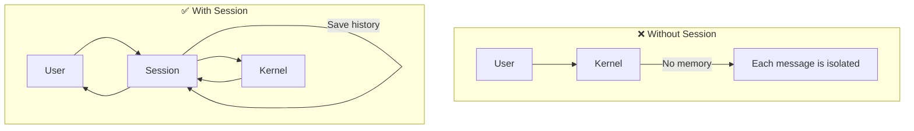

| Feature | Without Session | With Session |
|---------|-----------------|--------------|
| Remember context | ❌ No | ✅ Yes |
| Long-term memory | ❌ No | ✅ Yes |
| History compression | ❌ No | ✅ Yes |
| Multi-turn dialogue | ❌ Hard | ✅ Easy |

---

## Core Responsibilities

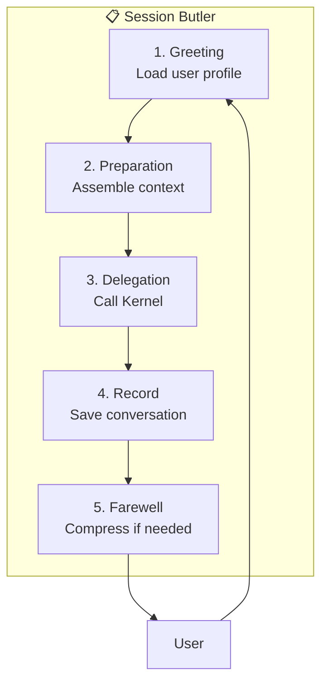

### 1. Greeting Phase

When you arrive at the hotel (start chatting):

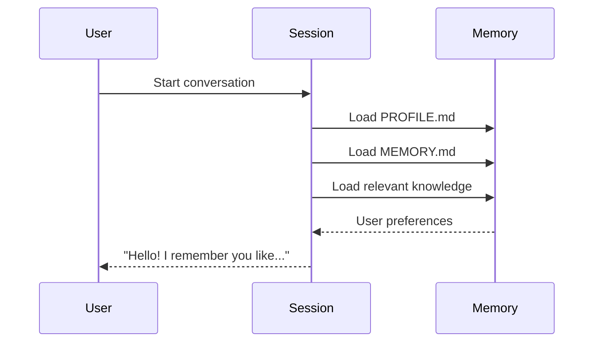

**What gets loaded:**
- Profile (who you are)
- Active memories (current focus)
- Relevant knowledge (based on query)

### 2. Preparation Phase

Before the "brain" (Kernel) starts working:

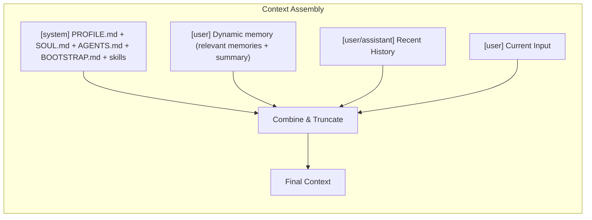

**Assembly order** (like making a sandwich):
1. Bottom: `[system]` - Static workspace markdown (PROFILE.md, SOUL.md, etc.)
2. Layer: `[user]` - Dynamic memory content (relevant memories, summary)
3. Layer: `[user/assistant]` - Conversation history
4. Top: `[user]` - Current user message

> **Prompt Cache Protection**: Dynamic memory is injected as a User Message rather than appended to the system prompt. This preserves the Prompt Cache for the static system content, reducing token costs and latency.

### 3. Delegation Phase

Hand over to Kernel (the brain):

```
Session: "Kernel, here's everything you need:
         - System prompt
         - User's background
         - Conversation history
         - Available tools
         
         Please process this and give me an answer."
```

### 4. Recording Phase

Save the conversation:

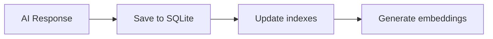

### 5. Farewell Phase

When conversation gets too long, compress it:

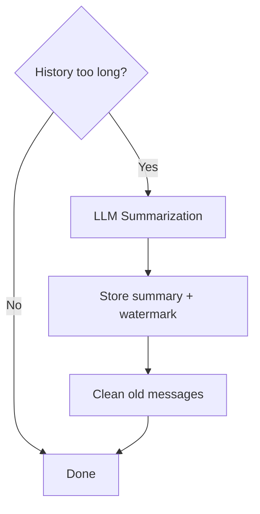

---

## Two Types of Sessions

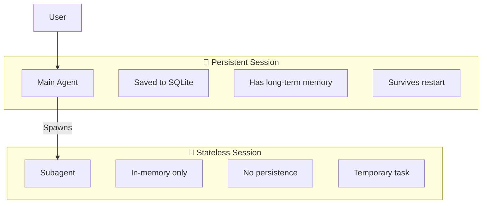

| Feature | Persistent | Stateless |
|---------|-----------|-----------|
| Use case | Main conversation | Background tasks |
| Storage | SQLite | Memory only |
| History | Kept indefinitely | Lost after task |
| Memory | Full access | No access |

---

## History Management

### Three-Phase History Loading

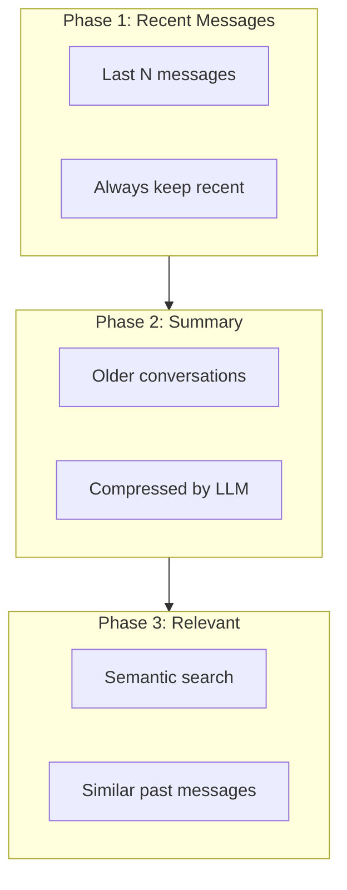

### Token Budget

Like a suitcase with limited space:

```
Memory Token Budgets (defaults):

Bootstrap:        1500 tokens ████████░░
Scenario:         1500 tokens ████████░░
On-demand:        1000 tokens █████░░░░░
Total Cap:        4000 tokens ██████████
────────────────────────────────────────
```

---

## Context Compression

When the suitcase is full, compress old clothes:

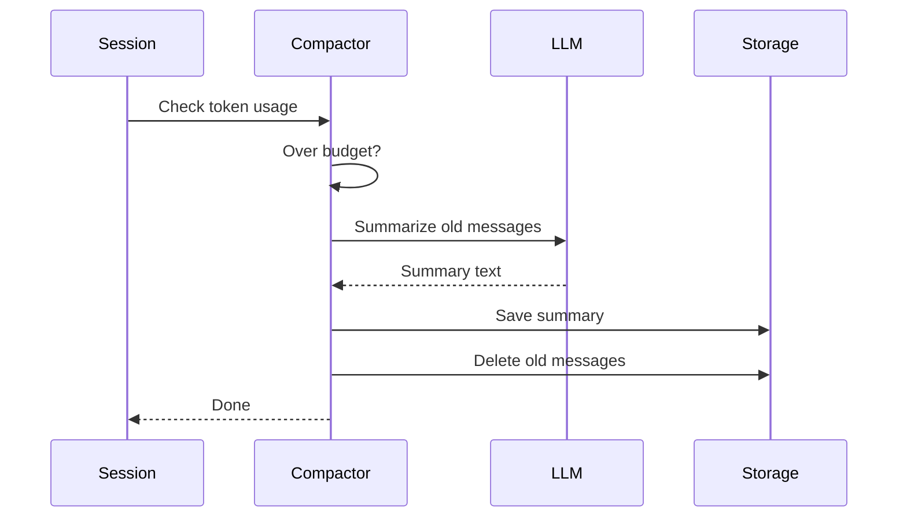

---

## Hook Integration

Session integrates with hooks at key points:

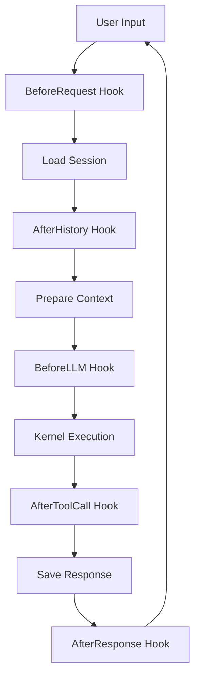

---

## Tool Approval Flow

When AI calls a tool that requires approval, Session coordinates the approval process:

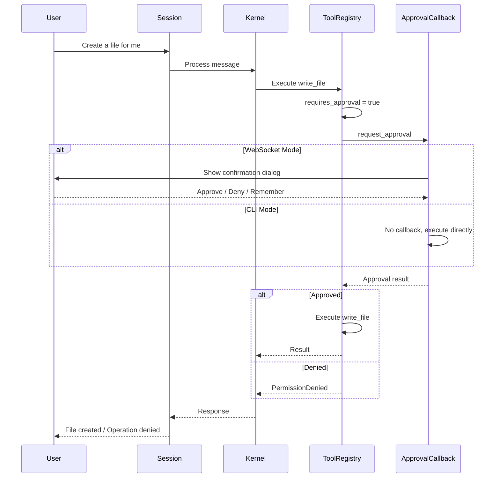

**WebSocket Mode Features:**
- Frontend shows a confirmation dialog with tool name, description, and arguments
- Users can check "Remember this decision" to auto-approve/deny future calls of the same tool in the same session
- Timeout without response is treated as denial

---

## Key Data Structures

### AgentSession

The butler's toolkit:

```rust
struct AgentSession {
    runtime_ctx: RuntimeContext,         // Execution dependencies
    event_store: Arc<EventStore>,        // Event persistence (non-optional)
    session_store: Arc<SessionStore>,    // Session storage (non-optional)
    config: AgentConfig,                 // Behavior settings
    system_prompt: String,               // AI personality
    hooks: Arc<HookRegistry>,            // Extension points
    compactor: Option<Arc<ContextCompactor>>, // Compression
    pricing: Option<ModelPricing>,       // Cost calculation
    finalizer: ResponseFinalizer,        // Response post-processing
    pending_done: TaskTracker,           // Graceful shutdown tracker
}
```

---

## Session Lifecycle

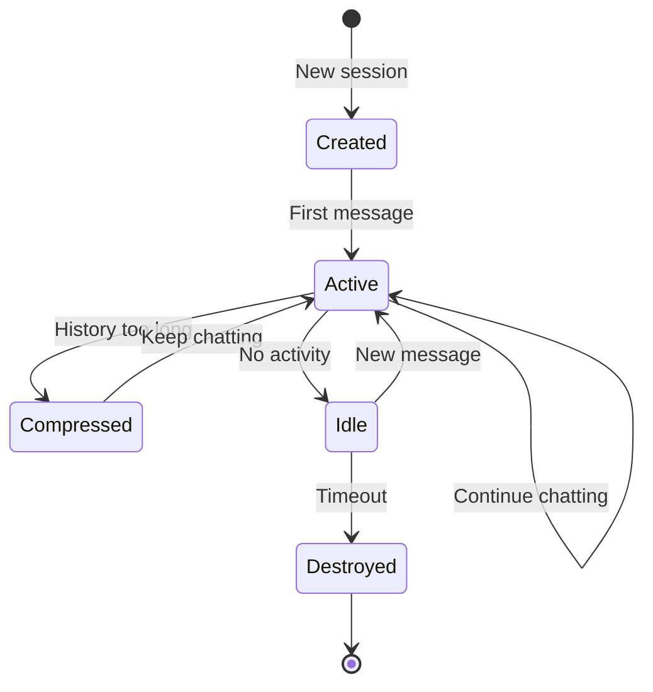

---

## Related Modules

- **Kernel**: The "brain" that Session delegates to
- **Memory**: Long-term storage that Session manages
- **Hooks**: Extension points during Session lifecycle
- **Storage**: SQLite backend for persistence
