# 会话管理模块 (Session)

> 对话的大管家——如何组织一次完整的 AI 对话

---

## 一句话理解

Session 是 AI 对话的**大管家**，负责接待用户、准备资料、协调大脑工作、整理回复。

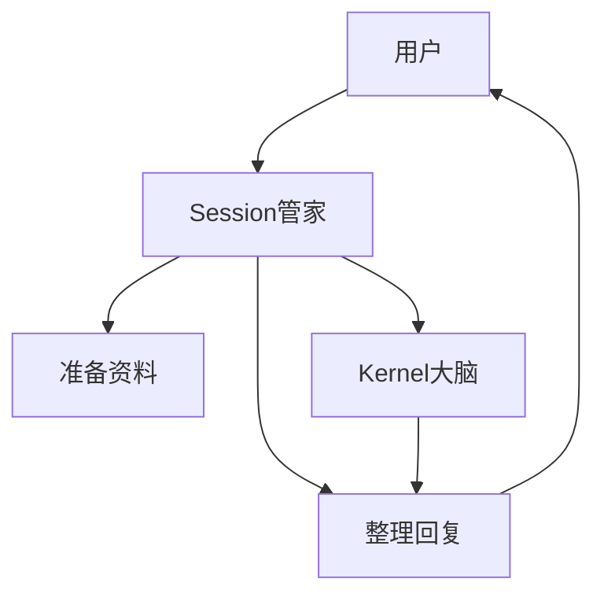

---

## 生活中的类比

Session 就像一个**私人助理**：

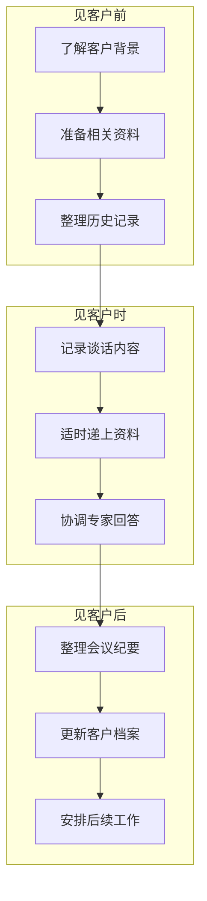

| 助理工作 | Session 对应功能 |
|---------|-----------------|
| 了解客户背景 | 加载用户记忆 |
| 准备资料 | 组装系统提示、技能 |
| 整理历史记录 | 加载对话历史 |
| 记录谈话 | 保存消息到历史 |
| 协调专家 | 调用 Kernel |
| 整理纪要 | 上下文压缩 |
| 更新档案 | 更新记忆 |

---

## Session 的核心职责

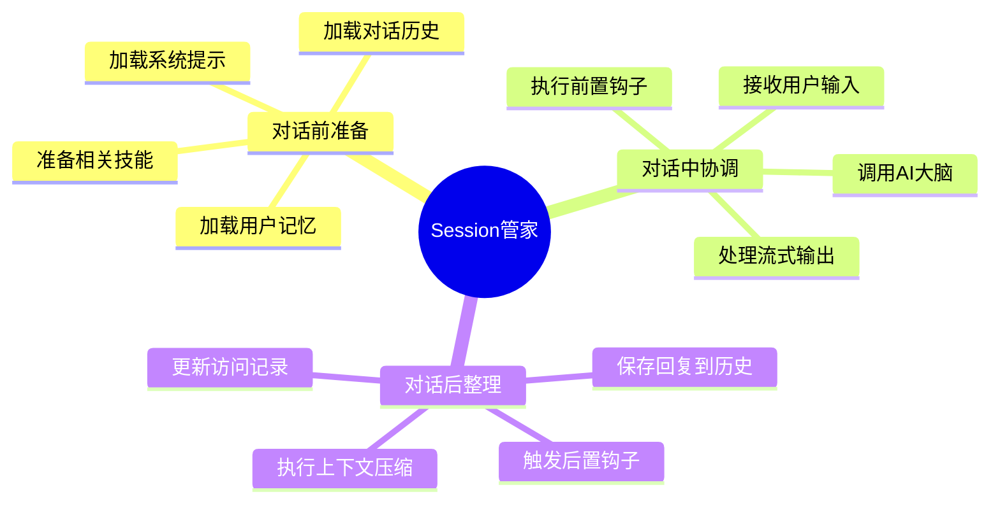

---

## 完整对话流程

### 阶段一：准备（对话前）

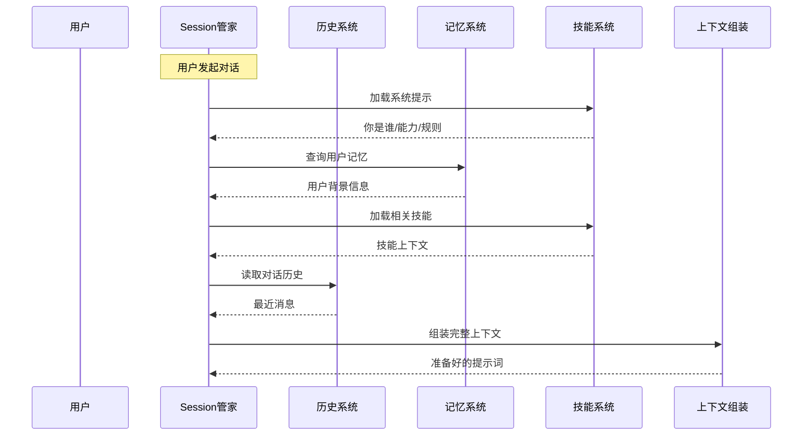

### 阶段二：执行（对话中）

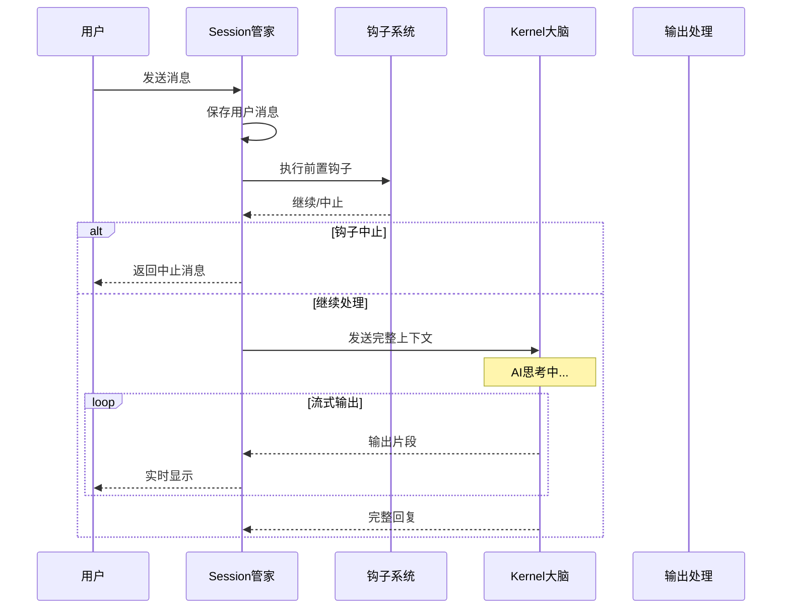

### 阶段三：收尾（对话后）

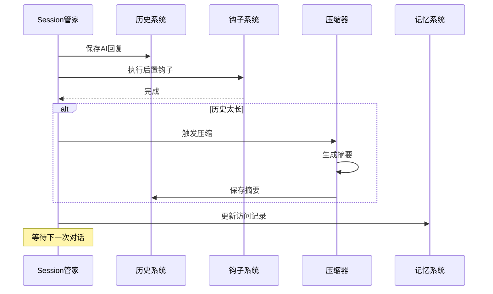

---

## 上下文组装过程

Session 把各种信息组装成 AI 能理解的格式：

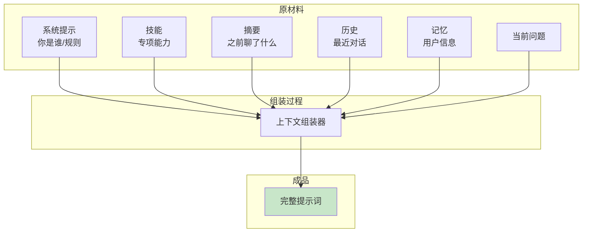

### 组装示例

```
┌─────────────────────────────────────────┐
│ 系统提示                                 │
│ 你是Gasket，一个AI助手...                │
├─────────────────────────────────────────┤
│ 技能                                    │
│ 你擅长Python开发...                      │
├─────────────────────────────────────────┤
│ 摘要                                    │
│ 之前聊了：用户在做一个网站项目...         │
├─────────────────────────────────────────┤
│ 历史                                    │
│ 用户: 帮我写个登录功能                   │
│ AI: 好的，用什么框架？                   │
│ 用户: React                              │
├─────────────────────────────────────────┤
│ 记忆                                    │
│ 用户叫小明，后端工程师                    │
├─────────────────────────────────────────┤
│ 当前问题                                 │
│ 用户: 继续                               │
└─────────────────────────────────────────┘
```

---

## 两种类型的 Session

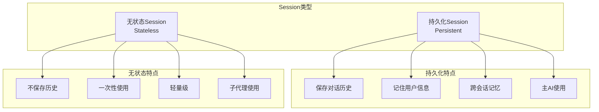

| 特性 | 持久化 Session | 无状态 Session |
|------|---------------|----------------|
| **保存历史** | ✓ | ✗ |
| **保存记忆** | ✓ | ✗ |
| **使用场景** | 主对话 | 子任务 |
| **资源占用** | 较高 | 很低 |
| **举例** | 你和AI的日常对话 | 让AI分析一个文件的临时任务 |

---

## 上下文压缩

当对话太长时，Session 会进行"总结"：

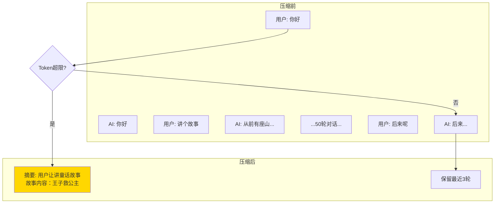

**压缩策略：**
- 老旧消息 → 生成摘要
- 最近消息 → 保留完整
- 关键信息 → 提取保存

---

## Session 与 Kernel 的关系

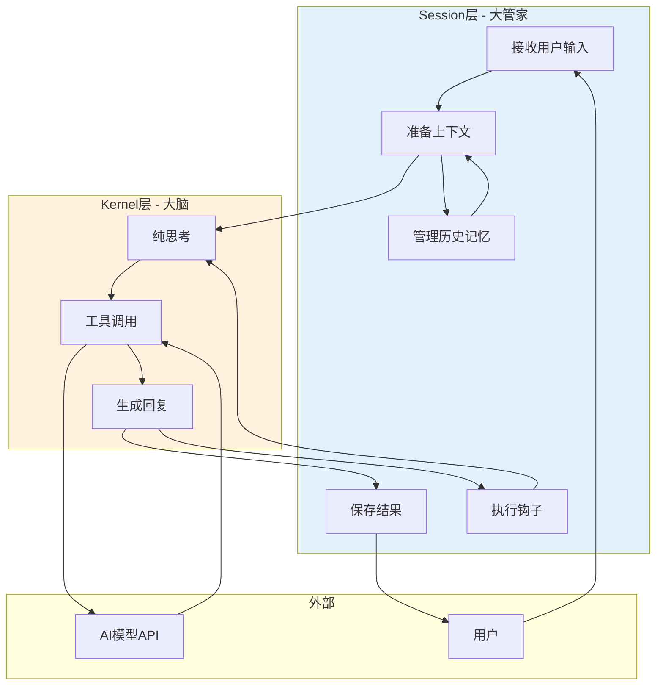

**比喻：**
- **Session** = 餐厅经理（接待、安排、记录）
- **Kernel** = 厨师（专心做菜）
- **AI模型** = 食材/厨具

---

## 数据流向全景图

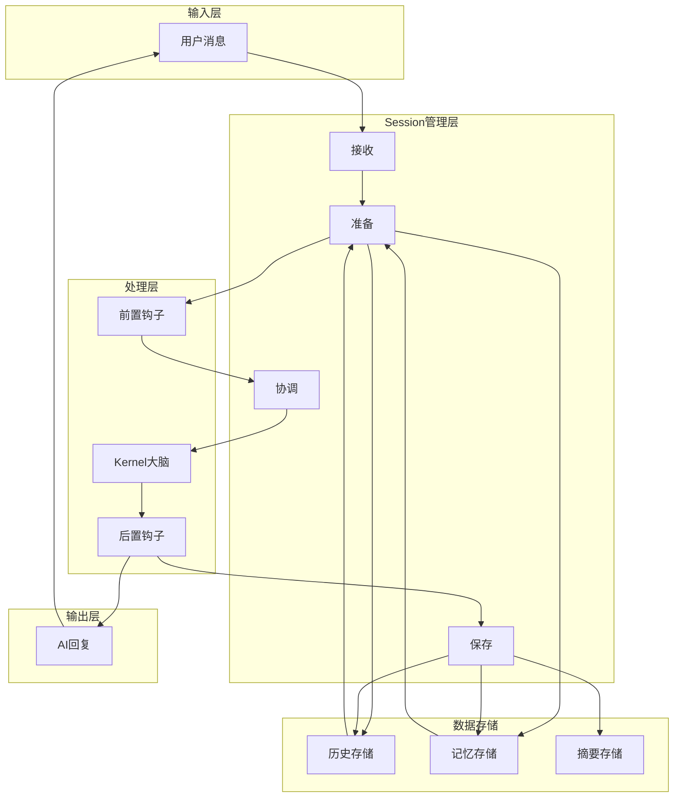

---

## 实际使用场景

### 场景1：日常对话

```mermaid
sequenceDiagram
    participant U as 用户:小明
    participant S as Session
    participant M as 记忆
    participant K as Kernel
    
    Note over S: 第一次对话
    
    U->>S: 你好，我叫小明
    S->>S: 创建持久化Session
    S->>M: 保存：用户叫小明
    S->>K: 处理消息
    K-->>S: 回复
    S-->>U: 你好小明！
    
    ...第二天...
    
    Note over S: 第二次对话
    
    U->>S: 你好
    S->>S: 恢复Session
    S->>M: 查询用户记忆
    M-->>S: 用户叫小明
    S->>K: 上下文+记忆
    K-->>S: 回复
    S-->>U: 你好小明！今天想做什么？
```

### 场景2：复杂任务（使用子代理）

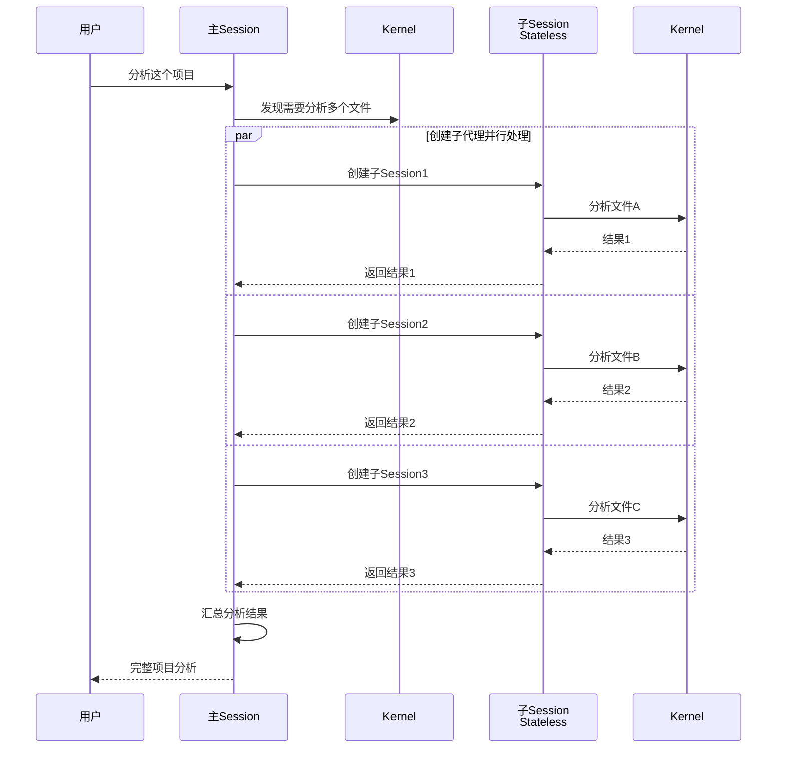

### 场景3：长对话压缩

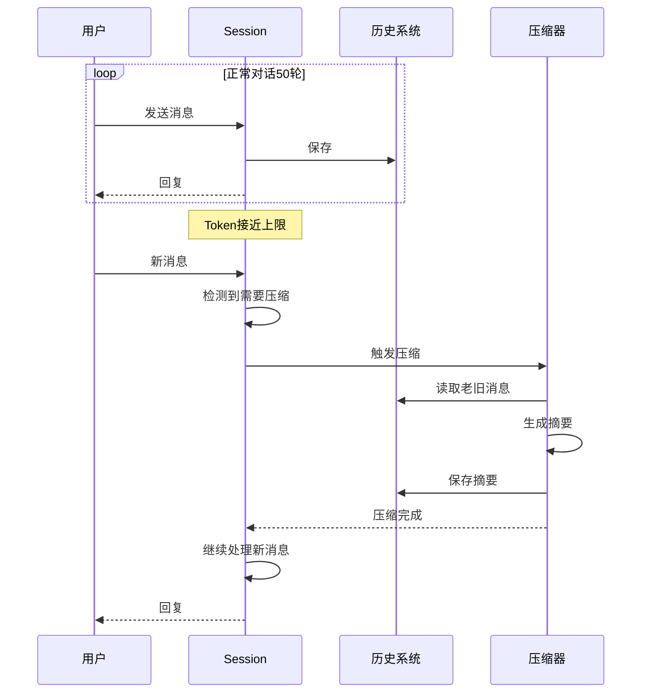

---

## 常见问题

**Q: Session 和对话是什么关系？**
A: 一个 Session 管理一次完整的对话过程。从开始聊天到结束，Session 负责整个过程。

**Q: 重启电脑后对话还在吗？**
A: 在！持久化 Session 会把历史保存到数据库，重启后可以恢复。

**Q: 为什么需要无状态 Session？**
A: 临时任务不需要保存历史，无状态更轻量、更快。比如让 AI 临时分析一个文件。

**Q: 上下文压缩会丢失信息吗？**
A: 压缩会保留关键信息，生成摘要。最近的消息会保留完整，不会丢失重要内容。

**Q: Session 能同时处理多个用户吗？**
A: 每个用户有独立的 Session，互不干扰。Session 通过 session_key 区分不同用户。
