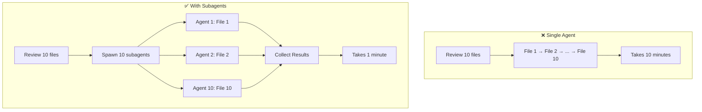
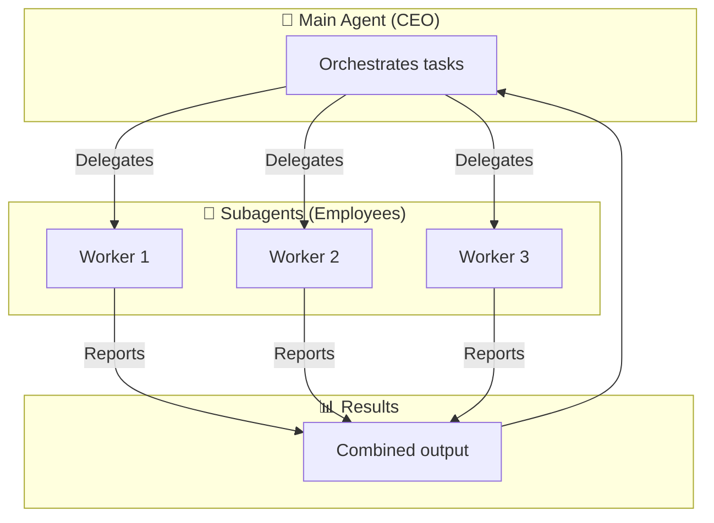
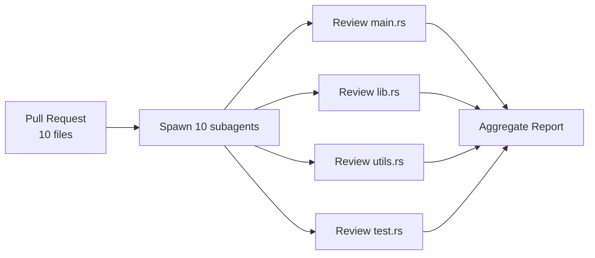
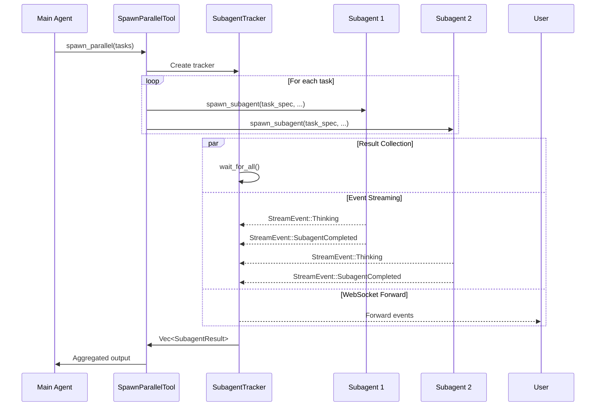
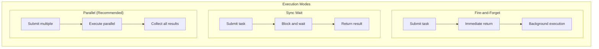
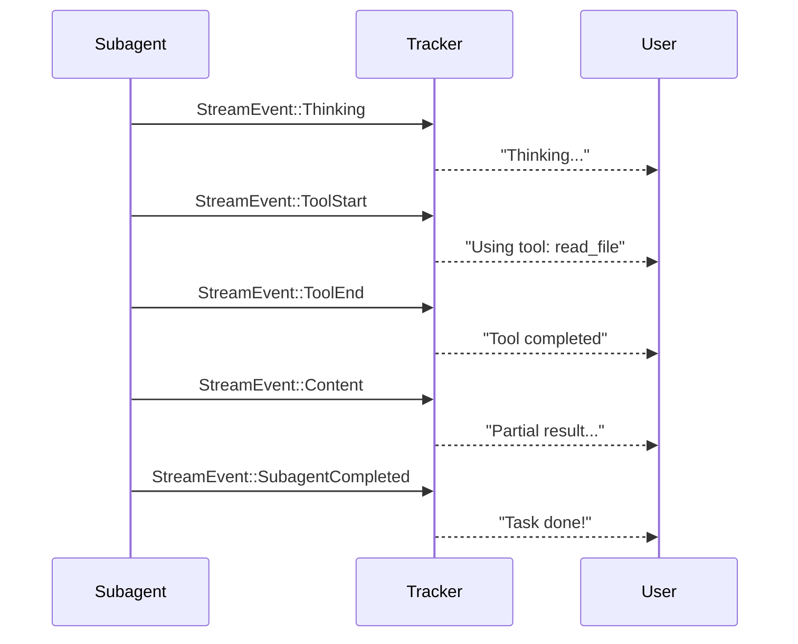
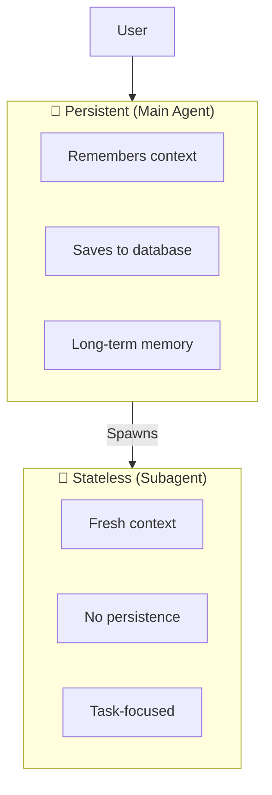
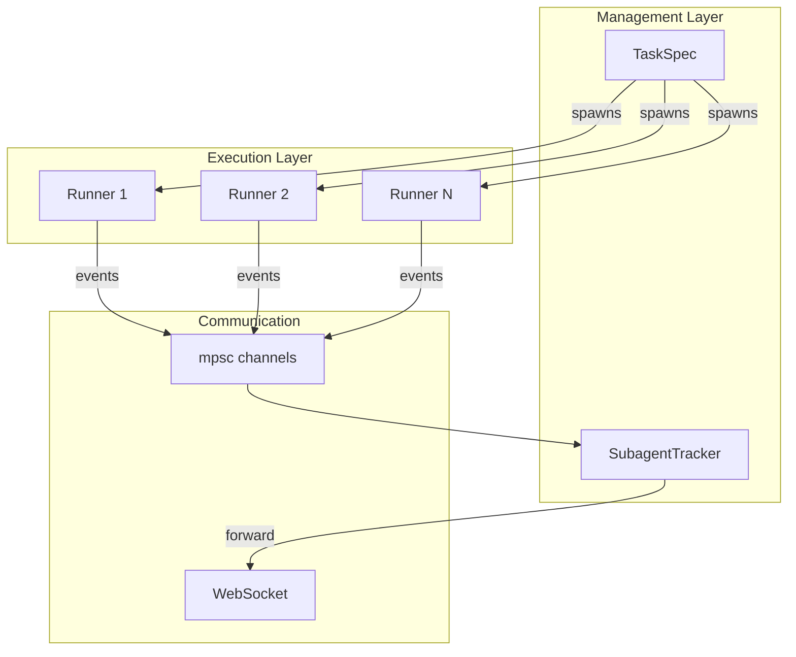

# Subagent System

> AI Creating Clones

---

## One-Sentence Understanding

**Subagents are AI creating clones** - the main AI can spawn parallel workers to handle complex tasks.

> Analogy: Like a CEO delegating tasks to employees who work simultaneously and report back results.

---

## Why Do We Need Subagents?



| Scenario | Single Agent | With Subagents |
|----------|--------------|----------------|
| Review 10 files | 10 minutes | 1 minute |
| Analyze multiple data sources | Sequential | Parallel |
| Complex workflow | Monolithic | Distributed |

---

## Core Concepts



**Key characteristics**:
- Main agent decides **what** to do
- Subagents decide **how** to do it
- All work **in parallel**
- Results **combined** at the end

---

## Use Cases

### 1. Code Review



### 2. Multi-Source Research

```
User: Research "Rust async runtime"

Main Agent spawns 3 subagents:
- Agent 1: Search official docs
- Agent 2: Search GitHub examples  
- Agent 3: Search blog posts

Results combined into comprehensive report
```

### 3. Data Processing

```
User: Analyze last month's logs

Main Agent spawns subagents by date:
- Agent 1: Week 1 logs
- Agent 2: Week 2 logs
- Agent 3: Week 3 logs
- Agent 4: Week 4 logs

Results aggregated for full analysis
```

---

## How It Works



---

## Three Execution Modes



| Mode | Use Case | Behavior |
|------|----------|----------|
| **Fire-and-Forget** | Background tasks | Submit and forget |
| **Sync Wait** | Sequential dependency | Wait for result |
| **Parallel** | Batch processing | Multiple simultaneous |

### Mode 1: Fire-and-Forget

```rust
// Spawn and continue immediately
let (result_tx, mut result_rx) = mpsc::channel(1);
spawn_subagent(
    provider,
    tools,
    workspace,
    TaskSpec::new("sub-1", "Summarize this article"),
    None,
    result_tx,
    None,
    CancellationToken::new(),
);
// Returns immediately, runs in background
```

### Mode 2: Sync Wait

```rust
// Block until complete
let (result_tx, mut result_rx) = mpsc::channel(1);
spawn_subagent(
    provider,
    tools,
    workspace,
    TaskSpec::new("sub-1", "Analyze this code"),
    None,
    result_tx,
    None,
    CancellationToken::new(),
);
let result = result_rx.recv().await;
// Use result in main agent
```

### Mode 3: Parallel (Recommended)

```rust
// Spawn multiple subagents with a tracker
let mut tracker = SubagentTracker::new();
for (id, task) in tasks {
    let task = TaskSpec::new(&id, task)
        .with_system_prompt("Code reviewer".to_string());
    spawn_subagent(
        provider.clone(),
        tools.clone(),
        workspace.clone(),
        task,
        Some(tracker.event_sender()),
        tracker.result_sender(),
        Some(token_tracker.clone()),
        tracker.cancellation_token(),
    );
}
let results = tracker.wait_for_all(tasks.len()).await?;
```

---

## Subagent Events

Real-time progress tracking:



### Event Types

```rust
// Unified StreamEvent is used for both main agent and subagent.n// Subagent events have agent_id set to Some(subagent_uuid).n// See docs/data-structures-en.md for the full StreamEvent definition.n
```

---

## State Management



Subagents are **stateless** by design:
- No access to main agent's conversation history
- No long-term memory
- Focused only on the assigned task

This ensures:
- ✅ Clean separation of concerns
- ✅ Isolated failure domains
- ✅ Easier debugging
- ✅ Resource efficiency

---

## Model Selection

Subagents can use different models than the main agent:

```rust
// Fast/cheap model for simple tasks
let task = TaskSpec::new("sub-1", prompt)
    .with_model("gpt-4o-mini")
    .with_system_prompt(system_prompt);
spawn_subagent(provider, tools, workspace, task, None, result_tx, None);

// Powerful model for complex tasks
let task = TaskSpec::new("sub-2", prompt)
    .with_model("claude-4.5-sonnet")
    .with_system_prompt(system_prompt);
spawn_subagent(provider, tools, workspace, task, None, result_tx, None);
```

| Task Type | Recommended Model | Why |
|-----------|-------------------|-----|
| Simple extraction | gpt-4o-mini | Fast, cheap |
| Code review | claude-4.5-sonnet | Better at code |
| Creative writing | claude-4.5-sonnet | More creative |
| Data analysis | deepseek-chat | Good at structured output |

---

## Architecture

### Components



### spawn_subagent

Core pure-function API for spawning a subagent:

```rust
pub fn spawn_subagent(
    provider: Arc<dyn LlmProvider>,
    tools: Arc<ToolRegistry>,
    workspace: PathBuf,
    task: TaskSpec,
    event_tx: Option<mpsc::Sender<StreamEvent>>,
    result_tx: mpsc::Sender<SubagentResult>,
    token_tracker: Option<Arc<TokenTracker>>,
    cancellation_token: CancellationToken,
) -> JoinHandle<()>
```

### SubagentTracker

Monitors all running subagents:

```rust
pub struct SubagentTracker {
    result_tx: mpsc::Sender<SubagentResult>,
    result_rx: Option<mpsc::Receiver<SubagentResult>>,
    event_tx: mpsc::Sender<StreamEvent>,
    event_rx: Option<mpsc::Receiver<StreamEvent>>,
    cancellation_token: CancellationToken,
}
```

---

## Best Practices

### 1. Task Granularity

```
✅ Good: "Review this specific function"
❌ Bad: "Review entire codebase"

✅ Good: "Extract dates from this log"
❌ Bad: "Analyze all logs"
```

### 2. Error Handling

```rust
// Always handle subagent failures
match result_rx.recv().await {
    Some(result) => process(result),
    None => {
        log!("Subagent failed or channel closed");
        // Fallback or retry
    }
}
```

### 3. Resource Limits

```yaml
# config.yaml
# Note: subagent_limits is not currently implemented.
# Subagent timeout defaults to 600 seconds.
agents:
  defaults:
    max_tokens: 2000        # Token limit per request
```

### 4. Result Aggregation

```rust
// Combine results intelligently
let results = tracker.wait_for_all().await;
let combined = results
    .into_iter()
    .map(|r| r.content)
    .collect::<Vec<_>>()
    .join("\n---\n");
```

---

## Complete Example

```rust
// Main agent decides to review 5 files
let files = vec!["main.rs", "lib.rs", "utils.rs", "tests.rs", "config.rs"];

// Create tracker for progress monitoring
let tracker = SubagentTracker::new();

// Spawn subagents for each file
for (i, file) in files.iter().enumerate() {
    let task_id = format!("review-{}", i);
    let prompt = format!("Review {} for code quality", file);
    
    manager
        .task(&task_id, &prompt)
        .with_system_prompt("You are a code reviewer".into())
        .with_streaming(tracker.event_sender())
        .spawn(tracker.result_sender())
        .await?;
}

// Wait for all to complete
let results = tracker.wait_for_all().await;

// Aggregate into final report
let report = generate_report(results);
```

---

## Related Modules

- **Kernel**: Executes subagent tasks
- **Session**: Provides isolated context
- **Tools**: `spawn_parallel` tool triggers subagents
