# 子代理系统 (Subagents)

> AI 也能当老板——让 AI 创建分身并行工作

---

## 一句话理解

子代理就是 AI 能创建**分身**来并行处理多个任务，就像老板把工作分配给不同员工。

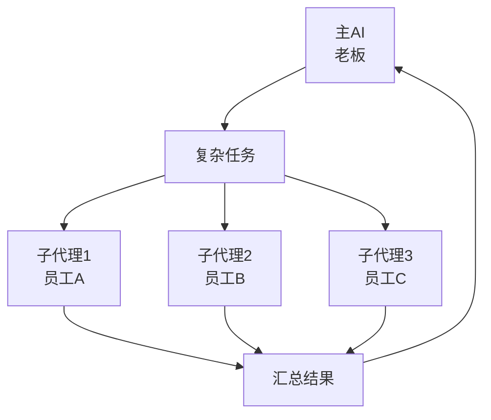

---

## 为什么需要子代理

### 单 AI 处理的局限

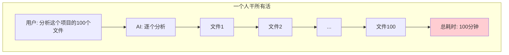

### 多子代理并行处理

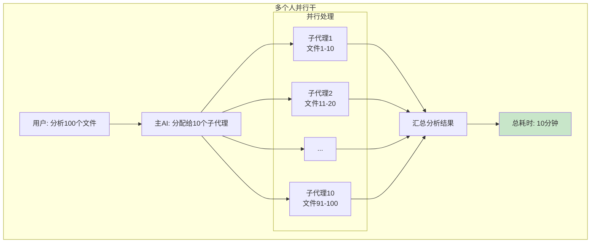

**优势：**
- ⚡ **更快**：并行处理，10 倍速提升
- 🎯 **更专注**：每个子代理专注一个子任务
- 🔄 **更灵活**：可以递归创建子-子代理
- 💪 **更强**：处理单 AI 搞不定的复杂任务

---

## 子代理 vs 主代理

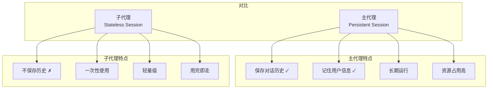

| 特性 | 主代理 | 子代理 |
|------|-------|-------|
| **对话历史** | 保存 | 不保存 |
| **用户记忆** | 有 | 无（继承主代理配置）|
| **使用场景** | 日常对话 | 临时任务 |
| **生命周期** | 长期 | 一次性的 |
| **比喻** | 全职员工 | 外包临时工 |

---

## 创建子代理的方式

### 方式1：单个子代理（spawn）

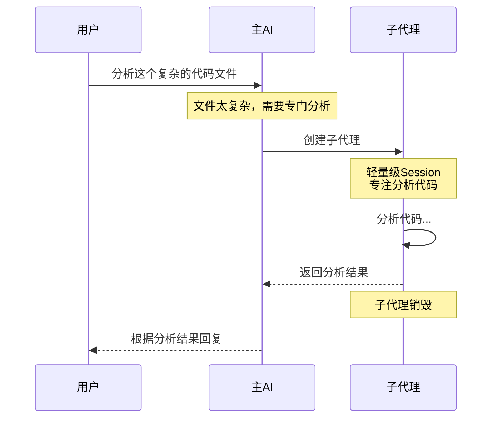

**参数：**
- `task`（必填）- 任务描述
- `model_id`（可选）- 模型 Profile ID，如 `"fast"`、`"coder"`，使用 `agents.models` 中定义的模型

**适用场景：**
- 复杂代码分析
- 长篇文档总结
- 独立的研究任务

### 方式2：并行多个子代理（spawn_parallel）

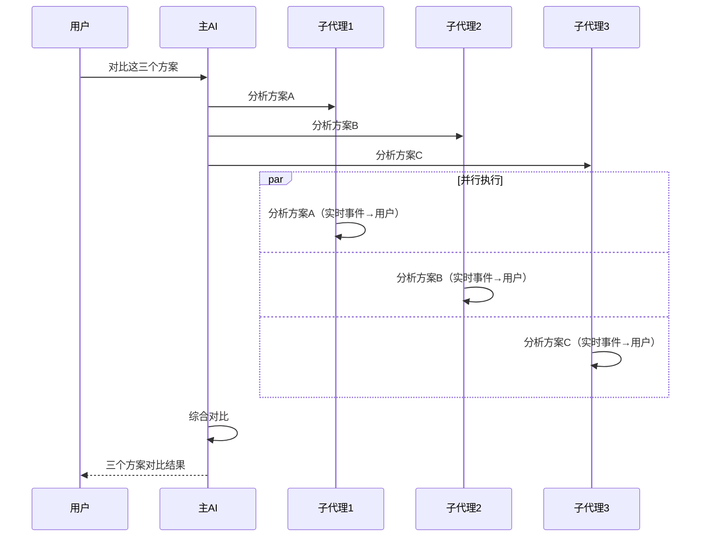

**参数：**
- `tasks`（必填）- 任务列表，支持两种格式：
  - 简单字符串数组：`["任务A", "任务B"]`
  - 带模型选择的对象数组：`[{"task": "任务A", "model_id": "fast"}, ...]`
- 最多 10 个任务，最多 5 个并发执行（防止 API 限流）

**适用场景：**
- A/B/C 方案对比
- 批量文件处理
- 并行数据收集

---

## 子代理的工作流程

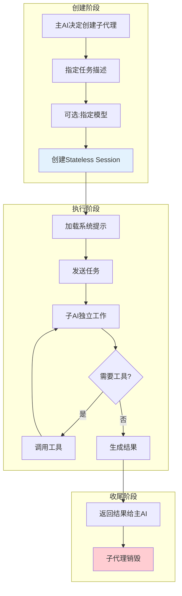

### 详细时序

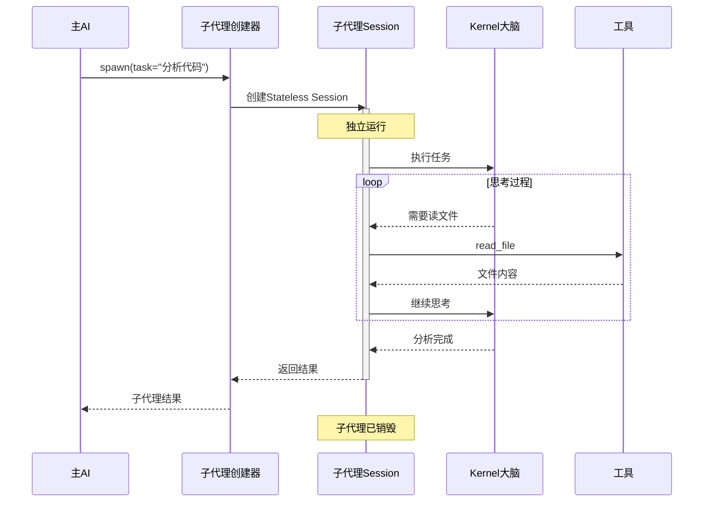

---

## 子代理追踪器

管理多个子代理，等待所有结果：

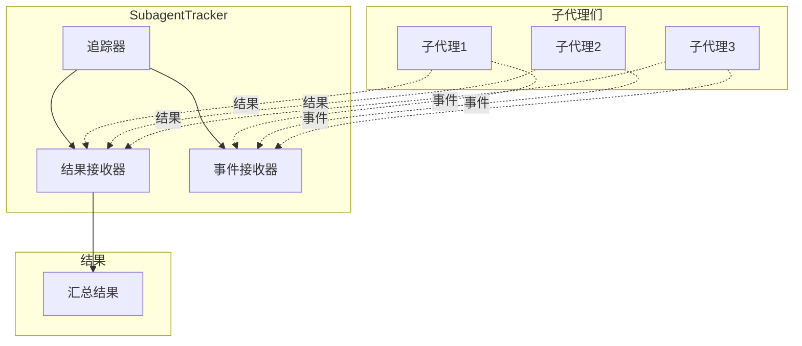

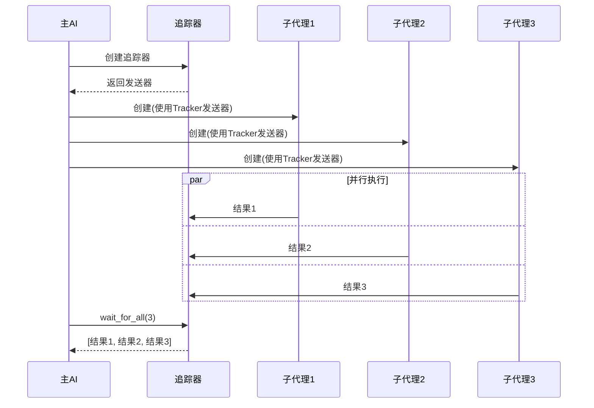

---

## 流式事件转发

子代理的执行过程可以实时看到：

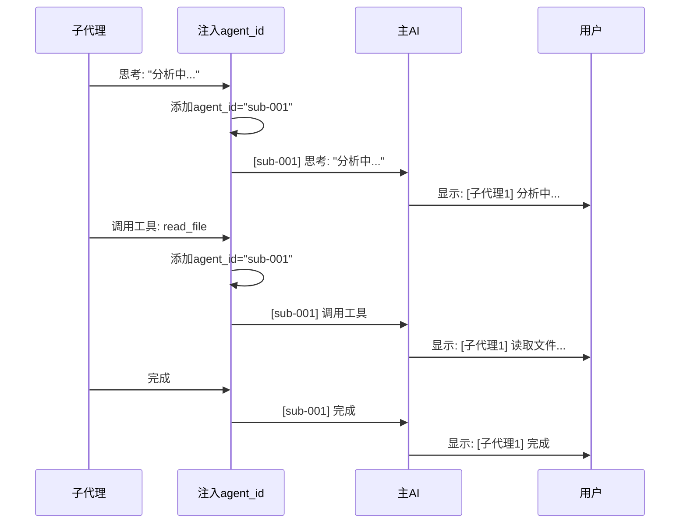

**WebSocket 模式下可接收的事件类型：**

| ChatEvent | 说明 |
|-----------|------|
| `subagent_started` | 子代理启动，附带任务描述 |
| `subagent_thinking` | 子代理的思考过程 |
| `subagent_tool_start` | 子代理开始调用工具 |
| `subagent_tool_end` | 子代理工具调用完成 |
| `subagent_content` | 子代理生成的内容片段 |
| `subagent_completed` | 子代理完成，返回结果摘要 |
| `subagent_error` | 子代理执行出错 |

**这样用户能看到：**
- `[子代理1]` 正在分析代码...
- `[子代理1]` 正在读取文件 main.py...
- `[子代理1]` 分析完成

---

## 实际使用场景

### 场景1：代码审查

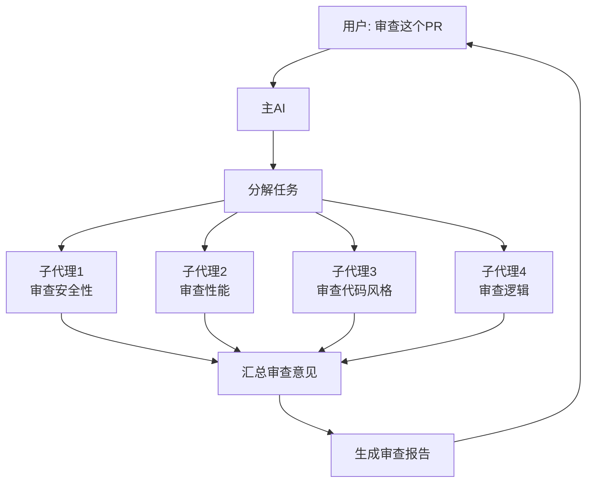

### 场景2：多数据源收集

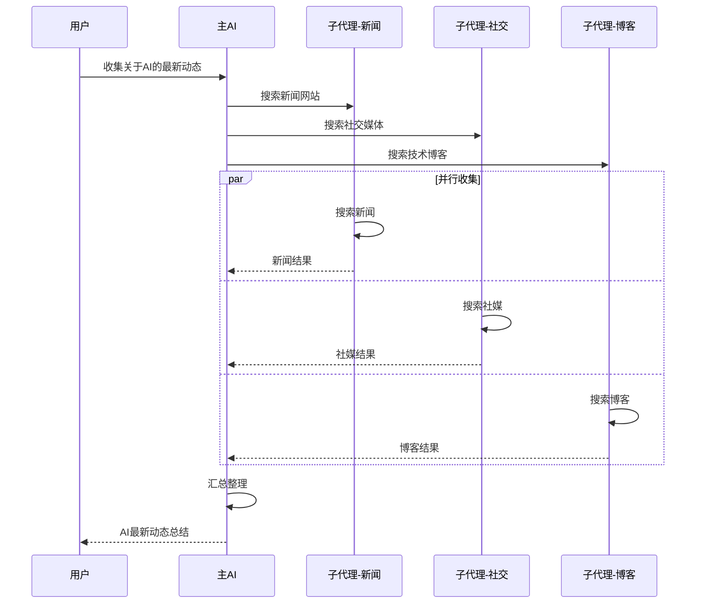

### 场景3：递归分解任务

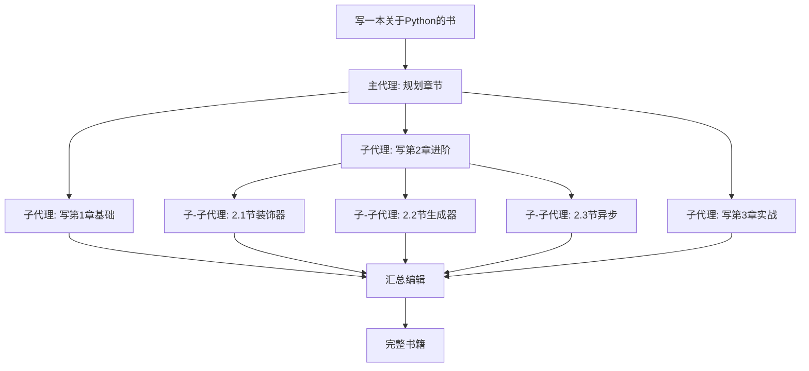

---

## 模型选择

子代理可以使用不同的 AI 模型：

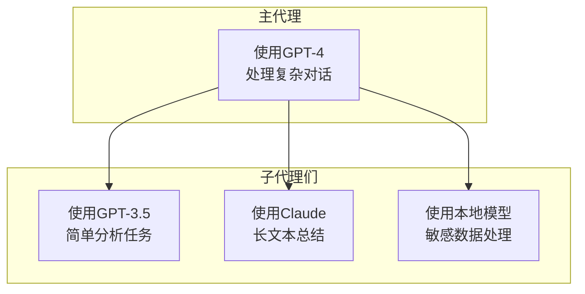

**策略：**
- 主任务用强模型（GPT-4/Claude-3）
- 简单子任务用快模型（GPT-3.5）
- 特定任务用专门模型（代码/CodeLlama）

---

## 超时和错误处理

```mermaid
flowchart TB
    subgraph 子代理执行
        Start[创建子代理] --> Run[开始执行]
        Run --> Timeout{超时?}
        
        Timeout -->|否| Complete[正常完成]
        Timeout -->|是|10分钟| Fail[超时失败]
        
        Run --> Error{出错?}
        Error -->|是| Fail
        Error -->|否| Complete
    end
    
    subgraph 主代理处理
        Complete --> Result[返回结果]
        Fail --> Retry[重试/跳过]
        Retry --> Result
    end
    
    style Timeout fill:#FFD700
    style Fail fill:#FFCDD2
    style Complete fill:#C8E6C9
```

**超时配置：**
- 子代理执行超时：`agents.defaults.subagent_timeout_secs`（默认 600 秒 = 10 分钟）
- 工具执行超时：`agents.defaults.tool_timeout_secs`（默认 120 秒）
- 失败返回错误信息，主代理决定是否重试

---

## 与工具系统集成

子代理本身就是通过 `spawn` 工具调用的：

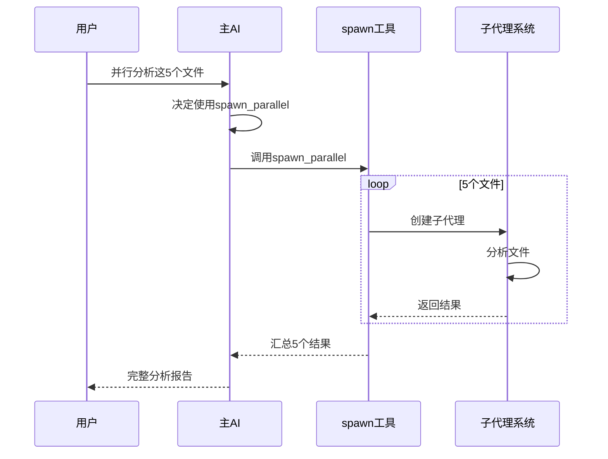

---

## 常见问题

**Q: 子代理和主代理共享记忆吗？**
A: 子代理是无状态的，不保存历史。但可以继承主代理的配置和上下文。

**Q: 可以创建多少个子代理？**
A: `spawn_parallel` 一次最多 10 个任务，内部最多 5 个并发执行。超过会报错。

**Q: 子代理可以创建子-子代理吗？**
A: 可以！支持递归创建，适合层层分解的复杂任务。

**Q: WebSocket 模式下能看到子代理的执行过程吗？**
A: 可以。子代理的思考、工具调用和内容生成会实时推送到前端，用户可以看到每个子代理的进度。

**Q: 子代理摘要太长怎么办？**
A: 可通过 `agents.defaults.ws_summary_limit` 限制摘要长度（字符数），0 表示不限制。
