# Tools System

> The "Hands and Feet" of AI

---

## One-Sentence Understanding

**Tools are AI's hands and feet** - they allow AI to interact with the outside world beyond just talking.

> Analogy: Like a person with hands can write, cook, and build; AI with tools can search, code, and execute commands.

---

## Why Do We Need Tools?

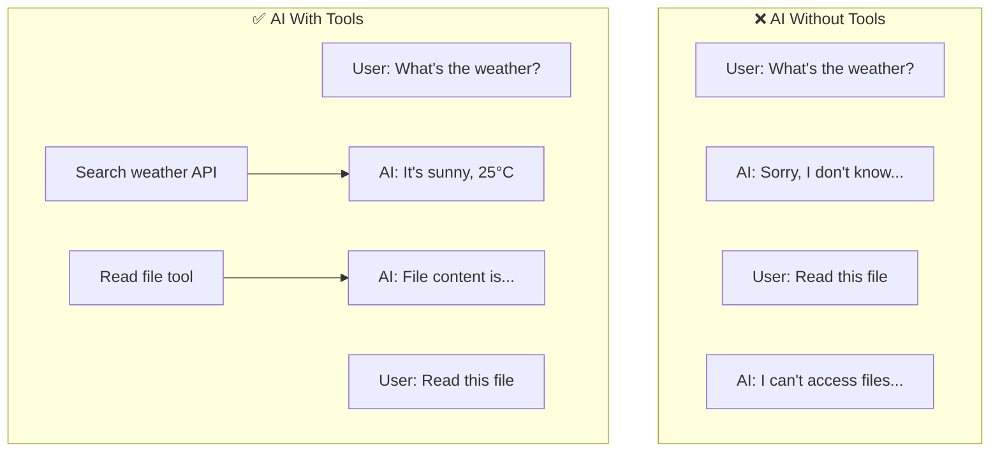

Without tools, AI is just a "brain in a jar" - smart but powerless.

---

## What Can Tools Do?

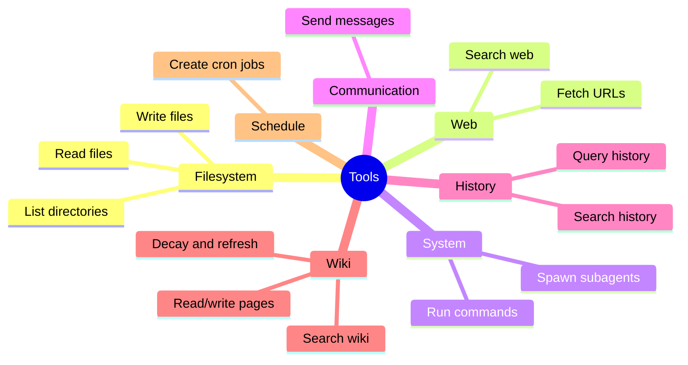

---

## Tool Categories

### 1. Filesystem Tools

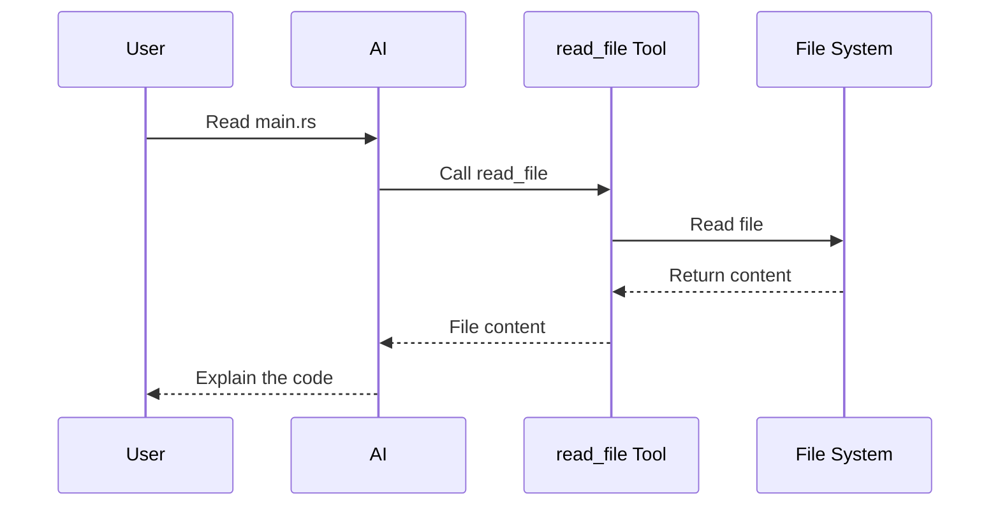

| Tool | Purpose | Example |
|------|---------|---------|
| `read_file` | Read file content | "Read config.yaml" |
| `write_file` | Create new file | "Create hello.py" |
| `edit_file` | Modify existing file | "Add function to main.rs" |
| `list_dir` | List directory | "Show files in src/" |

### 2. Web Tools

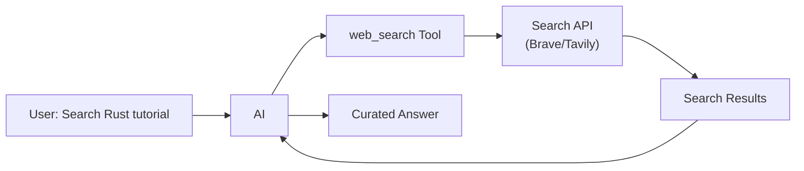

| Tool | Purpose | Example |
|------|---------|---------|
| `web_search` | Search the web | "Find latest Rust version" |
| `web_fetch` | Fetch specific URL | "Read this article" |

### 3. System Tools

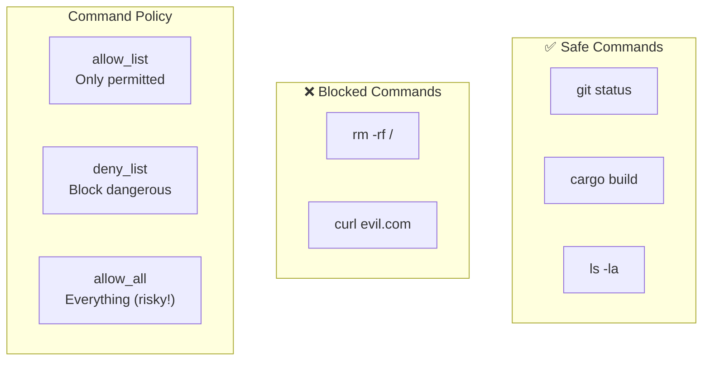

| Tool | Purpose | Safety |
|------|---------|--------|
| `exec` | Run shell commands | Configurable policy |
| `spawn` | Create subagent | Isolated execution, supports model selection |
| `spawn_parallel` | Create multiple subagents | Max 10 tasks, 5 concurrent |
| `new_session` | Start fresh session | Clears history, new session key |
| `clear_session` | Clear current session | Keeps session key |
| `message` | Send message to user | For cron/background tasks |

### 4. Communication Tools

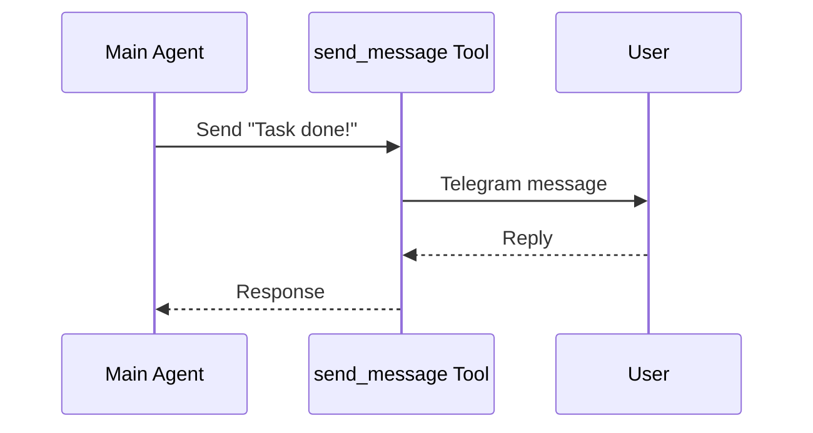

| Tool | Purpose | Example |
|------|---------|---------|
| `send_message` (`MessageTool`) | Send to channel | "Notify user on Telegram" |

### 5. History Query Tools

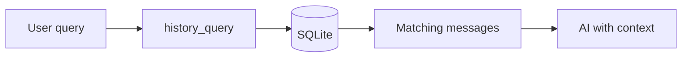

| Tool | Purpose | Example |
|------|---------|---------|
| `history_query` | Query conversation history by keywords | "What did I say yesterday?" |
| `history_search` | Semantic search through history (requires `embedding` feature) | "Find discussions about DB design" |

### 5.1 Wiki Tools

Wiki tools provide structured knowledge management powered by Tantivy BM25 full-text search and SQLite storage:

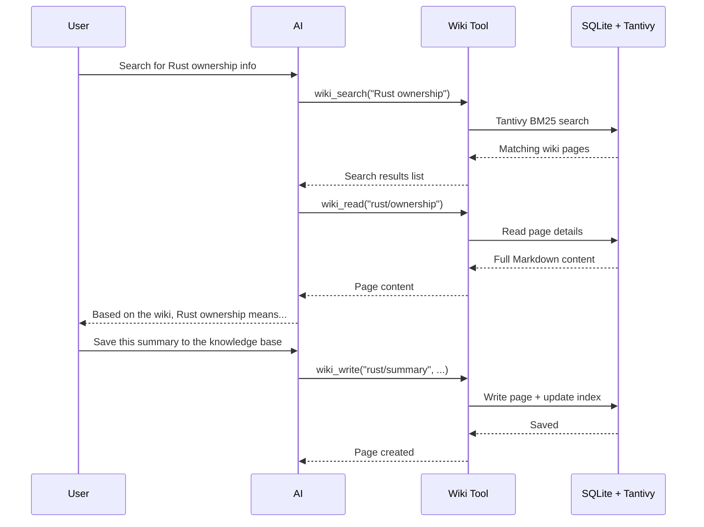

| Tool | Purpose | Parameters |
|------|---------|------------|
| `wiki_search` (`WikiSearchTool`) | Search wiki pages using Tantivy BM25 | `query` (required), `limit` (optional, default 10) |
| `wiki_write` (`WikiWriteTool`) | Write/update a wiki page | `path`, `title`, `content` (required), `page_type` (optional, default `"topic"`), `tags` (optional array) |
| `wiki_read` (`WikiReadTool`) | Read a wiki page by path | `path` (required). Returns full Markdown content with metadata. |
| `wiki_decay` (`WikiDecayTool`) | Run automated frequency decay on wiki pages | No parameters required. Zero LLM cost. Returns summary of scanned/decayed/errored pages. |
| `wiki_refresh` (`WikiRefreshTool`) | Sync on-disk Markdown files into SQLite and Tantivy | `action`: `"sync"` (incremental), `"reindex"` (full rebuild), `"stats"` (statistics) |

### 6. Schedule Tools

| Tool | Purpose | Example |
|------|---------|---------|
| `cron` | Create scheduled task | "Remind me daily at 9am" |
| `script` (`PluginTool`) | External script with YAML manifest | Custom business logic |

---

## How AI Uses Tools

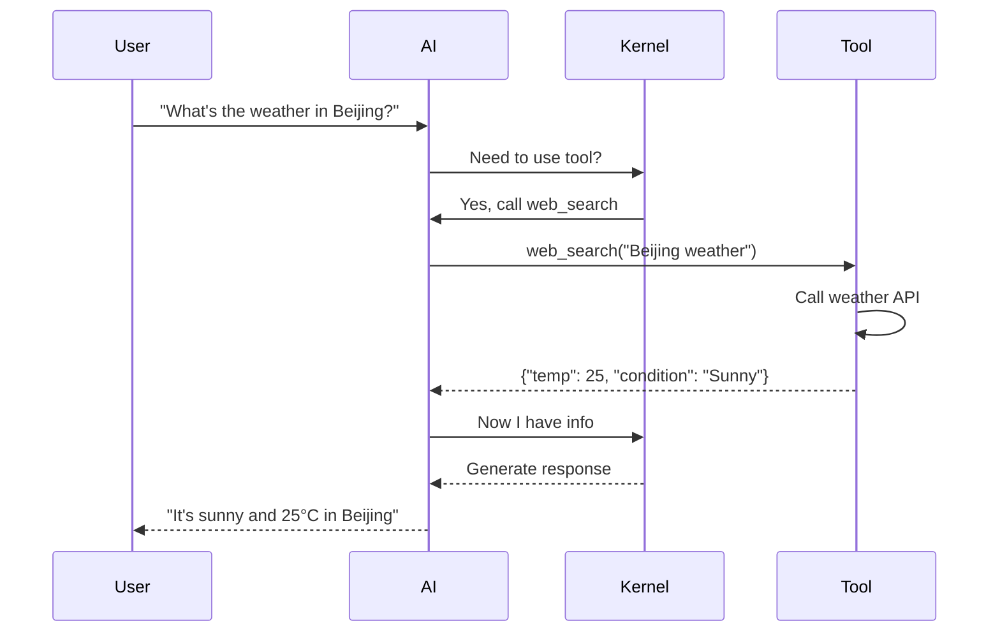

### Decision Flow

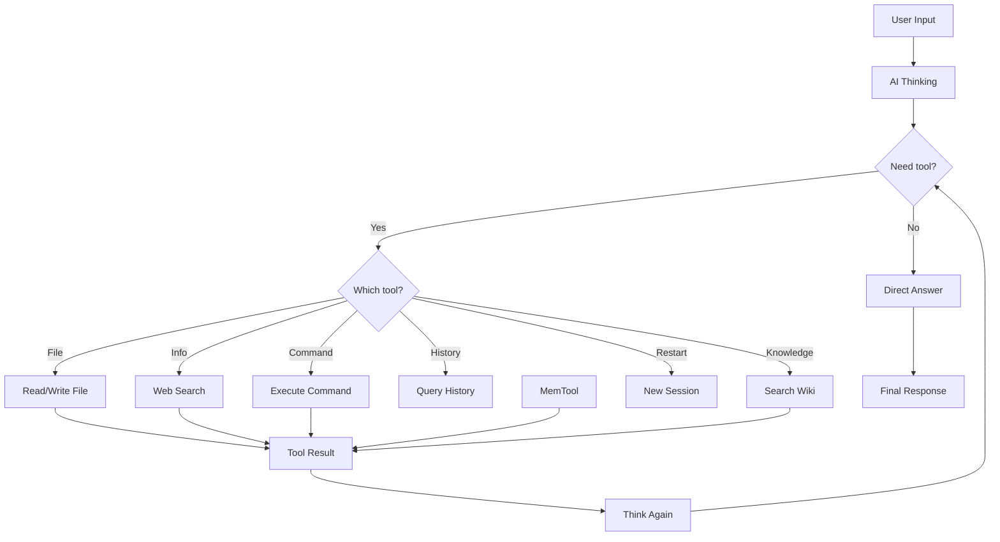

---

## Tool Execution

### Parallel Execution

When AI needs multiple tools, they run in parallel:

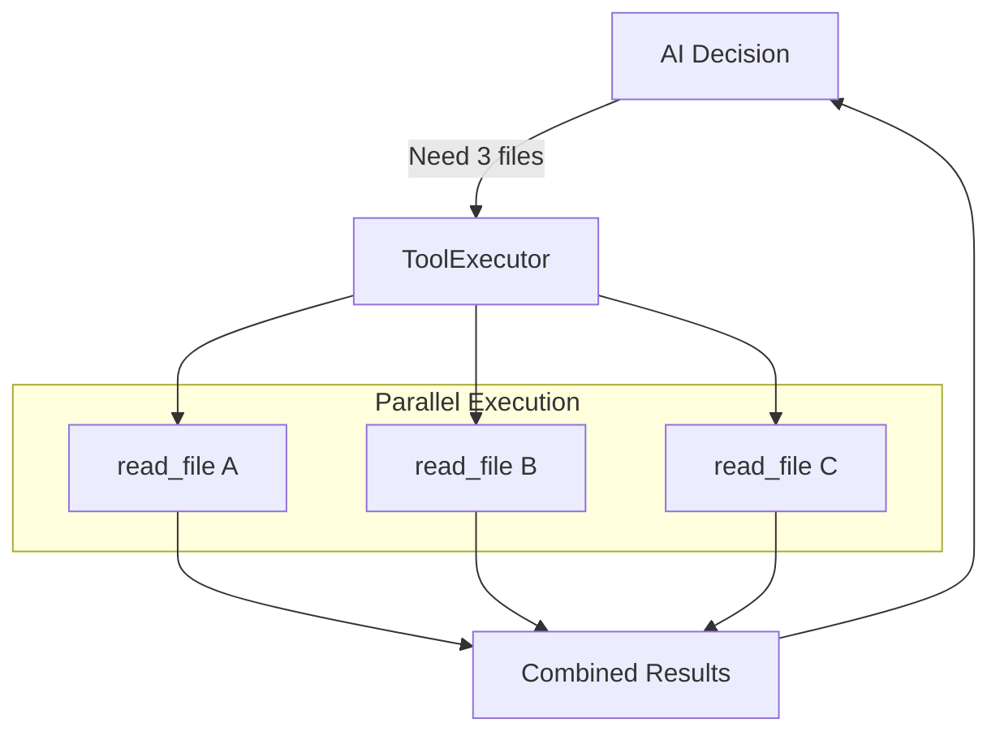

Example: "Compare file1.rs, file2.rs, and file3.rs"
- All three files are read simultaneously
- Results combined and sent back to AI

### Tool Context

Tools receive context about the current session:

```rust
struct ToolContext {
    session_key: SessionKey,     // Who is asking
    outbound_tx: Sender<OutboundMessage>, // Real-time message channel
    spawner: Arc<dyn SubagentSpawner>,    // Subagent spawner
    ws_summary_limit: usize,     // Subagent summary length limit (WebSocket)
    token_tracker: Arc<TokenTracker>,     // Token budget tracker
}
```

This allows tools to:
- Know which user/session
- Access allowed directories
- Respect configuration limits

---

## Tool Registry

All available tools are registered in a central registry:

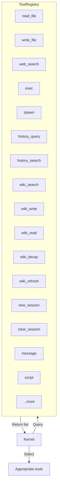

### Tool Execution Signature

All tools implement the `Tool` trait. The `ctx` parameter is **required**:

```rust
async fn execute(&self, args: Value, ctx: &ToolContext) -> ToolResult;
```

### Tool Definition Format

Each tool defines:

```json
{
  "name": "read_file",
  "description": "Read content of a file",
  "parameters": {
    "type": "object",
    "properties": {
      "path": {
        "type": "string",
        "description": "Path to the file"
      }
    },
    "required": ["path"]
  }
}
```

This is the **JSON Schema** that tells AI how to use the tool.

---

## Tool Approval System

Gasket includes a **tool execution approval** mechanism to prevent AI from executing dangerous operations without confirmation.

### Approval Flow

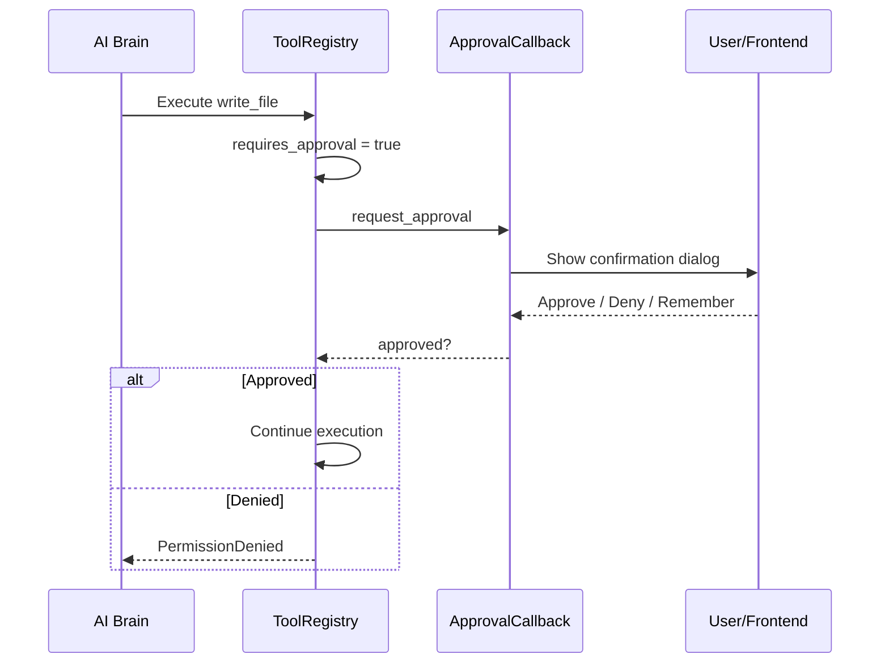

### Tools Requiring Approval

The following tools require user confirmation by default:

| Tool | Category | Description |
|------|----------|-------------|
| `write_file` | Filesystem | Create or overwrite files |
| `edit_file` | Filesystem | Modify existing files |
| `exec` | System | Execute shell commands |
| `new_session` | Session | Clear history and create new session |
| `clear_session` | Session | Clear current session history |
| `wiki_delete` | Wiki | Delete wiki pages |

**Remember Decision**: In WebSocket frontend, users can check "Remember this decision" to auto-approve/deny future calls of the same tool in the same session.

### No-Approval Tools

The following read-only tools execute without confirmation:

- `read_file`, `list_dir`, `web_search`, `web_fetch`
- `wiki_search`, `wiki_read`, `history_query`
- `spawn`, `spawn_parallel`

---

## Safety Design

### Command Policy

```yaml
tools:
  exec:
    policy:
      allowlist: ["git", "cargo", "ls", "cat"]
      denylist: ["rm", "sudo"]
```

| Policy | Description | Risk Level |
|--------|-------------|------------|
| `allowlist` | Only allow specific commands | 🟢 Low |
| `denylist` | Block dangerous commands | 🟡 Medium |
| `allow_all` | Allow everything | 🔴 High |

### Path Restrictions

Enable `restrict_to_workspace` to limit file operations to the workspace directory:

```yaml
tools:
  restrict_to_workspace: true
```

---

## MCP: External Tools

Model Context Protocol allows connecting external tool servers:

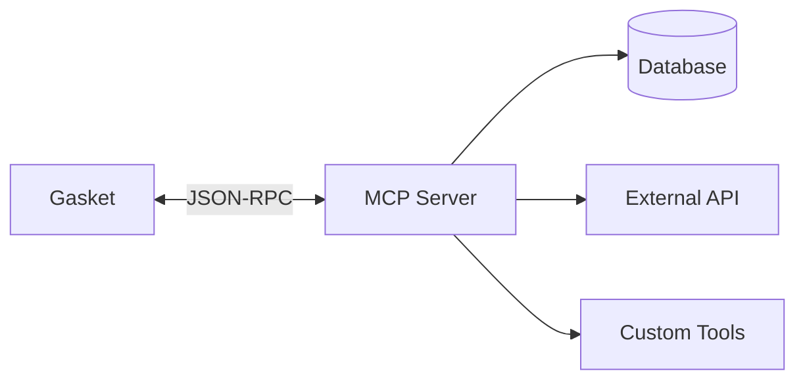

Example MCP servers:
- Database query tools
- GitHub integration
- Custom business tools

---

## Related Modules

- **Kernel**: Decides when to use tools
- **Sandbox**: Isolates tool execution
- **Session**: Provides tool context
