# Tools System

> The "Hands and Feet" of AI

---

## One-Sentence Understanding

**Tools are AI's hands and feet** - they allow AI to interact with the outside world beyond just talking.

> Analogy: Like a person with hands can write, cook, and build; AI with tools can search, code, and execute commands.

---

## Why Do We Need Tools?

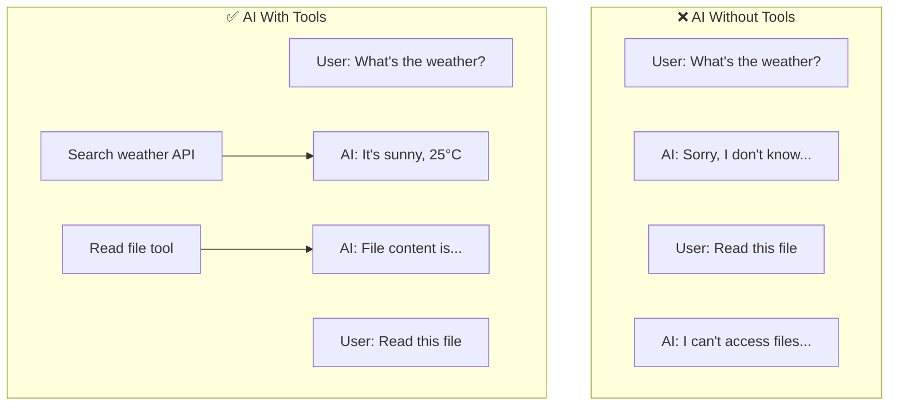

Without tools, AI is just a "brain in a jar" - smart but powerless.

---

## What Can Tools Do?

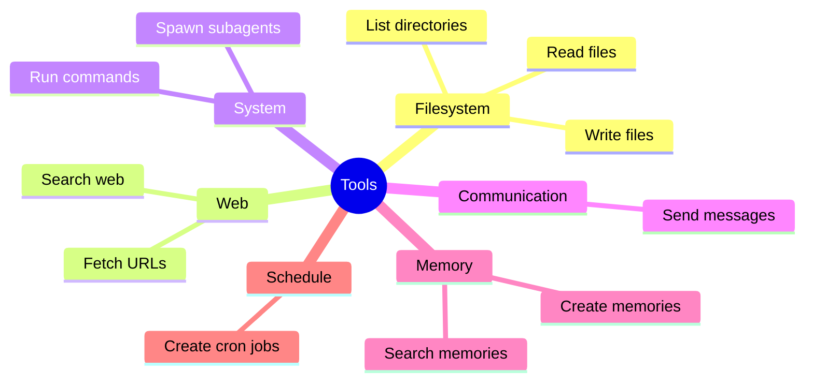

---

## Tool Categories

### 1. Filesystem Tools

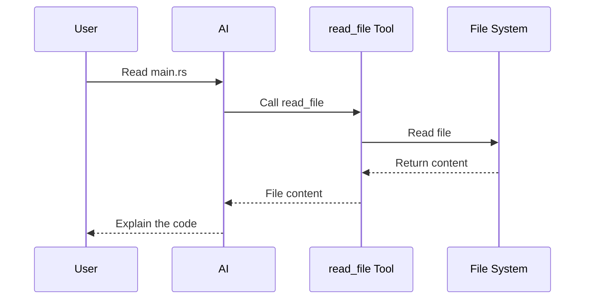

| Tool | Purpose | Example |
|------|---------|---------|
| `read_file` | Read file content | "Read config.yaml" |
| `write_file` | Create new file | "Create hello.py" |
| `edit_file` | Modify existing file | "Add function to main.rs" |
| `list_dir` | List directory | "Show files in src/" |

### 2. Web Tools

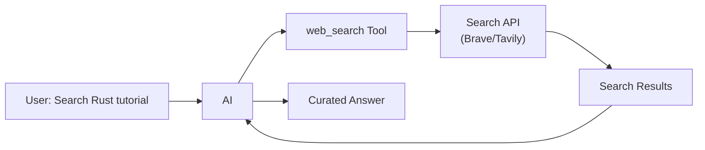

| Tool | Purpose | Example |
|------|---------|---------|
| `web_search` | Search the web | "Find latest Rust version" |
| `web_fetch` | Fetch specific URL | "Read this article" |

### 3. System Tools

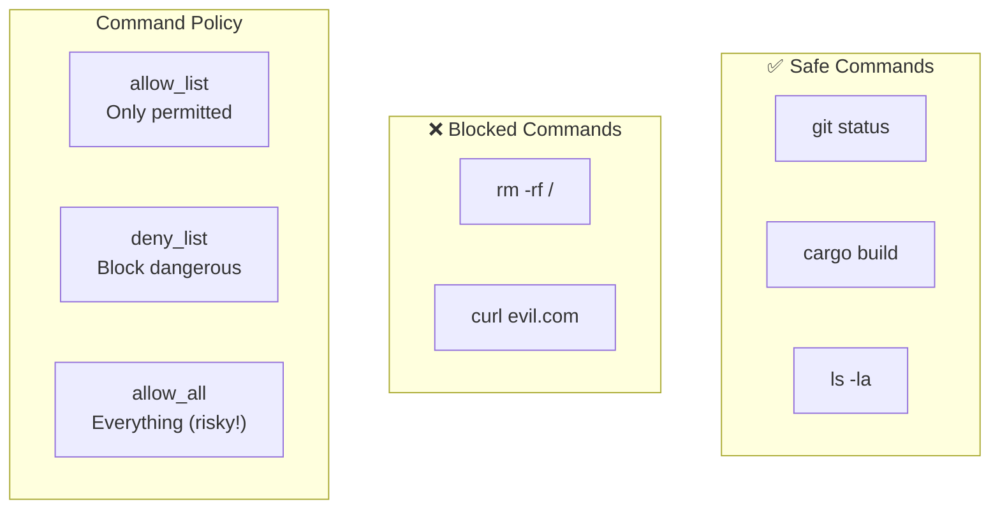

| Tool | Purpose | Safety |
|------|---------|--------|
| `exec` | Run shell commands | Configurable policy |
| `spawn` | Create subagent | Isolated execution |

### 4. Communication Tools

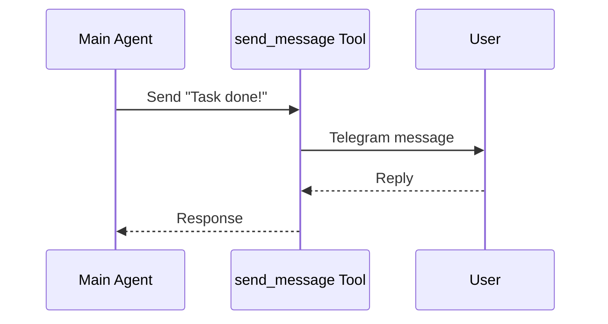

| Tool | Purpose | Example |
|------|---------|---------|
| `send_message` | Send to channel | "Notify user on Telegram" |

### 5. Memory Tools

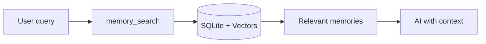

| Tool | Purpose | Example |
|------|---------|---------|
| `memory_search` | Search long-term memory | "What did I learn about DB?" |
| `memorize` | Create new memory | "Remember my API key is..." |

### 6. Schedule Tools

| Tool | Purpose | Example |
|------|---------|---------|
| `cron` | Create scheduled task | "Remind me daily at 9am" |

---

## How AI Uses Tools

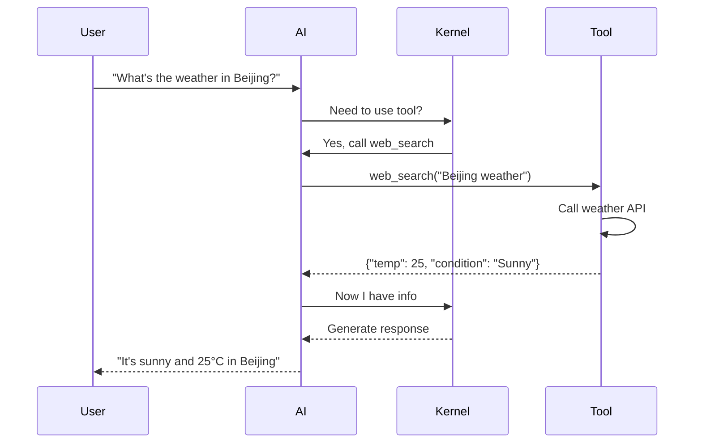

### Decision Flow

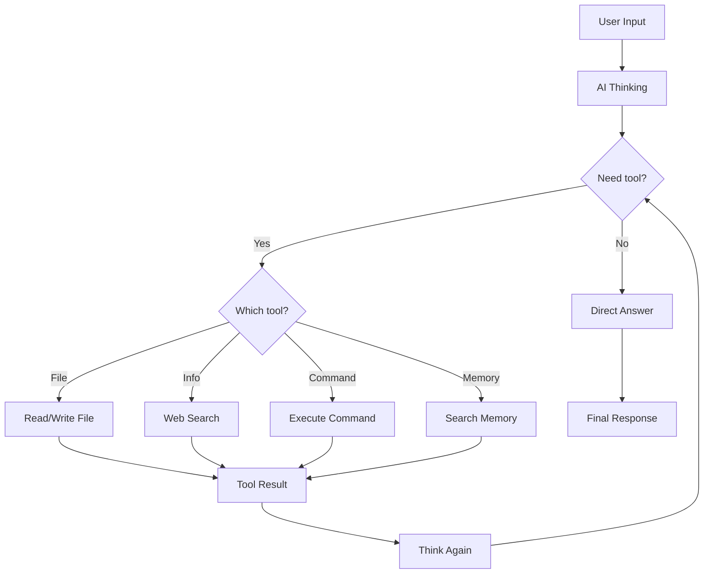

---

## Tool Execution

### Parallel Execution

When AI needs multiple tools, they run in parallel:

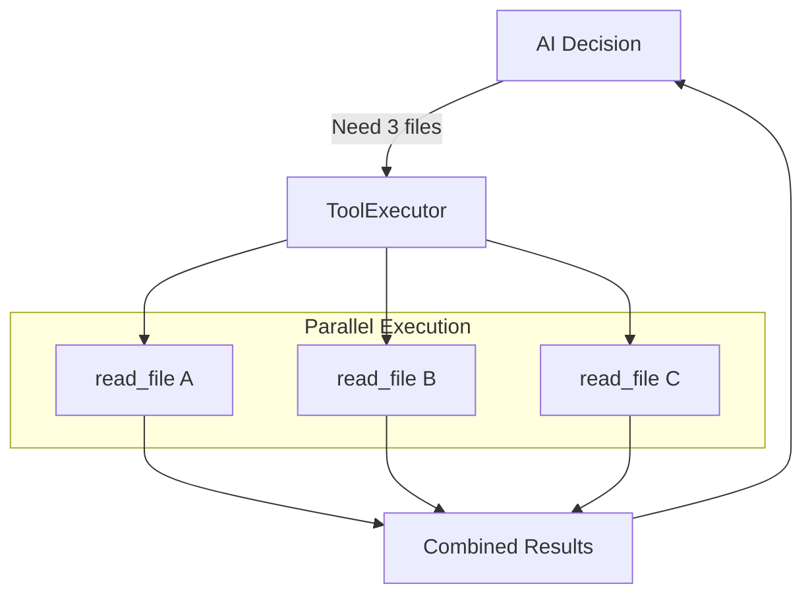

Example: "Compare file1.rs, file2.rs, and file3.rs"
- All three files are read simultaneously
- Results combined and sent back to AI

### Tool Context

Tools receive context about the current session:

```rust
struct ToolContext {
    session_key: SessionKey,    // Who is asking
    workspace: PathBuf,          // Working directory
    config: ToolConfig,          // Tool settings
}
```

This allows tools to:
- Know which user/session
- Access allowed directories
- Respect configuration limits

---

## Tool Registry

All available tools are registered in a central registry:

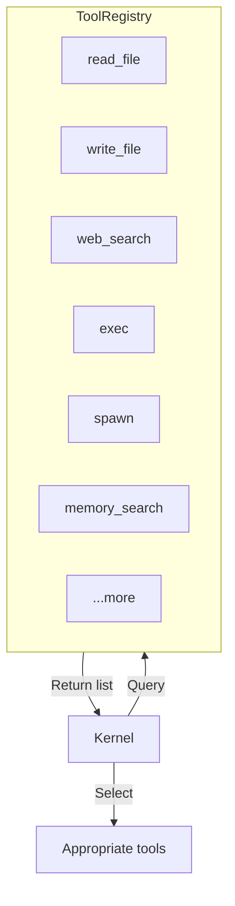

### Tool Definition Format

Each tool defines:

```json
{
  "name": "read_file",
  "description": "Read content of a file",
  "parameters": {
    "type": "object",
    "properties": {
      "path": {
        "type": "string",
        "description": "Path to the file"
      }
    },
    "required": ["path"]
  }
}
```

This is the **JSON Schema** that tells AI how to use the tool.

---

## Safety Design

### Command Policy

```yaml
tools:
  exec:
    command_policy: allow_list  # Safest option
    allowed_commands:
      - git
      - cargo
      - ls
      - cat
```

| Policy | Description | Risk Level |
|--------|-------------|------------|
| `allow_list` | Only allow specific commands | 🟢 Low |
| `deny_list` | Block dangerous commands | 🟡 Medium |
| `allow_all` | Allow everything | 🔴 High |

### Path Restrictions

```yaml
tools:
  filesystem:
    allowed_paths:
      - "~/projects/"
      - "~/.gasket/"
    blocked_paths:
      - "~/.ssh/"
      - "/etc/"
```

---

## MCP: External Tools

Model Context Protocol allows connecting external tool servers:

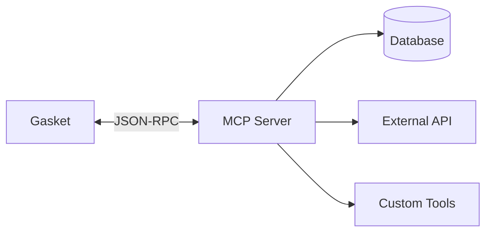

Example MCP servers:
- Database query tools
- GitHub integration
- Custom business tools

---

## Related Modules

- **Kernel**: Decides when to use tools
- **Sandbox**: Isolates tool execution
- **Session**: Provides tool context
