# 工具系统

> AI 的百宝箱——让 AI 能操作电脑、访问网络、管理文件

---

## 一句话理解

工具就是 AI 的**手和脚**，让 AI 不仅能"说话"，还能"做事"。

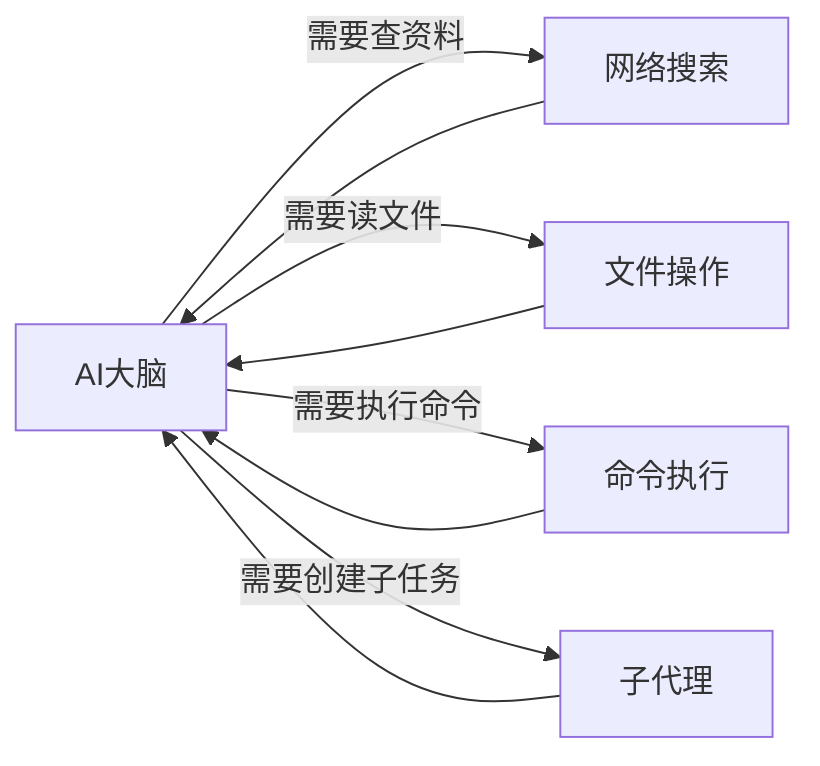

---

## 为什么需要工具？

没有工具的 AI 就像一个**只有大脑、没有手脚**的人：

| 场景 | 没有工具 | 有工具 |
|------|---------|--------|
| 查今天天气 | "我无法获取实时信息" | [搜索网络] "今天北京25°C" |
| 分析你的代码 | "请把代码贴给我" | [读取文件] 直接分析项目 |
| 执行数据处理 | "请手动运行脚本" | [执行命令] 自动处理 |
| 获取最新新闻 | "我的知识截止到..." | [搜索网络] 获取实时新闻 |

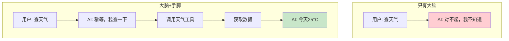

---

## 工具分类

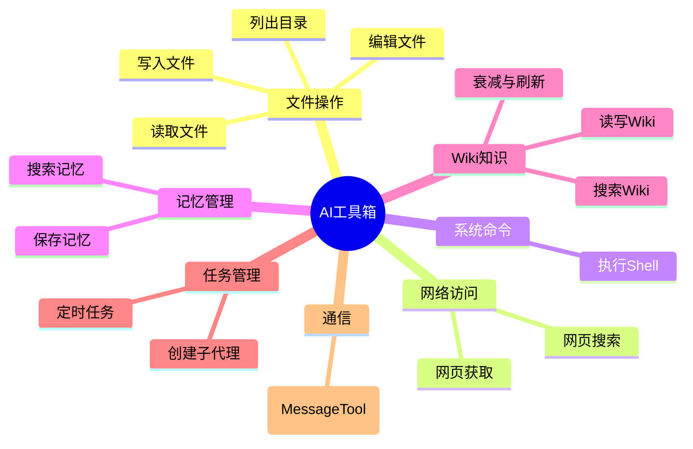

---

## 各类工具详解

### 1. 文件操作工具

让 AI 能读写你电脑上的文件：

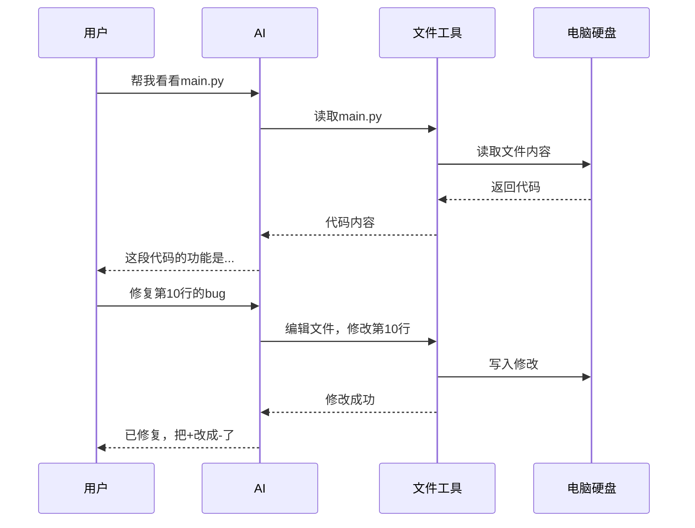

**包含的工具：**
- `read_file` - 读取文件内容
- `write_file` - 创建/覆盖文件
- `edit_file` - 修改文件部分内容
- `list_dir` - 查看文件夹内容

**使用场景：**
- 代码审查和修改
- 配置文件编辑
- 批量文件处理
- 项目结构分析

### 2. 网络工具

让 AI 能上网查资料：

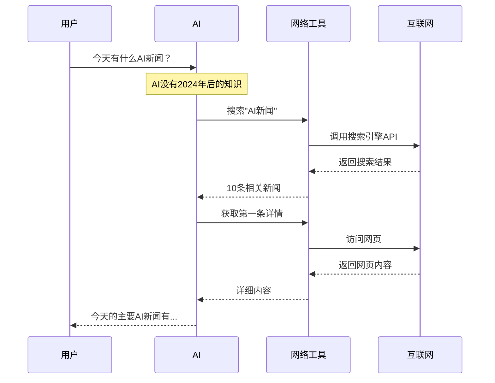

**包含的工具：**
- `web_search` - 搜索引擎（Brave/Tavily/Exa）
- `web_fetch` - 获取特定网页内容

**使用场景：**
- 获取实时信息
- 查阅最新文档
- 研究某个话题
- 验证事实

### 3. Shell 执行工具

让 AI 能执行系统命令：

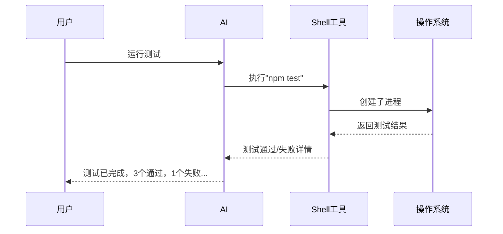

**包含的工具：**
- `exec` - 执行 Shell 命令（带安全限制）

**使用场景：**
- 运行测试
- 构建项目
- 执行数据处理脚本
- 系统管理任务

**安全保护：**
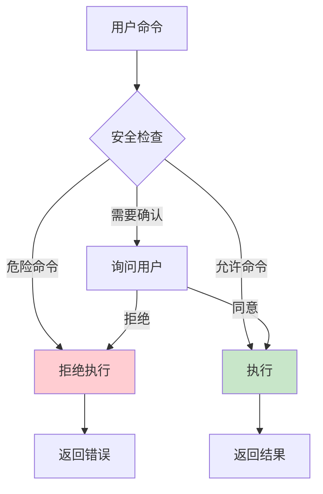

### 4. 历史查询工具

让 AI 能查询当前会话的对话历史：

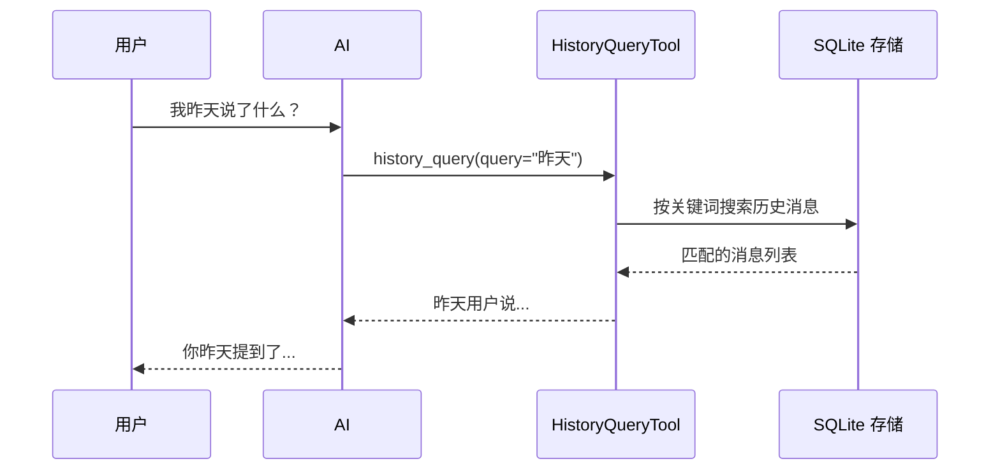

**包含的工具：**
- `history_query` - 按关键词查询当前会话的对话历史（SQLite 本地搜索）
- `history_search` - 语义搜索历史对话（需要 `embedding` 特性）

### 4.1 Wiki 知识工具

让 AI 能读写和检索结构化知识库（基于 Tantivy BM25 全文搜索 + SQLite 存储）：

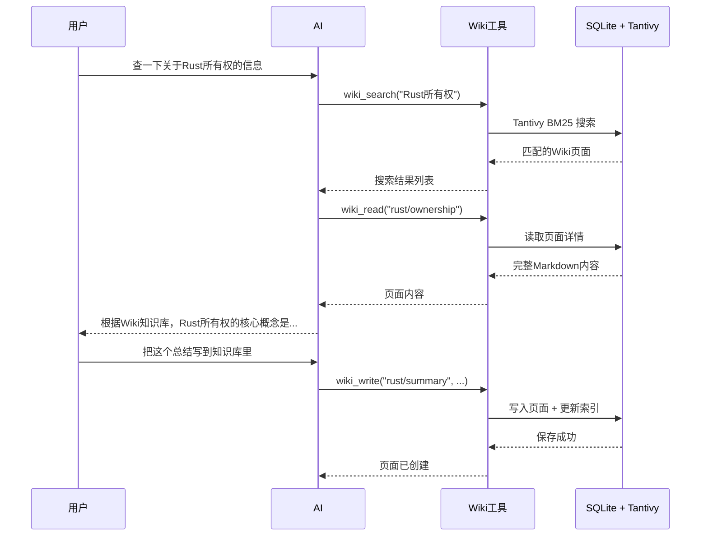

**包含的工具：**
- `wiki_search` (`WikiSearchTool`) - 使用 Tantivy BM25 搜索 Wiki 页面。参数：`query`（必填，搜索关键词），`limit`（可选，默认 10）。返回格式化的搜索结果。
- `wiki_write` (`WikiWriteTool`) - 写入/更新 Wiki 页面。参数：`path`、`title`、`content`（必填），`page_type`（可选，默认 `"topic"`），`tags`（可选，数组）。
- `wiki_read` (`WikiReadTool`) - 按路径读取 Wiki 页面。参数：`path`（必填）。返回完整 Markdown 内容及元数据。
- `wiki_decay` (`WikiDecayTool`) - 运行自动化频率衰减，零 LLM 消耗。返回扫描/衰减/错误的页面统计。
- `wiki_refresh` (`WikiRefreshTool`) - 将磁盘 Markdown 文件同步到 SQLite 和 Tantivy。参数：`action` - `"sync"`（增量同步）、`"reindex"`（完全重建）、`"stats"`（统计信息）。

### 5. 子代理工具

让 AI 能创建"分身"处理复杂任务，支持**实时流式事件**和**模型选择**：

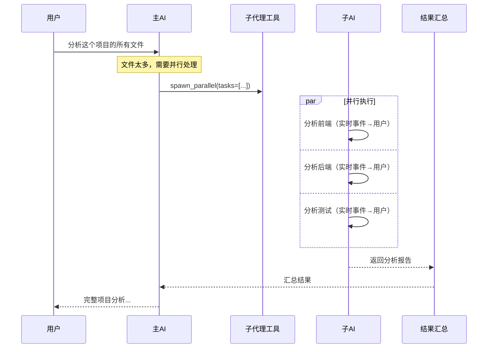

**包含的工具：**
- `spawn` - 创建单个子代理
  - 参数：`task`（任务描述，必填），`model_id`（可选，使用模型配置中的 profile ID）
- `spawn_parallel` - 并行创建最多 10 个子代理
  - 参数：`tasks`（任务列表，必填），支持简单字符串数组或带 `model_id` 的对象数组
  - 并发限制：最多 5 个同时执行，防止 API 限流

**实时流式事件（WebSocket 模式）：**

在 WebSocket 模式下，子代理的执行过程会实时推送到前端：

| 事件 | 说明 |
|------|------|
| `subagent_started` | 子代理启动，附带任务描述 |
| `subagent_thinking` | 子代理的思考过程 |
| `subagent_tool_start` | 子代理开始调用工具 |
| `subagent_tool_end` | 子代理工具调用完成 |
| `subagent_content` | 子代理生成的内容片段 |
| `subagent_completed` | 子代理完成，返回结果摘要 |

可通过 `agents.defaults.ws_summary_limit` 控制摘要长度（0 = 完整返回）。

### 6. 会话管理工具

**包含的工具：**
- `new_session` - 开启新会话，清空当前会话的所有历史消息和摘要，生成新的 session key
- `clear_session` - 清空当前会话历史（保留 session key）

### 7. 消息工具

- `message` (`MessageTool`) - 向用户发送消息（用于 Cron 等后台任务主动推送）

### 工具执行签名

所有工具通过统一的 `Tool` trait 执行，`ctx` 参数是**必需**的：

```rust
async fn execute(&self, args: Value, ctx: &ToolContext) -> ToolResult;
```

### 6. 定时任务工具

让 AI 能管理定时任务：

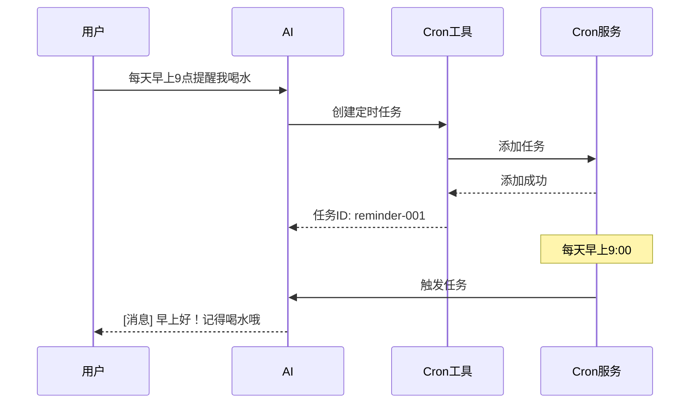

**包含的工具：**
- `cron` - 管理定时任务（增删改查）
- `script` (`PluginTool`) - 外部脚本工具（通过 YAML manifest 声明）

---

## 工具注册表

所有工具都登记在一个"工具箱"里：

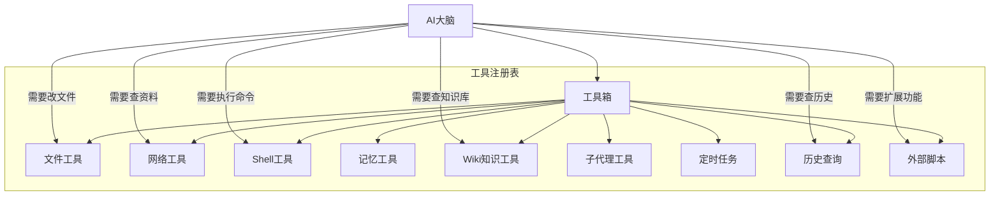

### 语义路由

AI 会自动选择最合适的工具：

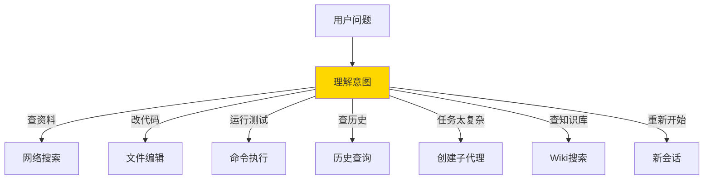

---

## 工具执行流程

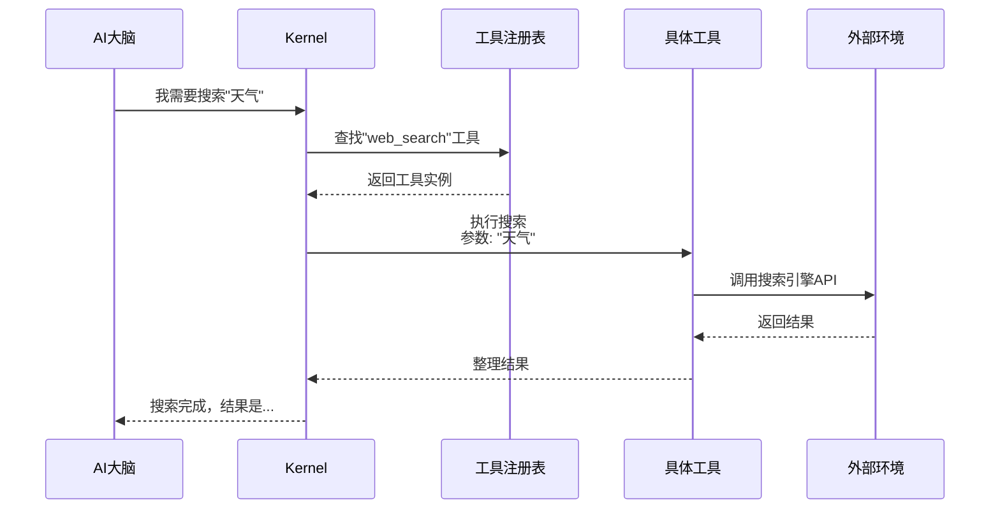

---

## 工具使用示例

### 示例1：复杂编程任务

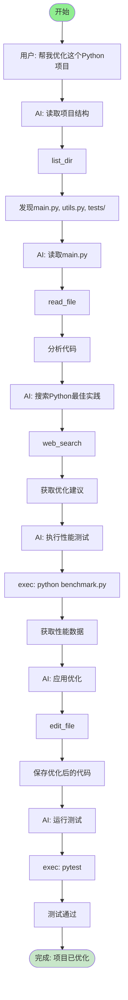

### 示例2：研究性任务

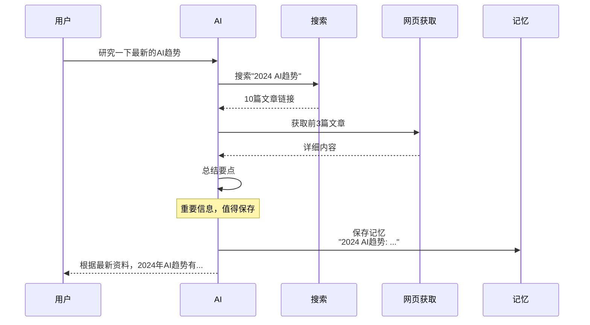

---

## MCP 工具扩展

Gasket 还支持**外部工具服务**（MCP）：

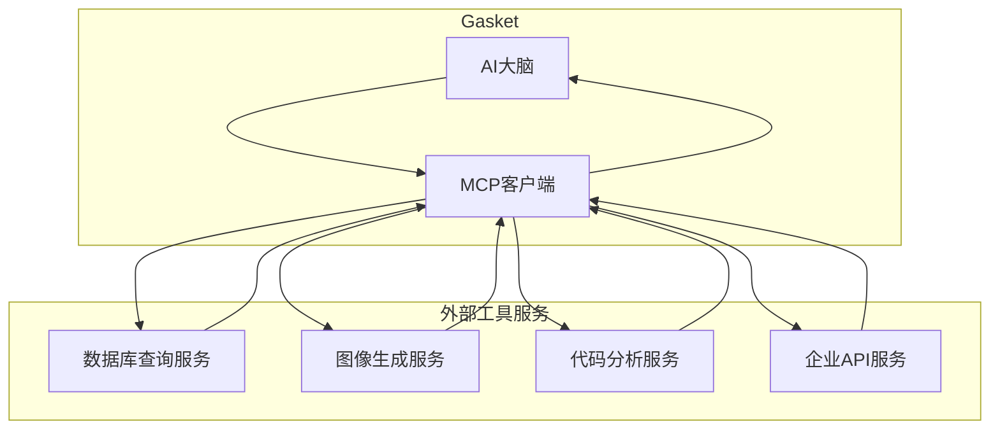

**举例：**
- 连接公司内部的员工查询系统
- 连接专业的图像生成 AI
- 连接数据库执行 SQL 查询

---

## 工具审批系统

Gasket 内置了**工具执行审批**机制，防止 AI 在未经确认的情况下执行危险操作。

### 审批流程

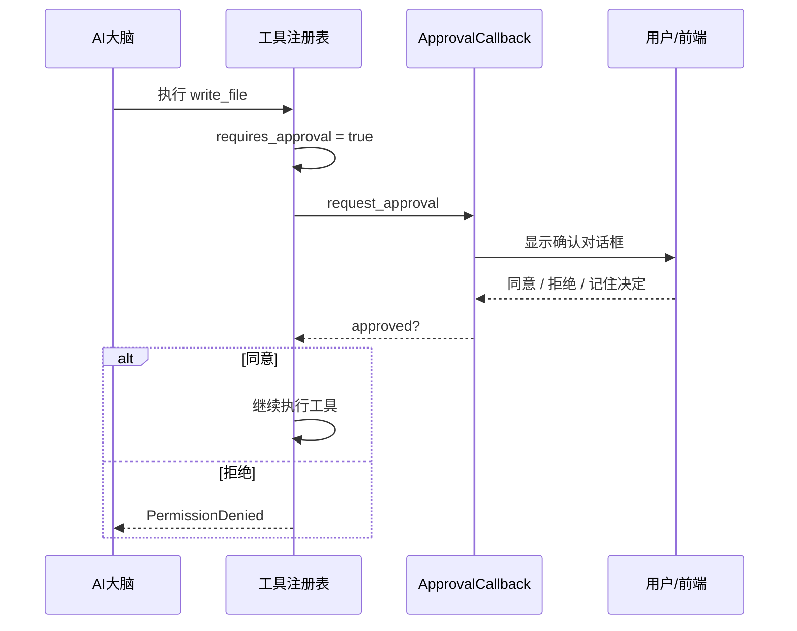

### 需要审批的工具

以下工具默认需要用户确认（WebSocket 模式显示确认对话框，CLI 模式直接执行）：

| 工具 | 类别 | 说明 |
|------|------|------|
| `write_file` | 文件系统 | 创建或覆盖文件 |
| `edit_file` | 文件系统 | 修改现有文件 |
| `exec` | 系统 | 执行 Shell 命令 |
| `new_session` | 会话 | 清空历史并新建会话 |
| `clear_session` | 会话 | 清空当前会话历史 |
| `wiki_delete` | Wiki | 删除 Wiki 页面 |

**记住决策**：在 WebSocket 前端可以勾选"记住此决定"，同一会话中再次调用相同工具时将自动通过/拒绝。

### 免审批工具

以下只读工具无需确认，直接执行：

- `read_file`, `list_dir`, `web_search`, `web_fetch`
- `wiki_search`, `wiki_read`, `history_query`
- `spawn`, `spawn_parallel`

---

## 常见问题

**Q: AI 能随便执行任何命令吗？**
A: 不能。`exec` 等危险工具默认需要用户确认。可通过 `tools.exec.policy` 配置命令白名单/黑名单进一步限制。

**Q: AI 能访问我电脑上的所有文件吗？**
A: 默认可以访问任意路径，但可通过 `tools.restrict_to_workspace: true` 限制仅允许访问工作空间目录。

**Q: 工具执行失败怎么办？**
A: AI 会收到错误信息，然后决定重试、换种方式、或告诉用户出错了。

**Q: 怎么知道 AI 用了什么工具？**
A: 在流式输出中可以看到工具调用信息，比如"正在搜索..."、"正在读取文件..."。WebSocket 模式下还能实时看到子代理的执行进度。
