# 工具系统

> AI 的百宝箱——让 AI 能操作电脑、访问网络、管理文件

---

## 一句话理解

工具就是 AI 的**手和脚**，让 AI 不仅能"说话"，还能"做事"。

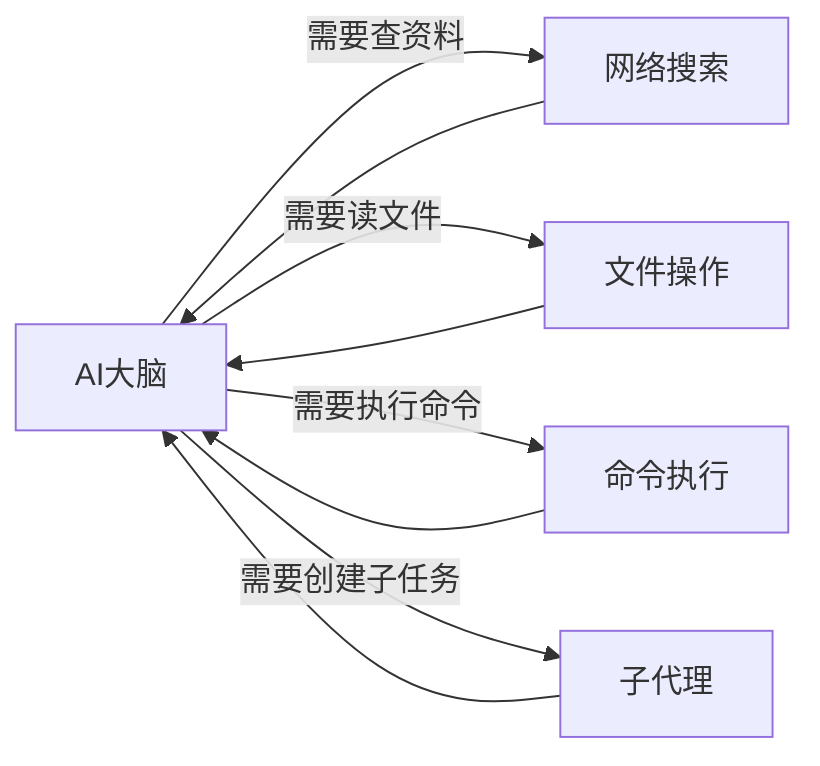

---

## 为什么需要工具？

没有工具的 AI 就像一个**只有大脑、没有手脚**的人：

| 场景 | 没有工具 | 有工具 |
|------|---------|--------|
| 查今天天气 | "我无法获取实时信息" | [搜索网络] "今天北京25°C" |
| 分析你的代码 | "请把代码贴给我" | [读取文件] 直接分析项目 |
| 执行数据处理 | "请手动运行脚本" | [执行命令] 自动处理 |
| 获取最新新闻 | "我的知识截止到..." | [搜索网络] 获取实时新闻 |

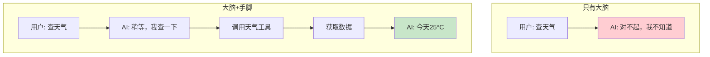

---

## 工具分类

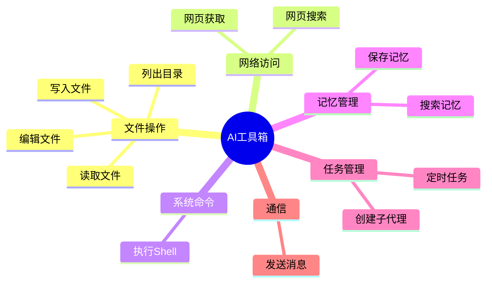

---

## 各类工具详解

### 1. 文件操作工具

让 AI 能读写你电脑上的文件：

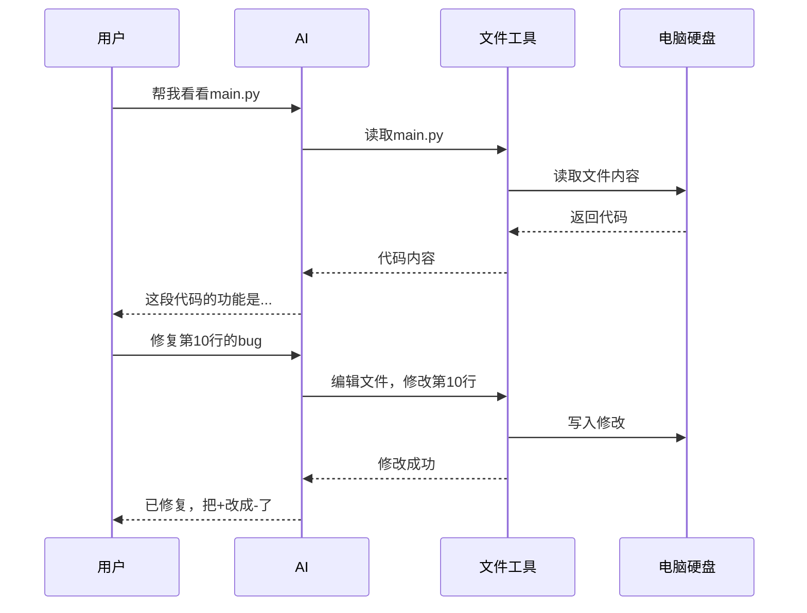

**包含的工具：**
- `read_file` - 读取文件内容
- `write_file` - 创建/覆盖文件
- `edit_file` - 修改文件部分内容
- `list_dir` - 查看文件夹内容

**使用场景：**
- 代码审查和修改
- 配置文件编辑
- 批量文件处理
- 项目结构分析

### 2. 网络工具

让 AI 能上网查资料：

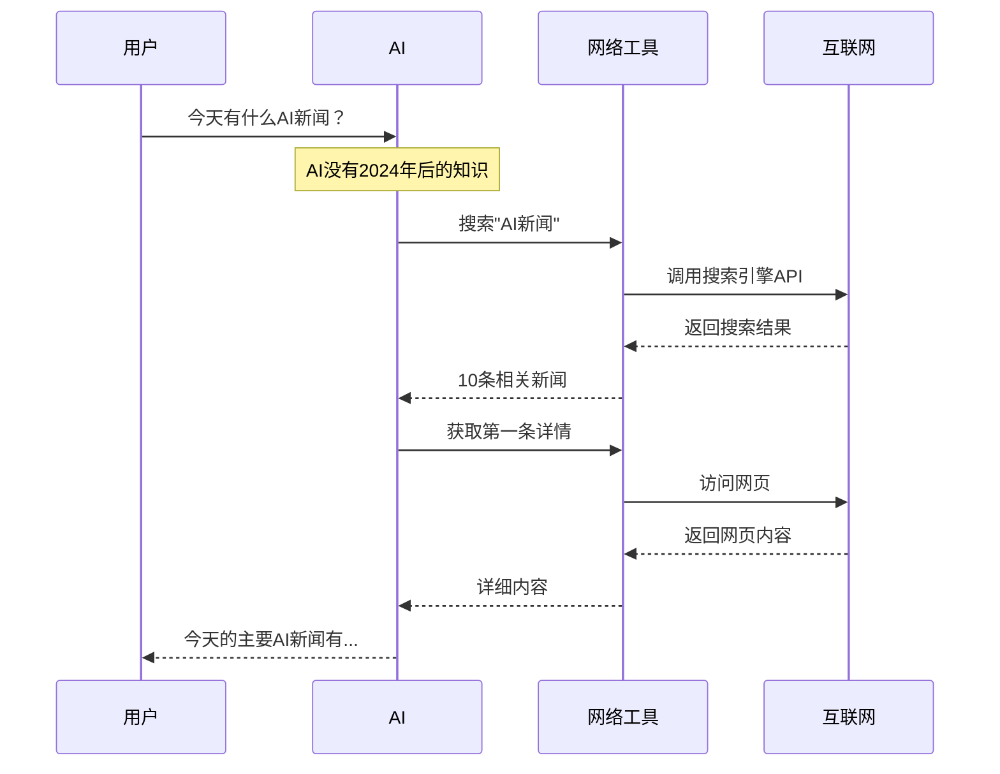

**包含的工具：**
- `web_search` - 搜索引擎（Brave/Tavily/Exa）
- `web_fetch` - 获取特定网页内容

**使用场景：**
- 获取实时信息
- 查阅最新文档
- 研究某个话题
- 验证事实

### 3. Shell 执行工具

让 AI 能执行系统命令：

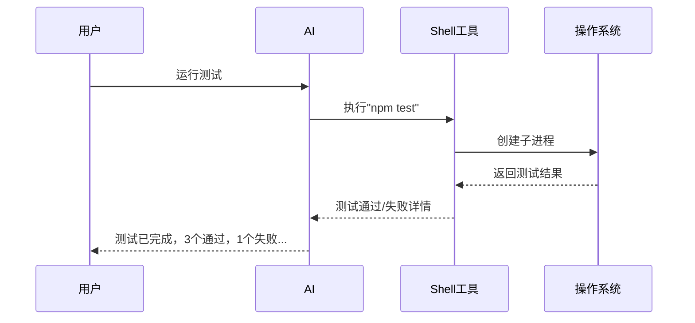

**包含的工具：**
- `exec` - 执行 Shell 命令（带安全限制）

**使用场景：**
- 运行测试
- 构建项目
- 执行数据处理脚本
- 系统管理任务

**安全保护：**
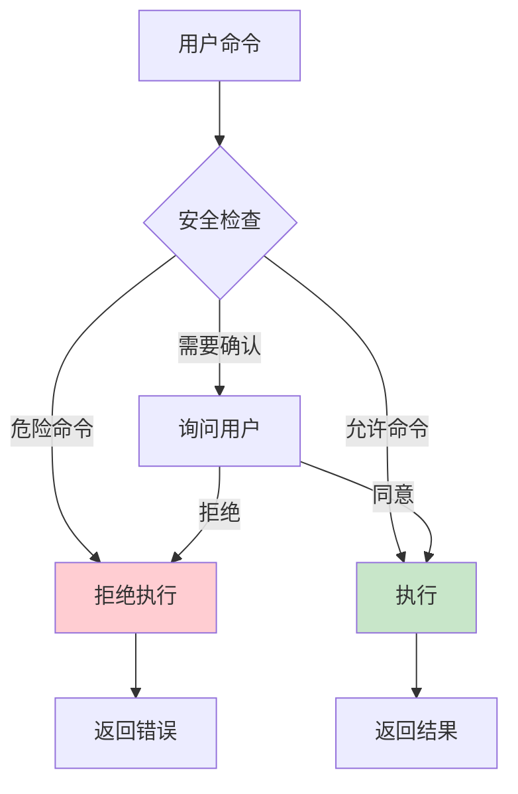

### 4. 记忆工具

让 AI 能读写长期记忆：

```mermaid
sequenceDiagram
    participant U as 用户
    participant AI as AI
    participant M as 记忆工具
    participant Store as 记忆存储
    
    U->>AI: 我叫小明，做后端开发
    
    Note over AI: 判断这是重要信息
    
    AI->>M: 保存记忆 (type: note/skill)
    Note over M: 判断类型：事实→note，流程→skill
    M->>Store: 写入对应抽屉
    M-->>AI: 保存成功 (type: note)
    
    ...第二天...
    
    U->>AI: 帮我写段代码
    AI->>M: 搜索用户相关信息
    M->>Store: 查询记忆
    Store-->>M: 小明，后端开发
    M-->>AI: 用户信息
    
    Note over AI: 根据用户背景调整回答
    
    AI-->>U: 小明，这段后端代码...
```

**包含的工具：**
- `memory_search` - 搜索记忆
- `memorize` - 保存新记忆（支持 `memory_type`: `"note"` 或 `"skill"`）
- `memory_decay` - 清理旧记忆
- `memory_refresh` - 刷新记忆索引

### 5. 子代理工具

让 AI 能创建"分身"处理复杂任务：

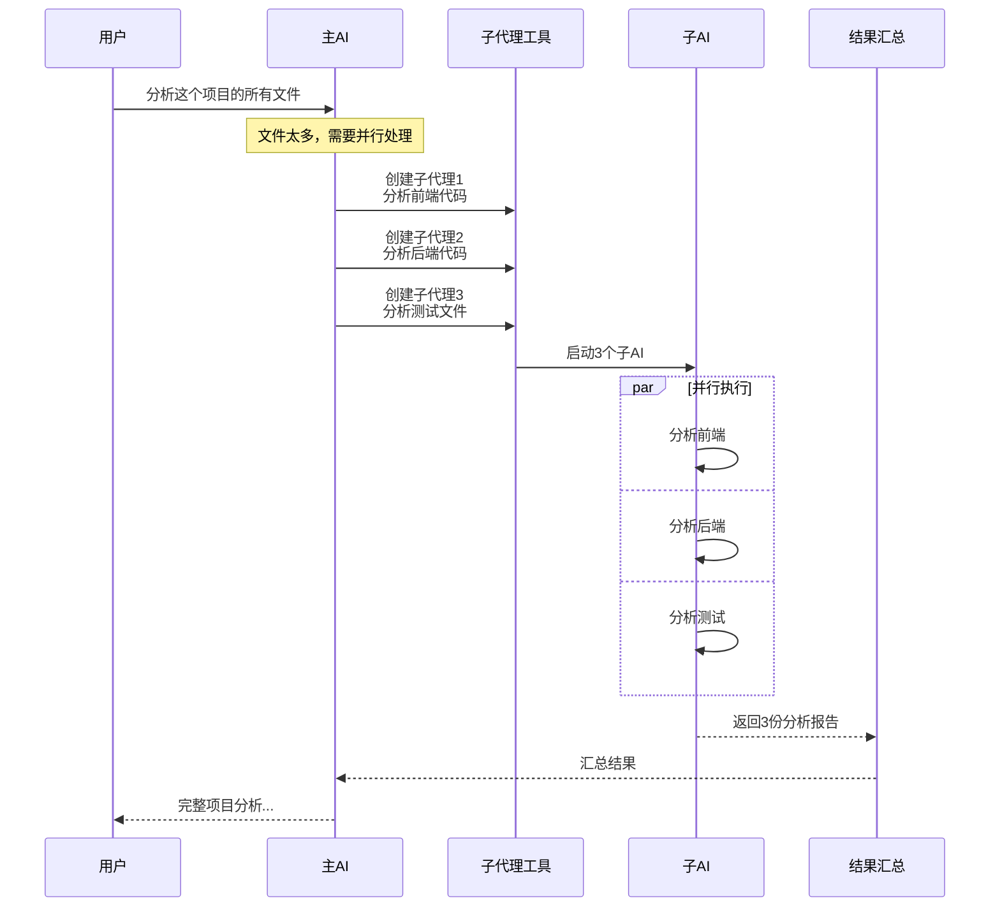

**包含的工具：**
- `spawn` - 创建单个子代理
- `spawn_parallel` - 并行创建多个子代理

### 6. 定时任务工具

让 AI 能管理定时任务：

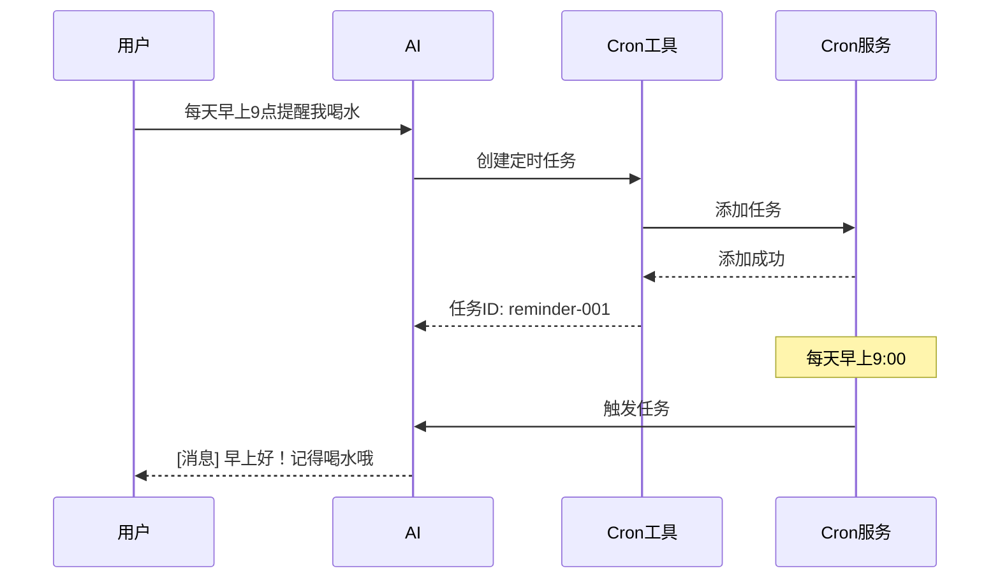

**包含的工具：**
- `cron` - 管理定时任务（增删改查）

---

## 工具注册表

所有工具都登记在一个"工具箱"里：

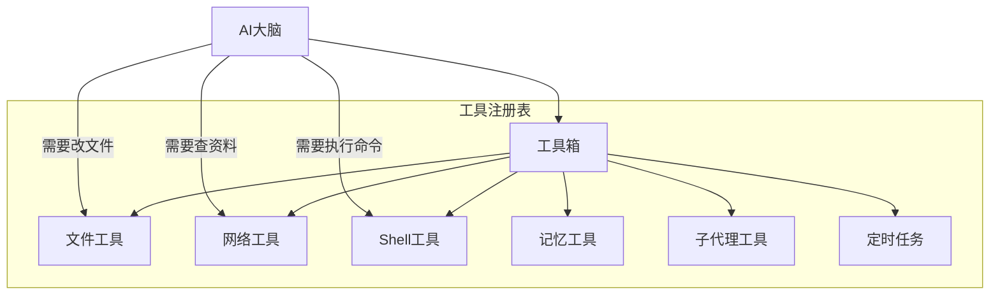

### 语义路由

AI 会自动选择最合适的工具：

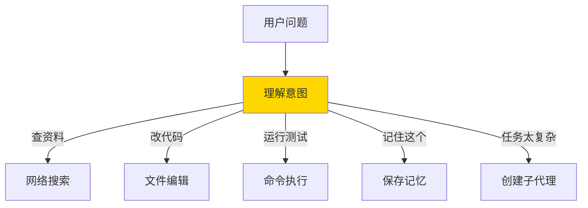

---

## 工具执行流程

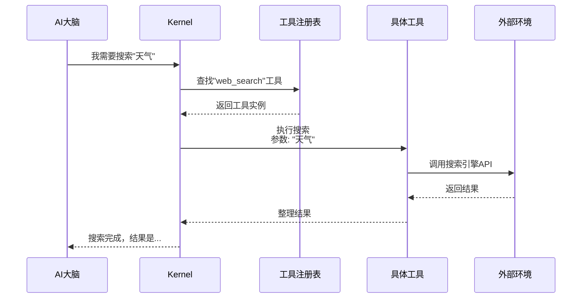

---

## 工具使用示例

### 示例1：复杂编程任务

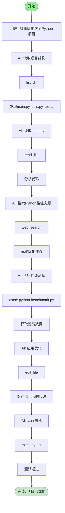

### 示例2：研究性任务

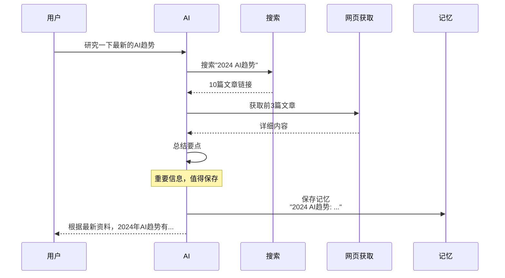

---

## MCP 工具扩展

Gasket 还支持**外部工具服务**（MCP）：

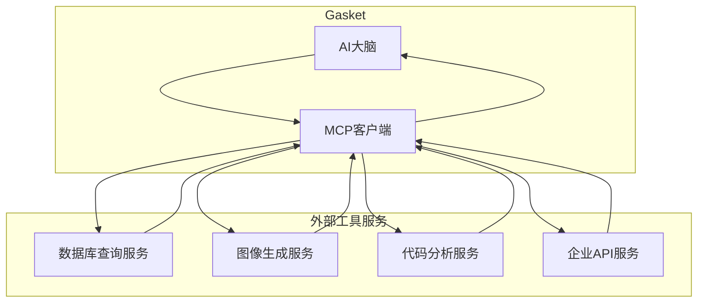

**举例：**
- 连接公司内部的员工查询系统
- 连接专业的图像生成 AI
- 连接数据库执行 SQL 查询

---

## 常见问题

**Q: AI 能随便执行任何命令吗？**
A: 不能。有安全策略限制，危险命令会被拦截或需要用户确认。

**Q: AI 能访问我电脑上的所有文件吗？**
A: 只能访问工作空间内的文件，不会随意读取系统敏感文件。

**Q: 工具执行失败怎么办？**
A: AI 会收到错误信息，然后决定重试、换种方式、或告诉用户出错了。

**Q: 怎么知道 AI 用了什么工具？**
A: 在流式输出中可以看到工具调用信息，比如"正在搜索..."、"正在读取文件..."
