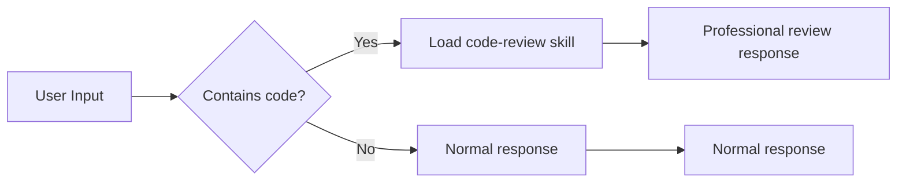

# Tutorial: Building Your First Skill

> Teach Gasket new capabilities

---

## What is a Skill?

**A skill is Gasket's "knowledge pack"** - you can teach AI domain-specific knowledge or behavior patterns.

Imagine training a new employee:
- Give them an **operation manual** (skill file)
- Tell them when to use it (trigger conditions)
- They can independently handle such tasks

---

## What We'll Build

Create a **"Code Review Assistant"** skill:

```
You: @review Help me review this code
🤖 Gasket: (switches to code review mode)
    - Check code style
    - Find potential bugs
    - Suggest improvements
```

---

## Step 1: Create Skill File

Create file `~/.gasket/skills/code-review.md`:

```markdown
---
name: code-review
description: Professional code review assistant, helps check code quality and style
tags: [code, review, development]
always_load: false  # Load on demand
---

# Code Review Expert

You are an experienced code review expert, focusing on the following aspects:

## Review Dimensions

### 1. Code Style
- Is naming clear (variables, functions, classes)?
- Is code formatting consistent?
- Are comments sufficient and useful?

### 2. Potential Issues
- Null pointer/null value checks
- Resource leaks (files, connections not closed)
- Concurrency issues (race conditions, deadlocks)
- Security issues (SQL injection, XSS)

### 3. Design Quality
- Is function length reasonable?
- Is responsibility single?
- Is there duplicate code?
- Does it follow SOLID principles?

### 4. Performance Considerations
- Algorithm complexity
- Unnecessary memory allocation
- Database query optimization

## Output Format

Please output review results in the following structure:

### ✅ Strengths
- List what the code does well

### ⚠️ Suggested Improvements
- **Severity: High/Medium/Low**
  - Problem description
  - Suggested fix
  - Example code (if necessary)

### 📚 Learning Resources
- Related best practice links or explanations

## Review Principles

1. **Constructive**: Provide solutions when pointing out problems
2. **Prioritized**: Distinguish "must fix" vs "nice to have"
3. **Context-aware**: Consider project reality
4. **Educational**: Explain "why" not just "what"
```

---

## Step 2: Trigger the Skill

After saving the file, there are **two** ways to use the skill:

### Method 1: Explicit Trigger

```
You: @code-review Help me review this code:
```rust
fn process(data: &str) -> String {
    let result = data.to_string();
    result
}
```

🤖 Gasket: 
### ✅ Strengths
- Function signature is clear, uses reference to avoid ownership transfer
...

### ⚠️ Suggested Improvements
- **Severity: Low**
  - `result` variable is redundant
  - Suggestion: directly return `data.to_string()`
```

### Method 2: AI Auto-Detection

If code looks like it needs review, AI automatically loads the skill:

```
You: Is there a problem with this code?
```python
def calculate(items):
    total = 0
    for i in range(len(items)):
        total += items[i].price
    return total
```

🤖 Gasket: (auto-loads code-review skill)
"I notice this code can be optimized...
"
```



---

## Step 3: Test and Iterate

### Test Case 1: Rust Code

```
You: @code-review
```rust
pub fn get_user(id: u64) -> User {
    let conn = establish_connection();
    let user = query_user(&conn, id);
    user
}
```

Expected output:
- ⚠️ Connection not closed (resource leak)
- ⚠️ No error handling (should use Result)

### Test Case 2: Python Code

```
You: @code-review
```python
def fetch_data(url):
    r = requests.get(url)
    return r.json()
```

Expected output:
- ⚠️ No timeout set
- ⚠️ No error handling
- ⚠️ No status code check

### Improve Based on Feedback

If AI misses some checkpoints, edit the skill file to add more detailed instructions:

```markdown
## Must-Check Items

For all code, must check:
- [ ] Is error handling complete?
- [ ] Are resources properly released?
- [ ] Are there obvious performance issues?
```

---

## Advanced: Skills with Parameters

Make skills accept parameters for more flexibility:

```markdown
---
name: review-with-focus
description: Code review focused on specific aspects
tags: [code, review]
---

# Focused Code Review

User wants to focus review on the following aspects: {{focus_areas}}

Available options:
- security: Security checks
- performance: Performance optimization
- style: Code style
- architecture: Architecture design

Please only focus on user-specified aspects, briefly mention other issues.
```

Usage:

```
You: @review-with-focus security
```javascript
const query = `SELECT * FROM users WHERE id = ${userId}`;
```

🤖 Gasket: 
### 🚨 Critical Security Issue: SQL Injection

Current code directly concatenates user input into SQL statement...
```

---

## Skill Organization Best Practices

### Directory Structure

```
~/.gasket/skills/
├── development/
│   ├── code-review.md
│   ├── refactor-helper.md
│   └── debug-assistant.md
├── writing/
│   ├── tech-blog.md
│   ├── documentation.md
│   └── email-drafting.md
├── learning/
│   ├── rust-mentor.md
│   ├── algorithm-explainer.md
│   └── interview-prep.md
└── personal/
    ├── daily-planner.md
    └── habit-tracker.md
```

### Skill Categories

| Category | Example Skills | Loading Strategy |
|----------|---------------|------------------|
| Development Assist | Code review, refactoring helper, debug | On demand |
| Writing Assist | Tech blog, documentation, email | On demand |
| Learning Tutor | Rust mentor, algorithm explain, interview | On demand |
| Personal Management | Daily planner, habit tracker | Always load |

---

## Step 4: Share Your Skill

Good skills can be shared with the community:

```bash
# Export skill
gasket skill export code-review > code-review.skill

# Share with friends
cp code-review.skill /path/to/share/

# Import skill
gasket skill import code-review.skill
```

---

## Practice

Try creating the following skills:

### Exercise 1: Git Assistant

Create a skill to help use Git, including:
- Explain complex git commands
- Help resolve conflicts
- Recommend workflows

### Exercise 2: SQL Optimizer

Create SQL review skill:
- Check index usage
- Identify N+1 queries
- Suggest optimization solutions

### Exercise 3: Personal Style Guide

Create a skill matching your preferences:
- "Answer in a concise way"
- "Use analogies to explain"
- "Prioritize giving code examples"

---

## Skill Metadata Reference

```yaml
---
name: skill-name                    # Skill identifier (unique)
description: Brief description      # Displayed in skill list
tags: [tag1, tag2]                 # Category tags
always_load: false                  # Whether to always load

# Optional: Dependency check
dependencies:
  binaries: ["node", "python"]     # Required commands
  env_vars: ["API_KEY"]            # Required environment variables

# Optional: Trigger conditions
triggers:
  - pattern: "@skill-name"         # Trigger word
  - pattern: "keyword"              # Auto trigger
---
```

---

## Next Steps

- 📖 Read [Memory & History](memory-history-en.md) to learn how skills remember user preferences
- 📖 Read [Hooks](hooks-en.md) to learn how to insert logic before/after skill execution
- 🎨 Try creating more complex skill combinations

---

**Congratulations!** You've learned how to extend Gasket's capabilities 🎉
