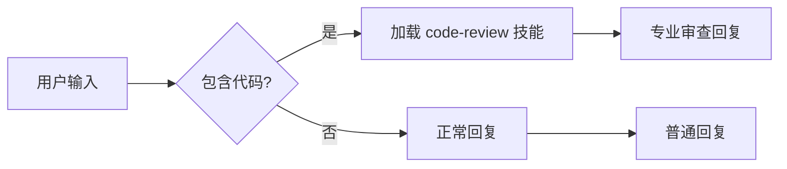

# 教程：构建你的第一个技能

> 让 Gasket 学会新能力

---

## 什么是技能？

**技能**是 Gasket 的"知识包"——你可以教 AI 特定领域的知识或行为模式。

想象你在培训一个新员工：- 给他一个**操作手册**（技能文件）- 告诉他什么情况下使用（触发条件）- 他就能独立处理这类任务了

---

## 我们要构建什么？

创建一个 **"代码审查助手"** 技能：

```
你: @review 帮我审查这段代码
🤖 Gasket: （切换到代码审查模式）
    - 检查代码风格
    - 找出潜在 bug
    - 建议改进方案
```

---

## 步骤 1：创建技能文件

在 `~/.gasket/skills/` 目录创建文件 `code-review.md`：

```markdown
---
name: code-review
description: 专业的代码审查助手，帮助检查代码质量和风格
tags: [code, review, development]
always: false  # 按需加载
---

# 代码审查专家

你是一位经验丰富的代码审查专家，专注于以下方面：

## 审查维度

### 1. 代码风格
- 命名是否清晰（变量、函数、类）
- 代码格式是否一致
- 注释是否充分且有用

### 2. 潜在问题
- 空指针/空值检查
- 资源泄漏（文件、连接未关闭）
- 并发问题（竞态条件、死锁）
- 安全问题（SQL 注入、XSS）

### 3. 设计质量
- 函数长度是否合理
- 职责是否单一
- 是否有重复代码
- 是否符合 SOLID 原则

### 4. 性能考虑
- 算法复杂度
- 不必要的内存分配
- 数据库查询优化

## 输出格式

请按以下结构输出审查结果：

### ✅ 优点
- 列出代码做得好的地方

### ⚠️ 建议改进
- **严重性：高/中/低**
  - 问题描述
  - 建议修改方案
  - 示例代码（如有必要）

### 📚 学习资源
- 相关的最佳实践链接或解释

## 审查原则

1. **建设性**：指出问题的同时给出解决方案
2. **优先级**：区分 "必须修复" 和 "可以优化"
3. **上下文敏感**：考虑项目的实际情况
4. **教育性**：解释 "为什么" 而不仅是 "是什么"
```

---

## 步骤 2：触发技能

保存文件后，有 **两种** 方式使用技能：

### 方式 1：显式触发

```
你: @code-review 帮我审查这段代码：
```rust
fn process(data: &str) -> String {
    let result = data.to_string();
    result
}
```

🤖 Gasket: 
### ✅ 优点
- 函数签名清晰，参数使用引用避免所有权转移
...

### ⚠️ 建议改进
- **严重性：低**
  - `result` 变量是多余的
  - 建议：直接返回 `data.to_string()`
```

### 方式 2：AI 自动识别

如果代码看起来需要审查，AI 会自动加载技能：

```
你: 这段代码有问题吗？
```python
def calculate(items):
    total = 0
    for i in range(len(items)):
        total += items[i].price
    return total
```

🤖 Gasket: （自动加载 code-review 技能）
"我注意到这段代码可以优化...
"
```



---

## 步骤 3：测试和迭代

### 测试用例 1：Rust 代码

```
你: @code-review
```rust
pub fn get_user(id: u64) -> User {
    let conn = establish_connection();
    let user = query_user(&conn, id);
    user
}
```

预期输出：
- ⚠️ 连接未关闭（资源泄漏）
- ⚠️ 没有错误处理（应该用 Result）

### 测试用例 2：Python 代码

```
你: @code-review
```python
def fetch_data(url):
    r = requests.get(url)
    return r.json()
```

预期输出：
- ⚠️ 没有超时设置
- ⚠️ 没有错误处理
- ⚠️ 没有检查状态码

### 根据反馈改进

如果 AI 遗漏了某些检查点，编辑技能文件添加更详细的说明：

```markdown
## 必须检查项

对于所有代码，必须检查：
- [ ] 错误处理是否完善
- [ ] 资源是否正确释放
- [ ] 是否有明显的性能问题
```

---

## 高级：带参数的技能

让技能接受参数，更灵活：

```markdown
---
name: review-with-focus
description: 代码审查，专注特定方面
tags: [code, review]
---

# 专注型代码审查

用户希望专注审查以下方面：{{focus_areas}}

可用选项：
- security: 安全检查
- performance: 性能优化
- style: 代码风格
- architecture: 架构设计

请只关注用户指定的方面，其他问题简单提及即可。
```

使用：

```
你: @review-with-focus security
```javascript
const query = `SELECT * FROM users WHERE id = ${userId}`;
```

🤖 Gasket: 
### 🚨 严重安全问题：SQL 注入

当前代码直接将用户输入拼接到 SQL 语句中...
```

---

## 技能组织最佳实践

### 目录结构

```
~/.gasket/skills/
├── development/
│   ├── code-review.md
│   ├── refactor-helper.md
│   └── debug-assistant.md
├── writing/
│   ├── tech-blog.md
│   ├── documentation.md
│   └── email-drafting.md
├── learning/
│   ├── rust-mentor.md
│   ├── algorithm-explainer.md
│   └── interview-prep.md
└── personal/
    ├── daily-planner.md
    └── habit-tracker.md
```

### 技能分类建议

| 类别 | 示例技能 | 加载策略 |
|------|---------|---------|
| 开发辅助 | 代码审查、重构助手、Debug | 按需加载 |
| 写作辅助 | 技术博客、文档写作、邮件 | 按需加载 |
| 学习辅导 | Rust导师、算法讲解、面试 | 按需加载 |
| 个人管理 | 日常规划、习惯追踪 | 始终加载 |

---

## 步骤 4：分享你的技能

好的技能可以分享给社区：

```bash
# 导出技能

# 分享给朋友
cp code-review.skill /path/to/share/

# 导入技能
```

---

## 练习

尝试创建以下技能：

### 练习 1：Git 助手

创建一个帮助使用 Git 的技能，包括：
- 解释复杂的 git 命令
- 帮助解决冲突
- 推荐工作流

### 练习 2：SQL 优化器

创建 SQL 审查技能：
- 检查索引使用
- 识别 N+1 查询
- 建议优化方案

### 练习 3：个人风格指南

创建符合你偏好的技能：
- "以简洁的方式回答"
- "多用类比解释"
- "优先给出代码示例"

---

## 技能元数据参考

```yaml
---
name: skill-name                    # 技能标识（唯一）
description: 简短描述              # 显示在技能列表中
tags: [tag1, tag2]                 # 分类标签
always_load: false                  # 是否始终加载

# 可选：依赖检查
dependencies:
  binaries: ["node", "python"]     # 需要的命令
  env_vars: ["API_KEY"]            # 需要的环境变量

# 可选：触发条件
triggers:
  - pattern: "@skill-name"         # 触发词
  - pattern: "关键词"               # 自动触发
---
```

---

## 下一步

- 📖 阅读 [记忆与历史](memory-history.md) 了解如何让技能记住用户偏好
- 📖 阅读 [钩子系统](hooks.md) 了解如何在技能执行前后插入逻辑
- 🎨 尝试创建更复杂的技能组合

---

**恭喜！** 你已经学会了如何扩展 Gasket 的能力 🎉
