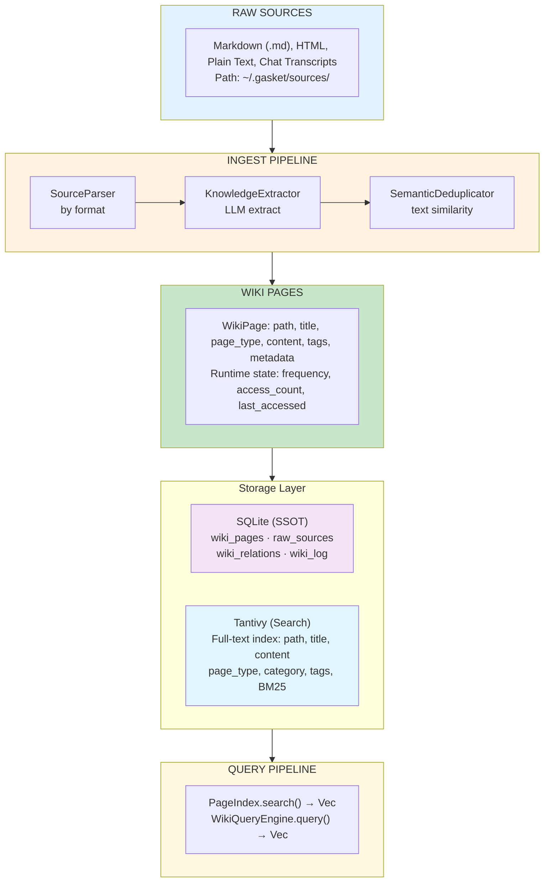
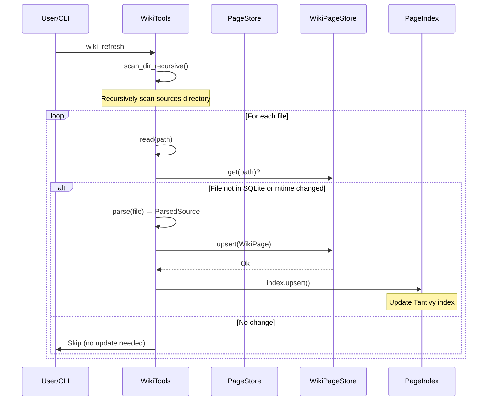
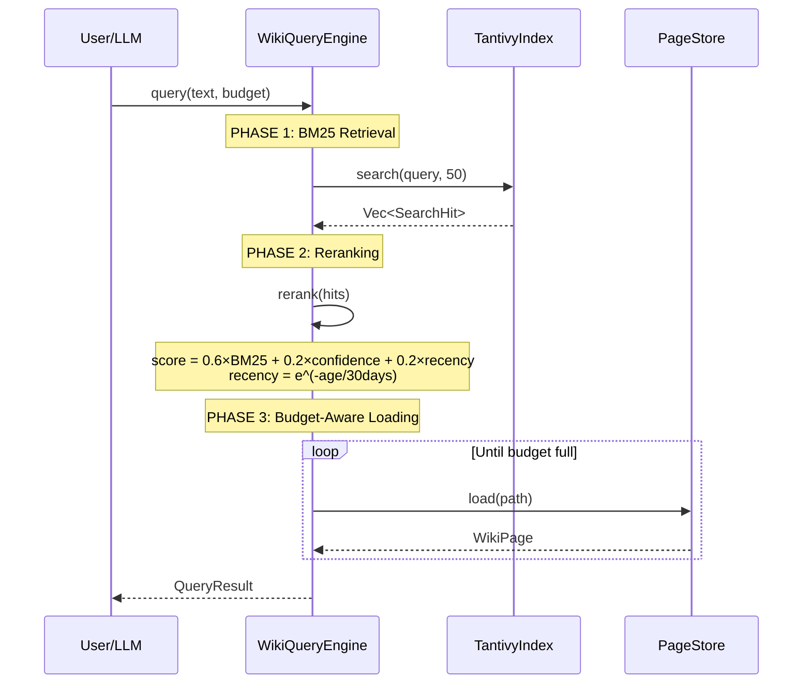
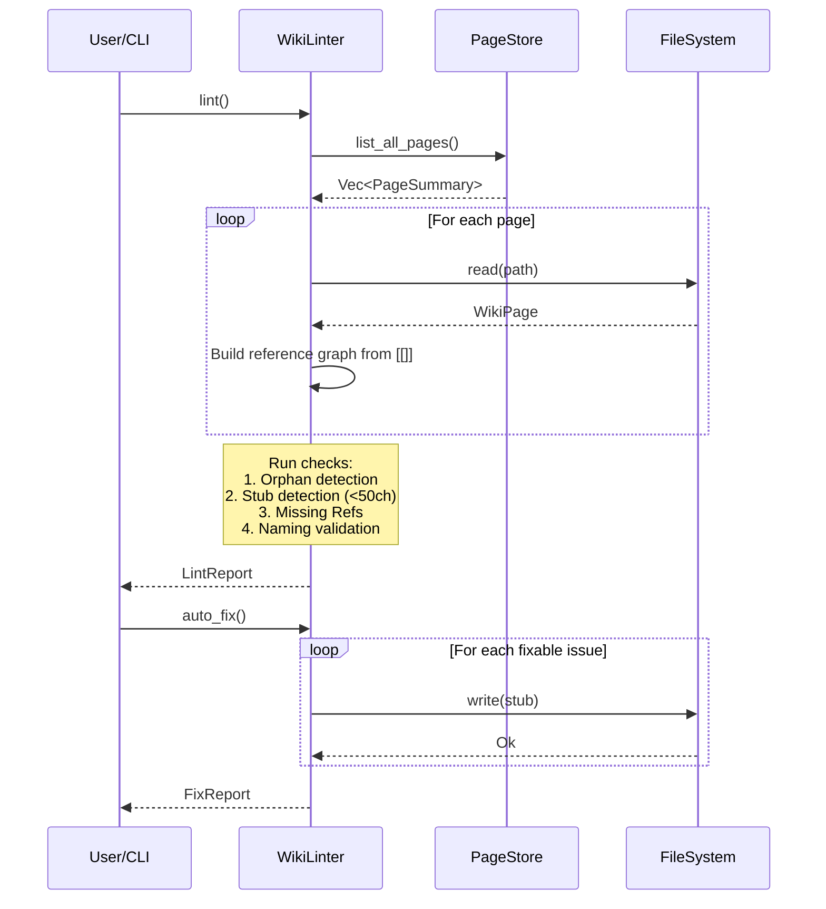

# Wiki Module Design Document

## 1. Overview

The Wiki module is a three-layer knowledge management system:

| Layer | Storage | Purpose |
|-------|---------|---------|
| Raw Sources | `~/.gasket/sources/` | Original documents |
| Compiled Wiki | `~/.gasket/wiki/` (SQLite + optional .md cache) | Structured knowledge pages |
| Search Index | `~/.gasket/wiki/.tantivy/` | Tantivy BM25 full-text search |

---

## 2. Directory Structure

```
gasket/
├── engine/src/wiki/              # Application Layer - High-level interfaces
│   ├── mod.rs                   # Module exports
│   ├── page.rs                  # WikiPage, PageType, PageSummary, PageFilter, slugify()
│   ├── store.rs                 # PageStore (SQLite CRUD wrapper)
│   ├── index.rs                 # PageIndex (Tantivy search wrapper)
│   ├── lifecycle.rs             # FrequencyManager, DecayReport (page lifecycle)
│   ├── log.rs                   # WikiLog (operation logging)
│   │
│   ├── ingest/                  # Source ingestion pipeline
│   │   ├── mod.rs               # Module exports
│   │   ├── parser.rs            # SourceParser trait + Markdown/Html/PlainText/Conversation parsers
│   │   ├── extractor.rs         # KnowledgeExtractor (LLM-based extraction)
│   │   └── dedup.rs             # SemanticDeduplicator (text similarity dedup)
│   │
│   ├── lint/                    # Quality check pipeline
│   │   ├── mod.rs               # WikiLinter, LintReport, FixReport
│   │   └── structural.rs        # Structural checks (orphan, stub, naming, missing refs)
│   │
│   └── query/                   # Query pipeline
│       ├── mod.rs              # WikiQueryEngine (3-phase retrieval), TokenBudget, QueryResult
│       ├── tantivy_adapter.rs  # TantivyIndex, SearchHit, WikiFields (BM25 search)
│       └── reranker.rs         # Reranker (BM25 + confidence + recency scoring)
│
├── storage/src/wiki/            # Data Layer - SQLite persistence
│   ├── mod.rs                   # Module exports
│   ├── types.rs                 # Frequency enum, TokenBudget
│   ├── tables.rs                # SQL table definitions + indexes
│   ├── page_store.rs            # WikiPageStore (SQLite ops), PageRow, WikiPageInput
│   ├── source_store.rs          # WikiSourceStore (raw sources tracking), SourceRow
│   ├── relation_store.rs        # WikiRelationStore (page relations), RelationRow
│   └── log_store.rs             # WikiLogStore (operation log), LogRow
│
└── engine/src/tools/             # CLI Tools
    ├── wiki_tools.rs           # WikiSearchTool, WikiWriteTool, WikiReadTool
    ├── wiki_refresh.rs          # WikiRefreshTool (disk ↔ SQLite ↔ Tantivy sync)
    └── wiki_decay.rs            # WikiDecayTool (frequency decay batch job)
```

---

## 3. Core Data Structures

### 3.1 Data Layer (storage/src/wiki/)

| Struct | Responsibility |
|--------|---------------|
| `WikiPageStore` | SQLite-backed wiki page store. Single source of truth. Handles upsert/get/delete/list with WAL mode for concurrency. |
| `WikiSourceStore` | Tracks raw sources for ingestion. Records path, format, ingestion status. |
| `WikiRelationStore` | Stores page-to-page relations (from_page → to_page with relation type and confidence). |
| `WikiLogStore` | Append-only operation log for audit trail. |
| `PageRow` | SQLite row representation of a wiki page. |
| `WikiPageInput` | Input struct for upserting to SQLite. |
| `DecayCandidate` | Page path + frequency + last_accessed for decay processing. |
| `Frequency` | Enum: `Hot`(rank 3), `Warm`(rank 2), `Cold`(rank 1), `Archived`(rank 0). Machine runtime state only. |

### 3.2 Application Layer (engine/src/wiki/)

| Struct | Responsibility |
|--------|---------------|
| `WikiPage` | Core domain struct. Contains path, title, page_type, content, tags, frequency, access_count, last_accessed, file_mtime. Serializes to/from Markdown with YAML frontmatter. |
| `PageStore` | High-level CRUD wrapper over WikiPageStore. Adds disk sync and path validation. |
| `PageIndex` | Wrapper over TantivyIndex for full-text search. Provides search(), upsert(), delete(), rebuild(). |
| `WikiQueryEngine` | Three-phase retrieval: BM25 candidate → rerank → budget-aware loading. |
| `WikiLinter` | Runs structural quality checks. Produces LintReport, supports auto_fix(). |

### 3.3 Ingest Pipeline (engine/src/wiki/ingest/)

| Struct | Responsibility |
|--------|---------------|
| `SourceParser` | Async trait for parsing files. Supports Markdown, Html, PlainText, Conversation formats. |
| `KnowledgeExtractor` | LLM-based extraction of entities/topics/claims from raw sources. Uses system prompt + user prompt pattern. |
| `SemanticDeduplicator` | Text-similarity deduplication using title match, containment, tag overlap (Jaccard), trigram similarity. Threshold 0.85. |

### 3.4 Page Types & Directory Conventions

```
PageType        Directory      Purpose
─────────────────────────────────────────────
Entity          entities/     People, projects, concepts
Topic           topics/       Subjects, guides, how-tos
Source          sources/      Reference material
Sop             sops/         Standard operating procedures
```

---

## 4. Data Flow Diagram

### 4.1 Overall Data Flow



### 4.2 SQLite Schema

```mermaid
erDiagram
    wiki_pages {
        string path PK
        string title
        string type
        string category
        json tags
        text content
        timestamp created
        timestamp updated
        int source_count
        float confidence
        string frequency
        int access_count
        timestamp last_accessed
        int file_mtime
    }

    raw_sources {
        int id PK
        string path
        string format
        boolean ingested
        timestamp ingested_at
        string title
        json metadata
        timestamp created
    }

    wiki_relations {
        string from_page PK
        string to_page PK
        string relation PK
        float confidence
        timestamp created
    }

    wiki_log {
        int id PK AUTO
        string action
        string target
        text detail
        timestamp created
    }

    wiki_pages ||--o{ wiki_relations : "has"
    raw_sources ||--o{ wiki_log : "generates"
```

---

## 5. Sequence Diagrams

### 5.1 Ingest Operation



### 5.2 Query Operation



### 5.3 Lint Operation



---

## 6. Key Design Principles

### 6.1 SQLite is Single Source of Truth (SSOT)
- Markdown files are optional human-readable cache only
- All operations go through SQLite first

### 6.2 Tantivy is Derived Data
- Search index is rebuilt from SQLite on reindex
- Writes keep it in sync via upsert

### 6.3 Frequency is Machine Runtime State
- Never serialized to Markdown frontmatter
- Decay is a background batch job (WikiDecayTool)

### 6.4 Three-Phase Query
```
Phase 1: BM25 Candidate Retrieval → Phase 2: Hybrid Reranking (BM25 0.6 + Confidence 0.2 + Recency 0.2) → Phase 3: Token Budget Loading
```

### 6.5 LLM-Augmented Ingest
- `KnowledgeExtractor` uses LLM to structure knowledge from raw documents
- `SemanticDeduplicator` prevents duplicates via text similarity

---

## 7. CLI Commands

```bash
# Initialize wiki directory
gasket wiki init

# Ingest documents
gasket wiki ingest <path>

# Search
gasket wiki search <query>

# List all pages
gasket wiki list

# Health check
gasket wiki lint

# Statistics
gasket wiki stats

# Migration (old memory → wiki)
gasket wiki migrate
```

---

## 8. File Index

| Feature | File Path |
|---------|----------|
| WikiPage definition | `engine/src/wiki/page.rs` |
| SQLite storage | `storage/src/wiki/page_store.rs` |
| Tantivy index | `engine/src/wiki/query/tantivy_adapter.rs` |
| Query engine | `engine/src/wiki/query/mod.rs` |
| Ingest pipeline | `engine/src/wiki/ingest/mod.rs` |
| Linting | `engine/src/wiki/lint/mod.rs` |
| CLI tools | `engine/src/tools/wiki_tools.rs` |
| Refresh tool | `engine/src/tools/wiki_refresh.rs` |
