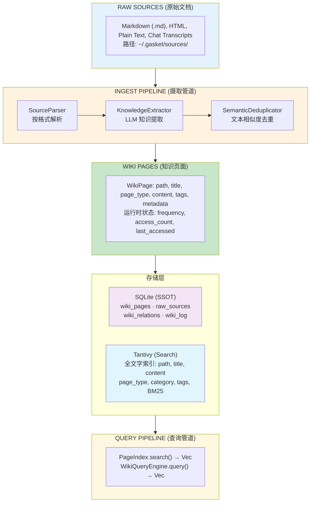
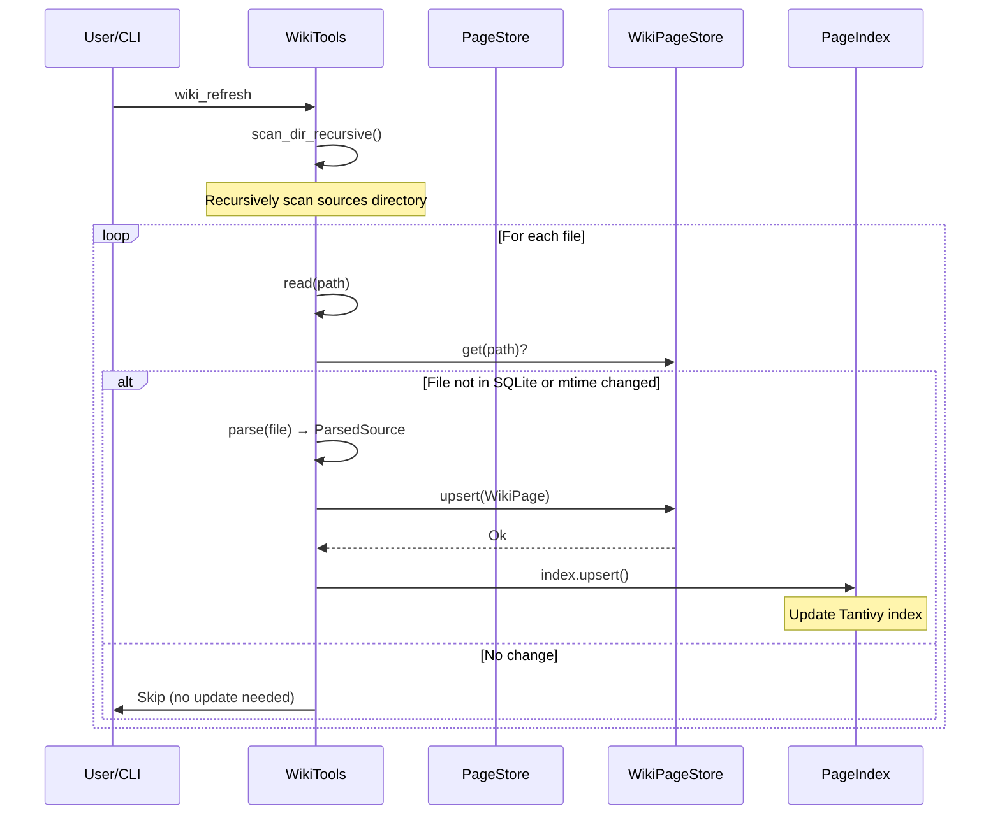
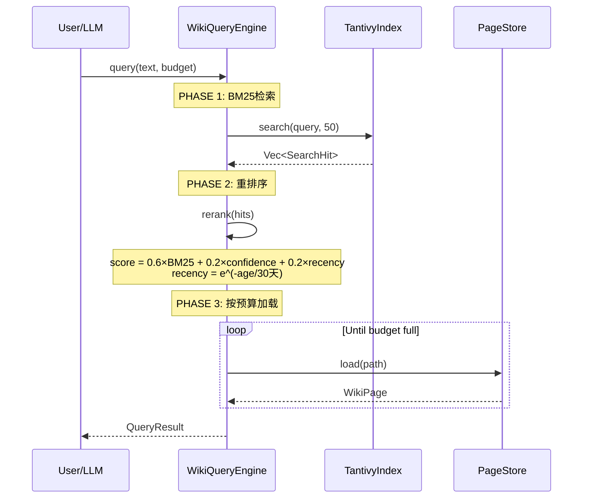
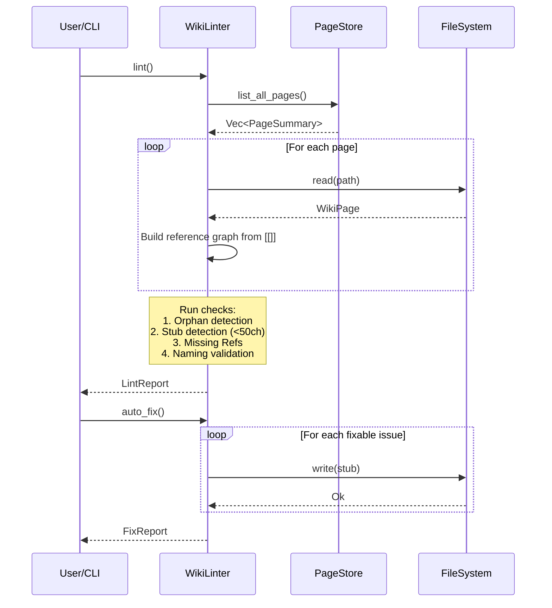

# Wiki 知识模块设计文档

## 1. 概述

Wiki 模块是一个三层架构的知识管理系统：

| 层级 | 存储 | 目的 |
|------|------|------|
| Raw Sources | `~/.gasket/sources/` | 原始文档 |
| Compiled Wiki | `~/.gasket/wiki/` (SQLite + 可选 .md 缓存) | 结构化知识页面 |
| Search Index | `~/.gasket/wiki/.tantivy/` | Tantivy BM25 全文搜索 |

---

## 2. 目录结构

```
gasket/
├── engine/src/wiki/              # 应用层 - 高级接口
│   ├── mod.rs                    # 模块导出
│   ├── page.rs                  # WikiPage, PageType, PageSummary, PageFilter, slugify()
│   ├── store.rs                 # PageStore (SQLite CRUD 包装器)
│   ├── index.rs                 # PageIndex (Tantivy 搜索包装器)
│   ├── lifecycle.rs             # FrequencyManager, DecayReport (页面生命周期)
│   ├── log.rs                   # WikiLog (操作日志)
│   │
│   ├── ingest/                  # 源文档摄取管道
│   │   ├── mod.rs               # 模块导出
│   │   ├── parser.rs            # SourceParser trait + Markdown/Html/PlainText/Conversation 解析器
│   │   ├── extractor.rs         # KnowledgeExtractor (基于 LLM 的知识提取)
│   │   └── dedup.rs             # SemanticDeduplicator (文本相似度去重)
│   │
│   ├── lint/                    # 质量检查管道
│   │   ├── mod.rs               # WikiLinter, LintReport, FixReport
│   │   └── structural.rs        # 结构化检查 (孤儿页面、存根、命名、缺失引用)
│   │
│   └── query/                   # 查询管道
│       ├── mod.rs               # WikiQueryEngine (三阶段检索), TokenBudget, QueryResult
│       ├── tantivy_adapter.rs   # TantivyIndex, SearchHit, WikiFields (BM25 搜索)
│       └── reranker.rs          # Reranker (BM25 + 置信度 + 时效性 重排序)
│
├── storage/src/wiki/            # 数据层 - SQLite 持久化
│   ├── mod.rs                   # 模块导出
│   ├── types.rs                 # Frequency 枚举, TokenBudget
│   ├── tables.rs                # SQL 表定义 + 索引
│   ├── page_store.rs            # WikiPageStore (SQLite 操作), PageRow, WikiPageInput
│   ├── source_store.rs          # WikiSourceStore (源文档追踪), SourceRow
│   ├── relation_store.rs         # WikiRelationStore (页面关系), RelationRow
│   └── log_store.rs             # WikiLogStore (操作日志), LogRow
│
└── engine/src/tools/            # CLI 工具
    ├── wiki_tools.rs            # WikiSearchTool, WikiWriteTool, WikiReadTool
    ├── wiki_refresh.rs          # WikiRefreshTool (磁盘 ↔ SQLite ↔ Tantivy 同步)
    └── wiki_decay.rs            # WikiDecayTool (频率衰减批量任务)
```

---

## 3. 核心数据结构

### 3.1 数据层 (storage/src/wiki/)

| Struct | 职责 |
|--------|------|
| `WikiPageStore` | SQLite 持久化的 wiki 页面存储。单点数据源。处理 upsert/get/delete/list 操作，使用 WAL 模式支持并发。 |
| `WikiSourceStore` | 追踪待摄取的原始源文档。记录路径、格式、摄取状态。 |
| `WikiRelationStore` | 存储页面间关系 (from_page → to_page，包含关系类型和置信度)。 |
| `WikiLogStore` | 仅追加的操作日志。记录操作时间戳用于审计。 |
| `PageRow` | Wiki 页面的 SQLite 行表示。 |
| `WikiPageInput` | 写入 SQLite 的输入结构。 |
| `DecayCandidate` | 页面路径 + 频率 + 上次访问时间，用于衰减处理。 |
| `Frequency` | 枚举: `Hot`(rank 3), `Warm`(rank 2), `Cold`(rank 1), `Archived`(rank 0)。机器运行时状态。 |

### 3.2 应用层 (engine/src/wiki/)

| Struct | 职责 |
|--------|------|
| `WikiPage` | 核心领域结构。包含 path, title, page_type, content, tags, frequency, access_count, last_accessed, file_mtime。支持与 Markdown+YAML frontmatter 互转。 |
| `PageStore` | WikiPageStore 的高级 CRUD 包装器。增加磁盘同步（可选 markdown 缓存）和路径验证。 |
| `PageIndex` | TantivyIndex 的包装器，提供 search(), upsert(), delete(), rebuild() 方法。 |
| `WikiQueryEngine` | 三阶段检索引擎：BM25 候选 → 重排序 → 按预算加载。 |
| `WikiLinter` | 运行结构化质量检查。生成 LintReport，支持 auto_fix() 自动修复简单问题。 |

### 3.3 摄取管道 (engine/src/wiki/ingest/)

| Struct | 职责 |
|--------|------|
| `SourceParser` | 解析文件的异步 trait。支持 Markdown, Html, PlainText, Conversation 格式。 |
| `KnowledgeExtractor` | 基于 LLM 从原始文档中提取实体/主题/声明。使用 system prompt + user prompt 模式。 |
| `SemanticDeduplicator` | 文本相似度去重。使用标题匹配、包含检测、标签重叠 (Jaccard)、trigram 相似度。阈值 0.85。 |

### 3.4 页面类型与目录约定

```
PageType        目录           用途
─────────────────────────────────────────────
Entity          entities/     人物、项目、概念
Topic           topics/       主题、指南、操作说明
Source          sources/      参考资料
Sop             sops/         标准操作流程
```

---

## 4. 数据流图

### 4.1 整体数据流



### 4.2 SQLite 表结构

```mermaid
erDiagram
    wiki_pages {
        string path PK
        string title
        string type
        string category
        json tags
        text content
        timestamp created
        timestamp updated
        int source_count
        float confidence
        string frequency
        int access_count
        timestamp last_accessed
        int file_mtime
    }

    raw_sources {
        int id PK
        string path
        string format
        boolean ingested
        timestamp ingested_at
        string title
        json metadata
        timestamp created
    }

    wiki_relations {
        string from_page PK
        string to_page PK
        string relation PK
        float confidence
        timestamp created
    }

    wiki_log {
        int id PK AUTO
        string action
        string target
        text detail
        timestamp created
    }

    wiki_pages ||--o{ wiki_relations : "has"
    raw_sources ||--o{ wiki_log : "generates"
```

---

## 5. 时序图

### 5.1 Ingest (摄取) 操作



### 5.2 Query (查询) 操作



### 5.3 Lint (质量检查) 操作



---

## 6. 关键设计原则

### 6.1 SQLite 是单一数据源 (SSOT)
- Markdown 文件仅作为可选的人类可读缓存
- 所有操作优先通过 SQLite

### 6.2 Tantivy 是派生数据
- 搜索索引在 reindex 时从 SQLite 重建
- 写入时通过 upsert 保持同步

### 6.3 频率是机器运行时状态
- 不序列化到 Markdown frontmatter
- 衰减是后台批量任务 (WikiDecayTool)

### 6.4 三阶段查询
```
Phase 1: BM25 候选检索 → Phase 2: 混合重排序 (BM25 + 置信度 + 时效性) → Phase 3: 按 Token 预算加载
```

### 6.5 LLM 增强的摄取
- `KnowledgeExtractor` 使用 LLM 结构化原始文档
- `SemanticDeduplicator` 通过文本相似度防止重复

---

## 7. CLI 命令

```bash
# 初始化 wiki 目录
gasket wiki init

# 摄取文档
gasket wiki ingest <path>

# 搜索
gasket wiki search <query>

# 列出所有页面
gasket wiki list

# 健康检查
gasket wiki lint

# 统计信息
gasket wiki stats

# 迁移 (旧 memory → wiki)
gasket wiki migrate
```

---

## 8. 相关文件索引

| 功能 | 文件路径 |
|------|----------|
| WikiPage 定义 | `engine/src/wiki/page.rs` |
| SQLite 存储 | `storage/src/wiki/page_store.rs` |
| Tantivy 索引 | `engine/src/wiki/query/tantivy_adapter.rs` |
| 查询引擎 | `engine/src/wiki/query/mod.rs` |
| 摄取管道 | `engine/src/wiki/ingest/mod.rs` |
| 质量检查 | `engine/src/wiki/lint/mod.rs` |
| CLI 工具 | `engine/src/tools/wiki_tools.rs` |
| 刷新工具 | `engine/src/tools/wiki_refresh.rs` |
