# Gasket Wiki & History 用户指南

> 本文档面向零基础用户，解释 Gasket 系统中 **Wiki 知识库** 和 **History 会话历史** 的作用、设计初衷，以及如何使用它们。

---

## 目录

1. [核心概念：为什么需要 Wiki？](#1-核心概念为什么需要-wiki)
2. [核心概念详解](#2-核心概念详解)
3. [系统架构：三层存储设计](#3-系统架构三层存储设计)
4. [Wiki 快速入门](#4-wiki-快速入门)
5. [History 会话历史](#5-history-会话历史)
6. [高级用法](#6-高级用法)
7. [常见问题](#7-常见问题)

---

## 1. 核心概念：为什么需要 Wiki？

### 1.1 问题：AI 会"遗忘"

大型语言模型（LLM）有上下文窗口限制。就像人类的短期记忆，AI 对话只能看到最近的消息。如果你问 AI：

> "上次我们讨论的项目架构是什么？"

AI 会回答：**"我不知道，因为我们还没讨论过这个。"**

这对于长期工作的助手来说是个严重问题。

### 1.2 解决方案：外部知识库

Gasket 的 Wiki 系统就是来解决这个问题的：

```mermaid
flowchart TB
    subgraph 用户层
        U[用户: "gasket项目的架构是怎样的？"]
    end

    subgraph AI助手
        AI[AI 助手 gasket]
    end

    subgraph Wiki知识库
        W[Wiki 知识库]
        W1["entities/gasket"]
    end

    U --> AI
    AI --> W
    W --> W1
    W1 --->|找到相关知识| AI
    AI -->|回复| U

    style W fill:#E3F2FD
    style AI fill:#FFF3E0
```

**Wiki 的本质**：AI 的"长期记忆"。让 AI 在需要时能查阅项目文档、决策记录、流程规范等知识。

### 1.3 设计初衷

| 设计原则 | 说明 |
|---------|------|
| **单一可信源 (SSOT)** | Markdown 文件是真相，数据库只是索引 |
| **人类可读** | Wiki 内容是纯文本 Markdown，随时可以用任何编辑器打开 |
| **AI 可查询** | 通过 Tantivy 全文搜索引擎，AI 可以快速找到相关内容 |
| **自动同步** | 修改 Markdown 文件后，自动同步到数据库和搜索索引 |

---

## 2. 核心概念详解

> 以下内容帮助深入理解 Wiki 系统的设计细节。

### 2.1 页面类型 (PageType)

Wiki 页面分为四种类型，每种类型有特定的用途和存储位置：

| 类型 | 英文名 | 用途 | 存储目录 | 示例 |
|------|--------|------|----------|------|
| **实体** | Entity | 具体的人事物 | `entities/` | 项目、人物、产品、服务器 |
| **主题** | Topic | 抽象的概念和讨论 | `topics/` | 架构决策、技术方案、问答记录 |
| **来源** | Source | 原始参考资料 | `sources/` | 文档链接、API 规范、第三方资料 |
| **流程** | SOP | 标准操作规程 | `sops/` | 部署流程、故障排查、代码规范 |

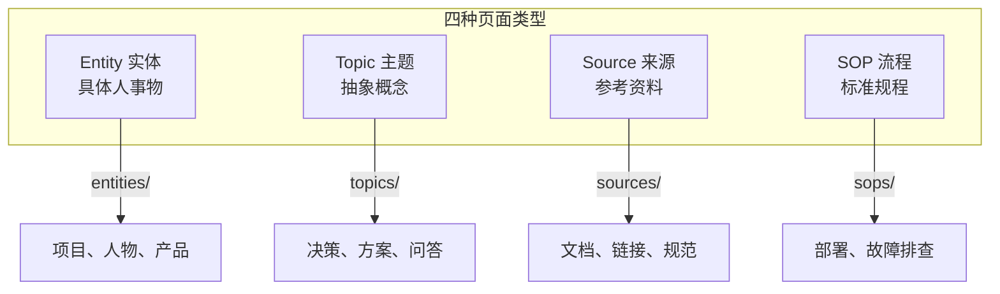
```mermaid
graph TB
    subgraph 四种页面类型
        E[Entity 实体<br/>具体人事物]
        T[Topic 主题<br/>抽象概念]
        S[Source 来源<br/>参考资料]
        P[SOP 流程<br/>标准规程]
    end

    E --> |"entities/"| EP[项目、人物、产品]
    T --> |"topics/"| TT[决策、方案、问答]
    S --> |"sources/"| SP[文档、链接、规范]
    P --> |"sops/"| PP[部署、故障排查]
```

```markdown
---
title: Gasket 项目
type: entity           # 实体：具体项目
category: projects
tags: [rust, ai, framework]
---

# Gasket 项目

这是一个 AI 代理框架...
```

### 2.2 频率生命周期 (Frequency)

Wiki 页面有**访问频率**状态，系统根据访问频率自动调整页面的"温度"：

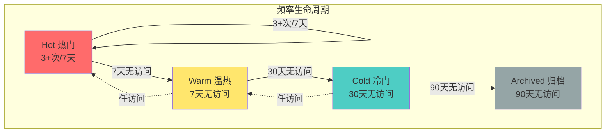
```mermaid
flowchart TB
    subgraph 频率生命周期
        H[Hot 热门<br/>3+次/7天]
        W[Warm 温热<br/>7天无访问]
        C[Cold 冷门<br/>30天无访问]
        A[Archived 归档<br/>90天无访问]
    end

    H -->|"3+次/7天"| H
    H -->|"7天无访问"| W
    W -->|"30天无访问"| C
    C -->|"90天无访问"| A

    W -.->|"任访问"| H
    C -.->|"任访问"| W

    style H fill:#FF6B6B
    style W fill:#FFE66D
    style C fill:#4ECDC4
    style A fill:#95A5A6
```

**豁免规则**：以下路径**永远不会**被衰减为 Cold 或 Archived：
- `profile/*` - 用户配置文件
- `entities/people/*` - 人物实体
- `sops/*` - 标准操作流程
- `sources/*` - 原始资料
- `*/decisions/*` - 决策记录

**频率优先级**：

| 频率 | 优先级 | 说明 |
|------|--------|------|
| Hot | 3 (最高) | 最近访问过的热门页面 |
| Warm | 2 | 标准保留优先级 |
| Cold | 1 | 可能被清理的冷门页面 |
| Archived | 0 | 已归档，等待清理 |

### 2.3 Token 预算 (TokenBudget)

AI 的上下文窗口有字数限制。Wiki 系统使用 **Token 预算** 来控制返回多少内容：

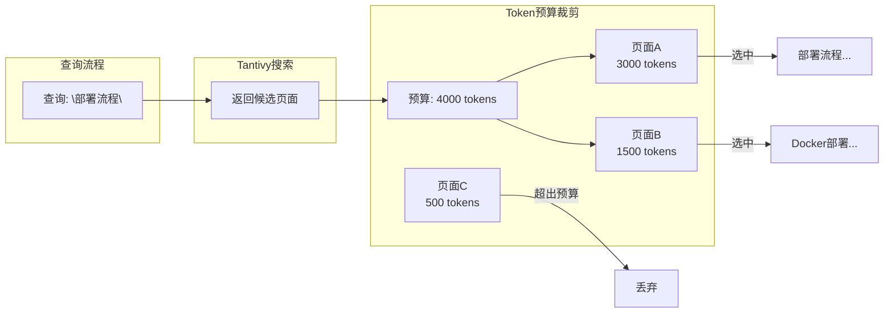
```mermaid
flowchart LR
    subgraph 查询流程
        Q["查询: \"部署流程\""]
    end

    subgraph Tantivy搜索
        T["返回候选页面"]
    end

    subgraph Token预算裁剪
        B["预算: 4000 tokens"]
        A[页面A<br/>3000 tokens]
        B2[页面B<br/>1500 tokens]
        C[页面C<br/>500 tokens]
    end

    Q --> T --> B
    B --> A
    B --> B2
    A -->|选中| OUT1[部署流程...]
    B2 -->|选中| OUT2[Docker部署...]
    C -->|超出预算| DROP[丢弃]
```

```rust
pub struct TokenBudget {
    pub max_tokens: usize,  // 最大 Token 数
}

// 默认：4000 tokens ≈ 16000 字符
```

### 2.4 两阶段检索 (Two-Phase Retrieval)

Wiki 查询分为两个阶段，确保既快又准：

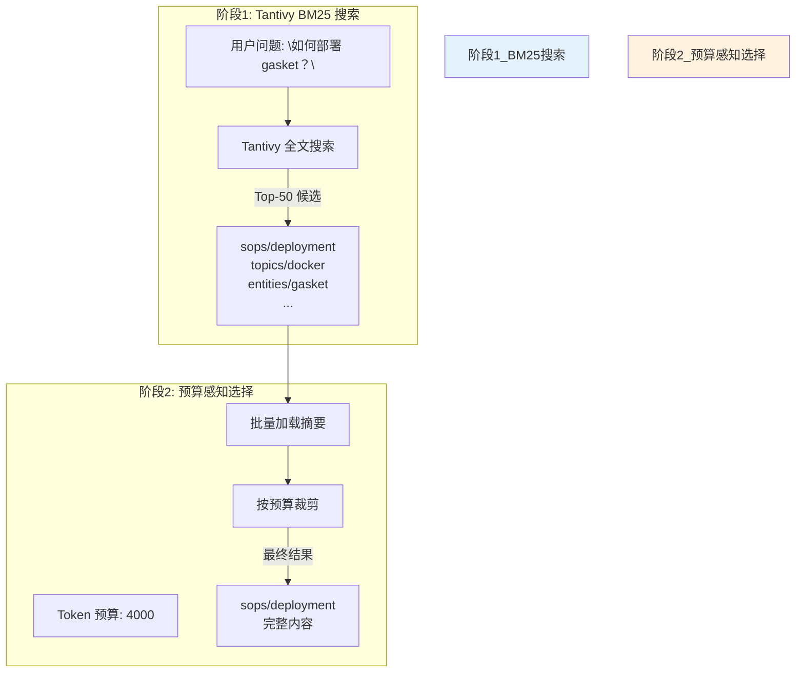
```mermaid
flowchart TB
    subgraph 阶段1: Tantivy BM25 搜索
        Q["用户问题: \"如何部署 gasket？\""]
        T[Tantivy 全文搜索]
        Q --> T
        T -->|Top-50 候选| C["sops/deployment<br/>topics/docker<br/>entities/gasket<br/>..."]
    end

    subgraph 阶段2: 预算感知选择
        B[Token 预算: 4000]
        L[批量加载摘要]
        S[按预算裁剪]
        C --> L
        L --> S
        S -->|最终结果| R["sops/deployment<br/>完整内容"]
    end

    style 阶段1_BM25搜索 fill:#E3F2FD
    style 阶段2_预算感知选择 fill:#FFF3E0
```

**为什么是两阶段？**
- **阶段1**：Tantivy 是为全文搜索优化的，BM25 算法比 SQLite 的 LIKE 查询更准确
- **阶段2**：避免加载所有候选页面的完整内容，只加载预算能容纳的内容

### 2.5 单一可信源 (SSOT)

Wiki 的核心理念：**Markdown 文件是唯一的真相来源**

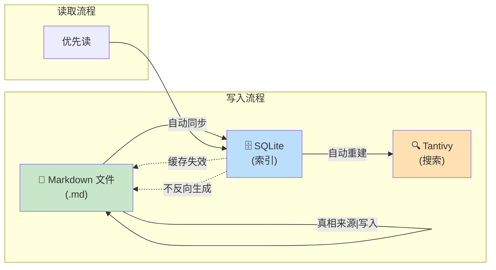
```mermaid
flowchart LR
    subgraph 写入流程
        M["📄 Markdown 文件<br/>(.md)"] -->|"自动同步"| S["🗄️ SQLite<br/>(索引)"]
        S -->|"自动重建"| T["🔍 Tantivy<br/>(搜索)"]
    end

    subgraph 读取流程
        R["优先读"] --> S
        S -.->|"缓存失效"| M
    end

    M -->|"真相来源|写入"| M
    S -.->|"不反向生成"| M

    style M fill:#C8E6C9
    style S fill:#BBDEFB
    style T fill:#FFE0B2
```

**关键原则**：
1. **写入**：先写 Markdown → 再更新 SQLite → 再更新 Tantivy
2. **读取**：优先从 SQLite 缓存，缓存失效则从 Markdown 重新解析
3. **机器状态不写入 Markdown**：`frequency`、`access_count`、`last_accessed` 只存在于 SQLite

### 2.6 N+1 查询修复

批量加载页面时，原始做法是循环内逐个查询（低效），改进后是一次批量查询：

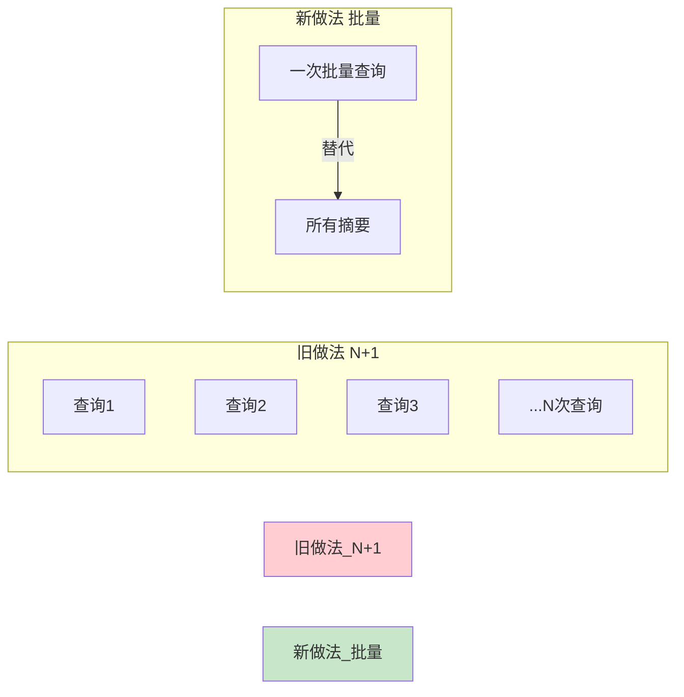
```mermaid
flowchart LR
    subgraph 旧做法 N+1
        O1[查询1]
        O2[查询2]
        O3[查询3]
        ON[...N次查询]
    end

    subgraph 新做法 批量
        N[一次批量查询]
        N -->|替代| ALL[所有摘要]
    end

    style 旧做法_N+1 fill:#FFCDD2
    style 新做法_批量 fill:#C8E6C9
```

```rust
// 旧做法 (N+1 问题)：
for path in paths {
    let page = store.read(path).await;  // N 次数据库查询！
}

// 新做法 (一次批量)：
let summaries = store.read_summaries(&paths).await;  // 1 次查询
```

### 2.7 惰性同步 (Lazy Mtime Sync)

读取页面时，系统检查文件修改时间 (mtime) 来判断缓存是否过期：

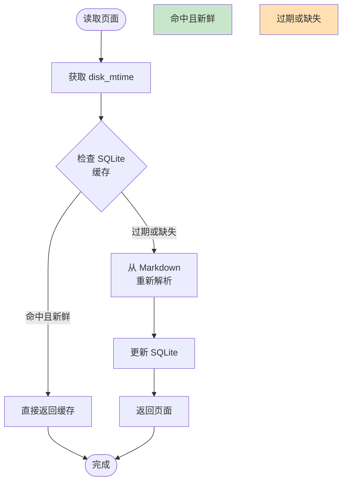
```mermaid
flowchart TB
    A([读取页面]) --> M["获取 disk_mtime"]
    M --> C{检查 SQLite<br/>缓存}
    C -->|命中且新鲜| R1[直接返回缓存]
    C -->|过期或缺失| P["从 Markdown<br/>重新解析"]
    P --> U["更新 SQLite"]
    U --> R2[返回页面]
    R1 --> E([完成])
    R2 --> E

    style 命中且新鲜 fill:#C8E6C9
    style 过期或缺失 fill:#FFE0B2
```

```rust
async fn read(&self, path: &str) -> WikiPage {
    let disk_mtime = file_mtime(path).await?;

    if let Some(cached) = db.get(path).await? {
        if cached.file_mtime == disk_mtime {
            return Ok(cached);  // 缓存新鲜，直接返回
        }
    }
    // 缓存失效，从 Markdown 重新解析
    let markdown = fs::read_to_string(path).await?;
    let page = WikiPage::from_markdown(path, &markdown)?;
    db.upsert(&page, disk_mtime).await
}
```

### 2.8 问答归档 (File Answer)

AI 可以将好的问答内容保存为 Wiki 页面：

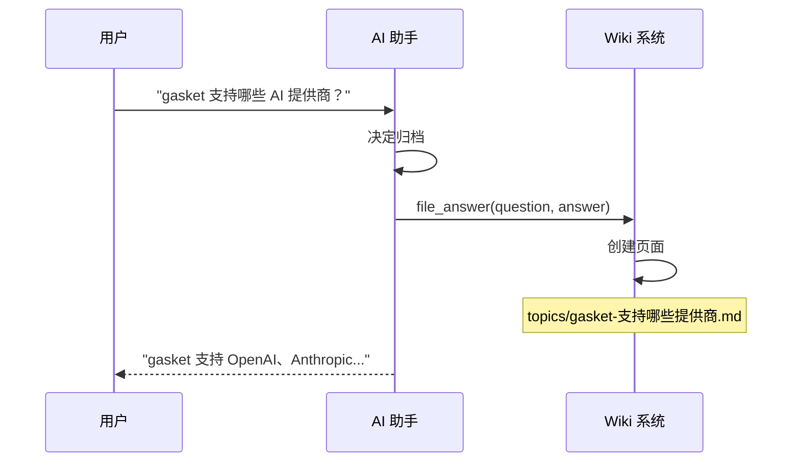
```mermaid
sequenceDiagram
    participant U as 用户
    participant AI as AI 助手
    participant W as Wiki 系统

    U->>AI: "gasket 支持哪些 AI 提供商？"
    AI->>AI: 决定归档
    AI->>W: file_answer(question, answer)
    W->>W: 创建页面
    Note over W: topics/gasket-支持哪些提供商.md
    AI-->>U: "gasket 支持 OpenAI、Anthropic..."
```

### 2.9 健康检查 (Lint)

Wiki 有内置的健康检查系统，发现结构性问题：

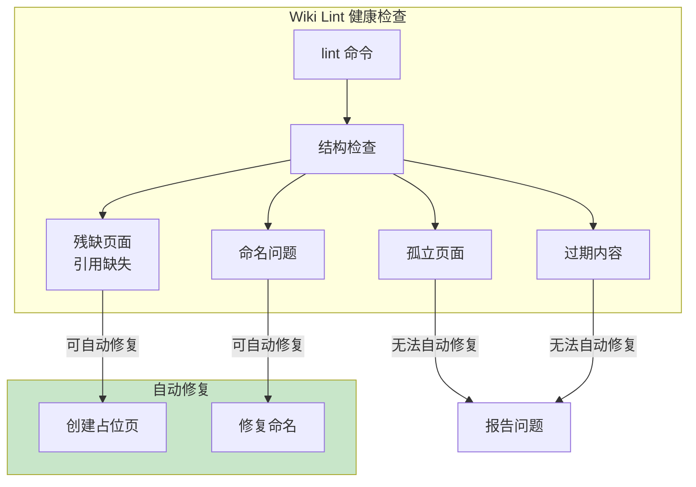
```mermaid
flowchart TB
    subgraph Wiki Lint 健康检查
        L[lint 命令] --> S[结构检查]
        S --> O[孤立页面]
        S --> M[残缺页面<br/>引用缺失]
        S --> N[命名问题]
        S --> T[过期内容]
    end

    subgraph 自动修复
        M -->|可自动修复| C["创建占位页"]
        N -->|可自动修复| F["修复命名"]
    end

    O -->|无法自动修复| R[报告问题]
    T -->|无法自动修复| R

    style 自动修复 fill:#C8E6C9
```

| 检查类型 | 说明 | 自动修复 |
|----------|------|----------|
| **孤立页面** | 没有被其他页面引用的页面 | 否 |
| **残缺页面** | 引用了不存在的页面 | 可自动创建占位页 |
| **命名问题** | 路径/名称不规范 | 可自动修复 |
| **过期内容** | 时间戳过旧 | 否 |

---

## 3. 系统架构：三层存储设计

### 3.1 存储层级

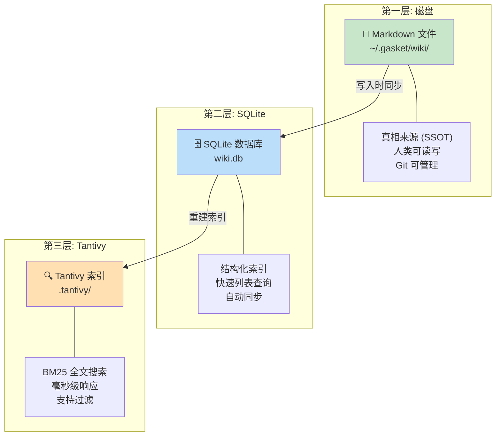
```mermaid
flowchart TB
    subgraph 第一层: 磁盘
        M["📄 Markdown 文件<br/>~/.gasket/wiki/"]
        Note1["真相来源 (SSOT)<br/>人类可读写<br/>Git 可管理"]
        M --- Note1
    end

    subgraph 第二层: SQLite
        S["🗄️ SQLite 数据库<br/>wiki.db"]
        Note2["结构化索引<br/>快速列表查询<br/>自动同步"]
        S --- Note2
    end

    subgraph 第三层: Tantivy
        T["🔍 Tantivy 索引<br/>.tantivy/"]
        Note3["BM25 全文搜索<br/>毫秒级响应<br/>支持过滤"]
        T --- Note3
    end

    M -->|"写入时同步"| S
    S -->|"重建索引"| T

    style M fill:#C8E6C9
    style S fill:#BBDEFB
    style T fill:#FFE0B2
```

### 3.2 数据流向

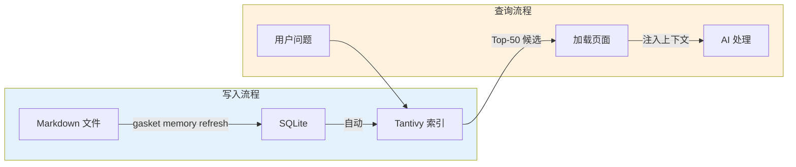
```mermaid
flowchart LR
    subgraph 写入流程
        MD[Markdown 文件] -->|"gasket memory refresh"| SQL[SQLite]
        SQL -->|"自动"| TAN[Tantivy 索引]
    end

    subgraph 查询流程
        Q[用户问题] --> TAN
        TAN -->|"Top-50 候选"| P[加载页面]
        P -->|"注入上下文"| AI[AI 处理]
    end

    style 写入流程 fill:#E3F2FD
    style 查询流程 fill:#FFF3E0
```

### 3.3 目录结构

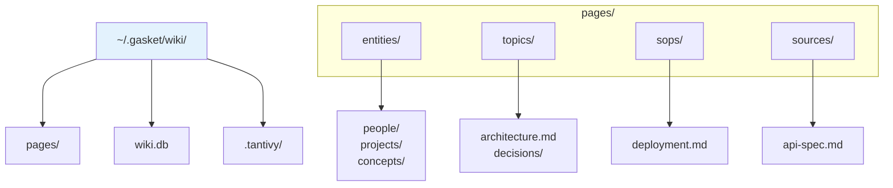
```mermaid
graph TB
    W["~/.gasket/wiki/"]

    subgraph pages/
        E["entities/"]
        T["topics/"]
        S["sops/"]
        SO["sources/"]
    end

    E --> EP["people/<br/>projects/<br/>concepts/"]
    T --> TP["architecture.md<br/>decisions/"]
    S --> SP["deployment.md"]
    SO --> SOP["api-spec.md"]

    W --> P[pages/]
    W --> DB[wiki.db]
    W --> TI[.tantivy/]

    style W fill:#E3F2FD
```

---

## 4. Wiki 快速入门

### 4.1 初始化 Wiki

```bash
# 初始化 wiki 目录结构
gasket wiki init
```

这会创建：
- `~/.gasket/wiki/pages/` 目录结构
- `~/.gasket/wiki/wiki.db` SQLite 数据库

### 4.2 创建第一个 Wiki 页面

创建一个关于"项目概述"的 Wiki 页面：

```bash
# 创建 pages/entities/projects/myproject.md
cat > ~/.gasket/wiki/pages/entities/projects/myproject.md << 'EOF'
---
title: MyProject 项目概述
type: entity
category: projects
tags: [rust, ai, assistant]
created: 2026-04-22
---

# MyProject 项目概述

## 项目背景

MyProject 是一个 AI 助手框架，用于自动化软件开发和 DevOps 任务。

## 核心功能

1. **多提供商路由** - 支持 OpenAI、Anthropic、MiniMax 等多种 AI 提供商
2. **工具系统** - 可扩展的工具注册和执行机制
3. **Wiki 知识库** - 持久化知识管理
4. **会话历史** - 完整的对话上下文追踪

## 技术栈

- **语言**: Rust
- **运行时**: Tokio (异步)
- **存储**: SQLite + Tantivy
- **消息总线**: Actor 模式

## 联系方式

- GitHub: https://github.com/example/myproject
EOF
```

### 4.3 同步到数据库和搜索索引

```bash
# 刷新 wiki：将 Markdown 文件同步到数据库和搜索索引
gasket memory refresh
```

### 4.4 搜索 Wiki

```bash
# 搜索包含关键词的页面
gasket wiki search "AI 助手框架"

# 查看所有实体类型页面
gasket wiki list entity

# 查看所有 Topic 类型页面
gasket wiki list topic
```

### 4.5 Wiki 页面格式

每个 Wiki 页面是一个 Markdown 文件，头部包含 YAML Front Matter：

```markdown
---
title: 页面标题
type: entity          # entity | topic | source | sop
category: projects    # 可选分类
tags: [rust, ai]      # 可选标签
created: 2026-04-22   # 创建日期
---

# 页面标题

页面内容（Markdown 格式）...
```

---

## 5. History 会话历史

### 5.1 什么是 History？

History 是 Gasket 的**会话历史管理**系统。它记录每一次对话，让 AI 能够：

- 回顾之前的讨论
- 保持上下文连续性
- 基于之前的决策继续工作

### 5.2 工作原理

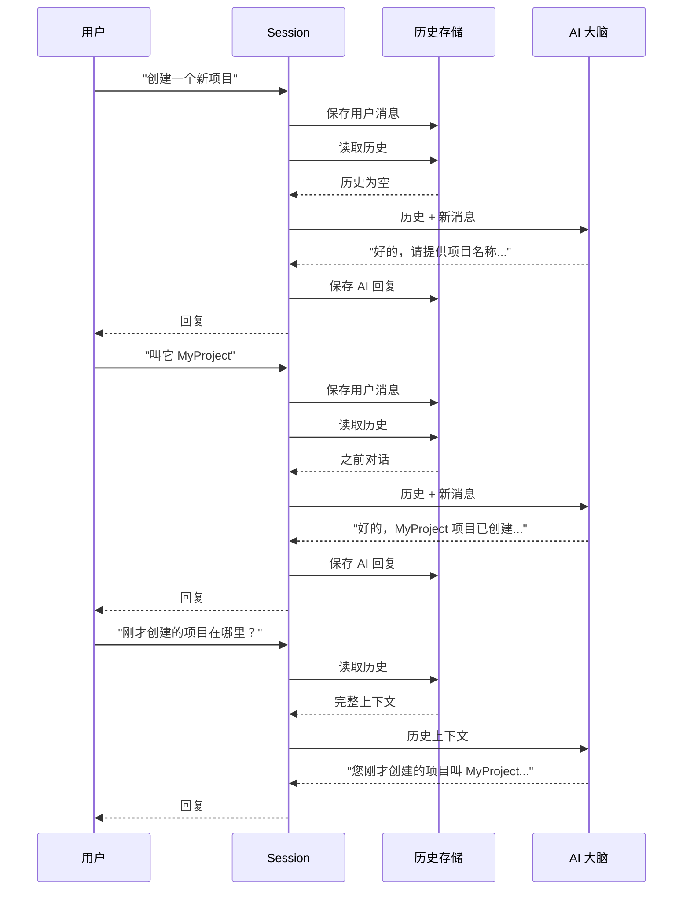
```mermaid
sequenceDiagram
    participant U as 用户
    participant S as Session
    participant H as 历史存储
    participant AI as AI 大脑

    U->>S: "创建一个新项目"
    S->>H: 保存用户消息
    S->>H: 读取历史
    H-->>S: 历史为空
    S->>AI: 历史 + 新消息
    AI-->>S: "好的，请提供项目名称..."
    S->>H: 保存 AI 回复
    S-->>U: 回复

    U->>S: "叫它 MyProject"
    S->>H: 保存用户消息
    S->>H: 读取历史
    H-->>S: 之前对话
    S->>AI: 历史 + 新消息
    AI-->>S: "好的，MyProject 项目已创建..."
    S->>H: 保存 AI 回复
    S-->>U: 回复

    U->>S: "刚才创建的项目在哪里？"
    S->>H: 读取历史
    H-->>S: 完整上下文
    S->>AI: 历史上下文
    AI-->>S: "您刚才创建的项目叫 MyProject..."
    S-->>U: 回复
```

### 5.3 自动摘要（Compaction）

随着对话增加，历史记录会变得很长。Gasket 会自动：

1. **定期摘要**：当历史超过阈值时，生成摘要
2. **保留关键**：最近的消息完整保留
3. **压缩旧内容**：旧消息被摘要替代

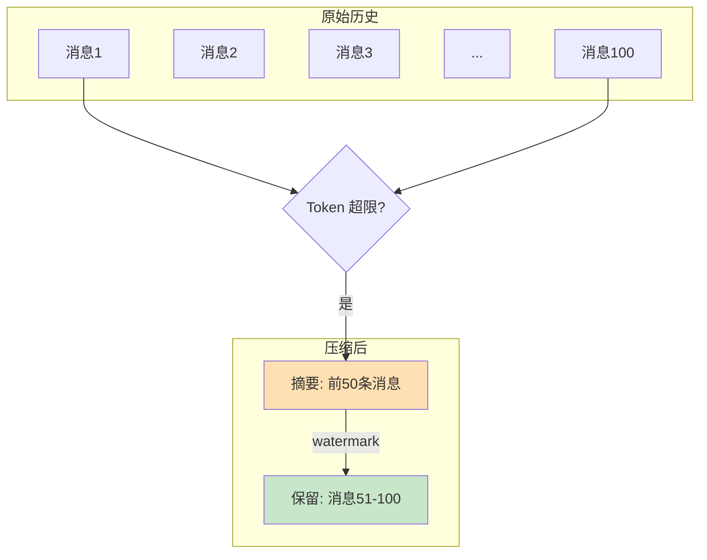
```mermaid
flowchart TB
    subgraph 原始历史
        A1[消息1]
        A2[消息2]
        A3[消息3]
        A4[...]
        A5[消息100]
    end

    B{Token 超限?}

    subgraph 压缩后
        SUM["摘要: 前50条消息"]
        KEEP["保留: 消息51-100"]
    end

    A1 --> B
    A5 --> B
    B -->|是| SUM
    SUM -->|"watermark"| KEEP

    style SUM fill:#FFE0B2
    style KEEP fill:#C8E6C9
```

### 5.4 访问 History

History 是自动管理的，不需要用户手动操作。但你可以：

```bash
# 查看会话统计
gasket wiki stats
```

---

## 6. 高级用法

### 6.1 AI 自动查询 Wiki

当 AI 处理用户问题时，它会自动查询 Wiki：

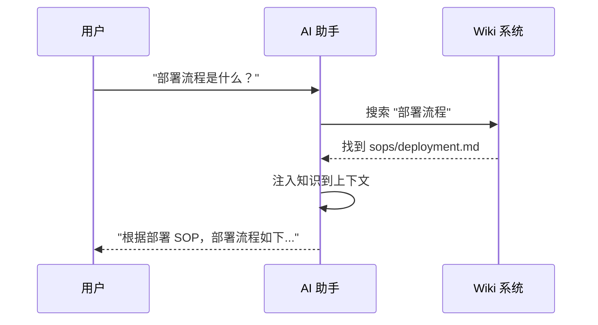
```mermaid
sequenceDiagram
    participant U as 用户
    participant AI as AI 助手
    participant W as Wiki 系统

    U->>AI: "部署流程是什么？"
    AI->>W: 搜索 "部署流程"
    W-->>AI: 找到 sops/deployment.md
    AI->>AI: 注入知识到上下文
    AI-->>U: "根据部署 SOP，部署流程如下..."
```

### 6.2 手动触发 Wiki 刷新

如果你修改了大量 Markdown 文件：

```bash
# 完整刷新：重新扫描所有文件并重建索引
gasket memory refresh

# 仅重建搜索索引（数据库已是最新时使用）
gasket wiki search --rebuild
```

### 6.3 Wiki 健康检查

```bash
# 检查 Wiki 结构问题
gasket wiki lint

# 自动修复问题
gasket wiki lint --fix
```

检查项目：
- 孤立页面（没有被引用的页面）
- 残缺页面（引用了不存在的页面）
- 命名不规范
- 过期内容

### 6.4 从旧版 Memory 迁移

如果你有旧版的 memory 文件：

```bash
# 迁移旧 memory 到 Wiki
gasket wiki migrate
```

### 6.5 访问频率管理

Wiki 页面有访问频率状态：

| 状态 | 说明 | 触发条件 |
|------|------|----------|
| Hot | 热门页面 | 7天内访问3+次 |
| Warm | 温热 | 7天无访问 |
| Cold | 冷门 | 30天无访问 |
| Archived | 归档 | 90天无访问 |

```bash
# 手动运行频率衰减
gasket memory decay
```

### 6.6 问答归档

让 AI 自动将重要问答保存为 Wiki 页面：


```mermaid
flowchart LR
    Q[有价值的问题] --> F["file_answer()"]
    F -->|创建| P["topics/xxx.md"]
    P -->|下次检索| R[相关答案]

    style F fill:#C8E6C9
```

---

## 7. 常见问题

### Q1: 我可以直接编辑 Markdown 文件吗？

**可以**。Wiki 的核心理念是 Markdown 文件是"单一可信源"。你可以：

- 用任意文本编辑器编辑
- 用 Git 管理版本
- 多人协作（通过 Git PR）

### Q2: 我修改文件后需要手动同步吗？

**不需要**。执行 `gasket memory refresh` 后，系统会自动：
1. 扫描所有 Markdown 文件
2. 更新 SQLite 数据库
3. 重建 Tantivy 搜索索引

### Q3: Wiki 和 History 有什么区别？

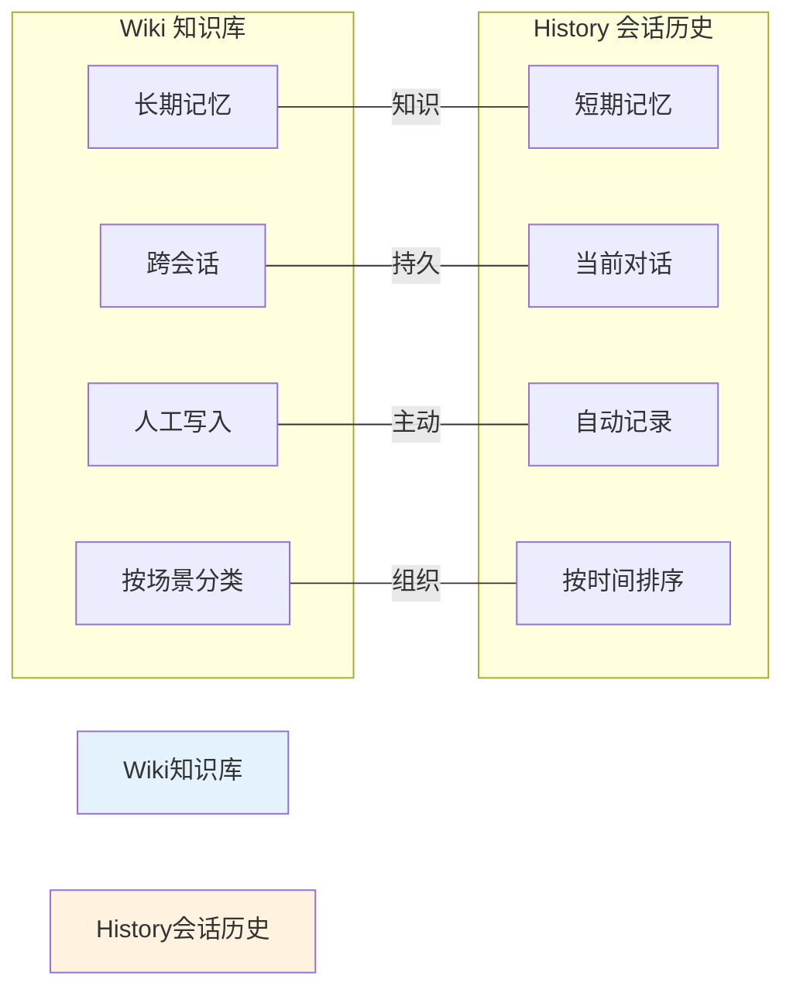
```mermaid
graph LR
    subgraph Wiki 知识库
        W1[长期记忆]
        W2[跨会话]
        W3[人工写入]
        W4[按场景分类]
    end

    subgraph History 会话历史
        H1[短期记忆]
        H2[当前对话]
        H3[自动记录]
        H4[按时间排序]
    end

    W1 ---|知识| H1
    W2 ---|持久| H2
    W3 ---|主动| H3
    W4 ---|组织| H4

    style Wiki知识库 fill:#E3F2FD
    style History会话历史 fill:#FFF3E0
```

| 对比 | Wiki | History |
|------|------|---------|
| **用途** | 长期知识存储 | 会话上下文 |
| **内容** | 项目文档、决策、流程 | 对话消息 |
| **来源** | 人工编写 | 自动记录 |
| **生命周期** | 持久 | 自动压缩摘要 |
| **访问方式** | AI 自动查询 | 自动注入上下文 |

**简单理解**：
- Wiki = 图书馆（存放知识）
- History = 日记本（记录对话）

### Q4: AI 什么时候会查询 Wiki？

当 AI 处理用户消息时，它会自动：

1. 分析用户问题
2. 从 Wiki 中检索相关内容
3. 将找到的知识注入上下文
4. 生成回复

这个过程对用户透明，不需要手动指定。

### Q5: Wiki 搜索支持什么语法？

Tantivy 支持以下搜索语法：

```bash
# 简单搜索
gasket wiki search "部署"

# 短语搜索（精确匹配）
gasket wiki search "\"部署流程\""

# 标签过滤
gasket wiki search "tag:rust"

# 类型过滤
gasket wiki search "type:sop"

# 组合搜索
gasket wiki search "部署 AND rust"
```

### Q6: Wiki 内容有大小限制吗？

Wiki 页面本身没有硬性限制。但注入 AI 上下文的知识量受限于 AI 模型的上下文窗口和 Token 预算。系统会自动：

- 按相关性排序
- 裁剪超出预算的内容
- 优先保留高相关性内容

### Q7: 页面类型怎么选？

| 场景 | 推荐类型 | 理由 |
|------|----------|------|
| 项目介绍 | `entity` | 项目是具体实体 |
| 技术方案讨论 | `topic` | 方案是抽象主题 |
| API 文档链接 | `source` | 是参考资料 |
| 部署步骤 | `sop` | 是标准流程 |
| 人物介绍 | `entity` (people 子目录) | 人也是实体 |
| 架构决策 | `topic` (decisions 子目录) | 决策是主题 |

---

## 附录 A：核心概念速查表

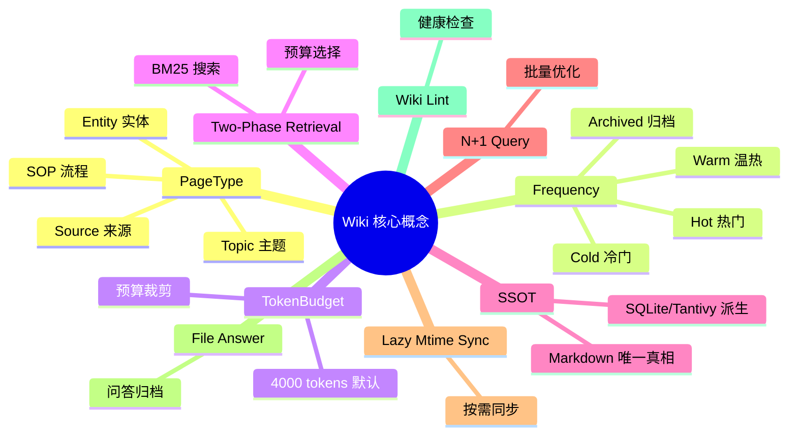
```mermaid
mindmap
  root((Wiki 核心概念))
    PageType
      Entity 实体
      Topic 主题
      Source 来源
      SOP 流程
    Frequency
      Hot 热门
      Warm 温热
      Cold 冷门
      Archived 归档
    TokenBudget
      4000 tokens 默认
      预算裁剪
    Two-Phase Retrieval
      BM25 搜索
      预算选择
    SSOT
      Markdown 唯一真相
      SQLite/Tantivy 派生
    N+1 Query
      批量优化
    Lazy Mtime Sync
      按需同步
    File Answer
      问答归档
    Wiki Lint
      健康检查
```

| 概念 | 说明 |
|------|------|
| **PageType** | 页面类型：Entity/Topic/Source/Sop |
| **Frequency** | 访问频率：Hot/Warm/Cold/Archived |
| **TokenBudget** | Token 预算，控制返回内容大小 |
| **Two-Phase Retrieval** | 两阶段检索：BM25 搜索 + 预算选择 |
| **SSOT** | 单一可信源，Markdown 是真相 |
| **N+1 Query** | 批量查询优化 |
| **Lazy Mtime Sync** | 惰性同步，按需更新缓存 |
| **File Answer** | 问答归档功能 |
| **Wiki Lint** | Wiki 健康检查 |

## 附录 B：CLI 命令速查

```bash
# Wiki 操作
gasket wiki init              # 初始化 Wiki 目录
gasket wiki ingest <path>     # 导入文件到 Wiki
gasket wiki search <query>    # 搜索 Wiki
gasket wiki list [type]       # 列出页面
gasket wiki lint [--fix]     # 健康检查
gasket wiki stats            # 显示统计
gasket wiki migrate          # 迁移旧 memory

# Memory 操作
gasket memory refresh         # 刷新（同步到数据库+索引）
gasket memory decay          # 运行频率衰减

# 便捷命令（部分功能整合）
gasket memory --help          # 查看所有 memory 相关命令
```

---

## 总结

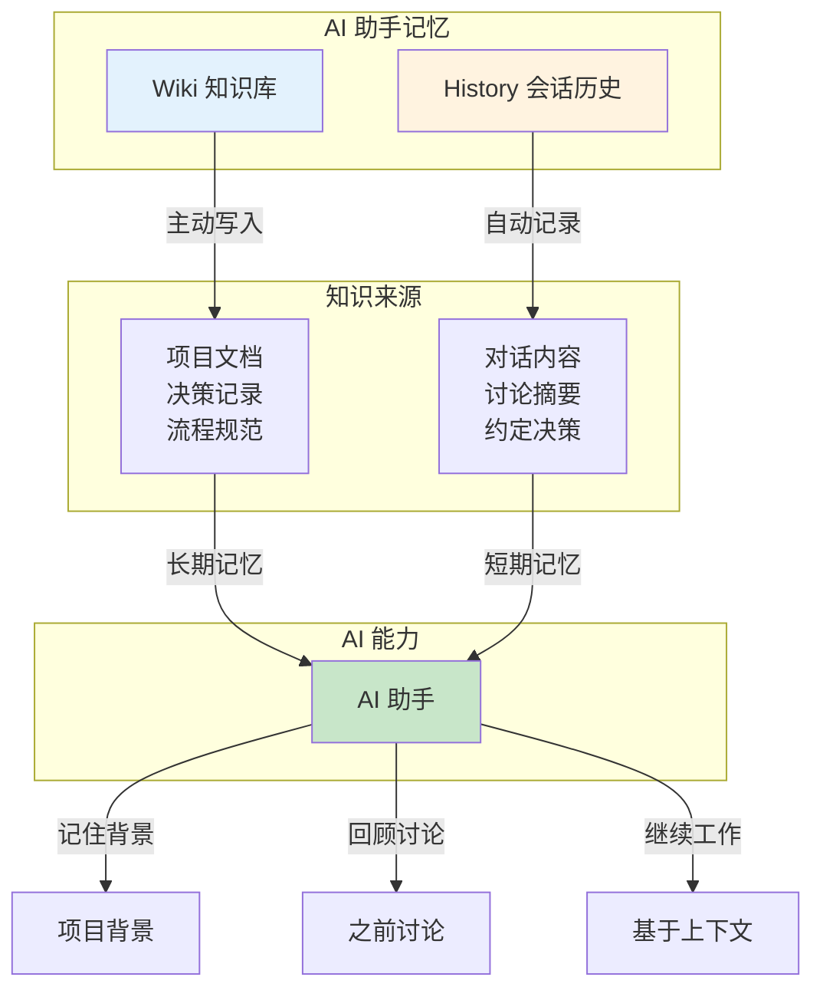
```mermaid
flowchart TB
    subgraph AI 助手记忆
        W[Wiki 知识库] 
        H[History 会话历史]
    end

    subgraph 知识来源
        W -->|"主动写入"| WP[项目文档<br/>决策记录<br/>流程规范]
        H -->|"自动记录"| HP[对话内容<br/>讨论摘要<br/>约定决策]
    end

    subgraph AI 能力
        WP -->|"长期记忆"| AI[AI 助手]
        HP -->|"短期记忆"| AI
    end

    AI -->|"记住背景"| A1[项目背景]
    AI -->|"回顾讨论"| A2[之前讨论]
    AI -->|"继续工作"| A3[基于上下文]

    style W fill:#E3F2FD
    style H fill:#FFF3E0
    style AI fill:#C8E6C9
```

Gasket 的 Wiki 和 History 系统共同构成了 AI 助手的"记忆"：

- **Wiki** 是**主动学习**的知识库 - 你主动写入项目信息
- **History** 是**被动记录**的对话历史 - 自动记录每次交互

两者结合，让 AI 能够：
1. 记住项目背景和决策
2. 回顾之前的讨论
3. 基于完整上下文继续工作

这就是 Gasket 能够成为真正有用的长期 AI 助手的原因。
